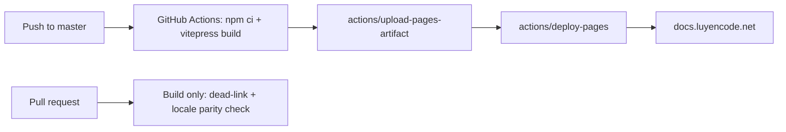
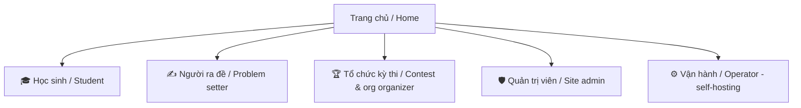
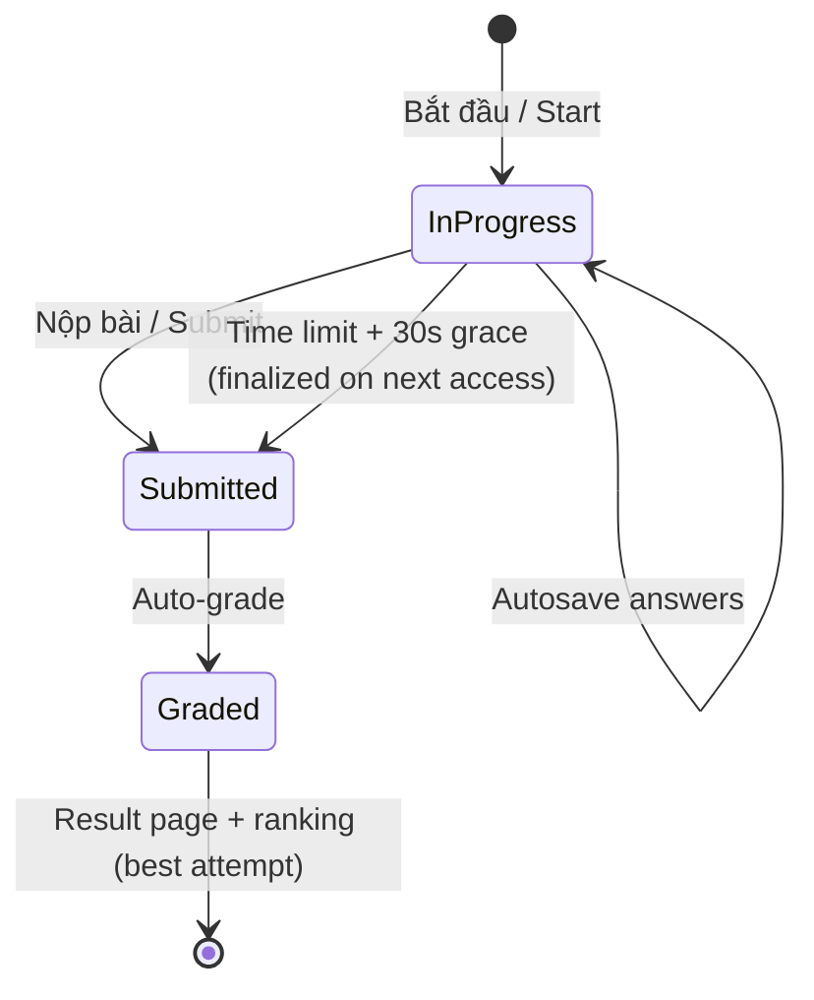
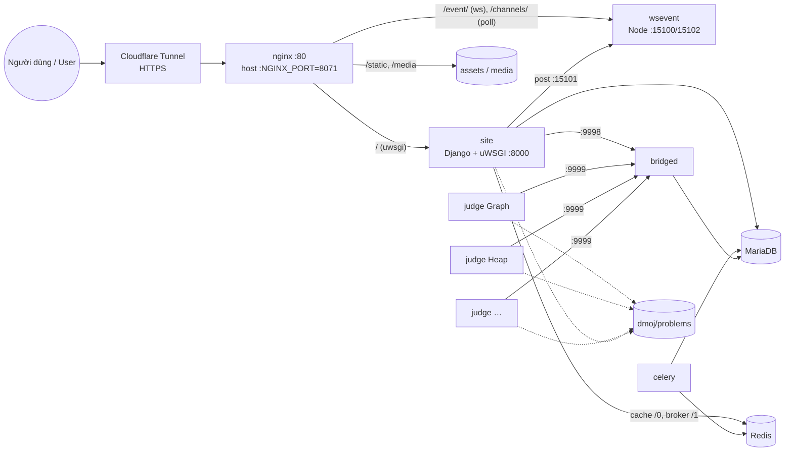

# LCOJ Docs Refactor: i18n (vi/en), missing features, beginner-friendly rewrite

**Date:** 2026-09-19
**Status:** Draft, for review
**Repo:** `luyencode/docs` → https://docs.luyencode.net (GitHub Pages)
**Source of truth:** [lcoj-site](https://github.com/luyencode/lcoj-site) (`dmoj/repo`) and [lcoj-docker](https://github.com/luyencode/lcoj-docker) (`dmoj/`)

---

## 1. Current state and problems

| Area | Today | Problem |
|---|---|---|
| Engine | Docsify loaded from unpkg at runtime, served from `/docs` on `master` | No i18n support, no build step (so no dead-link checks), hash URLs (`#/site/...`) are bad for SEO, an unpinned CDN can break the site silently |
| Language | Vietnamese only | No English |
| Structure | Sidebar grouped by *system* (Site / Judge / Problem format) | A newcomer can't tell where to start. Students, problem setters and operators all share one list. |
| Coverage | 26 pages, about 6k lines | Many shipped features have no page (see §5) |
| Accuracy | Partly stale | `uwsgi.md` and `sample_files/` are bare-metal DMOJ guides. The judge image name, ports, env vars and `mysql*` commands are wrong. See §6. |
| Branding | Mixed | `sample_files/local_settings.py` still says `VNOJ`, `oj.vnoi.info` and `vnoj@vnoi.info`. VNOI links are scattered through the site guides. |
| Visuals | None | No diagrams and no screenshots |

---

## 2. Target stack: VitePress + GitHub Actions → GitHub Pages

**Recommendation: [VitePress](https://vitepress.dev).**

- Folder-based i18n is built in (`locales`), with a language switcher and a separate sidebar and nav per locale.
- It builds to static HTML and fails the build on dead internal links, which is a free correctness check.
- Local search (minisearch) is built in and indexed per locale, so no Algolia account is needed.
- It has admonitions (`::: tip`, `::: warning`, `::: danger`, `::: details`), code groups (tabs), line highlighting, and `lastUpdated` taken from git.
- Mermaid works via `vitepress-plugin-mermaid`. Custom Vue components are available for richer visuals.
- Node 18+ is already part of the LCOJ stack (base image, websocket).

Alternatives considered:
- **MkDocs Material + mkdocs-static-i18n:** mature, but upstream is now in maintenance mode, and i18n comes from a third-party plugin.
- **Docusaurus:** strong i18n, but heavier (React, versioning machinery) than this project needs.
- **Keep Docsify:** i18n would need hacks, there is no build-time link checking, and the URLs stay hash-based.

### Hosting pipeline



- New file `.github/workflows/deploy.yml`, using the official `actions/configure-pages`, `upload-pages-artifact` and `deploy-pages` actions.
- **One-time manual step:** Repo Settings → Pages → Source = **GitHub Actions**. The current source is branch `master` `/docs`.
- `CNAME` (`docs.luyencode.net`) moves to `src/public/CNAME`, so it ends up in the build output. Custom domain means `base: '/'`.
- PRs run the build without deploying, so broken links or missing translations block the merge.
- **Legacy URL redirect:** a small inline script in the theme maps old Docsify links (`/#/site/installation`) to the new paths (`/operate/install`), so existing links from luyencode.net, GitHub and Facebook posts keep working.

### Repository layout

```
docs/                                # repo root (luyencode/docs)
├── .github/workflows/deploy.yml
├── package.json                     # vitepress, vitepress-plugin-mermaid, mermaid
├── src/
│   ├── .vitepress/
│   │   ├── config.mts               # shared config + locales
│   │   ├── locales/vi.mts           # vi nav/sidebar/labels
│   │   ├── locales/en.mts           # en nav/sidebar/labels
│   │   └── theme/                   # LCOJ colors, logo, legacy-hash redirect, custom components
│   ├── public/                      # CNAME, favicon, logo, img/ (screenshots)
│   ├── index.md                     # vi home (root locale)
│   ├── start/ learn/ setter/ organize/ admin/ operate/ reference/ about/
│   └── en/                          # mirror of the tree above, English
├── problem_examples/                # kept (still valid judge format)
├── scripts/check-locales.mjs        # fails if a vi page has no en twin (or vice versa)
└── plans/
```

- **Default locale = `vi` at `/`**, since the audience and luyencode.net itself are Vietnamese. English lives at `/en/`.
- `sample_files/` is **deleted**. It is stale bare-metal DMOJ config. Pages link to the real files in lcoj-docker instead: `dmoj/config/*`, `dmoj/nginx/conf.d/nginx.conf`, `docker-compose.yml`.

---

## 3. Information architecture: organized by audience

The home page starts with a **"Who are you?"** picker, a set of cards that each lead to a path.



| Section (vi / en) | Pages |
|---|---|
| **start/** Bắt đầu / Getting started | What is LCOJ · Choose your path · Glossary (bài tập = problem, bộ chấm = checker, …) · FAQ |
| **learn/** Học sinh / Students | Account & sign-in (Google OAuth, 2FA) · Solving your first problem · Submissions & verdicts · Taking part in a contest (incl. virtual participation) · **Taking a quiz** · **Exam library** · Blog, comments, contribution points · **Reporting an issue (tickets)** · **Notifications** · Tagging problems from other judges |
| **setter/** Người ra đề / Problem setters | *Tutorial: your first problem in 10 minutes* · Problem statement (Markdown, LaTeX, images) · **Test data in the web editor** · `init.yml` format · Checkers · Graders / signature · Interactive · Generators · **Import from Polygon** · Editorials (incl. `generate_editorials` AI) · **Quiz authoring** · Problem examples |
| **organize/** Tổ chức / Organizers | *Tutorial: run your first contest* · Contest settings · Contest formats (**incl. `vnoj`**, with a comparison table) · Rankings, freeze, **replay** · Clone contest · MOSS & disqualification · **Organizations** (join, members, org problems/contests, tags, quotas) · Contest data download |
| **admin/** Quản trị / Admins | Permission system · **Site config UI (`/misc_config/`)** · User management (`batchadduser`, bans, **impersonate**) · Comment moderation (`moderate_comments`) · **URL shortener** · Newsletter · Exam library content |
| **operate/** Vận hành / Operators | **Architecture overview** · Install with Docker · **Environment variable reference** · **Scripts reference** · Judges (setup, config, running several judges) · Day-to-day operations · Backup & restore · Updating (incl. submodule branch) · Cloudflare Tunnel / HTTPS · Mathoid / Texoid / PDFoid · reCAPTCHA · SSL content proxy · User data download |
| **reference/** Tham khảo / Reference | Status codes · Supported languages · Management commands (all 25) · REST API · Settings reference (`VNOJ_*`, `DMOJ_*`) |
| **about/** | License & credits (DMOJ, VNOJ attribution) · Contributing to the docs |

Bold items are new or substantially rewritten.

---

## 4. Writing standard ("friendly for beginners")

Every how-to page uses the same template:

```md
# <Task as a verb phrase>            e.g. "Tạo bài tập đầu tiên"
> 1–2 sentence summary. ⏱ ~10 phút · 👤 Người ra đề · 🔑 Cần quyền: judge.add_problem

## Trước khi bắt đầu / Before you start   (prereqs as a checklist)
## Các bước / Steps                       (numbered, one action per step, screenshot where UI)
## Kiểm tra kết quả / Verify               (what success looks like)
## Sự cố thường gặp / Troubleshooting      (symptom → fix table)
## Tiếp theo / Next steps                  (2–3 links)
```

Rules:
- Explain *why* before *how*. Define every term the first time it appears, or link it to the glossary.
- Use a `::: tip` / `::: warning` / `::: danger` callout for anything destructive (`down -v`, deleting problems, rejudge).
- Use a code group whenever a command differs by context (host vs. inside the container).
- One concept per page. Anything over about 300 lines gets split. `management_commands.md` (608 lines) becomes one page per command group.
- Commands must be copy-paste runnable from `dmoj/`. Secrets appear only as `<placeholder>`.
- Terminology follows the site's own `locale/vi` translations, so the docs match the UI labels.

---

## 5. New content for undocumented features

The inventory was built from `dmoj/repo`. Priority order:

### P0: Quiz (`quiz/` app)

Two pages per locale: **learn/quiz** (student) and **setter/quiz** (authoring).

- **Concepts:**
  - Question bank vs. quiz, and categories.
  - Question types: MC, MA, TF, SA (exact / regex, case-sensitive).
  - MA grading strategies (all-or-nothing, partial credit + penalty, right-minus-wrong, correct-only), with a worked scoring example table.
- **Quiz settings:**
  - Time limit, max attempts, shuffle.
  - Result feedback (`score_only` / `correctness` / `full`).
  - Schedule (`start_time`/`end_time`).
  - Visibility (public / org-private).
  - Authors, curators, testers.
- **Authoring flow:** question bank `/quizzes/questions/`, then bulk import via XLSX/JSON (link the template at `/quizzes/import/template`, document every column/field), then create the quiz `/quizzes/new`, then clone or export.
- **Integrity monitoring:** what gets logged (tab switch, window blur, devtools, print screen, copy), what students see, how to review `/quizzes/<code>/attempts`, and a clear note that it *deters*, not *prevents*.
- **Student flow:** start, autosave, submit, result, ranking (best attempt, ties broken by shortest duration). Deadline behavior: 30 s grace, finalized lazily.
- **Permissions:** `quiz.edit_all_quiz` (staff) and `quiz.edit_own_quiz` (teachers).
- **Diagrams:**



### P1

- **Exam library:** browsing and filters, the flipbook viewer, and the admin upload in Django admin.
- **Organizations:**
  - Membership and requests.
  - Org problems and contests, including the key-prefix rule.
  - Org tags, member solved view.
  - Storage and quotas, plus the `VNOJ_ORG_*` / `VNOJ_QUOTA_*` settings.
- **Problem web tools:** test-data editor (`/test_data`, diff), package download, Polygon import/update, clone, deletion grace period, rejudge/rescore.
- **Contest formats:** add `vnoj` and a comparison table covering all 7 formats. Add ranking replay / ghost participations, and auto-ban for cheating.
- **Accounts:** OAuth-only sign-up (`OAUTH_ONLY`), 2FA (TOTP / WebAuthn / scratch codes, required for staff), API tokens.

### P2

- Tickets and contribution points.
- Notifications.
- Blog (min solved count).
- `/misc_config/`.
- URL shortener.
- Impersonate.
- Newsletter, contributors, stats/status pages, RSS feeds.
- The 3 undocumented commands: `add_blog_navigation`, `backfill_problem_data_size`, `merge_replay_data`.

---

## 6. Accuracy fixes (align with `dmoj/` and `dmoj/repo`)

| Page | Fix |
|---|---|
| install | site.env example → the real variable list (`HOST`, `SITE_FULL_URL`, `MEDIA_URL`, `DEBUG=0/1`, `SECRET_KEY`, `EVENT_DAEMON_POST`, `REDIS_CACHING_URL`, `CELERY_BROKER_URL`, `CELERY_RESULT_BACKEND`, `BRIDGED_HOST`, `NGINX_PORT`, `MOSS_API_KEY`, `SOCIAL_AUTH_GOOGLE_OAUTH2_*`). `MYSQL_*` moves to mysql.env. Drop `SITE_NAME` & co. (hardcoded in local_settings). |
| install | Ports: nginx is published on `${NGINX_PORT:-8071}` (not 80). db, redis and wsevent are not published. Only bridged 9998/9999 is published. |
| install / updating | Dependency changes require `docker compose build base` first. Code changes only need a restart, because `./repo` is bind-mounted. |
| install | Replace the Let's Encrypt section with Cloudflare Tunnel (prod) and keep certbot as an alternative. Fix "performance tuning": `workers=8` in `uwsgi.ini`, not `CMD` flags. |
| uwsgi | Rewrite for Docker (`socket = :8000` TCP, ENTRYPOINT) or fold into the architecture page. |
| operations | `mysqldump`/`mysql`/`mysqladmin`/`mysqlcheck` → `mariadb-dump`/`mariadb`/`mariadb-admin`/`mariadb-check`. DB name from `MYSQL_DATABASE`. Settings path `/site/dmoj/local_settings.py`. Remove the nonexistent `clear_cache`. Explain exactly what `down -v` deletes (volumes, not the `./database` bind mount). |
| updating | The submodule tracks the `prod/luyencode` branch. Explain the detached-HEAD situation after `git submodule update`. |
| judge setup | Image `vnoj/judge-tier3` (decided: keep upstream image), build dir `judge-server/.docker`, mount `dmoj/problems`, real run args (`run -p 9999 -c /problems/judge_X.yml localhost <name> <key>`). Refresh the tier3 language list. |
| scripts (new) | Document `initialize`, `migrate`, `manage.py`, `enter_site`, `copy_static` (what it actually runs), `moderate_comments [--dry-run]`, and `COMPOSE_EXEC_FLAGS`. |

### Architecture diagram (operate/architecture)



We'll also add a **submission lifecycle** sequence diagram (submit → bridged → judge → per-test results → wsevent → live update in the browser) to learn/submissions. This one diagram is the part newcomers most often misunderstand.

---

## 7. Branding: VNOJ → LCOJ

Rules. Some names are code identifiers, and renaming those in the docs would make the docs wrong.

| Replace with LCOJ | Keep as-is (and say why in a footnote) |
|---|---|
| Site name/title/email/URL examples (`VNOJ`, `oj.vnoi.info`, `vnoj@vnoi.info`, `//oj.vnoi.info/tos/`) → `LCOJ`, `luyencode.net` | Upstream credits: "LCOJ is built on DMOJ and VNOJ" (required AGPL attribution) in README, home footer, about/license |
| Links to VNOI-Admin repos for things LCOJ forks (judge-server executors, site) → `luyencode/*` if a fork exists, else keep with "upstream" label | Code identifiers: `dmoj` Python package, `dmoj-cli`, `judge/`, `VNOJ_*` / `DMOJ_*` settings names, the `vnoj` contest format key |
| Screenshots/examples showing VNOJ UI → LCOJ UI | Docker image tag `vnoj/judge-tier3` (decided: keep) |
| Generic "VNOJ" wording in prose → "LCOJ" | Names of external judges in the tagging feature (`VNOJ` is one of the `OJ_LIST` judges) |

---

## 8. Translation workflow

- The two locales are **mirrored trees**: `src/learn/quiz.md` ↔ `src/en/learn/quiz.md`.
- `scripts/check-locales.mjs` runs in CI and fails on missing twins. A page can temporarily carry `translation: pending` in its frontmatter, which renders a "not yet translated" banner instead of failing the build.
- Vietnamese is written first (existing content and audience), then English. Both are updated in the **same PR** from then on.
- A shared glossary (`start/glossary`) keeps terminology consistent, sourced from `dmoj/repo/locale/vi/LC_MESSAGES/*.po`.
- Screenshots use one set, taken in the vi UI (the audience majority). English captions describe them. Screenshots are only re-taken when the UI changes.

---

## 9. Phased rollout

Each phase is its own PR and deploys independently.

| Phase | Scope | Done when |
|---|---|---|
| **0. Platform** | Scaffold VitePress, port existing vi pages 1:1, sidebar, theme/logo, local search, Mermaid, GitHub Actions deploy, legacy `#/` redirect, switch the Pages source | docs.luyencode.net serves the same content on VitePress; old links redirect; CI green |
| **1. Restructure + accuracy + brand** | Move pages into the audience IA (§3). Apply the §6 fixes and the §7 branding. Delete `sample_files/`. Add the architecture and submission diagrams. | No stale commands; no VNOJ product branding; dead-link check passes |
| **2. Missing features** | P0 quiz, then P1, then P2 (§5), in vi | Every URL namespace in `dmoj/urls.py` + `quiz/urls.py` that a user can reach is covered by some page |
| **3. Beginner rewrite** | Apply the §4 template to all pages. Add the 3 tutorials (first problem, first contest, first quiz), screenshots, FAQ, glossary. | Each page has prereqs / steps / verify / troubleshooting / next |
| **4. English** | Translate everything into `src/en/`, turn on the locale parity check as blocking | Parity check passes with zero `translation: pending` |
| **5. Maintenance hooks** | "Edit this page on GitHub" links, `lastUpdated`, CONTRIBUTING (how to add a page in both languages), an optional lcoj-site PR template checkbox "docs updated?" | — |

Phases 2 and 3 can run in parallel per section. Phase 4 can start per section as soon as that section's vi text is stable.

---

## 10. Decisions (2026-09-19)

1. **Judge image:** keep `vnoj/judge-tier3`, and document it as the upstream VNOJ image.
2. **Default locale:** `vi` at `/`, `en` at `/en/`.
3. **Self-hosting is a goal.** The full `operate/` section stays. Every operator page ends with a "Cần hỗ trợ? / Need help?" box linking to GitHub Issues, https://behitek.com and https://luyencode.net/about/#lien-he. The same links go in the home page footer and in `start/faq`.
4. **Excluded from docs:** the `/magazine/` page and `dmoj/start-judge.sh`. The judge page describes running several judges generically, with `<name>`/`<key>` placeholders.
5. **Screenshots:** automated with Playwright (see §11).

## 11. Screenshot pipeline

The Docker stack in `lcoj-docker/dmoj` on the maintainer machine **is production** (`HOST=luyencode.net`, `DEBUG=0`). Because of that:

- **No credentials are read or copied from the DB.** Password hashes are useless for logging in anyway. `scripts/screenshots/login.py`, run via `./scripts/manage.py shell`, mints a Django session for a chosen username and prints only the session key. Playwright injects it as the `sessionid` cookie against `http://localhost:8071`. The session is deleted afterwards.
- **Use a dedicated `docs-demo` account** in a `docs-demo` organization, with the minimum permissions needed for each screen (student, then setter with `quiz.edit_own_quiz` / `judge.add_problem`, then staff). Don't use a real admin account, so that screenshots never show real users' private data.
- **Read-only against prod.** Authoring flows (creating a problem, quiz or contest, or importing) are shot on a throwaway local instance (`docker compose -p lcoj-docs` with the `demo` fixture plus a seeded demo quiz and problem), never on prod.
- `scripts/screenshots/shoot.mjs` holds a list of `{url, selector?, locale, file}` entries. It captures at 1280×800 in light theme, the `vi` UI and the `en` UI where the page text matters, and writes to `src/public/img/<section>/`. Re-running it refreshes every image after UI changes.
- Before committing, blur or crop anything personal: usernames other than `docs-demo`, emails, IPs in the admin.
