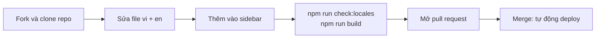

# Đóng góp cho tài liệu

> Cách sửa lỗi, bổ sung hoặc viết trang mới cho tài liệu LCOJ, bằng cả tiếng Việt và tiếng Anh.
>
> ⏱ ~10 phút · 👤 Bất kỳ ai · 🔑 Tài khoản GitHub

## Trước khi bắt đầu

- [ ] Có tài khoản GitHub.
- [ ] Sửa nhỏ (lỗi chính tả, câu sai): chỉ cần trình duyệt.
- [ ] Sửa lớn hoặc thêm trang: cài [Node.js](https://nodejs.org/) 18 trở lên và Git.

## Cách nhanh nhất: sửa ngay trên GitHub

1. Mở trang cần sửa trên docs.luyencode.net.
2. Kéo xuống cuối trang, bấm **Sửa trang này trên GitHub**.
3. Sửa nội dung, rồi bấm **Propose changes** để tạo pull request.

::: tip Nhớ sửa cả bản còn lại
Mỗi trang có hai bản: tiếng Việt ở `src/<đường-dẫn>.md` và tiếng Anh ở `src/en/<đường-dẫn>.md`. Nếu bạn chỉ sửa được một bản, hãy ghi rõ trong pull request để người khác cập nhật bản kia.
:::

## Sửa lớn hoặc thêm trang mới



1. Fork [luyencode/docs](https://github.com/luyencode/docs) rồi clone về máy.
2. Cài đặt và chạy thử:
   ```sh
   npm install
   npm run dev   # xem tại http://localhost:5173, tự tải lại khi sửa file
   ```
3. Sửa hoặc tạo **cả hai** file: `src/<thư-mục>/<tên-trang>.md` và `src/en/<thư-mục>/<tên-trang>.md`. Tên file viết thường, nối bằng dấu gạch ngang.
4. Trang mới: thêm một dòng vào `src/.vitepress/sidebar.mts`, gồm đường dẫn, nhãn tiếng Việt và nhãn tiếng Anh.
5. Đổi tên hoặc chuyển trang: thêm đường dẫn cũ vào `LEGACY_PATHS` trong `src/.vitepress/config.mts` để link cũ vẫn dùng được.
6. Kiểm tra:
   ```sh
   npm run check:locales   # mỗi trang phải có đủ hai ngôn ngữ
   npm run build           # báo lỗi nếu có link hỏng
   ```
7. Commit và mở pull request vào nhánh `master`.

## Tài liệu được tổ chức thế nào

| Thư mục | Dành cho |
|---|---|
| `start/`, `tutorials/` | Người mới: giới thiệu, thuật ngữ, FAQ, bài hướng dẫn từng bước |
| `learn/` | Học sinh |
| `setter/` | Người ra đề |
| `organize/` | Người tổ chức kỳ thi, giáo viên |
| `admin/` | Quản trị viên website |
| `operate/` | Người tự cài đặt và vận hành LCOJ |
| `reference/` | Tra cứu: mã trạng thái, ngôn ngữ, lệnh, API, cấu hình |

## Quy tắc viết

- **Đúng với code.** Lệnh, đường dẫn, biến môi trường, URL và nhãn giao diện phải khớp với [lcoj-docker](https://github.com/luyencode/lcoj-docker) và [lcoj-site](https://github.com/luyencode/lcoj-site). Nhãn giao diện lấy từ `locale/vi/LC_MESSAGES/django.po` của lcoj-site: `msgid` là tiếng Anh, `msgstr` là tiếng Việt.
- **Viết cho người mới.** Trang hướng dẫn theo mẫu: tóm tắt (⏱ thời gian · 👤 đối tượng · 🔑 quyền) → *Trước khi bắt đầu* → các bước đánh số → *Kiểm tra kết quả* → *Sự cố thường gặp* → *Tiếp theo*.
- **Không dùng ảnh chụp màn hình.** Dùng sơ đồ Mermaid (khối ` ```mermaid `), bảng và hộp lưu ý (`::: tip`, `::: warning`, `::: danger` cho lệnh nguy hiểm).
- **Không đưa bí mật vào tài liệu.** Mật khẩu, khóa judge, `SECRET_KEY`… luôn viết dạng `<placeholder>`.
- **Thương hiệu.** Dùng LCOJ / luyencode.net. Giữ nguyên phần ghi công DMOJ, VNOJ và các định danh trong code (`dmoj`, `VNOJ_*`, định dạng `vnoj`, image `vnoj/judge-tier3`).
- **Thuật ngữ thống nhất** theo trang [Thuật ngữ](/start/glossary). Tiếng Việt viết tự nhiên, không dịch từng chữ.

## Kiểm tra kết quả

- [ ] `npm run check:locales` báo *locales in sync*.
- [ ] `npm run build` chạy xong, không báo link hỏng.
- [ ] Trang mới xuất hiện trong sidebar ở cả hai ngôn ngữ.

## Sự cố thường gặp

| Triệu chứng | Cách xử lý |
|---|---|
| `missing English page: src/en/...` | Tạo bản tiếng Anh cho trang đó (hoặc bản tiếng Việt nếu báo thiếu tiếng Việt). |
| Build báo `dead link` | Sửa link: dùng đường dẫn tuyệt đối không có `.md`, bản tiếng Anh thêm tiền tố `/en`. |
| Trang mới không có trong sidebar | Thêm dòng tương ứng vào `src/.vitepress/sidebar.mts`. |
| Sơ đồ Mermaid báo lỗi cú pháp | Đặt nhãn có ký tự đặc biệt trong dấu ngoặc kép, ví dụ `A["Bước 1: tạo bài"]`. |

## Tiếp theo

- [LCOJ là gì?](/start/introduction): tổng quan để hiểu tài liệu đang nói về gì.
- [Thuật ngữ](/start/glossary): từ ngữ dùng thống nhất trong tài liệu.
- [Báo lỗi hoặc góp ý](https://github.com/luyencode/lcoj-docker/issues) trên GitHub Issues.
