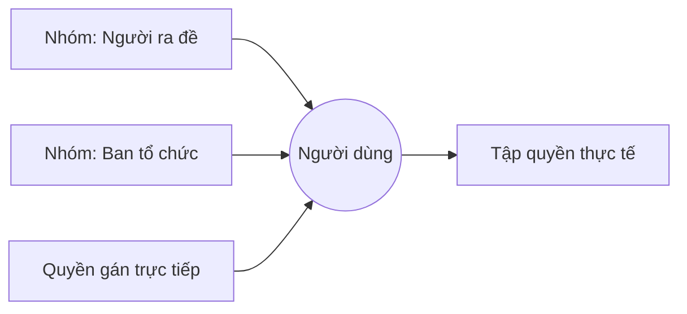

# Hệ thống phân quyền

LCOJ dùng hệ thống phân quyền của Django: mỗi hành động nhạy cảm (sửa bài, chấm lại, xem kỳ thi riêng tư…) được kiểm tra bằng một **quyền** (permission) có tên dạng `<app>.<codename>`, ví dụ `judge.edit_own_problem`. Trang này liệt kê toàn bộ quyền tùy chỉnh của LCOJ, giải thích mỗi quyền cho phép làm gì và hướng dẫn cấp quyền trong trang quản trị.

## Cách phân quyền hoạt động

| Khái niệm | Ý nghĩa |
|---|---|
| **Superuser** | Có mọi quyền, không cần cấp từng quyền. Chỉ dành cho quản trị viên hệ thống. |
| **Staff** (`is_staff`) | Cho phép đăng nhập trang quản trị `/admin/`. Bản thân nó không cho quyền gì thêm; bạn vẫn phải cấp quyền cụ thể. |
| **Quyền của người dùng** (User permissions) | Quyền gán trực tiếp cho một tài khoản. |
| **Nhóm** (Groups) | Một tập quyền có tên. Người dùng thuộc nhóm nào sẽ có mọi quyền của nhóm đó. |

Quyền thực tế của một người = quyền gán trực tiếp **cộng** quyền của tất cả các nhóm họ thuộc về. Không có cơ chế "cấm" quyền; muốn thu hồi, hãy gỡ quyền hoặc gỡ người dùng khỏi nhóm.

::: tip Nên dùng nhóm
Hãy tạo nhóm theo vai trò (ví dụ "Người ra đề", "Ban tổ chức kỳ thi") rồi thêm người vào nhóm. Khi cần đổi quyền cho cả vai trò, bạn chỉ sửa nhóm một lần.
:::

## Cách cấp quyền trong trang quản trị

### Cách 1: Qua nhóm (khuyên dùng)

1. Vào `/admin/auth/group/` (ví dụ `https://luyencode.net/admin/auth/group/`).
2. Bấm **Thêm** để tạo nhóm mới, đặt tên (ví dụ "Người ra đề").
3. Trong ô **Permissions** (tiếng Việt: *Cho phép*), chọn các quyền cần thiết rồi bấm mũi tên để chuyển sang cột đã chọn. Gõ codename (ví dụ `edit_own_problem`) vào ô lọc để tìm nhanh.
4. Lưu nhóm.
5. Vào `/admin/auth/user/`, mở tài khoản cần cấp, thêm nhóm vào mục **Groups** (*Các nhóm*) và lưu.

### Cách 2: Cấp trực tiếp cho một người dùng

1. Vào `/admin/auth/user/` và mở tài khoản cần cấp.
2. Nếu người này cần dùng trang quản trị, bật **Staff status** (*Tình trạng nhân viên*).
3. Trong mục **User permissions** (*Quyền của người sử dụng*), chọn các quyền. Mỗi dòng hiển thị dạng `judge.edit_own_problem | Edit own problems` (app, codename, rồi nhãn).
4. Lưu.

::: info Nhãn quyền là tiếng Anh
Nhãn quyền được lưu trong cơ sở dữ liệu bằng tiếng Anh, và nhiều nhãn chưa có bản dịch tiếng Việt. Hãy tìm quyền theo **codename** (cột đầu tiên trong các bảng dưới đây). Nếu nhãn trong cơ sở dữ liệu bị cũ sau khi cập nhật mã nguồn, chạy `./scripts/manage.py update_permissions` (xem [Lệnh quản lý](/reference/management-commands)).
:::

## Quyền mặc định của Django

Với mỗi model, Django tự tạo bốn quyền: `add_<model>`, `change_<model>`, `delete_<model>` và `view_<model>` (ví dụ `judge.change_problem`). Các quyền này chủ yếu quyết định người dùng staff thấy và thao tác được những mục nào trong trang quản trị `/admin/`. Một số màn hình quản trị còn kiểm tra thêm quyền tùy chỉnh bên dưới; ví dụ để sửa tổ chức trong admin cần `judge.change_organization`, và phạm vi tổ chức được sửa phụ thuộc vào `judge.edit_all_organization`.

## Danh sách quyền tùy chỉnh

Các bảng dưới đây được đối chiếu với `Meta.permissions` trong mã nguồn (`judge/models/`, `quiz/models.py`) và với những chỗ mã nguồn kiểm tra từng quyền.

### Bài tập (`judge` · Problem)

| Codename | Nhãn | Cho phép |
|---|---|---|
| `see_private_problem` | See hidden problems | Xem mọi bài tập, kể cả bài đang ẩn (chưa công khai) và bài riêng của tổ chức. |
| `edit_own_problem` | Edit own problems | Sửa những bài mình là tác giả hoặc curator. **Là điều kiện bắt buộc** cho `edit_public_problem` và `edit_all_problem`: thiếu quyền này thì hai quyền kia không có tác dụng. Cũng cần để dùng trang quản trị bài nộp của bài mình. |
| `edit_public_problem` | Edit all public problems | Sửa mọi bài đang công khai và xem/sửa bài nộp của các bài đó. |
| `edit_all_problem` | Edit all problems | Sửa mọi bài tập; xem mọi bài nộp và mọi bài riêng của tổ chức. |
| `create_organization_problem` | Create organization problem | Tạo bài tập riêng trong tổ chức mà mình quản trị. |
| `problem_full_markup` | Edit problems with full markup | Bật/tắt chế độ **full markup** (cho phép HTML không lọc trong đề) và sửa bài đang bật chế độ này. |
| `clone_problem` | Clone problem | Nhân bản một bài mà mình có quyền sửa. |
| `upload_file_statement` | Upload file-type statement | Tải lên đề dạng tệp (PDF). |
| `change_public_visibility` | Change is_public field | Đổi trường công khai (`is_public`) của bài; dùng các thao tác hàng loạt "công khai / ẩn" trong admin. |
| `change_manually_managed` | Change is_manually_managed field | Đổi trường `is_manually_managed` (dữ liệu test do người quản trị tự quản lý trên máy chấm). |
| `see_organization_problem` | See organization-private problems | Xem bài riêng của mọi tổ chức, kể cả khi không là thành viên. |
| `import_polygon_package` | Import Codeforces Polygon package | Nhập bài từ gói Codeforces Polygon. |
| `edit_type_group_all_problem` | Edit type and group for all problems | Sửa dạng bài và nhóm bài của mọi bài tập (không cần quyền sửa bài). |

### Lời giải (`judge` · Solution)

| Codename | Nhãn | Cho phép |
|---|---|---|
| `see_private_solution` | See hidden solutions | Xem lời giải (editorial) chưa công khai hoặc chưa tới giờ công bố. Người sửa được bài cũng xem được lời giải của bài đó. |

### Bài nộp (`judge` · Submission)

| Codename | Nhãn | Cho phép |
|---|---|---|
| `abort_any_submission` | Abort any submission | Dừng chấm bất kỳ bài nộp nào. Không có quyền này, người dùng chỉ dừng được bài của chính mình (và không dùng được trong chế độ thi chính thức). |
| `rejudge_submission` | Rejudge the submission | Chấm lại bài nộp của những bài mình sửa được (cần kèm `edit_own_problem`). |
| `rejudge_submission_lot` | Rejudge a lot of submissions | Chấm lại hàng loạt: vượt giới hạn `DMOJ_SUBMISSIONS_REJUDGE_LIMIT` (mặc định 10) bài mỗi lần trong admin, và dùng chức năng chấm lại trên trang quản lý bài nộp của bài tập. |
| `spam_submission` | Submit without limit | Nộp bài không giới hạn. Người không có quyền này chỉ được có tối đa `DMOJ_SUBMISSION_LIMIT` (mặc định 2) bài đang chờ chấm cùng lúc. |
| `view_all_submission` | View all submission | Xem mã nguồn của mọi bài nộp. |
| `resubmit_other` | Resubmit others' submission | Nộp lại (resubmit) bài nộp của người khác. |
| `lock_submission` | Change lock status of submission | Sửa trường khóa `locked_after` của bài nộp trong admin. |

### Kỳ thi (`judge` · Contest)

| Codename | Nhãn | Cho phép |
|---|---|---|
| `see_private_contest` | See private contests | Xem mọi kỳ thi, kể cả kỳ thi ẩn, riêng tư hoặc riêng của tổ chức. |
| `edit_own_contest` | Edit own contests | Sửa những kỳ thi mình là tác giả hoặc curator; cần để mở trang sửa kỳ thi trong admin. |
| `edit_all_contest` | Edit all contests | Xem và sửa mọi kỳ thi. |
| `clone_contest` | Clone contest | Nhân bản kỳ thi mà mình sửa được. |
| `moss_contest` | MOSS contest | Chạy MOSS (kiểm tra đạo code) cho kỳ thi. Nút MOSS chỉ hiện khi đã cấu hình `MOSS_API_KEY`. |
| `contest_rating` | Rate contests | Bật tính rating cho kỳ thi (các trường `is_rated`, `rate_all`, `rate_exclude`) và chạy tính lại rating trong admin. |
| `contest_access_code` | Contest access codes | Đặt mã truy cập (`access_code`) cho kỳ thi. |
| `create_private_contest` | Create private contests | Đặt kỳ thi riêng tư hoặc riêng của tổ chức (các trường `is_private`, `private_contestants`, `is_organization_private`, `organization`); tạo kỳ thi trong tổ chức mình quản trị. |
| `change_contest_visibility` | Change contest visibility | Công khai (`is_visible`) kỳ thi bất kỳ. Người chỉ có `create_private_contest` chỉ được công khai kỳ thi riêng tư/riêng của tổ chức. |
| `contest_problem_label` | Edit contest problem label script | Sửa script đặt nhãn bài trong kỳ thi (`problem_label_script`). |
| `lock_contest` | Change lock status of contest | Khóa kỳ thi (`locked_after`) và dùng thao tác khóa/mở khóa hàng loạt trong admin. |

Cách chọn thể thức và cấu hình kỳ thi: xem [Thể thức kỳ thi](/organize/contest-formats).

### Tổ chức (`judge` · Organization)

| Codename | Nhãn | Cho phép |
|---|---|---|
| `organization_admin` | Administer organizations | Trong admin: sửa danh sách quản trị viên, `is_open`, `slots`, tín dụng chấm (`paid_credit`, hạn mức miễn phí hằng tháng) của tổ chức. |
| `edit_all_organization` | Edit all organizations | Sửa mọi tổ chức (không cần là quản trị viên tổ chức); tự tham gia cả các tổ chức đóng hoặc không công khai trong danh sách. |
| `change_open_organization` | Change is_open field | Được khai báo nhưng hiện **không** được kiểm tra ở đâu trong mã nguồn; trường `is_open` trong admin do `organization_admin` quyết định. |
| `spam_organization` | Create organization without limit | Dự định để tạo tổ chức vượt giới hạn `VNOJ_ORGANIZATION_ADMIN_LIMIT` (mặc định 3 tổ chức mà một người làm quản trị). Xem cảnh báo bên dưới. |

::: warning `spam_organization` hiện không có tác dụng với người dùng thường
Mã nguồn kiểm tra `has_perm('spam_organization')` mà thiếu tiền tố `judge.`, nên với Django kiểm tra này chỉ đúng cho superuser. Cấp quyền này cho người dùng thường sẽ không giúp họ vượt giới hạn tạo tổ chức.
:::

### Người dùng (`judge` · Profile)

| Codename | Nhãn | Cho phép |
|---|---|---|
| `test_site` | Shows in-progress development stuff | Cờ "Bật các tính năng đang thử nghiệm". Mọi người dùng đều tự bật/tắt được trong trang sửa hồ sơ; hiện không có tính năng nào trong mã nguồn được khóa sau quyền này. |
| `totp` | Edit TOTP settings | Xem và sửa khóa TOTP, mã dự phòng (xác thực hai lớp) của người dùng trong admin. |
| `can_upload_image` | Can upload image directly to server via martor | Tải ảnh lên máy chủ từ trình soạn thảo Markdown. Người dùng staff luôn được phép. |
| `high_problem_timelimit` | Can set high problem timelimit | Đặt giới hạn thời gian của bài vượt `VNOJ_PROBLEM_TIMELIMIT_LIMIT` (mặc định 5 giây). |
| `long_contest_duration` | Can set long contest duration | Đặt thời lượng kỳ thi vượt `VNOJ_CONTEST_DURATION_LIMIT` (mặc định 14 ngày). |
| `create_mass_testcases` | Can create unlimitted number of testcases for a problem | Tạo nhiều test hơn `VNOJ_TESTCASE_HARD_LIMIT` (mặc định 100) cho một bài; không bị cảnh báo khi vượt `VNOJ_TESTCASE_SOFT_LIMIT` (mặc định 50). |
| `ban_user` | Ban users | Khóa (ban) tài khoản người dùng. Không ban được chính mình hoặc superuser. |

### Bài đăng blog (`judge` · BlogPost)

| Codename | Nhãn | Cho phép |
|---|---|---|
| `edit_all_post` | Edit all posts | Sửa mọi bài đăng; xem mọi bài đăng của tổ chức kể cả bài chưa công bố. |
| `edit_organization_post` | Edit organization posts | Tạo bài đăng trong tổ chức mà mình quản trị. |
| `mark_global_post` | Mark post as global | Đánh dấu bài đăng tổ chức là "toàn cục" (hiện ở trang chủ). |
| `pin_post` | Pin post | Ghim bài đăng (trường `sticky`). |
| `manage_magazine_post` | Manage magazine blog posts | Sửa thẻ, tác giả và tóm tắt của bài đăng trong biểu mẫu soạn bài. |

### Bình luận (`judge` · Comment, CommentLock)

| Codename | Nhãn | Cho phép |
|---|---|---|
| `view_all_user_comment` | View all comments by a user | Xem trang tất cả bình luận của một người dùng và ẩn hàng loạt các bình luận đó. |
| `override_comment_lock` | Override comment lock | Vẫn bình luận được trên trang đã bị khóa bình luận. |

### Quiz (`quiz` · QuizQuestion)

| Codename | Nhãn | Cho phép |
|---|---|---|
| `edit_own_quiz` | Edit own quizzes and questions | Soạn câu hỏi và bài kiểm tra của mình; xem ngân hàng câu hỏi công khai. |
| `edit_all_quiz` | Edit all quizzes and questions | Xem và sửa mọi câu hỏi và bài kiểm tra. |

Chi tiết: xem [Soạn quiz](/setter/quiz-authoring).

### Rút gọn liên kết (`urlshortener`)

Ứng dụng rút gọn liên kết không khai báo quyền tùy chỉnh mà dùng bốn quyền mặc định của Django: `urlshortener.view_urlshortener`, `add_urlshortener`, `change_urlshortener` và `delete_urlshortener`. Chi tiết: xem [Rút gọn liên kết](/admin/url-shortener).

## Các vai trò gợi ý

Đây là điểm khởi đầu, hãy điều chỉnh theo nhu cầu. Nhớ bật **Staff status** nếu vai trò cần dùng trang quản trị.

| Vai trò | Quyền gợi ý |
|---|---|
| Người ra đề | `edit_own_problem`, `clone_problem`, `rejudge_submission`, `upload_file_statement`, `can_upload_image` |
| Người ra đề cấp cao | Như trên, thêm `edit_public_problem` hoặc `edit_all_problem`, `see_private_problem`, `change_public_visibility`, `rejudge_submission_lot`, `import_polygon_package` |
| Ban tổ chức kỳ thi | `edit_own_contest`, `clone_contest`, `contest_access_code`, `create_private_contest`, `moss_contest`, `contest_problem_label` |
| Điều hành viên (moderator) | `edit_all_post`, `pin_post`, `override_comment_lock`, `view_all_user_comment`, `ban_user` |
| Giáo viên soạn quiz | `edit_own_quiz` |

::: warning Cấp quyền cẩn thận
- `problem_full_markup` cho phép chèn HTML không lọc vào đề bài; chỉ cấp cho người thật sự tin cậy.
- `edit_all_problem`, `edit_all_contest`, `view_all_submission` cho phép xem dữ liệu kỳ thi và mã nguồn của mọi người.
- Định kỳ rà soát quyền của các nhóm và người dùng, gỡ quyền của người không còn tham gia.
:::
