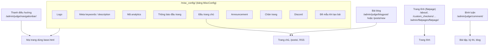
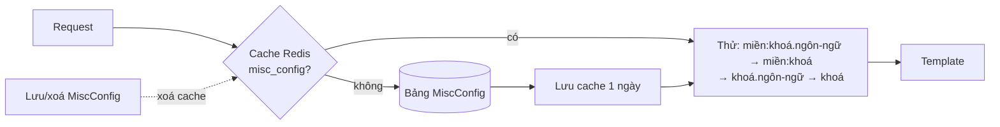

# Cấu hình giao diện và nội dung

> Đổi logo, thông báo đầu trang, nội dung trang chủ và chân trang qua `/misc_config/`; sửa thanh điều hướng, trang tĩnh (Thông tin), bài blog; kiểm duyệt bình luận; và biết các trang trạng thái, RSS, sitemap nằm ở đâu.
>
> ⏱ ~20 phút · 👤 Quản trị viên trang · 🔑 Superuser (blog, bình luận, trang tĩnh có thể giao cho staff có quyền tương ứng)

## Trước khi bắt đầu

- [ ] Có tài khoản superuser. Trang `/misc_config/` trả 404 với mọi người khác, kể cả staff.
- [ ] Với các mục trong trang quản trị (`/admin/`): staff cần quyền của model tương ứng, xem [Hệ thống phân quyền](/admin/permissions).
- [ ] Nếu cần chạy script (`moderate_comments`) hoặc lệnh (`add_blog_navigation`): có SSH vào server, chạy từ thư mục `dmoj/`.

## Nội dung nào nằm ở đâu



| Muốn đổi | Sửa ở |
|---|---|
| Logo, SEO, analytics, thông báo, chân trang, Discord, đề mẫu | `/misc_config/` |
| Các mục menu trên cùng | `/admin/judge/navigationbar/` |
| Trang **Thông tin** (`/about/`), trang hướng dẫn tĩnh | `/admin/flatpages/flatpage/` |
| Tin tức, thông báo dài trên trang chủ | Bài blog, đánh dấu **bài đăng chung** |
| Ẩn bình luận xấu | Biểu tượng thùng rác cạnh bình luận, hoặc `/admin/judge/comment/` |

## Trang cấu hình `/misc_config/`

Mở bằng biểu tượng bánh răng (**Cài đặt**) ở góc phải thanh điều hướng, hoặc vào thẳng `https://luyencode.net/misc_config/`. Trang có tiêu đề **Site settings**; các nhãn trên trang này **chưa được dịch** nên hiện bằng tiếng Anh.

1. Sửa các ô cần thay đổi (bảng dưới).
2. Bấm **Cập nhật**.
3. Tải lại một trang bất kỳ để kiểm tra. Thay đổi có hiệu lực ngay.

| Nhóm | Ô (nhãn) | Khoá | Hiển thị ở đâu | Định dạng |
|---|---|---|---|---|
| Branding | Site logo | `site_logo` | Logo góc trái thanh điều hướng; ảnh `og:image` khi chia sẻ link | File ảnh (tải lên) |
| Branding | Site favicon | `site_favicon` | **Hiện không được dùng** (xem cảnh báo) | File ảnh (tải lên) |
| SEO | Meta keywords | `meta_keywords` | Thẻ `<meta name="keywords">` mọi trang | Văn bản |
| SEO | Meta description | `meta_description` | Thẻ `<meta name="description">` **chỉ trên trang chủ** | Văn bản |
| Content | Home page top | `home_page_top` | Đầu danh sách bài trên trang chủ | HTML + cú pháp template Django |
| Content | Announcement | `announcement` | Khối `#announcement` ngay dưới nội dung chính, mọi trang | HTML thô |
| Content | Footer | `footer` | Chân trang, sau "proudly powered by VNOJ \| Github \|" | HTML thô |
| Notifications | Top notification | `top_notification` | Đầu vùng nội dung, mọi trang | HTML + cú pháp template Django |
| Analytics | Analytics | `analytics` | Chèn nguyên văn vào `<head>` mọi trang | HTML/JS thô |
| Community | Discord invite link | `discord_invite_link` | Xem dưới | URL |
| Community | Discord Shield.io badge URL | `discord_invite_shieldio` | Xem dưới | URL ảnh badge |
| Problem editor | Description example | `description_example` | Nội dung điền sẵn ô đề bài khi tạo bài mới trên site | Markdown |

Chi tiết:

- **Để trống một ô và bấm Cập nhật** sẽ xoá khoá đó khỏi cơ sở dữ liệu; phần tương ứng biến mất khỏi site.
- **Logo/favicon**: để trống ô chọn file thì giữ ảnh hiện tại. File tải lên được lưu vào `static-upload/` trong thư mục media với tên ngẫu nhiên, URL dạng `/static-upload/<uuid>.<đuôi>`.
- **Discord**: badge chỉ hiện khi **cả hai** ô Discord đều có giá trị. Nơi hiện: thanh bên trang chủ/blog, thông báo lỗi đăng nhập (ví dụ tài khoản bị cấm), trang 2FA, trang sau khi gửi yêu cầu đặt lại mật khẩu.
- **Home page top** được render bằng template Django với các biến `request`, `user_count`, `problem_count`, `submission_count`, `language_count`, `perms`. Ví dụ: <code v-pre>{{ problem_count }} bài tập, {{ user_count }} thành viên</code>. **Top notification** được render không có biến nào. Lỗi cú pháp template sẽ hiện chữ `Error rendering: …` thay cho nội dung.
- **Description example** chỉ áp dụng khi tạo bài ở giao diện site; xem [Quản lý bài tập](/setter/managing-problems).

::: danger Analytics, Announcement và Footer là HTML thô
Nội dung được chèn **không lọc** vào mọi trang của site (trừ trang quản trị `/admin/`), kể cả trang đăng nhập. Một thẻ `<script>` sai hoặc độc hại ảnh hưởng mọi người dùng. Chỉ dán mã từ nguồn tin cậy (Google Analytics…), kiểm tra lại trên trang dev trước nếu có thể.
:::

::: warning Favicon và logo tải lên
- Favicon của site luôn lấy từ các file `icons/favicon-*.png` trong thư mục static; ô **Site favicon** lưu được giá trị nhưng **tải favicon lên không đổi gì**. Muốn đổi favicon, thay file trong `resources/icons/` của lcoj-site rồi chạy lại `./scripts/copy_static`.
- `dmoj/nginx/conf.d/nginx.conf` đi kèm **không có** `location /static-upload`; đường dẫn này rơi vào `location /static` (tìm trong `/assets/`) nên ảnh logo vừa tải lên có thể trả 404. Nếu gặp, thêm `location /static-upload { root /media/; }` vào nginx rồi `docker compose restart nginx`.
:::

### Cách giá trị được lưu và áp dụng

- Mỗi ô là một dòng `(key, value)` trong bảng `MiscConfig`. Đầu trang có liên kết **Configure in admin panel for more options** trỏ tới `/admin/judge/miscconfig/` (mục *cấu hình khác*) để sửa trực tiếp.
- Toàn bộ bảng được cache trong Redis với khoá `misc_config`, tối đa 1 ngày. Cache bị **xoá tự động** mỗi khi một dòng được lưu hoặc xoá (qua `/misc_config/` hay admin), nên không cần khởi động lại gì.
- Khi hiển thị, LCOJ thử lần lượt các khoá: `<tên-miền>:<khoá>.<ngôn-ngữ>`, `<tên-miền>:<khoá>`, `<khoá>.<ngôn-ngữ>`, `<khoá>`, và dùng giá trị đầu tiên tìm thấy. `<tên-miền>` là tên miền của Site trong `/admin/sites/site/`; `<ngôn-ngữ>` là mã ngôn ngữ giao diện của người xem, ví dụ `vi` hoặc `en`.

Nhờ vậy bạn có thể tạo bản riêng cho từng ngôn ngữ trong admin, ví dụ khoá `top_notification.en` cho người xem tiếng Anh. Lưu ý khoá dài tối đa **30 ký tự**.



## Thanh điều hướng

Các mục menu trên cùng nằm ở `/admin/judge/navigationbar/` (**thanh điều hướng**). Danh sách hiển thị dạng cây: kéo thả để đổi thứ tự hoặc đưa một mục vào làm mục con (menu thả xuống).

| Trường | Nhãn trong admin | Ý nghĩa |
|---|---|---|
| `key` | định danh | Mã duy nhất, tối đa 10 ký tự; dùng làm class CSS `nav-<key>` |
| `label` | nhãn | Chữ hiển thị, tối đa 20 ký tự. Được đưa qua hàm dịch, nên nhãn tiếng Anh có sẵn bản dịch (ví dụ `Contests`) sẽ hiện tiếng Việt |
| `path` | đường dẫn liên kết | Đường dẫn trong site (`/contests/`) hoặc URL đầy đủ |
| `order` | thứ tự | Số thứ tự; kéo thả sẽ tự cập nhật |
| `regex` | làm nổi regex | Biểu thức chính quy so với đường dẫn hiện tại để tô sáng mục đang xem, ví dụ `^/contest`. Được so bằng `REGEXP BINARY` của MariaDB |
| `parent` | mục cha | Để trống cho mục cấp 1 |

Menu được đọc từ cơ sở dữ liệu ở mỗi request, lưu xong là thấy ngay.

### Thêm mục Blog bằng lệnh

```bash
./scripts/manage.py add_blog_navigation
```

Lệnh tạo mục `key=blog`, nhãn `Blog`, đường dẫn `/blog/`, regex `^/blog/`, đặt cuối menu (thứ tự lớn nhất + 10). Nếu đã có mục `key=blog` thì lệnh chỉ báo `Blog navigation item already exists`.

::: warning Kiểm tra đường dẫn sau khi chạy
Site không có trang `/blog/`; các trang danh sách blog là `/blogs/` và `/posts/`. Sau khi chạy lệnh, bấm thử mục Blog. Nếu gặp 404, sửa `path` (và `regex`) của mục này trong admin, hoặc tạo một chuyển hướng `/blog/` → `/blogs/` tại `/admin/redirects/redirect/` (**Chuyển hướng**).
:::

## Trang tĩnh (flatpage)

Trang tĩnh là trang nội dung cố định như **Thông tin** (`/about/`) hay **Custom checkers** (`/custom_checkers/`). Chúng được quản lý tại `/admin/flatpages/flatpage/`.

1. Mở trang cần sửa, hoặc bấm **Thêm** để tạo mới.
2. Điền **URL** (bắt đầu và kết thúc bằng `/`, ví dụ `/terms/`), **tiêu đề**, **nội dung** (Markdown, có xem trước).
3. Ở mục **các trang web** (*Sites*), chọn site của LCOJ. Thiếu bước này trang sẽ 404.
4. **Lưu**. Mở URL để kiểm tra.

Mục **Các tùy chọn nâng cao**:

| Trường | Ý nghĩa |
|---|---|
| **Bạn cần phải cần đăng kí** (*registration required*) | Chỉ người đã đăng nhập mới xem được |
| **tên thiết kế** (*template name*) | Để trống thì dùng `flatpages/default.html` (có cache và hỗ trợ công thức toán). Có thể đặt `flatpages/markdown.html` (không cache) |
| **mở bình luận** | Không có tác dụng trong LCOJ |

Những điều cần biết:

- Trang tĩnh chỉ được phục vụ khi **không** có route nào khác khớp URL (Django `FlatpageFallbackMiddleware`).
- Nội dung trang dùng template mặc định được cache 1 ngày; cache được xoá khi bạn lưu trang.
- Người có quyền sửa trang tĩnh thấy liên kết **[Chỉnh sửa]** cạnh tiêu đề trang.
- Nội dung trang tĩnh cho phép HTML thô (không lọc), nên có thể dùng `<h2 id="...">` để tạo mỏ neo.
- Trang Thông tin có sẵn trong menu (mục `about`) và trong sitemap. Tài liệu này và nhiều trang khác trỏ tới `https://luyencode.net/about/#lien-he`; khi sửa trang Thông tin, **giữ lại** phần tử có `id="lien-he"`, ví dụ `<h2 id="lien-he">Liên hệ</h2>`.
- Muốn có trang **Điều khoản**: tạo flatpage `/terms/`. Setting `TERMS_OF_SERVICE_URL` (mặc định `None`) chỉ dùng trên form đăng ký bằng mật khẩu, vốn bị ẩn khi site chỉ cho đăng ký qua OAuth (`OAUTH_ONLY = True`).

## Bài blog và thông báo trên trang chủ

Trang chủ hiển thị danh sách bài blog. Một bài xuất hiện trên trang chủ khi **đủ cả bốn** điều kiện:

| Trường | Nhãn | Điều kiện |
|---|---|---|
| `visible` | **hiển thị công khai** | Được tích |
| `publish_on` | **thời gian đăng** | Đã tới thời điểm này |
| `organization` | **tổ chức** | Để trống (bài của tổ chức chỉ hiện trong trang tổ chức) |
| `global_post` | **bài đăng chung** | Được tích ("Hiển thị bài đăng này ở trang chủ.") |

Thứ tự: bài có **dán** (`sticky`) lên đầu, sau đó theo thời gian đăng mới nhất. Người xem có thể chuyển sang xem mọi bài không thuộc tổ chức bằng `/?show_all_blogs=true` (lựa chọn được nhớ trong phiên).

### Đăng bài từ trang quản trị

1. Mở `/admin/judge/blogpost/` → **Thêm**.
2. Điền **tiêu đề bài viết** (slug tự sinh), **tác giả**, nội dung (Markdown), tuỳ chọn **đăng bài tóm tắt** (nếu có, trang chủ và RSS dùng phần tóm tắt thay cho toàn bài) và ảnh OpenGraph.
3. Đặt **thời gian đăng**. Có thể đặt trong tương lai để lên lịch.
4. Tích **hiển thị công khai**, **bài đăng chung**, và **dán** nếu muốn ghim lên đầu.
5. **Lưu**.

### Đăng bài từ giao diện site

Vào `/posts/new`. Người không phải superuser cần giải ít nhất 10 bài (`VNOJ_BLOG_MIN_PROBLEM_COUNT`). Ô **bài đăng chung** chỉ hiện với người có quyền `judge.mark_global_post`, ô **dán** với quyền `judge.pin_post`. Khi tạo bài ở site, thời gian đăng luôn được đặt là thời điểm hiện tại. Xem [Hệ thống phân quyền](/admin/permissions).

::: tip Thông báo ngắn hay dài?
Thông báo ngắn cần hiện ở **mọi trang** (bảo trì, sự cố chấm bài): dùng **Top notification** trong `/misc_config/`. Tin dài, có bình luận, cần lưu lại: đăng bài blog, tích **bài đăng chung** và **dán**. Thông báo cho một kỳ thi đang diễn ra: dùng thông báo kỳ thi, xem [Thiết lập kỳ thi](/organize/contest-setup).
:::

## Kiểm duyệt bình luận

Bình luận có điểm từ vote. Bình luận có điểm ≤ `DMOJ_COMMENT_VOTE_HIDE_THRESHOLD` (mặc định `-5`) được thu gọn trên giao diện nhưng vẫn mở ra xem được. Muốn **ẩn hẳn**, dùng một trong các cách sau.

| Cách | Ai dùng được | Phạm vi |
|---|---|---|
| Biểu tượng thùng rác cạnh bình luận | Người có quyền `judge.change_comment` | Ẩn bình luận đó **và toàn bộ trả lời** của nó, tính lại điểm đóng góp của tác giả |
| Sửa bình luận trong `/admin/judge/comment/`, tích **ẩn** | Như trên | Ẩn bình luận và các trả lời khi lưu |
| Hành động **Ẩn bình luận** / **Bỏ ẩn bình luận** trên danh sách admin | Như trên | Nhiều bình luận cùng lúc (xem cảnh báo) |
| `./scripts/moderate_comments` | Người vận hành có SSH | Mọi bình luận đang hiện có điểm ≤ −5 |

Danh sách `/admin/judge/comment/` tìm được theo tên người viết, trang và nội dung, lọc theo **ẩn**.

::: warning Hành động hàng loạt trong admin báo lỗi server
Hai hành động **Ẩn bình luận** / **Bỏ ẩn bình luận** hiện báo lỗi server sau khi chạy. Các bình luận thường đã được cập nhật dù thấy lỗi; tải lại danh sách để kiểm tra. Hành động này cũng không ẩn các trả lời. Ưu tiên dùng biểu tượng thùng rác.
:::

### Script `moderate_comments`

```bash
./scripts/moderate_comments --dry-run   # xem số lượng và 5 bình luận mới nhất sẽ bị ẩn
./scripts/moderate_comments             # ẩn thật
```

Script chạy SQL trực tiếp trên MariaDB (thông tin đăng nhập đọc từ `environment/mysql.env`), đặt `hidden = 1` cho mọi bình luận có `hidden = 0 AND score <= -5`. Ngưỡng `-5` được viết cứng trong script.

::: warning Giới hạn của script
Vì cập nhật thẳng bằng SQL, script **không** ẩn các trả lời của bình luận bị ẩn, **không** tính lại điểm đóng góp và không ghi lịch sử. Luôn chạy `--dry-run` trước.
:::

### Khoá bình luận một trang

Tạo một dòng ở `/admin/judge/commentlock/` với mã trang, ví dụ `p:<mã-bài>` (bài tập), `c:<mã-kỳ-thi>` (kỳ thi), `b:<id-bài-blog>` (blog), `s:<mã-bài>` (lời giải). Chỉ người có quyền `judge.override_comment_lock` còn bình luận được ở trang đó.

Muốn tắt quyền bình luận của một người: xem [Quản lý người dùng](/admin/users).

## Bản tin (newsletter)

LCOJ có sẵn chỗ tích hợp [django-newsletter](https://pypi.org/project/django-newsletter/) (route `/newsletter/` và ô đăng ký trong trang sửa hồ sơ, dùng `DMOJ_NEWSLETTER_ID_ON_REGISTER`), nhưng cấu hình mặc định **không cài gói này** và không thêm `newsletter` vào `INSTALLED_APPS`. Vì vậy `/newsletter/` không tồn tại và `DMOJ_NEWSLETTER_ID_ON_REGISTER` (mặc định `None`) không có tác dụng.

## Trang trạng thái và thống kê

| Đường dẫn | Nội dung | Ai xem được |
|---|---|---|
| `/status/` | **Trạng thái** các máy chấm và phiên bản runtime | Mọi người thấy máy chấm đang online; staff/superuser thấy cả máy offline |
| `/runtimes/` | **Các ngôn ngữ** hỗ trợ | Mọi người |
| `/runtimes/matrix/` | Ma trận phiên bản ngôn ngữ trên từng máy chấm online | Mọi người |
| `/status/oj/` | **Trạng thái của OJ**: biểu đồ bài nộp theo ngày, theo ngôn ngữ, theo kết quả, thời gian chờ chấm, hoạt động của tổ chức | Chỉ superuser (người khác nhận lỗi "You must be admin to view this content.") |
| `/stats/data/all/` | API JSON cấp dữ liệu cho `/status/oj/` (chỉ nhận POST) | Chỉ superuser |

Thiết lập máy chấm: xem [Cài đặt judge](/operate/judge-setup).

## RSS, Atom và sitemap

| Đường dẫn | Nội dung |
|---|---|
| `/feed/problems/rss/`, `/feed/problems/atom/` | 25 bài tập công khai mới nhất |
| `/feed/comment/rss/`, `/feed/comment/atom/` | 25 bình luận mới nhất mà khách chưa đăng nhập xem được |
| `/feed/blog/rss/`, `/feed/blog/atom/` | 25 bài blog đang hiện, đã tới thời gian đăng (bài dán lên trước) |
| `/sitemap.xml` | Trang chủ, `/about/`, bài tập công khai, lời giải công khai, bài blog, kỳ thi công khai, tổ chức, trang người dùng |

::: warning Feed blog có cả bài của tổ chức
Feed blog lọc theo "đang hiện" và "đã tới thời gian đăng" nhưng **không** loại bài thuộc tổ chức, nên tóm tắt (hoặc nội dung, nếu không có tóm tắt) của bài tổ chức riêng tư đang hiện cũng có thể xuất hiện trong feed. Với nội dung nhạy cảm của tổ chức, hãy bỏ tích **hiển thị công khai**.
:::

Link tuyệt đối trong sitemap dùng tên miền của Site (`/admin/sites/site/`, **Tên miền**), bản ghi này cần là tên miền thật của site (trên luyencode.net là `luyencode.net`). Nếu link sai tên miền, sửa bản ghi Site đó.

## Sự cố thường gặp

| Triệu chứng | Nguyên nhân | Cách xử lý |
|---|---|---|
| `/misc_config/` báo 404 | Không phải superuser | Đăng nhập tài khoản superuser |
| Sửa ở `/misc_config/` nhưng site vẫn hiện nội dung cũ | Có khoá riêng theo ngôn ngữ/tên miền (ví dụ `top_notification.vi`) được ưu tiên hơn | Kiểm tra `/admin/judge/miscconfig/`, sửa hoặc xoá khoá riêng đó |
| Logo mới bị vỡ ảnh | nginx không phục vụ `/static-upload/` | Xem cảnh báo "Favicon và logo tải lên" |
| Tải favicon lên nhưng không đổi | Template không dùng `site_favicon` | Thay file icon trong static, chạy `./scripts/copy_static` |
| Đầu trang hiện `Error rendering: …` | Lỗi cú pháp template Django trong Top notification / Home page top | Sửa cú pháp <code v-pre>{{ }}</code>, `` |
| Cả site trắng hoặc lỗi JS sau khi sửa Analytics/Footer | HTML/JS dán vào bị hỏng | Xoá nội dung ô đó trong `/misc_config/` hoặc `/admin/judge/miscconfig/` |
| Mục menu không tô sáng khi đang ở trang đó | `regex` không khớp đường dẫn | Sửa regex, ví dụ `^/contest` |
| Flatpage mới báo 404 | Chưa chọn Site, URL thiếu `/` đầu/cuối, hoặc URL trùng một route có sẵn | Kiểm tra mục **các trang web** và URL |
| Link `/about/#lien-he` không cuộn tới mục Liên hệ | Mất phần tử `id="lien-he"` khi sửa trang | Thêm lại `<h2 id="lien-he">Liên hệ</h2>` |
| Bài blog không hiện trên trang chủ | Thiếu **bài đăng chung**, chưa tích **hiển thị công khai**, thời gian đăng ở tương lai, hoặc có chọn tổ chức | Kiểm tra bốn điều kiện ở trên |
| Admin báo lỗi server khi dùng **Ẩn bình luận** | Hành động báo lỗi sau khi đã cập nhật | Tải lại danh sách để kiểm tra; dùng biểu tượng thùng rác |

## Tiếp theo

- [Quản lý người dùng](/admin/users): cấm, tắt bình luận, cấp quyền staff.
- [Hệ thống phân quyền](/admin/permissions): quyền cho blog, bình luận, trang tĩnh.
- [Rút gọn liên kết](/admin/url-shortener): tạo link ngắn cho thông báo, poster.
- [Các script hỗ trợ](/operate/scripts): `copy_static`, `moderate_comments` và các script khác.
- [Vận hành LCOJ](/operate/operations): khởi động lại service, xem log.
- [Tham khảo cấu hình](/reference/settings): các setting nhắc tới ở trang này, như `DMOJ_COMMENT_VOTE_HIDE_THRESHOLD`, `VNOJ_BLOG_MIN_PROBLEM_COUNT`.
