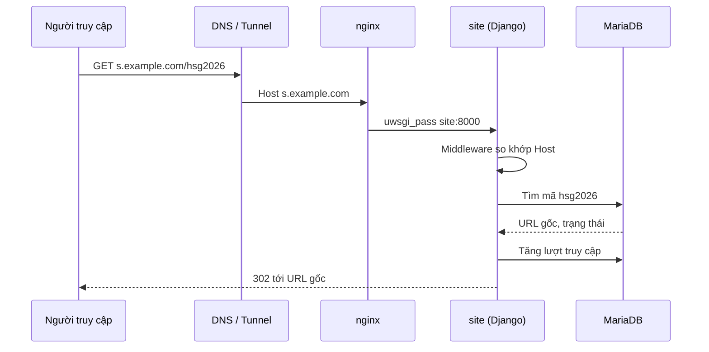
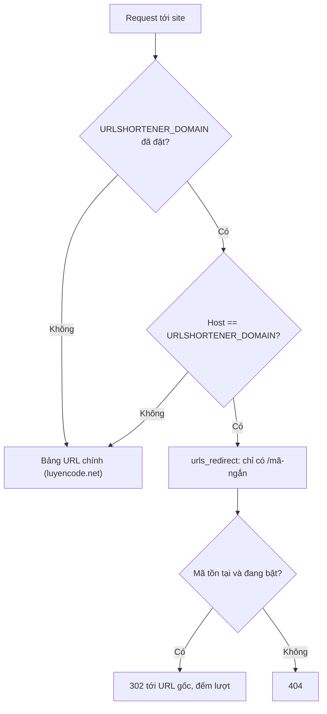

# Rút gọn liên kết

> Tạo link ngắn dạng `https://<tên-miền-rút-gọn>/hsg2026` trỏ tới địa chỉ dài, xem lượt truy cập, cấp quyền cho staff và cấu hình tên miền rút gọn riêng.
>
> ⏱ ~2 phút (tạo link) · ~15 phút (cấu hình tên miền) · 👤 Staff, admin, người vận hành · 🔑 Các quyền `urlshortener.*`; cấu hình tên miền cần quyền truy cập server

LCOJ có sẵn một công cụ rút gọn liên kết nội bộ: bạn gán một **mã ngắn** (ví dụ `hsg2026`) cho một địa chỉ dài, rồi chia sẻ link dạng `https://<tên-miền-rút-gọn>/hsg2026`. Công cụ này hữu ích khi cần phát link kỳ thi, form đăng ký hay tài liệu trên slide, poster, tin nhắn nhóm.

Trang này gồm ba phần, cho ba nhóm người đọc:

| Phần | Dành cho | Nội dung |
|---|---|---|
| [1. Tạo và quản lý link rút gọn](#_1-tao-va-quan-ly-link-rut-gon) | Staff đã được cấp quyền | Tạo, sửa, tắt, xoá link; xem số lượt truy cập |
| [2. Cấp quyền](#_2-cap-quyen) | Admin | Cấp 4 quyền `urlshortener.*` qua trang admin |
| [3. Dùng tên miền riêng](#_3-dung-ten-mien-rieng) | Người vận hành server | Bật middleware, cấu hình `URLSHORTENER_DOMAIN`, `ALLOWED_HOSTS`, định tuyến tên miền |

::: warning Link rút gọn chỉ hoạt động khi đã cấu hình tên miền riêng
Việc chuyển hướng `/<mã-ngắn>` **chỉ** được xử lý trên tên miền rút gọn riêng (Phần 3). Trên tên miền chính (ví dụ `luyencode.net`) không có route nào cho `/<mã-ngắn>`, nên `https://luyencode.net/hsg2026` sẽ trả về lỗi 404.

Cấu hình mặc định của LCOJ (`dmoj/config/local_settings.py`) **chưa** đặt `URLSHORTENER_DOMAIN` và **chưa** thêm `URLShortenerMiddleware` vào `MIDDLEWARE`. Khi đó bạn vẫn tạo và quản lý link được, nhưng link sao chép ra chỉ là đường dẫn tương đối `/<mã-ngắn>` và không dùng được. Hãy nhờ người vận hành làm Phần 3 trước.
:::

## Cách hoạt động



- Middleware so sánh Host của request với `URLSHORTENER_DOMAIN`. Nếu khớp, request được định tuyến bằng bảng URL riêng `urlshortener.urls_redirect`, chỉ có đúng một route: `/<mã-ngắn>`.
- Tìm thấy mã và link đang bật: tăng bộ đếm, ghi thời điểm truy cập, trả **302** (chuyển hướng tạm thời) về URL gốc.
- Không tìm thấy mã, hoặc link đã tắt: trả **404**.
- Người truy cập **không cần đăng nhập**.

---

## 1. Tạo và quản lý link rút gọn

⏱ ~2 phút · 👤 Staff đã được cấp quyền · 🔑 `urlshortener.view_urlshortener`, `urlshortener.add_urlshortener`, `urlshortener.change_urlshortener`, `urlshortener.delete_urlshortener`

### Trước khi bắt đầu

- Bạn đã đăng nhập và được cấp quyền (xem [Phần 2](#_2-cap-quyen)). Chưa đăng nhập sẽ bị chuyển tới trang đăng nhập; đăng nhập nhưng thiếu quyền sẽ gặp lỗi 403.
- Trang quản lý nằm ở **`/shorteners/`** trên tên miền chính (ví dụ `https://luyencode.net/shorteners/`). Menu và thanh điều hướng **không có** liên kết tới trang này, nên hãy lưu lại địa chỉ.
- Để link hoạt động được thì tên miền rút gọn phải được cấu hình sẵn (Phần 3).

Các trang quản lý:

| Địa chỉ | Chức năng | Quyền cần có |
|---|---|---|
| `/shorteners/` | Danh sách tất cả link, 20 link/trang | `view_urlshortener` |
| `/shorteners/create/` | Tạo link mới | `add_urlshortener` |
| `/shorteners/<mã-ngắn>/` | Xem chi tiết một link | `view_urlshortener` |
| `/shorteners/<mã-ngắn>/edit/` | Sửa link | `change_urlshortener` |
| `/shorteners/<mã-ngắn>/delete/` | Xoá link | `delete_urlshortener` |

::: tip Nhãn giao diện
Phần lớn nhãn của tính năng này chưa có bản dịch tiếng Việt, nên kể cả khi giao diện đang ở tiếng Việt bạn vẫn sẽ thấy tiếng Anh (ví dụ `Create New`, `Original URL`, `Short code`). Trang này ghi nhãn đúng như trên màn hình.
:::

### Tạo link mới

1. Mở `/shorteners/`, bấm tab **Create New** (tab bên cạnh là **Danh sách**).
2. Điền form:

   | Trường | Bắt buộc | Ý nghĩa và quy tắc |
   |---|---|---|
   | **Original URL** | Có | Địa chỉ đích đầy đủ, phải là URL hợp lệ, gồm cả `https://` (ví dụ `https://luyencode.net/contest/hsg2026`). Nhập `luyencode.net/...` không có scheme sẽ bị báo lỗi. |
   | **Short code** | Có | Mã ngắn, xuất hiện sau dấu `/` của link. Chỉ gồm chữ cái Latin không dấu, chữ số, dấu gạch ngang `-` và gạch dưới `_`; tối đa 50 ký tự; **không trùng** với mã đã có. Không có khoảng trắng, dấu tiếng Việt hay ký tự như `@`, `!`, `.`, `/`. |
   | **Is active** | Không (mặc định bật) | Bật: link chuyển hướng bình thường. Tắt: người truy cập nhận lỗi 404, nhưng link vẫn được giữ lại để bật lại sau. |

   Nút có biểu tượng xáo trộn 🔀 bên phải ô **Short code** sẽ điền một mã ngẫu nhiên gồm 8 ký tự chữ và số. Mã này không được kiểm tra trùng trước khi bạn lưu.
3. Bấm **Tạo**.
4. Bạn được chuyển tới trang chi tiết của link. Hộp trên cùng hiển thị link rút gọn đầy đủ; bấm **Copy** để sao chép.

::: tip Chọn mã ngắn
- Ưu tiên mã dễ đọc, dễ gõ: `hsg2026`, `dang-ky-k10`, `slide_buoi3`.
- Đừng dùng chữ hoa/thường để phân biệt hai mã khác nhau (`HSG` và `hsg`); dễ nhầm khi đọc và có thể bị cơ sở dữ liệu coi là trùng.
- Tránh đặt mã là `create`: trang chi tiết `/shorteners/create/` sẽ bị trang tạo link mới “chiếm” mất (link vẫn chuyển hướng bình thường).
:::

### Xem danh sách và thống kê

Trang **Danh sách** (`/shorteners/`) hiển thị **mọi** link trong hệ thống, mới nhất trước. Link không thuộc riêng người tạo; ai có quyền xem đều thấy tất cả. Các cột:

| Cột | Nội dung |
|---|---|
| **Short URL** | Mã ngắn, kèm biểu tượng 📋 để sao chép link đầy đủ |
| **Original URL** | URL gốc (cắt còn 50 ký tự đầu nếu dài) |
| **Accesses** | Số lượt truy cập |
| **Trạng thái** | `Active` hoặc `Inactive` (link đã tắt hiển thị mờ) |
| **Created** | Thời điểm tạo |
| **Actions** | Xem 👁, sửa ✏️, xoá 🗑 |

Trang chi tiết có thêm **Last Accessed**: thời điểm truy cập gần nhất, chỉ hiện khi đã có ít nhất một lượt.

::: details Lượt truy cập được đếm như thế nào?
- Mỗi request tới link đang bật mà được chuyển hướng thành công sẽ cộng 1 vào **Access Count** và cập nhật **Last Accessed**.
- Không lọc trùng người truy cập hay bot: bấm lại 10 lần là 10 lượt. Công cụ xem trước link (Zalo, Messenger, Discord…) cũng có thể được tính.
- Truy cập vào link đã tắt, hoặc mã không tồn tại, **không** được tính.
- Không có thống kê theo ngày, theo nguồn hay theo quốc gia.
:::

### Sửa, tắt hoặc xoá link

1. Trong **Danh sách**, bấm biểu tượng ✏️ (hoặc nút **Chỉnh sửa** trên trang chi tiết).
2. Sửa các trường như lúc tạo, rồi bấm **Lưu**.
   - Đổi **Original URL**: link cũ vẫn giữ nguyên, chỉ đích đến thay đổi. Thích hợp khi cần đổi đích mà không phát lại link.
   - Đổi **Short code**: link cũ **ngừng hoạt động** ngay (404), vì hệ thống không lưu mã cũ.
   - Bỏ chọn **Is active**: tạm khoá link, giữ nguyên thống kê.
3. Để xoá hẳn, bấm 🗑 (hoặc **Xoá** trên trang chi tiết). Trang xác nhận hiện mã, URL gốc, số lượt truy cập, ngày tạo; bấm **Xoá** để xác nhận. Việc xoá **không thể hoàn tác**, sau đó bạn được đưa về **Danh sách**.

::: warning
Link rút gọn không có thời hạn: nó hoạt động cho tới khi bị tắt hoặc xoá. Khi kỳ thi hay sự kiện đã xong, hãy tắt link nếu không muốn người khác tiếp tục dùng.
:::

### Người truy cập thấy gì

- Link đang bật: trình duyệt chuyển thẳng tới URL gốc (HTTP 302), không có trang trung gian.
- Link đã tắt hoặc mã sai: trang lỗi 404.
- Tham số truy vấn **không** được chuyển tiếp: `https://<tên-miền-rút-gọn>/hsg2026?ref=fb` vẫn chỉ tới đúng URL gốc, phần `?ref=fb` bị bỏ.
- Dấu `/` ở cuối **không** được chấp nhận: `/hsg2026/` trả về 404, phải dùng `/hsg2026`.

### Kiểm tra kết quả

1. Trên trang chi tiết, bấm **Copy** rồi dán vào tab ẩn danh (không đăng nhập).
2. Trình duyệt phải mở đúng URL gốc.
3. Tải lại trang chi tiết: **Access Count** tăng lên và xuất hiện **Last Accessed**.

### Xử lý sự cố

| Triệu chứng | Cách khắc phục |
|---|---|
| Vào `/shorteners/` bị chuyển tới trang đăng nhập | Đăng nhập trước. |
| Lỗi 403 khi mở danh sách, tạo, sửa hoặc xoá | Thiếu quyền tương ứng; nhờ admin cấp (Phần 2). |
| Tạo thành công nhưng sau đó gặp 403 | Bạn có quyền `add` nhưng thiếu `view`: sau khi lưu, hệ thống chuyển tới trang chi tiết, trang này cần `view_urlshortener`. Link vẫn đã được tạo. |
| Link sao chép ra chỉ là `/hsg2026` (không có tên miền) | Chưa cấu hình `URLSHORTENER_DOMAIN`; báo người vận hành (Phần 3). |
| Mở link bị 404 | Kiểm tra: link đang `Active`; mã gõ đúng; không có `/` ở cuối; link được mở trên tên miền rút gọn chứ không phải tên miền chính; tên miền rút gọn đã cấu hình xong (Phần 3). |
| Lỗi ở ô **Short code** khi lưu | Mã đã tồn tại, chứa ký tự không được phép, hoặc dài quá 50 ký tự. |
| Lỗi ở ô **Original URL** | Thiếu `http://` / `https://` hoặc URL sai định dạng. |
| Đổi mã xong, link cũ đã in trên poster bị 404 | Đổi mã về như cũ. Muốn có thêm mã mới thì tạo thêm một link riêng trỏ cùng đích. |

---

## 2. Cấp quyền

⏱ ~3 phút · 👤 Admin (superuser, hoặc người được sửa User/Group trong trang admin) · 🔑 quyền sửa `auth.User` hoặc `auth.Group`

Tính năng dùng 4 quyền mặc định mà Django sinh cho model `URLShortener`:

| Quyền | Cho phép |
|---|---|
| `urlshortener.view_urlshortener` | Xem danh sách và trang chi tiết |
| `urlshortener.add_urlshortener` | Tạo link mới |
| `urlshortener.change_urlshortener` | Sửa link (bao gồm bật/tắt) |
| `urlshortener.delete_urlshortener` | Xoá link |

::: tip Nên cấp đủ bộ 4 quyền
Các nút **Chỉnh sửa**/**Xoá** luôn hiển thị với người có quyền xem, và sau khi tạo link người dùng được đưa tới trang chi tiết (cần quyền xem). Cấp lẻ từng quyền dễ gây lỗi 403 khó hiểu. Với người chỉ cần xem thống kê thì chỉ cấp `view_urlshortener`.
:::

::: details Model này không có trang quản lý trong Django admin
App `urlshortener` không đăng ký model vào Django admin, nên trong `/admin/` bạn **không** tìm thấy mục “URL shortener” để quản lý link. Admin chỉ dùng để cấp quyền; mọi thao tác với link đều qua `/shorteners/`. Superuser tự động có đủ mọi quyền.
:::

### Trước khi bắt đầu

- Bạn đăng nhập được vào `/admin/` với quyền sửa người dùng hoặc nhóm.
- Đã chạy migration của app `urlshortener` (`./scripts/migrate`), để 4 quyền trên tồn tại trong cơ sở dữ liệu.

### Cách A: cấp qua nhóm (khuyến nghị)

1. Vào `/admin/auth/group/`, mở một nhóm có sẵn hoặc tạo nhóm mới (ví dụ `Link Managers`).
2. Trong ô chọn quyền, gõ `URL shortener` để lọc. Các quyền hiện dạng `URL Shortener | URL shortener | Can view URL shortener`, tương tự với `add`, `change`, `delete`.
3. Chuyển các quyền cần cấp sang cột đã chọn, rồi lưu.
4. Mở `/admin/auth/user/`, chọn người dùng, thêm họ vào nhóm vừa tạo ở mục nhóm, rồi lưu.

### Cách B: cấp trực tiếp cho một người

1. Vào `/admin/auth/user/`, mở người dùng cần cấp.
2. Ở mục quyền người dùng, gõ `urlshortener` để lọc. Trang người dùng của LCOJ hiển thị quyền dạng `urlshortener.view_urlshortener | Can view URL shortener`.
3. Chọn các quyền cần cấp, rồi lưu.

Xem thêm về cơ chế quyền tại [Hệ thống phân quyền](/admin/permissions).

### Kiểm tra kết quả

1. Đăng nhập bằng tài khoản vừa được cấp quyền (hoặc nhờ họ tự thử).
2. Mở `/shorteners/`: phải thấy trang **Danh sách** thay vì lỗi 403.
3. Bấm **Create New**: phải thấy form tạo link (nếu đã cấp `add_urlshortener`).

Bạn cũng có thể kiểm tra trong Django shell:

```sh
./scripts/manage.py shell -c "from django.contrib.auth.models import User; u = User.objects.get(username='ten_dang_nhap'); print(sorted(p for p in u.get_all_permissions() if p.startswith('urlshortener.')))"
```

### Xử lý sự cố

| Triệu chứng | Cách khắc phục |
|---|---|
| Không tìm thấy quyền `urlshortener` trong danh sách | Chạy `./scripts/migrate` để tạo bảng và quyền, rồi tải lại trang admin. |
| Đã cấp quyền nhưng người dùng vẫn bị 403 | Kiểm tra lại đúng tài khoản; người dùng đã thuộc nhóm; nhóm có đúng quyền cần cho thao tác đó (xem bảng quyền ở trên). |
| Người dùng tạo được nhưng bị 403 sau khi bấm **Tạo** | Cấp thêm `view_urlshortener`. |
| Tìm trong admin không thấy danh sách link | Đúng như thiết kế: quản lý link tại `/shorteners/`. |

---

## 3. Dùng tên miền riêng

⏱ ~15 phút · 👤 Người vận hành server · 🔑 quyền truy cập server, `dmoj/repo/dmoj/local_settings.py` và cấu hình DNS / Cloudflare Tunnel

Phần này cấu hình một tên miền riêng, ví dụ `s.example.com`, để `https://s.example.com/<mã-ngắn>` chuyển hướng tới URL gốc. Trong các ví dụ dưới đây, hãy thay `s.example.com` bằng tên miền thật của bạn.

### Middleware quyết định thế nào

`urlshortener.middleware.URLShortenerMiddleware` làm đúng một việc: nếu `URLSHORTENER_DOMAIN` được đặt **và** `request.get_host()` **bằng đúng** giá trị đó, request được định tuyến bằng `urlshortener.urls_redirect` thay cho bảng URL chính.



Hệ quả:

- So sánh là **so khớp chính xác** chuỗi Host, kể cả cổng. Ví dụ `s.example.com:8071` **không** khớp với `s.example.com`.
- Trên tên miền rút gọn, **chỉ** có `/<mã-ngắn>`. Trang chủ `/`, `/shorteners/`, `/admin/`… đều 404. Hãy quản lý link trên tên miền chính.
- `URLSHORTENER_DOMAIN` còn được dùng để dựng link hiển thị ở trang quản lý: nếu giá trị không có scheme, LCOJ tự thêm `https://` vào trước (ví dụ `s.example.com` → `https://s.example.com/hsg2026`). Tuy nhiên, vì middleware so khớp với Host, giá trị **phải là tên miền trần** (không scheme, không cổng). Nếu ghi `https://s.example.com`, link hiển thị vẫn đúng nhưng chuyển hướng sẽ không bao giờ chạy.

### Trước khi bắt đầu

- LCOJ đã chạy ổn định trên tên miền chính (xem [Cài đặt website](/operate/installation)).
- Bạn quản lý được DNS của tên miền rút gọn, và Cloudflare Tunnel (nếu dùng, như bản production).
- Trong `docker-compose.yml`, nginx được publish ra host ở cổng `${NGINX_PORT:-8071}` (mặc định `8071`). Tunnel của tên miền chính đang trỏ tới cổng này.
- Bạn biết file cấu hình thật là `dmoj/repo/dmoj/local_settings.py` (được git bỏ qua). Script `./scripts/initialize` copy nó từ `dmoj/config/local_settings.py`.

### Các bước

1. **Trỏ tên miền về nginx.** Thêm một public hostname `s.example.com` trong Cloudflare Tunnel, trỏ tới **cùng dịch vụ nginx** với tên miền chính (`http://<máy-chủ>:8071`). Không ghi đè Host header: Django cần nhận đúng `Host: s.example.com`.

2. **(Tuỳ chọn) Khai báo trong nginx.** `dmoj/nginx/conf.d/nginx.conf` chỉ có một khối `server` (`listen 80`, `server_name luyencode.net;`) nên nó là server mặc định và đã nhận mọi Host. Nhờ vậy request tới `s.example.com` đã tới `site` qua `uwsgi_pass site:8000` (có `include uwsgi_params`, nên Host được chuyển tiếp). Muốn khai báo tường minh, thêm tên miền vào `server_name`:

   ```nginx
   server_name  luyencode.net s.example.com;
   ```

   Sau đó chạy `docker compose restart nginx`.

3. **Cấu hình Django.** Thêm vào cuối `dmoj/repo/dmoj/local_settings.py`:

   ```python
   # Tên miền rút gọn: chỉ tên miền trần, không scheme, không cổng
   URLSHORTENER_DOMAIN = 's.example.com'

   # Django từ chối Host không có trong ALLOWED_HOSTS (lỗi 400)
   ALLOWED_HOSTS = [HOST, URLSHORTENER_DOMAIN]

   # Middleware không được bật sẵn trong dmoj/settings.py
   MIDDLEWARE += ('urlshortener.middleware.URLShortenerMiddleware',)
   ```

   - `local_settings.py` được `exec` ở cuối `dmoj/settings.py`, nên dùng được `HOST` và `MIDDLEWARE += (...)` (`MIDDLEWARE` là tuple).
   - Thêm middleware vào cuối danh sách là đủ, vì việc chọn bảng URL chỉ xảy ra sau khi tất cả middleware đã chạy phần xử lý request.
   - `URLSHORTENER_DOMAIN` **không** đọc từ biến môi trường; phải đặt trong `local_settings.py`.
   - Không sửa `dmoj/settings.py`.

4. **Lưu cấu hình vào template.** Chép các dòng trên vào `dmoj/config/local_settings.py` luôn, để lần chạy `./scripts/initialize` sau không làm mất cấu hình.

5. **Khởi động lại:**

   ```sh
   cd lcoj-docker/dmoj
   docker compose restart site celery
   ```

### Kiểm tra kết quả

Tạo một link thử (Phần 1), ví dụ mã `test123` trỏ tới `https://luyencode.net/`, rồi:

```sh
# 1. Gọi thẳng nginx trên server, giả lập Host của tên miền rút gọn
curl -sI -H 'Host: s.example.com' http://localhost:8071/test123
# Mong đợi: HTTP/1.1 302 Found  và  Location: https://luyencode.net/

# 2. Qua Internet (DNS / Tunnel)
curl -sI https://s.example.com/test123
# Mong đợi: 302 và Location như trên

# 3. Mã không tồn tại
curl -sI https://s.example.com/khong-ton-tai
# Mong đợi: 404

# 4. Tên miền chính không bị ảnh hưởng
curl -sI https://luyencode.net/
# Mong đợi: 200 như trước
```

Cuối cùng, mở trang chi tiết của link: hộp link phải hiển thị `https://s.example.com/test123`, và **Access Count** đã tăng.

### Xử lý sự cố

| Triệu chứng | Cách khắc phục |
|---|---|
| `400 Bad Request` trên tên miền rút gọn | Chưa thêm tên miền vào `ALLOWED_HOSTS`, hoặc chưa restart `site`. Xem `docker compose logs site` có dòng `DisallowedHost`. |
| Tên miền rút gọn hiện trang chủ hoặc 404 của site chính | Middleware chưa chạy: thiếu `MIDDLEWARE += ('urlshortener.middleware.URLShortenerMiddleware',)`; hoặc giá trị `URLSHORTENER_DOMAIN` khác Host thật (có scheme, có cổng, sai chính tả, hoa/thường). |
| `curl -H 'Host: ...'` lên `localhost:8071` chạy, nhưng qua Internet thì không | Kiểm tra public hostname của tunnel/DNS trỏ đúng tới nginx và không ghi đè Host header. |
| Link hiển thị trong trang quản lý vẫn là `/mã` | `URLSHORTENER_DOMAIN` chưa được nạp: kiểm tra đã sửa đúng file `dmoj/repo/dmoj/local_settings.py` và đã restart. |
| `/mã/` (có `/` cuối) bị 404 | Đúng như thiết kế; dùng `/mã`. |
| Cấu hình mất sau khi chạy lại `./scripts/initialize` | Chép cấu hình vào `dmoj/config/local_settings.py` (bước 4). |

Xem thêm lệnh vận hành tại [Vận hành hệ thống](/operate/operations).

---

## Tiếp theo

- [Hệ thống phân quyền](/admin/permissions): các quyền khác trong LCOJ và cách tổ chức nhóm.
- [Vận hành hệ thống](/operate/operations): restart service, xem log, kiểm tra trạng thái.
- [Cài đặt website](/operate/installation): cài đặt lại hoặc dựng môi trường thử nghiệm để kiểm tra tên miền rút gọn trước khi áp dụng cho production.
