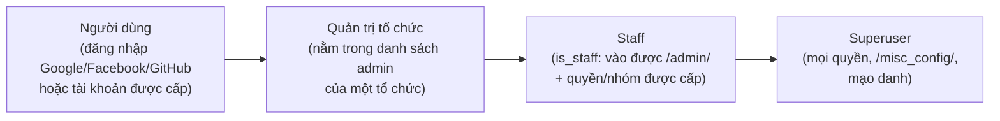
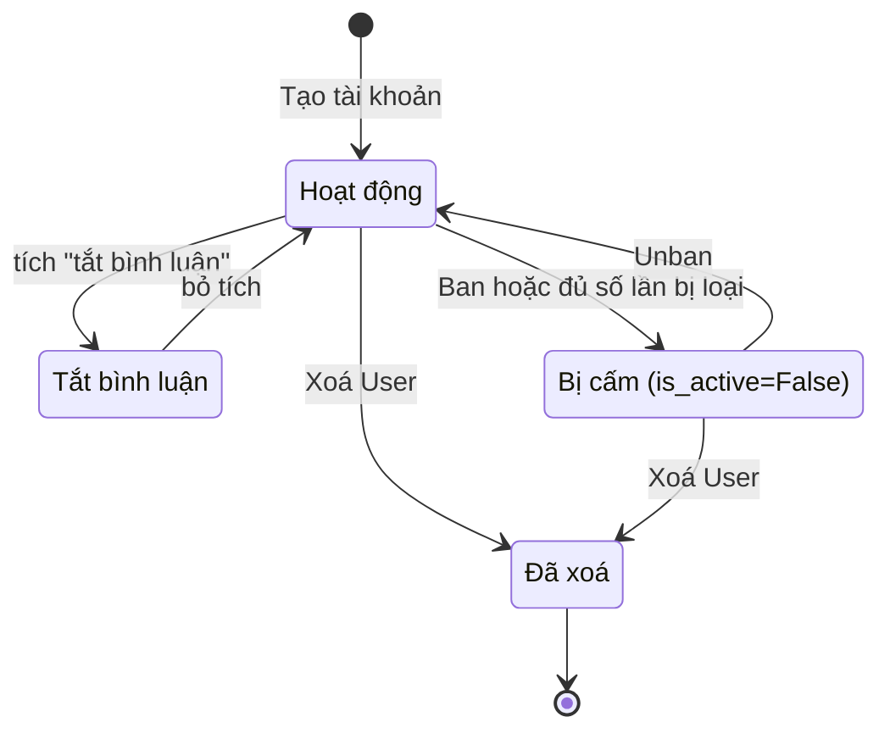

# Quản lý người dùng

> Tạo tài khoản hàng loạt cho lớp học, cấp quyền staff/superuser, cấm hoặc tắt bình luận của người vi phạm, mạo danh để gỡ lỗi, chuyển dữ liệu giữa hai tài khoản và xoá tài khoản an toàn.
>
> ⏱ ~25 phút · 👤 Quản trị viên trang · 🔑 Superuser (một số việc chỉ cần staff kèm quyền cụ thể, xem [Hệ thống phân quyền](/admin/permissions))

## Trước khi bắt đầu

- [ ] Đăng nhập được trang quản trị `/admin/` bằng tài khoản superuser (hoặc staff đã được cấp quyền tương ứng).
- [ ] Nếu cần chạy lệnh quản trị (`adduser`, `batchadduser`, `move_user_content`): có SSH vào server và chạy được `docker compose` trong thư mục `dmoj/`. Mọi lệnh bên dưới chạy từ `dmoj/` dưới dạng `./scripts/manage.py <lệnh>`.
- [ ] Đã đọc [Hệ thống phân quyền](/admin/permissions) để hiểu staff, superuser, nhóm và quyền.

## Các loại tài khoản

LCOJ có bốn mức vai trò, từ thấp đến cao. Mỗi mức không tự động bao gồm quyền của mức trên; riêng superuser có mọi quyền.



| Vai trò | Được gì | Cấp ở đâu |
|---|---|---|
| Người dùng | Nộp bài, thi, bình luận (sau khi giải đủ số bài tối thiểu) | Tự đăng nhập bằng OAuth, hoặc bạn tạo bằng lệnh (xem bên dưới) |
| Quản trị tổ chức | Quản lý thành viên, bài tập, kỳ thi của tổ chức mình | Trang sửa tổ chức, xem [Tổ chức](/organize/organizations) |
| Staff | Đăng nhập `/admin/`; chỉ làm được những gì quyền/nhóm cho phép | `/admin/auth/user/` |
| Superuser | Mọi quyền, không cần cấp từng quyền | `/admin/auth/user/` hoặc `adduser --superuser` |

::: info Đăng ký chỉ qua OAuth
LCOJ đặt `OAUTH_ONLY = True` trong `dmoj/config/local_settings.py`: form đăng ký bằng mật khẩu bị ẩn, người dùng mới tự tạo tài khoản bằng Google/Facebook/GitHub. Tuy vậy **form đăng nhập bằng tên đăng nhập + mật khẩu vẫn hoạt động**, nên tài khoản bạn tạo bằng lệnh (có mật khẩu) vẫn đăng nhập bình thường. Đây là cách phát tài khoản cho lớp học hoặc kỳ thi tại chỗ.
:::

## Tìm và xem một người dùng

Trong trang quản trị, mục **Users** có hai trang liên quan:

| Trang | Đường dẫn | Dùng để |
|---|---|---|
| Tài khoản Django (`User`) | `/admin/auth/user/` | Tên đăng nhập, email, mật khẩu, trạng thái hoạt động, staff/superuser, nhóm, quyền |
| Hồ sơ LCOJ (`Profile`, *hồ sơ người dùng*) | `/admin/judge/profile/` | Rank hiển thị, tổ chức, múi giờ, IP cuối, tắt bình luận, ẩn khỏi bảng xếp hạng, lý do cấm, 2FA, ghi chú nội bộ |

Các bước:

1. Mở `/admin/judge/profile/`, gõ tên đăng nhập, email hoặc địa chỉ IP vào ô tìm kiếm.
2. Danh sách hiện email, trạng thái TOTP, múi giờ, ngày tham gia, lần truy cập cuối, IP cuối và liên kết **Xem trên trang web**.
3. Bấm tên để mở hồ sơ. Trang hồ sơ không có nút xoá (cố ý), và không thể tạo hồ sơ mới trực tiếp ở đây: hồ sơ được tạo kèm khi tạo `User`.
4. Từ trang cá nhân của người dùng trên site (`/user/<tên>`), superuser/staff thấy thêm các tab **Mạo danh**, **Ban người dùng này** và **Admin User** (mở thẳng trang `/admin/auth/user/<id>/change/`) tuỳ quyền.

Hai hành động hàng loạt trên danh sách hồ sơ:

| Hành động | Tác dụng |
|---|---|
| **Tính lại điểm** | Tính lại điểm bài tập (`calculate_points`) cho các hồ sơ đã chọn |
| **Tính lại điểm đóng góp** | Tính lại điểm đóng góp (từ vote bình luận, blog…) |

## Tạo tài khoản

### Tạo một tài khoản bằng lệnh `adduser`

```bash
./scripts/manage.py adduser <tên> <email> <mật-khẩu> [mã-ngôn-ngữ] [--staff] [--superuser]
```

| Tham số | Ý nghĩa |
|---|---|
| `tên` | Tên đăng nhập |
| `email` | Email, không cần có thật |
| `mật-khẩu` | Mật khẩu ban đầu |
| `mã-ngôn-ngữ` | Tuỳ chọn. Mã ngôn ngữ mặc định (key của `Language`), mặc định `DEFAULT_USER_LANGUAGE` = `CPP20` |
| `--staff` | Tạo kèm quyền staff |
| `--superuser` | Tạo kèm quyền superuser |

Ví dụ tạo tài khoản quản trị đầu tiên:

```bash
./scripts/manage.py adduser admin admin@luyencode.net 'MatKhauManh!2026' --superuser --staff
```

Lệnh chạy xong không in gì. Kiểm tra bằng cách đăng nhập hoặc tìm tài khoản trong `/admin/auth/user/`.

::: warning Mật khẩu nằm trong lịch sử shell
Mật khẩu truyền qua dòng lệnh sẽ nằm trong lịch sử shell của server. Hãy yêu cầu người dùng đổi mật khẩu ngay sau lần đăng nhập đầu tiên.
:::

Bạn cũng có thể tạo từng tài khoản trong `/admin/auth/user/add/`: nhập tên và mật khẩu, lưu, rồi điền tiếp các thông tin khác. Hồ sơ LCOJ được tạo tự động khi lưu.

### Tạo hàng loạt cho lớp học bằng `batchadduser`

`batchadduser` đọc một file CSV (tên đăng nhập + họ tên), tạo tài khoản với **mật khẩu ngẫu nhiên 8 ký tự**, rồi ghi ra một file CSV mới chứa mật khẩu để bạn phát cho học sinh.

1. Tạo file CSV với **dòng tiêu đề đúng là** `username,fullname`:

   ```csv
   username,fullname
   hs10a_01,Nguyễn Văn An
   hs10a_02,Trần Thị Bình
   hs10a_03,Lê Minh Châu
   ```

   - Lưu dạng **UTF-8 không BOM**. Excel "CSV UTF-8" thêm BOM vào đầu file, khiến tên cột đầu bị dính ký tự BOM và lệnh báo `KeyError: 'username'`.
   - Tên đăng nhập nên chỉ gồm chữ không dấu, số, `_`, `-`. Lệnh **không kiểm tra** tên hợp lệ hay trùng.

2. Đặt file vào thư mục `dmoj/repo/` trên server. Thư mục này được gắn vào container `site` tại `/site/`, cũng là thư mục làm việc của lệnh.

3. Chạy lệnh (đường dẫn tính từ `/site/` trong container):

   ```bash
   ./scripts/manage.py batchadduser lop10a.csv lop10a_matkhau.csv
   ```

4. Mở `dmoj/repo/lop10a_matkhau.csv`. File có ba cột `username,fullname,password`:

   ```csv
   username,fullname,password
   hs10a_01,Nguyễn Văn An,k7Hq2xTa
   hs10a_02,Trần Thị Bình,3dYzBc9e
   ```

5. Phát mật khẩu cho học sinh, rồi **xoá cả hai file** khỏi `dmoj/repo/`.

Tài khoản được tạo có: họ tên lưu ở trường *first name*, ngôn ngữ mặc định `CPP20`, **không có email**, đang hoạt động, không phải staff. Mật khẩu chỉ dùng các ký tự dễ đọc (bỏ `i`, `l`, `o`, `0`, `1`…).

::: danger Không đặt file ở `dmoj/media/`
`dmoj/media/` được nginx phục vụ công khai một phần. Đừng để file chứa mật khẩu ở đó, và đừng commit chúng vào git (`dmoj/repo/` là submodule của lcoj-site).
:::

::: warning Lỗi giữa chừng
Lệnh tạo từng tài khoản một, không gói trong transaction. Nếu gặp tên đã tồn tại, lệnh dừng với `IntegrityError`: các tài khoản ở dòng trước đó **đã được tạo** và có mặt trong file kết quả, các dòng sau thì chưa. Sửa CSV (xoá các dòng đã tạo và dòng lỗi), chạy lại với **tên file kết quả khác** để không ghi đè mật khẩu đã sinh.
:::

Sau khi tạo, có thể thêm cả lớp vào một tổ chức (xem [Tổ chức](/organize/organizations)) hoặc vào danh sách thí sinh của kỳ thi riêng tư (xem [Thiết lập kỳ thi](/organize/contest-setup)).

## Cấp quyền staff, superuser và nhóm

1. Mở `/admin/auth/user/`, tìm và mở tài khoản.
2. Trong phần **Quyền**:
   - Tích **tình trạng nhân viên** (*Staff status*) để cho phép vào `/admin/`.
   - Tích **trạng thái superuser** (*Superuser status*) nếu muốn cấp mọi quyền. Chỉ dành cho người vận hành hệ thống.
   - Thêm vào **Các nhóm** (*Groups*) hoặc chọn **quyền của người sử dụng** (*User permissions*). Danh sách quyền hiển thị dạng `judge.<codename> | <mô tả>`.
3. Bấm **Lưu**.

Quyền nào cho phép làm gì, và các nhóm vai trò gợi ý: xem [Hệ thống phân quyền](/admin/permissions). Cách cấp quyền quản trị cho một tổ chức: xem [Tổ chức](/organize/organizations).

::: tip Staff mà không có quyền thì gần như không làm được gì
`is_staff` chỉ mở cửa vào `/admin/`. Người đó chỉ thấy những mục mà nhóm/quyền của họ cho phép.
:::

### Bắt buộc 2FA với staff

`DMOJ_REQUIRE_STAFF_2FA` (mặc định `True` trong `dmoj/settings.py`, LCOJ không đổi) **không ép** staff phải bật 2FA. Nó chỉ ngăn staff **tắt** phương thức 2FA cuối cùng: nút **Tắt** trên trang sửa hồ sơ bị vô hiệu, và xoá khoá WebAuthn cuối cùng bị từ chối với thông báo `Staff may not disable 2FA`.

Vì vậy quy trình nên là: yêu cầu người đó bật 2FA (TOTP hoặc WebAuthn) trong trang sửa hồ sơ **trước**, rồi mới tích staff.

**Khi người dùng mất thiết bị 2FA:** người có quyền `judge.totp` (*Edit TOTP settings*) hoặc superuser mở `/admin/judge/profile/<id>/change/`, bỏ tích **TOTP 2FA enabled**, và/hoặc xoá thiết bị trong bảng WebAuthn phía dưới, rồi lưu. Người không có quyền `judge.totp` chỉ thấy ô này ở chế độ chỉ đọc.

## Cấm và tắt bình luận

LCOJ có nhiều mức xử lý, từ nhẹ đến nặng:

| Mức | Cách làm | Tác dụng |
|---|---|---|
| Tắt bình luận | Hồ sơ → tích **tắt bình luận** (`mute`) | Không bình luận, không vote bình luận được; thông báo "Im lặng đi, bạn không có quyền nói ở đây." kèm lý do nếu có `ban_reason` |
| Ẩn khỏi xếp hạng | Hồ sơ → tích **thành viên không được liệt kê** (`is_unlisted`) | Không xuất hiện trên bảng xếp hạng người dùng |
| Cấm ở một bài/kỳ thi | Mục **Công lý** (*Justice*) của bài tập hoặc kỳ thi → **các người dùng bị cấm** | Không nộp bài / không vào được kỳ thi đó, xem [Thiết lập kỳ thi](/organize/contest-setup) |
| Cấm toàn trang | Tab **Ban người dùng này** trên trang cá nhân | Khoá tài khoản (xem bên dưới) |

### Cấm một tài khoản

Cần quyền `judge.ban_user` (*Ban users*). Không ai cấm được chính mình hoặc một superuser.

1. Mở trang cá nhân `https://luyencode.net/user/<tên>`.
2. Bấm tab **Ban người dùng này**.
3. Nhập lý do vào ô **Ban reason** rồi bấm **Submit**.

::: danger Cấm có hiệu lực ngay
Khi cấm, LCOJ đồng thời: lưu `ban_reason`, đổi rank hiển thị thành `banned`, đặt ẩn khỏi xếp hạng, và **tắt tài khoản** (`is_active = False`). Phiên đăng nhập hiện tại bị vô hiệu ở request tiếp theo. Thao tác được ghi vào lịch sử phiên bản (reversion) với chú thích "Banned by &lt;người cấm&gt;".
:::

Người bị cấm thấy gì:

- Đăng nhập bằng mật khẩu: form báo "Tài khoản này đã bị cấm vì lý do: &lt;lý do&gt;". Nếu có Discord (cấu hình ở [trang cấu hình](/admin/site-config)) thì hiện thêm link Discord để khiếu nại.
- Đăng nhập bằng Google/Facebook/GitHub: tài khoản đã bị tắt nên không đăng nhập được, nhưng lý do chỉ hiện trên form mật khẩu.

### Bỏ cấm

Trên trang cá nhân, bấm tab **Unban this user** (nhãn này chưa được dịch) rồi bấm **Submit**. LCOJ xoá lý do, trả rank hiển thị về mặc định, bỏ ẩn khỏi xếp hạng và bật lại tài khoản.

::: warning Đừng cấm bằng cách sửa tay trong admin
Chỉ điền **Ban reason** trong `/admin/judge/profile/` thì tài khoản **chưa** bị cấm: LCOJ coi là bị cấm khi *đồng thời* `is_active = False` và `ban_reason` khác rỗng. Luôn dùng tab trên trang cá nhân để các trường được cập nhật đồng bộ.
:::

### Tự động cấm khi gian lận trong kỳ thi

Có sẵn cơ chế tự cấm sau nhiều lần bị loại khỏi kỳ thi, nhưng **LCOJ đang tắt** (`VNOJ_SHOULD_BAN_FOR_CHEATING_IN_CONTESTS = False`). Khi bật:

| Setting | Mặc định | Ý nghĩa |
|---|---|---|
| `VNOJ_SHOULD_BAN_FOR_CHEATING_IN_CONTESTS` | `False` | Bật/tắt cơ chế |
| `VNOJ_MAX_DISQUALIFICATIONS_BEFORE_BANNING` | `3` | Số lần bị loại (disqualify) để bị cấm |
| `VNOJ_BAN_COUNT_FROM_DATE` | 2026-01-01 (UTC) | Chỉ đếm các kỳ thi bắt đầu từ ngày này |
| `VNOJ_CONTEST_CHEATING_BAN_MESSAGE` | `Banned for multiple cheating offenses during contests` | Lý do cấm được ghi |

Chỉ đếm kỳ thi **không** riêng tư theo tổ chức. Khi bỏ loại một lượt thi khiến số lần xuống dưới ngưỡng, tài khoản được **tự bỏ cấm** (nếu lý do cấm đúng là thông điệp trên). Người bị cấm theo cơ chế này thấy thêm danh sách các kỳ thi bị loại trên form đăng nhập. Cách loại thí sinh: xem [Thiết lập kỳ thi](/organize/contest-setup).



## Mạo danh người dùng

Mạo danh (impersonate, dùng [django-impersonate](https://pypi.org/project/django-impersonate/)) cho phép bạn xem site **đúng như một người dùng khác thấy** để gỡ lỗi (ví dụ "em không thấy bài X").

1. Mở trang cá nhân của người đó và bấm tab **Mạo danh**, hoặc truy cập thẳng `/impersonate/<id-của-User>/`.
2. Thanh điều hướng chuyển sang màu tím để nhắc bạn đang mạo danh.
3. Khi xong, mở menu người dùng và bấm **Ngừng mạo danh**, hoặc vào `/impersonate/stop/`.

Hành vi trong LCOJ:

- Không thể mạo danh superuser, và không thể bắt đầu mạo danh khi đang mạo danh.
- Các trang dưới `/admin/` luôn chạy bằng tài khoản thật của bạn.
- Khi mạo danh, "user script" của người đó không chạy và thời điểm truy cập cuối của họ không bị cập nhật. Log uWSGI ghi tên dạng `<bạn> as <người dùng>`.

::: danger Mọi thao tác đều nhân danh người dùng đó
Nộp bài, bình luận, vote, tham gia kỳ thi, đổi cài đặt… khi đang mạo danh đều được ghi cho **người bị mạo danh**, kể cả khi họ đang trong một kỳ thi. Chỉ xem, đừng thao tác. Luôn bấm **Ngừng mạo danh** khi xong.
:::

::: warning Ai được mạo danh và nhật ký: cấu hình thực tế khác với ý định
`dmoj/settings.py` khai báo `IMPERSONATE_REQUIRE_SUPERUSER = True` và `IMPERSONATE_DISABLE_LOGGING = True`, nhưng django-impersonate bản 1.9.x chỉ đọc cấu hình từ dict `IMPERSONATE = {...}`, nên hai dòng trên **không có tác dụng**. Hệ quả:

- Tab **Mạo danh** chỉ hiện cho superuser, nhưng **mọi staff** đều có thể mạo danh (người dùng không phải superuser) bằng cách vào thẳng `/impersonate/<id>/`.
- Nhật ký **đang được ghi**: xem tại `/admin/impersonate/impersonationlog/` (ai mạo danh ai, bắt đầu/kết thúc lúc nào).

Nếu muốn chỉ superuser được mạo danh, người vận hành thêm vào `dmoj/config/local_settings.py`:

```python
IMPERSONATE = {
    'REQUIRE_SUPERUSER': True,
}
```

rồi chép sang `dmoj/repo/dmoj/local_settings.py` và `docker compose restart site`. Xem [Biến môi trường](/operate/environment).
:::

## Đăng nhập theo IP (không bật mặc định)

LCOJ có sẵn cơ chế tự đăng nhập theo địa chỉ IP, dành cho phòng thi mà mỗi máy gán cố định cho một thí sinh:

- Trường **IP-based authentication** (`ip_auth`) trong hồ sơ: mỗi IP chỉ gán cho một người.
- Backend `judge.ip_auth.IPBasedAuthBackend` đã có trong `AUTHENTICATION_BACKENDS`.
- **Nhưng** `judge.middleware.IPBasedAuthMiddleware` **không** có trong `MIDDLEWARE`, nên điền `ip_auth` hiện không có tác dụng gì.

Khi middleware được bật, với mỗi request nó đọc IP từ `request.META[IP_BASED_AUTHENTICATION_HEADER]` (mặc định `REMOTE_ADDR`); nếu IP khớp `ip_auth` của một hồ sơ đang hoạt động thì đăng nhập **thay bằng** tài khoản đó, kể cả khi trình duyệt đang đăng nhập tài khoản khác.

::: warning Cần thiết kế cẩn thận trước khi bật
Trong LCOJ, request đi qua Cloudflare Tunnel và nginx, nên `REMOTE_ADDR` là IP của proxy chứ không phải IP máy thí sinh. Muốn dùng, người vận hành phải đổi `IP_BASED_AUTHENTICATION_HEADER` sang header chứa IP thật và thêm middleware sau `AuthenticationMiddleware`. Chỉ nên bật trên một instance riêng cho phòng thi.
:::

## Chuyển dữ liệu giữa hai tài khoản

Khi một người có hai tài khoản (ví dụ tài khoản cũ tạo bằng lệnh và tài khoản mới đăng nhập Google), dùng `move_user_content` để chuyển dữ liệu từ tài khoản nguồn sang tài khoản đích:

```bash
./scripts/manage.py move_user_content <nguồn> <đích>
```

| Được chuyển | Không được chuyển |
|---|---|
| Tất cả bài nộp | Lượt tham gia kỳ thi, rating |
| Tất cả bình luận | Bài blog, ticket, tổ chức, huy hiệu |
| Tất cả vote bình luận | Cài đặt hồ sơ, 2FA, API token |

1. Kiểm tra tên hai tài khoản thật kỹ (nguồn trước, đích sau).
2. Chạy lệnh. Lệnh từ chối nếu tài khoản nguồn **có bất kỳ lượt tham gia kỳ thi nào** (`Cannot move user … because it has contest participations.`).
3. Mở `/admin/judge/profile/`, chọn **cả hai** hồ sơ, chạy **Tính lại điểm** và **Tính lại điểm đóng góp**. Lệnh không tự tính lại.
4. Cấm hoặc xoá tài khoản nguồn nếu không còn dùng.

::: danger Không hoàn tác được
Cả ba bước chuyển nằm trong một transaction (lỗi thì không thay đổi gì), nhưng một khi thành công thì không có lệnh chuyển ngược tự động. Nếu cả hai tài khoản từng vote cùng một bình luận, lệnh sẽ lỗi `IntegrityError` và không chuyển gì: xoá vote trùng của tài khoản nguồn rồi chạy lại.
:::

## Xoá tài khoản

::: danger Xoá là xoá dây chuyền
Xoá một `User` sẽ xoá luôn hồ sơ và **mọi dữ liệu gắn với hồ sơ**: bài nộp, bình luận, vote, lượt tham gia kỳ thi (bảng xếp hạng kỳ thi thay đổi), đề xuất tag… Không có thùng rác. Trong hầu hết trường hợp, **cấm** hoặc bỏ tích **Kích hoạt** (*Active*) là đủ.
:::

Nếu vẫn cần xoá (ví dụ tài khoản rác, hoặc chủ tài khoản yêu cầu xoá dữ liệu):

1. Nếu cần giữ bài nộp/bình luận, chuyển sang tài khoản khác trước bằng `move_user_content`.
2. Mở `/admin/auth/user/<id>/change/`, bấm **Xoá** ở cuối trang.
3. Đọc kỹ trang xác nhận: Django liệt kê mọi đối tượng sẽ bị xoá kèm. Chỉ xác nhận khi đã chắc.

Danh sách hồ sơ (`/admin/judge/profile/`) cố ý không có hành động xoá hàng loạt và trang hồ sơ không có nút xoá; hãy xoá từ trang `User`.

## Yêu cầu tải dữ liệu cá nhân

Người dùng **tự** yêu cầu bản sao dữ liệu (mã nguồn bài nộp, bình luận) tại `/data/prepare/` và tải về ở `/data/download/`; quản trị viên không cần duyệt. Nếu người dùng báo lỗi, xem [Tải dữ liệu người dùng](/operate/user-data-download).

## Sự cố thường gặp

| Triệu chứng | Nguyên nhân | Cách xử lý |
|---|---|---|
| `batchadduser` báo `KeyError: 'username'` | CSV có BOM hoặc sai tiêu đề | Lưu UTF-8 không BOM, dòng đầu đúng `username,fullname` |
| `batchadduser` báo `FileNotFoundError` | File không nằm trong `dmoj/repo/` | Đặt file vào `dmoj/repo/`, dùng đường dẫn tương đối |
| `IntegrityError … Duplicate entry` khi tạo tài khoản | Tên đăng nhập đã tồn tại | Đổi tên hoặc bỏ dòng đó; với `batchadduser` xem cảnh báo "Lỗi giữa chừng" |
| `adduser` báo `Language matching query does not exist` | Sai mã ngôn ngữ | Dùng key trong `/admin/judge/language/`, ví dụ `CPP20` |
| Học sinh quên mật khẩu tài khoản tạo hàng loạt | Tài khoản không có email nên không tự đặt lại được | `/admin/auth/user/<id>/change/` → liên kết đổi mật khẩu ngay dưới trường mật khẩu |
| Staff không tắt được 2FA | `DMOJ_REQUIRE_STAFF_2FA` chặn tắt phương thức cuối | Thêm phương thức khác trước, hoặc nhờ người có quyền `judge.totp` tắt trong admin |
| Không thấy tab **Ban người dùng này** | Thiếu quyền `judge.ban_user`, hoặc đang xem chính mình / một superuser | Cấp quyền, xem [Hệ thống phân quyền](/admin/permissions) |
| Điền **Ban reason** trong admin nhưng người đó vẫn đăng nhập được | Tài khoản vẫn `is_active` | Dùng tab **Ban người dùng này** |
| `move_user_content` báo có lượt tham gia kỳ thi | Nguồn đã từng thi | Lệnh không hỗ trợ trường hợp này; giữ cả hai tài khoản hoặc xử lý thủ công |
| Mạo danh xong vẫn "là" người khác | Chưa dừng mạo danh | Vào `/impersonate/stop/` |

## Tiếp theo

- [Hệ thống phân quyền](/admin/permissions): danh sách quyền và nhóm vai trò gợi ý.
- [Cấu hình giao diện và nội dung](/admin/site-config): logo, thông báo, thanh điều hướng, blog, kiểm duyệt bình luận.
- [Tổ chức](/organize/organizations): gom người dùng theo lớp/trường và cấp quyền quản trị tổ chức.
- [Thiết lập kỳ thi](/organize/contest-setup): thí sinh riêng tư, cấm thí sinh, loại thí sinh gian lận.
- [Lệnh quản trị](/reference/management-commands): tham chiếu đầy đủ các lệnh `manage.py`.
