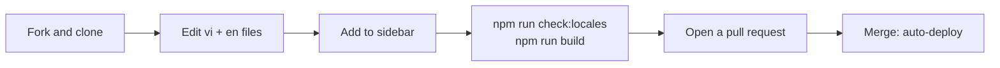

# Contributing to the docs

> How to fix mistakes, add content or write new pages for the LCOJ docs, in both Vietnamese and English.
>
> ⏱ ~10 min · 👤 Anyone · 🔑 A GitHub account

## Before you start

- [ ] You have a GitHub account.
- [ ] Small fixes (typos, a wrong sentence): a browser is enough.
- [ ] Bigger changes or new pages: install [Node.js](https://nodejs.org/) 18 or later and Git.

## Quickest way: edit on GitHub

1. Open the page you want to fix on docs.luyencode.net.
2. Scroll to the bottom and click **Edit this page on GitHub**.
3. Make your change, then click **Propose changes** to open a pull request.

::: tip Remember the other language
Every page has two versions: Vietnamese at `src/<path>.md` and English at `src/en/<path>.md`. If you can only update one, say so in the pull request so someone else can update the other.
:::

## Bigger changes or new pages



1. Fork [luyencode/docs](https://github.com/luyencode/docs) and clone it.
2. Install and preview:
   ```sh
   npm install
   npm run dev   # open http://localhost:5173, reloads as you edit
   ```
3. Edit or create **both** files: `src/<section>/<page>.md` and `src/en/<section>/<page>.md`. File names are lowercase and hyphen-separated.
4. New page: add one entry to `src/.vitepress/sidebar.mts` with the path, the Vietnamese label and the English label.
5. Renamed or moved page: add the old path to `LEGACY_PATHS` in `src/.vitepress/config.mts` so old links keep working.
6. Check your work:
   ```sh
   npm run check:locales   # every page must exist in both languages
   npm run build           # fails on dead links
   ```
7. Commit and open a pull request against `master`.

## How the docs are organized

| Folder | For |
|---|---|
| `start/`, `tutorials/` | Newcomers: introduction, glossary, FAQ, step-by-step tutorials |
| `learn/` | Students |
| `setter/` | Problem setters |
| `organize/` | Contest organizers and teachers |
| `admin/` | Site administrators |
| `operate/` | People self-hosting and operating LCOJ |
| `reference/` | Lookup: status codes, languages, commands, API, settings |

## Writing guidelines

- **Match the code.** Commands, paths, env vars, URLs and UI labels must match [lcoj-docker](https://github.com/luyencode/lcoj-docker) and [lcoj-site](https://github.com/luyencode/lcoj-site). UI labels come from lcoj-site's `locale/vi/LC_MESSAGES/django.po`: `msgid` is English, `msgstr` is Vietnamese.
- **Write for newcomers.** How-to pages follow the template: summary (⏱ time · 👤 audience · 🔑 permission) → *Before you start* → numbered steps → *Verify* → *Troubleshooting* → *Next steps*.
- **No screenshots.** Use Mermaid diagrams (` ```mermaid ` blocks), tables and callouts (`::: tip`, `::: warning`, `::: danger` for destructive commands).
- **No secrets.** Passwords, judge keys, `SECRET_KEY`, etc. are always written as `<placeholder>`.
- **Branding.** Use LCOJ / luyencode.net. Keep the DMOJ and VNOJ credits and code identifiers (`dmoj`, `VNOJ_*`, the `vnoj` format, the `vnoj/judge-tier3` image).
- **Consistent terms**, as listed in the [Glossary](/en/start/glossary). Vietnamese should read naturally, not as a word-for-word translation.

## Verify

- [ ] `npm run check:locales` prints *locales in sync*.
- [ ] `npm run build` finishes without dead-link errors.
- [ ] A new page shows up in the sidebar in both languages.

## Troubleshooting

| Symptom | Fix |
|---|---|
| `missing English page: src/en/...` | Create the English version of that page (or the Vietnamese one if that's what's missing). |
| The build reports a `dead link` | Fix the link: use an absolute path without `.md`, and prefix English pages with `/en`. |
| A new page doesn't appear in the sidebar | Add its entry to `src/.vitepress/sidebar.mts`. |
| A Mermaid diagram shows a syntax error | Put labels with special characters in double quotes, e.g. `A["Step 1: create problem"]`. |

## Next steps

- [What is LCOJ?](/en/start/introduction): an overview of what the docs cover.
- [Glossary](/en/start/glossary): the terms used consistently across the docs.
- [Report a problem or suggest a change](https://github.com/luyencode/lcoj-docker/issues) on GitHub Issues.
