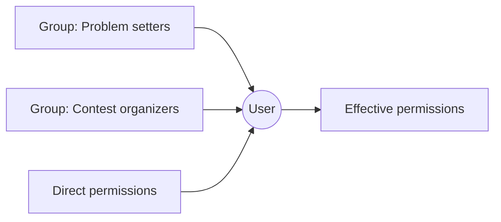

# Permission System

> How LCOJ checks permissions, how to grant them through groups or directly in the admin site, and the full list of custom permissions.
>
> ⏱ ~10 min (granting) · 👤 System administrators · 🔑 Superuser (or staff with `auth.change_group` / `auth.change_user`)

## When you need this page

Use this page when someone needs to do something a regular account cannot (setting problems, running contests, moderating comments, and so on), or when someone reports "permission denied" and you need to know which permission is missing. The first part explains how to grant permissions; the rest is a reference table.

LCOJ uses Django's permission system: every sensitive action (editing a problem, rejudging, viewing a private contest, and so on) is checked against a **permission** named `<app>.<codename>`, for example `judge.edit_own_problem`. This page lists every custom LCOJ permission, explains what each one lets you do, and shows how to grant permissions in the admin site.

## How permissions work

| Concept | Meaning |
|---|---|
| **Superuser** | Has every permission automatically. Reserve it for system administrators. |
| **Staff** (`is_staff`) | Lets the user sign in to the admin site at `/admin/`. It grants nothing else on its own; you still need to assign specific permissions. |
| **User permissions** | Permissions assigned directly to one account. |
| **Groups** | A named set of permissions. Members of a group get all of the group's permissions. |

A user's effective permissions are their direct permissions **plus** the permissions of every group they belong to. There is no way to "deny" a permission; to revoke one, remove it from the user or remove the user from the group.

::: tip Prefer groups
Create one group per role (for example "Problem setters" or "Contest organizers") and add people to it. When a role needs different permissions, you only edit the group once.
:::

## Granting permissions in the admin site

### Option 1: Through a group (recommended)

1. Go to `/admin/auth/group/` (for example `https://luyencode.net/admin/auth/group/`).
2. Click **Add** to create a new group and give it a name (for example "Problem setters").
3. In the **Permissions** box, select the permissions you need and click the arrow to move them to the chosen column. Type a codename (for example `edit_own_problem`) in the filter box to find it quickly.
4. Save the group.
5. Go to `/admin/auth/user/`, open the account, add the group under **Groups**, and save.

### Option 2: Directly on a user

1. Go to `/admin/auth/user/` and open the account.
2. If the person needs the admin site, turn on **Staff status**.
3. Under **User permissions**, select the permissions. Each entry is shown as `judge.edit_own_problem | Edit own problems` (app, codename, then label).
4. Save.

### Verify

- The person reloads the page and tries the action that needs the permission (for example **Edit problem** on one of their problems).
- If the role needs the admin site, they can open `/admin/` and see the matching sections.

::: info Search by codename
Permission labels are stored in the database in English, and many of them have no Vietnamese translation. Search for permissions by **codename** (the first column in the tables below). If labels in the database are out of date after a code update, run `./scripts/manage.py update_permissions` (see [Management commands](/en/reference/management-commands)).
:::

## Django's default permissions

For every model, Django creates four permissions automatically: `add_<model>`, `change_<model>`, `delete_<model>`, and `view_<model>` (for example `judge.change_problem`). They mostly control which admin pages a staff user can see and use. Some admin pages also check the custom permissions below; for example, editing an organization in the admin requires `judge.change_organization`, and which organizations you can edit depends on `judge.edit_all_organization`.

## Custom permissions

Permissions are grouped by the object they apply to. The **Label** column is the name shown in the admin.

### Problems (`judge` · Problem)

| Codename | Label | What it allows |
|---|---|---|
| `see_private_problem` | See hidden problems | View every problem, including hidden (non-public) problems and organization-private problems. |
| `edit_own_problem` | Edit own problems | Edit problems where you are an author or curator. **Required** for `edit_public_problem` and `edit_all_problem` to take effect. Also needed to use the submission admin for your own problems. |
| `edit_public_problem` | Edit all public problems | Edit every public problem, and view or edit submissions to those problems. |
| `edit_all_problem` | Edit all problems | Edit every problem; view all submissions and all organization-private problems. |
| `create_organization_problem` | Create organization problem | Create private problems inside an organization you administer. |
| `problem_full_markup` | Edit problems with full markup | Turn **full markup** (unsanitized HTML in the statement) on or off, and edit problems that use it. |
| `clone_problem` | Clone problem | Clone a problem you can edit. |
| `upload_file_statement` | Upload file-type statement | Upload a file (PDF) statement. |
| `change_public_visibility` | Change is_public field | Change a problem's `is_public` field and use the bulk "make public / make private" admin actions. |
| `change_manually_managed` | Change is_manually_managed field | Change the `is_manually_managed` field (test data managed by hand on the judge servers). |
| `see_organization_problem` | See organization-private problems | View private problems of any organization, even without membership. |
| `import_polygon_package` | Import Codeforces Polygon package | Import problems from a Codeforces Polygon package. |
| `edit_type_group_all_problem` | Edit type and group for all problems | Edit the type and group of any problem (without needing edit access to the problem). |

### Solutions (`judge` · Solution)

| Codename | Label | What it allows |
|---|---|---|
| `see_private_solution` | See hidden solutions | View editorials that are not public yet or not past their publish time. Anyone who can edit the problem can also see its editorial. |

### Submissions (`judge` · Submission)

| Codename | Label | What it allows |
|---|---|---|
| `abort_any_submission` | Abort any submission | Abort anyone's submission. Without it, users can only abort their own submissions (and not in official contest mode). |
| `rejudge_submission` | Rejudge the submission | Rejudge submissions to problems you can edit (also requires `edit_own_problem`). |
| `rejudge_submission_lot` | Rejudge a lot of submissions | Bulk rejudge: go past `DMOJ_SUBMISSIONS_REJUDGE_LIMIT` (default 10) submissions per action in the admin, and use rejudge on a problem's manage-submissions page. |
| `spam_submission` | Submit without limit | Submit without a queue limit. Users without it can have at most `DMOJ_SUBMISSION_LIMIT` (default 2) submissions waiting to be judged at once. |
| `view_all_submission` | View all submission | View the source code of every submission. |
| `resubmit_other` | Resubmit others' submission | Resubmit someone else's submission. |
| `lock_submission` | Change lock status of submission | Edit a submission's `locked_after` field in the admin. |

### Contests (`judge` · Contest)

| Codename | Label | What it allows |
|---|---|---|
| `see_private_contest` | See private contests | View every contest, including hidden, private, and organization-private contests. |
| `edit_own_contest` | Edit own contests | Edit contests where you are an author or curator; required to open the contest change page in the admin. |
| `edit_all_contest` | Edit all contests | View and edit every contest. |
| `clone_contest` | Clone contest | Clone a contest you can edit. |
| `moss_contest` | MOSS contest | Run MOSS (plagiarism detection) on a contest. The MOSS tab always appears for users with this permission, but it only works once a valid `MOSS_API_KEY` is set; without a key, running MOSS fails. |
| `contest_rating` | Rate contests | Make a contest rated (the `is_rated`, `rate_all`, `rate_exclude` fields) and run rating recalculation in the admin. |
| `contest_access_code` | Contest access codes | Set a contest's access code (`access_code`). |
| `create_private_contest` | Create private contests | Make a contest private or organization-private (the `is_private`, `private_contestants`, `is_organization_private`, `organization` fields); create contests inside an organization you administer. |
| `change_contest_visibility` | Change contest visibility | Make any contest visible (`is_visible`). Users with only `create_private_contest` can make only private or organization-private contests visible. |
| `contest_problem_label` | Edit contest problem label script | Edit the contest's problem label script (`problem_label_script`). |
| `lock_contest` | Change lock status of contest | Lock a contest (`locked_after`) and use the bulk lock/unlock admin actions. |

For choosing a contest format and its configuration, see [Contest formats](/en/organize/contest-formats).

### Organizations (`judge` · Organization)

| Codename | Label | What it allows |
|---|---|---|
| `organization_admin` | Administer organizations | In the admin: edit an organization's admin list, `is_open`, `slots`, and judging credit (`paid_credit`, monthly free credit limit). |
| `edit_all_organization` | Edit all organizations | Edit every organization without being one of its admins; join closed or unlisted organizations from the profile form. |
| `change_open_organization` | Change is_open field | Has no effect on its own: the `is_open` field in the admin is controlled by `organization_admin`, so grant that permission instead. |
| `spam_organization` | Create organization without limit | Create organizations beyond `VNOJ_ORGANIZATION_ADMIN_LIMIT` (default: admin of 3 organizations). See the note below. |

::: warning `spam_organization` only works for superusers
Currently only superusers can go past the organization limit. Granting this permission to a regular user does not lift the limit for them.
:::

### Users (`judge` · Profile)

| Codename | Label | What it allows |
|---|---|---|
| `test_site` | Shows in-progress development stuff | The "Enable experimental features" flag. Every user can turn it on or off on their own profile edit page; no feature currently uses this flag. |
| `totp` | Edit TOTP settings | View and edit a user's TOTP key and scratch codes (two-factor authentication) in the admin. |
| `can_upload_image` | Can upload image directly to server via martor | Upload images to the server from the Markdown editor. Staff users are always allowed. |
| `high_problem_timelimit` | Can set high problem timelimit | Set a problem time limit above `VNOJ_PROBLEM_TIMELIMIT_LIMIT` (default 5 seconds). |
| `long_contest_duration` | Can set long contest duration | Set a contest duration above `VNOJ_CONTEST_DURATION_LIMIT` (default 14 days). |
| `create_mass_testcases` | Can create unlimitted number of testcases for a problem | Create more than `VNOJ_TESTCASE_HARD_LIMIT` (default 100) test cases for a problem, without the warning shown past `VNOJ_TESTCASE_SOFT_LIMIT` (default 50). |
| `ban_user` | Ban users | Ban user accounts. You cannot ban yourself or a superuser. |

### Blog posts (`judge` · BlogPost)

| Codename | Label | What it allows |
|---|---|---|
| `edit_all_post` | Edit all posts | Edit every post; see all organization posts, including unpublished ones. |
| `edit_organization_post` | Edit organization posts | Create posts inside an organization you administer. |
| `mark_global_post` | Mark post as global | Mark an organization post as "global" (shown on the home page). |
| `pin_post` | Pin post | Pin a post (the `sticky` field). |
| `manage_magazine_post` | Manage magazine blog posts | Edit a post's tags, authors, and summary in the post editor. |

### Comments (`judge` · Comment, CommentLock)

| Codename | Label | What it allows |
|---|---|---|
| `view_all_user_comment` | View all comments by a user | Open the page listing all of a user's comments and hide those comments in bulk. |
| `override_comment_lock` | Override comment lock | Comment on pages where comments are locked. |

### Quizzes (`quiz` · QuizQuestion)

| Codename | Label | What it allows |
|---|---|---|
| `edit_own_quiz` | Edit own quizzes and questions | Write your own questions and quizzes; browse the public question bank. |
| `edit_all_quiz` | Edit all quizzes and questions | View and edit every question and quiz. |

For details, see [Quiz authoring](/en/setter/quiz-authoring).

### URL shortener (`urlshortener`)

The URL shortener app has no custom permissions; it uses Django's four default permissions: `urlshortener.view_urlshortener`, `add_urlshortener`, `change_urlshortener`, and `delete_urlshortener`. For details, see [URL shortener](/en/admin/url-shortener).

## Suggested roles

These are starting points; adjust them to your needs. Remember to turn on **Staff status** if the role needs the admin site.

| Role | Suggested permissions |
|---|---|
| Problem setter | `edit_own_problem`, `clone_problem`, `rejudge_submission`, `upload_file_statement`, `can_upload_image` |
| Senior problem setter | The above, plus `edit_public_problem` or `edit_all_problem`, `see_private_problem`, `change_public_visibility`, `rejudge_submission_lot`, `import_polygon_package` |
| Contest organizer | `edit_own_contest`, `clone_contest`, `contest_access_code`, `create_private_contest`, `moss_contest`, `contest_problem_label` |
| Moderator | `edit_all_post`, `pin_post`, `override_comment_lock`, `view_all_user_comment`, `ban_user` |
| Quiz teacher | `edit_own_quiz` |

::: warning Grant permissions carefully
- `problem_full_markup` allows unsanitized HTML in problem statements; grant it only to people you fully trust.
- `edit_all_problem`, `edit_all_contest`, and `view_all_submission` expose everyone's contest data and source code.
- Review group and user permissions regularly, and remove permissions from people who are no longer involved.
:::

## Troubleshooting

| Symptom | Fix |
|---|---|
| Cannot open `/admin/` despite having permissions | Turn on **Staff status** for the account. |
| Has `edit_all_problem` but still cannot edit problems | Also grant `edit_own_problem`; without it, `edit_public_problem` and `edit_all_problem` have no effect. |
| Cannot find a permission in the list | Search by **codename** instead of the label. If labels are stale, run `./scripts/manage.py update_permissions`. |
| Granted `spam_organization` but the user is still limited | This permission currently only works for superusers (see the warning under Organizations). |
| Bulk rejudge is capped at 10 submissions | Also grant `rejudge_submission_lot`. |

## Next steps

- [Managing users](/en/admin/users): find accounts, ban accounts, enable staff.
- [Site configuration](/en/admin/site-config): site-wide settings.
- [Organizations](/en/organize/organizations): per-organization admin rights.
- [Settings reference](/en/reference/settings): limits such as `DMOJ_SUBMISSION_LIMIT`, `VNOJ_ORGANIZATION_ADMIN_LIMIT`, and `MOSS_API_KEY`.
