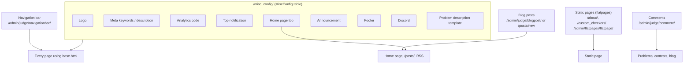
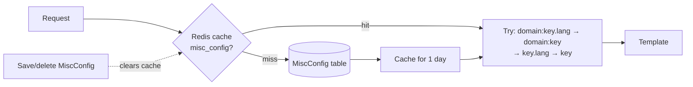

# Site configuration and content

> Change the logo, top notice, home page content and footer at `/misc_config/`; edit the navigation bar, static pages (About) and blog posts; moderate comments; and find the status pages, RSS feeds and sitemap.
>
> ⏱ ~20 min · 👤 Site admins · 🔑 Superuser (blog, comments and static pages can be delegated to staff with the right permissions)

## Before you start

- [ ] You have a superuser account. `/misc_config/` returns 404 for everyone else, including staff.
- [ ] For sections of the admin site (`/admin/`): staff need permissions on the relevant model, see [Permissions](/en/admin/permissions).
- [ ] To run the script (`moderate_comments`) or command (`add_blog_navigation`): SSH access to the server, run from the `dmoj/` directory.

## Where each piece of content lives



| To change | Edit at |
|---|---|
| Logo, SEO, analytics, notices, footer, Discord, description template | `/misc_config/` |
| Top menu items | `/admin/judge/navigationbar/` |
| The **About** page (`/about/`), static guide pages | `/admin/flatpages/flatpage/` |
| News and longer announcements on the home page | Blog post marked **global post** |
| Hiding bad comments | Trash icon next to the comment, or `/admin/judge/comment/` |

## The `/misc_config/` page

Open it with the gear icon (**Settings**) on the right of the navigation bar, or go to `https://luyencode.net/misc_config/`. The page title is **Site settings**; its labels have no Vietnamese translation yet, so they appear in English in both languages.

1. Edit the fields you need (table below).
2. Click **Update**.
3. Reload any page to check. Changes apply immediately.

| Group | Field (label) | Key | Where it shows | Format |
|---|---|---|---|---|
| Branding | Site logo | `site_logo` | Logo at the top left of the navigation bar; `og:image` when links are shared | Image file (upload) |
| Branding | Site favicon | `site_favicon` | **Currently unused** (see warning) | Image file (upload) |
| SEO | Meta keywords | `meta_keywords` | `<meta name="keywords">` on every page | Text |
| SEO | Meta description | `meta_description` | `<meta name="description">` **on the home page only** | Text |
| Content | Home page top | `home_page_top` | Above the post list on the home page | HTML + Django template syntax |
| Content | Announcement | `announcement` | `#announcement` block right below the main content, every page | Raw HTML |
| Content | Footer | `footer` | Footer, after "proudly powered by VNOJ \| Github \|" | Raw HTML |
| Notifications | Top notification | `top_notification` | Top of the content area, every page | HTML + Django template syntax |
| Analytics | Analytics | `analytics` | Inserted verbatim into `<head>` on every page | Raw HTML/JS |
| Community | Discord invite link | `discord_invite_link` | See below | URL |
| Community | Discord Shield.io badge URL | `discord_invite_shieldio` | See below | Badge image URL |
| Problem editor | Description example | `description_example` | Pre-filled problem statement when creating a problem on the site | Markdown |

Details:

- **Clearing a field and clicking Update** deletes that key from the database; the corresponding element disappears from the site.
- **Logo/favicon**: leaving the file input empty keeps the current image. Uploads are stored under `static-upload/` in the media directory with a random name, at a URL like `/static-upload/<uuid>.<ext>`.
- **Discord**: the badge only shows when **both** Discord fields are set. It appears in the home/blog sidebar, on login errors (e.g. a banned account), on the 2FA page, and after requesting a password reset.
- **Home page top** is rendered as a Django template with the variables `request`, `user_count`, `problem_count`, `submission_count`, `language_count` and `perms`. Example: <code v-pre>{{ problem_count }} problems, {{ user_count }} members</code>. **Top notification** is rendered with no variables. A template syntax error shows `Error rendering: …` instead of the content.
- **Description example** only applies when creating a problem through the site UI; see [Managing problems](/en/setter/managing-problems).

::: danger Analytics, Announcement and Footer are raw HTML
The content is inserted **unfiltered** into every site page (except the `/admin/` pages), including the login page. A broken or malicious `<script>` affects every user. Only paste code from trusted sources (Google Analytics…), and test on the dev site first if you can.
:::

::: warning Uploaded favicon and logo
- **Site favicon** saves a value, but the templates always use the static `icons/favicon-*.png` files, so **uploading a favicon changes nothing**. To change the favicon, an operator replaces the files in lcoj-site's `resources/icons/` and reruns `./scripts/copy_static`.
- The bundled `dmoj/nginx/conf.d/nginx.conf` has **no** `location /static-upload`; that path falls into `location /static` (served from `/assets/`), so a freshly uploaded logo may return 404. If that happens, an operator adds `location /static-upload { root /media/; }` to nginx and runs `docker compose restart nginx`.
:::

### How values are stored and applied

- Each field is one `(key, value)` row in the `MiscConfig` table. The top of the page has a **Configure in admin panel for more options** link to `/admin/judge/miscconfig/` (*miscellaneous configuration*) for direct editing.
- The whole table is cached in Redis under the key `misc_config` for up to one day. The cache is **cleared automatically** whenever a row is saved or deleted (through `/misc_config/` or the admin), so no restart is needed.
- When rendering, LCOJ tries these keys in order and uses the first match: `<domain>:<key>.<language>`, `<domain>:<key>`, `<key>.<language>`, `<key>`. `<domain>` is the Site's domain in `/admin/sites/site/`; `<language>` is the viewer's UI language code, e.g. `vi` or `en`.

This lets you add per-language versions in the admin, for example a `top_notification.en` key for English-language viewers. Keys are limited to **30 characters**.



## Navigation bar

The top menu items live at `/admin/judge/navigationbar/` (**navigation bar**). The list is a tree: drag and drop to reorder or to nest an item under another (a dropdown menu).

| Field | Admin label | Meaning |
|---|---|---|
| `key` | identifier | Unique code, max 10 characters; used as the CSS class `nav-<key>` |
| `label` | label | Displayed text, max 20 characters. It goes through the translation function, so an English label that already has a translation (e.g. `Contests`) shows in Vietnamese |
| `path` | link path | A site path (`/contests/`) or a full URL |
| `order` | order | Sort order; drag and drop updates it |
| `regex` | highlight regex | Regular expression matched against the current path to highlight the active item, e.g. `^/contest`. Matched with MariaDB's `REGEXP BINARY` |
| `parent` | parent item | Leave empty for top-level items |

The menu is read from the database on every request, so changes show up as soon as you save.

### Adding a Blog item with a command

```bash
./scripts/manage.py add_blog_navigation
```

The command creates an item with `key=blog`, label `Blog`, path `/blog/`, regex `^/blog/`, placed at the end of the menu (highest order + 10). If an item with `key=blog` already exists, it just prints `Blog navigation item already exists`.

::: warning Check the link after running it
lcoj-site's URL list has no `/blog/` route; the blog list pages are `/blogs/` and `/posts/`. After running the command, click the Blog item. If you get a 404, change the item's `path` (and `regex`) in the admin, or add a redirect from `/blog/` to `/blogs/` at `/admin/redirects/redirect/` (**Redirects**).
:::

## Static pages (flatpages)

Static pages are fixed content pages such as **About** (`/about/`) or **Custom checkers** (`/custom_checkers/`). They are managed at `/admin/flatpages/flatpage/`.

1. Open the page to edit, or click **Add** to create a new one.
2. Fill in **URL** (with leading and trailing `/`, e.g. `/terms/`), **title** and **content** (Markdown, with preview).
3. Under **Sites**, select the LCOJ site. Without this the page returns 404.
4. **Save**, then open the URL to check.

The **Advanced options** section:

| Field | Meaning |
|---|---|
| **Registration required** | Only logged-in users can view it |
| **Template name** | Empty means `flatpages/default.html` (cached, with math support). You can set `flatpages/markdown.html` (no cache) |
| **Enable comments** | Has no effect in LCOJ |

Things to know:

- A static page is only served when **no** other route matches the URL (Django's `FlatpageFallbackMiddleware`).
- Content rendered with the default template is cached for one day; the cache is cleared when you save the page.
- Users allowed to edit static pages see an **[Edit]** link next to the page title.
- Static page content allows raw, unfiltered HTML, so you can use `<h2 id="...">` to create anchors.
- The About page is in the menu (item `about`) and in the sitemap. These docs and many other pages link to `https://luyencode.net/about/#lien-he`; when editing the About page, **keep** an element with `id="lien-he"`, e.g. `<h2 id="lien-he">Liên hệ</h2>`.
- For a **Terms** page, create a `/terms/` flatpage. The `TERMS_OF_SERVICE_URL` setting (currently `None`) is only used on the password sign-up form, which is hidden because LCOJ only allows OAuth sign-up.

## Blog posts and home page announcements

The home page shows a list of blog posts. A post appears on the home page only when **all four** conditions hold:

| Field | Label | Condition |
|---|---|---|
| `visible` | **public visibility** | Checked |
| `publish_on` | **publish after** | That time has passed |
| `organization` | **organization** | Empty (organization posts only show on the organization's page) |
| `global_post` | **global post** | Checked ("Display this blog post at the homepage.") |

Order: **sticky** posts first, then newest publish time. Viewers can switch to all non-organization posts with `/?show_all_blogs=true` (remembered in their session).

### Posting from the admin

1. Open `/admin/judge/blogpost/` → **Add**.
2. Fill in **post title** (the slug is generated), **authors**, content (Markdown), and optionally a **post summary** (if set, the home page and RSS show the summary instead of the full post) and an OpenGraph image.
3. Set **publish after**. A future time schedules the post.
4. Check **public visibility**, **global post**, and **sticky** to pin it to the top.
5. **Save**.

### Posting from the site

Go to `/posts/new`. Non-superusers must have solved at least 10 problems (`VNOJ_BLOG_MIN_PROBLEM_COUNT`). The **global post** checkbox only appears for users with `judge.mark_global_post`, and **sticky** for `judge.pin_post`. Posts created on the site always get the current time as the publish time. See [Permissions](/en/admin/permissions).

::: tip Short notice or long announcement?
A short notice that must appear on **every page** (maintenance, judging issues): use **Top notification** in `/misc_config/`. A longer piece of news that should allow comments and stay archived: publish a blog post with **global post** and **sticky**. For a running contest, use contest announcements, see [Contest setup](/en/organize/contest-setup).
:::

## Comment moderation

Comments have a score from votes. Comments with score ≤ `DMOJ_COMMENT_VOTE_HIDE_THRESHOLD` (default `-5`) are collapsed in the UI but can still be expanded. To **hide** a comment completely, use one of the following.

| Method | Who can use it | Scope |
|---|---|---|
| Trash icon next to the comment | Users with `judge.change_comment` | Hides the comment **and all its replies**, recalculates the author's contribution points |
| Edit the comment at `/admin/judge/comment/` and check **hidden** | Same | Hides the comment and its replies on save |
| **Hide comments** / **Unhide comments** actions on the admin list | Same | Several comments at once (see warning) |
| `./scripts/moderate_comments` | Operators with SSH | Every visible comment with score ≤ −5 |

The `/admin/judge/comment/` list can be searched by author username, page and body, and filtered by **hidden**.

::: warning The bulk admin actions are broken
The **Hide comments** / **Unhide comments** actions update the database first, then access an attribute that does not exist on a queryset (`queryset.author`), so the page shows a server error. The comments are usually updated anyway; reload the list to check. These actions also do not hide replies. Prefer the trash icon.
:::

### The `moderate_comments` script

```bash
./scripts/moderate_comments --dry-run   # show the count and the 5 newest comments that would be hidden
./scripts/moderate_comments             # actually hide them
```

The script runs SQL directly against MariaDB (credentials are read from `environment/mysql.env`) and sets `hidden = 1` on every comment matching `hidden = 0 AND score <= -5`. The `-5` threshold is hard-coded in the script.

::: warning Script limitations
Because it updates rows directly with SQL, the script does **not** hide replies to hidden comments, does **not** recalculate contribution points and records no history. Always run `--dry-run` first.
:::

### Locking comments on a page

Add a row at `/admin/judge/commentlock/` with a page code such as `p:<problem-code>` (problem), `c:<contest-key>` (contest), `b:<blog-post-id>` (blog) or `s:<problem-code>` (editorial). Only users with `judge.override_comment_lock` can still comment on that page.

To take away one person's ability to comment: see [Managing users](/en/admin/users).

## Newsletter

The code supports [django-newsletter](https://pypi.org/project/django-newsletter/) (the `/newsletter/` route and a subscribe checkbox on the profile edit page, driven by `DMOJ_NEWSLETTER_ID_ON_REGISTER`), but **LCOJ does not install the package** and does not add `newsletter` to `INSTALLED_APPS`. So `/newsletter/` does not exist and `DMOJ_NEWSLETTER_ID_ON_REGISTER` (default `None`) has no effect.

## Status and statistics pages

| Path | Content | Who can see it |
|---|---|---|
| `/status/` | **Status** of judges and runtime versions | Everyone sees online judges; staff/superusers also see offline ones |
| `/runtimes/` | Supported languages (**Runtimes**) | Everyone |
| `/runtimes/matrix/` | Language version matrix across online judges | Everyone |
| `/status/oj/` | **OJ Status**: charts of submissions per day, by language, by result, judging queue time, organization activity | Superusers only (others get "You must be admin to view this content.") |
| `/stats/data/all/` | JSON API feeding `/status/oj/` (POST only) | Superusers only |

Judge setup: see [Setting up judges](/en/operate/judge-setup).

## RSS, Atom and sitemap

| Path | Content |
|---|---|
| `/feed/problems/rss/`, `/feed/problems/atom/` | 25 newest public problems |
| `/feed/comment/rss/`, `/feed/comment/atom/` | 25 newest comments visible to anonymous visitors |
| `/feed/blog/rss/`, `/feed/blog/atom/` | 25 visible blog posts whose publish time has passed (sticky first) |
| `/sitemap.xml` | Home page, `/about/`, public problems, public editorials, blog posts, public contests, organizations, user pages |

::: warning The blog feed includes organization posts
The blog feed filters on "visible" and "publish time passed" but does **not** exclude organization posts, so the summary (or the content, if there is no summary) of a visible private-organization post can appear in the feed. For sensitive organization content, uncheck **public visibility**.
:::

Absolute links in the sitemap use the Site's domain (`/admin/sites/site/`, **Domain name**), which should be `luyencode.net`. If links show the wrong domain, fix that Site record.

## Troubleshooting

| Symptom | Cause | Fix |
|---|---|---|
| `/misc_config/` returns 404 | Not a superuser | Log in with a superuser account |
| Edited `/misc_config/` but the site still shows old content | A language/domain-specific key (e.g. `top_notification.vi`) takes precedence | Check `/admin/judge/miscconfig/` and edit or delete that key |
| New logo shows as a broken image | nginx does not serve `/static-upload/` | See the "Uploaded favicon and logo" warning |
| Uploaded a favicon but nothing changed | Templates do not use `site_favicon` | Replace the static icon files and run `./scripts/copy_static` |
| `Error rendering: …` at the top of pages | Django template syntax error in Top notification / Home page top | Fix the <code v-pre>{{ }}</code> / `` syntax |
| Blank pages or JS errors after editing Analytics/Footer | Broken pasted HTML/JS | Clear that field in `/misc_config/` or `/admin/judge/miscconfig/` |
| Menu item not highlighted on its own page | `regex` does not match the path | Fix the regex, e.g. `^/contest` |
| New flatpage returns 404 | No Site selected, URL missing a leading/trailing `/`, or URL clashes with an existing route | Check **Sites** and the URL |
| `/about/#lien-he` does not scroll to the Contact section | The `id="lien-he"` element was lost while editing | Add back `<h2 id="lien-he">Liên hệ</h2>` |
| Blog post not on the home page | **global post** unchecked, **public visibility** unchecked, future publish time, or an organization is set | Check the four conditions above |
| Server error when using **Hide comments** in the admin | Bug in the action code | Reload the list to check; use the trash icon |

## Next steps

- [Managing users](/en/admin/users): bans, comment mutes, staff access.
- [Permissions](/en/admin/permissions): permissions for blog, comments and static pages.
- [URL shortener](/en/admin/url-shortener): short links for announcements and posters.
- [Helper scripts](/en/operate/scripts): `copy_static`, `moderate_comments` and other scripts.
- [Operating LCOJ](/en/operate/operations): restarting services, reading logs.
