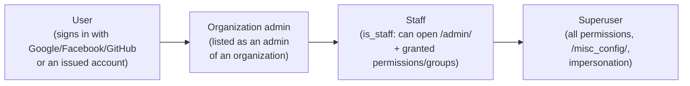
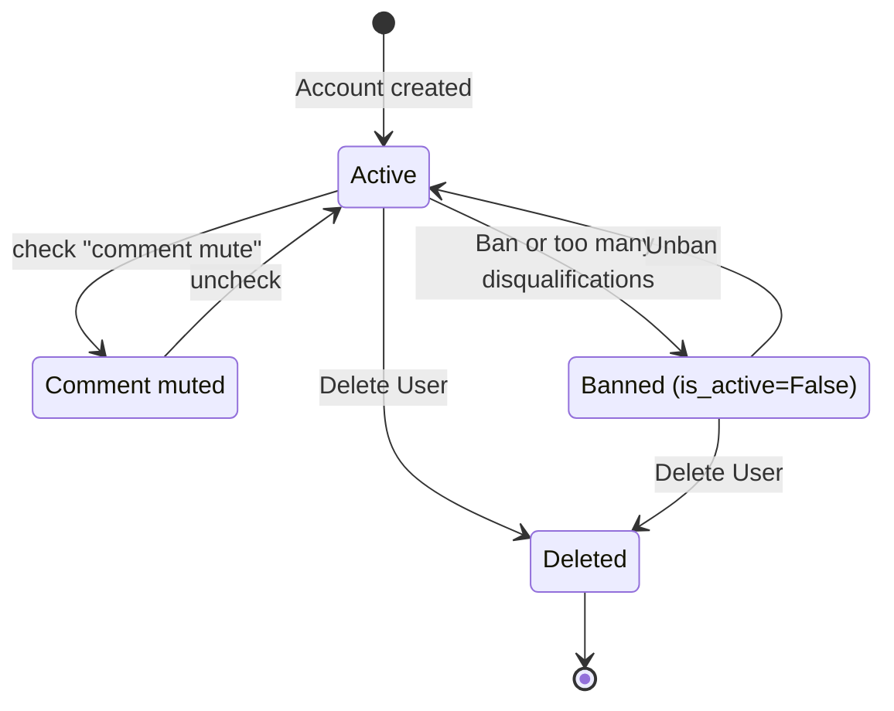

# Managing users

> Bulk-create accounts for a class, grant staff/superuser access, ban or mute rule-breakers, impersonate users for debugging, move content between two accounts, and delete accounts safely.
>
> ⏱ ~25 min · 👤 Site admins · 🔑 Superuser (some tasks only need staff plus a specific permission, see [Permissions](/en/admin/permissions))

## Before you start

- [ ] You can log in to the admin site at `/admin/` with a superuser account (or a staff account with the relevant permissions).
- [ ] For management commands (`adduser`, `batchadduser`, `move_user_content`): you have SSH access to the server and can run `docker compose` in the `dmoj/` directory. Every command below runs from `dmoj/` as `./scripts/manage.py <command>`.
- [ ] You have read [Permissions](/en/admin/permissions) and understand staff, superuser, groups and permissions.

## Account types

LCOJ has four role levels, from lowest to highest. A level does not automatically include the permissions of the level above it; only superusers have every permission.



| Role | Can do | Granted where |
|---|---|---|
| User | Submit, compete, comment (after solving the minimum number of problems) | Signs up via OAuth, or you create the account with a command (see below) |
| Organization admin | Manage members, problems and contests of their organization | Organization edit page, see [Organizations](/en/organize/organizations) |
| Staff | Log in to `/admin/`; can only do what their permissions/groups allow | `/admin/auth/user/` |
| Superuser | Everything, no individual permissions needed | `/admin/auth/user/` or `adduser --superuser` |

::: info OAuth-only sign-up
The default lcoj-docker config sets `OAUTH_ONLY = True` in `dmoj/config/local_settings.py`: the password sign-up form is hidden and new users create accounts with Google/Facebook/GitHub. However, **the username + password login form still works**, so accounts you create with a command (which have a password) can log in normally. This is how you hand out accounts for a class or an on-site contest.
:::

## Finding and inspecting a user

In the admin site, the **Users** section has two relevant pages:

| Page | Path | Used for |
|---|---|---|
| Django account (`User`) | `/admin/auth/user/` | Username, email, password, active status, staff/superuser, groups, permissions |
| LCOJ profile (`Profile`, *user profiles*) | `/admin/judge/profile/` | Display rank, organizations, time zone, last IP, comment mute, unlisted, ban reason, 2FA, internal notes |

Steps:

1. Open `/admin/judge/profile/` and type a username, email or IP address in the search box.
2. The list shows email, TOTP status, time zone, date joined, last access, last IP and a **View on site** link.
3. Click a name to open the profile. The profile page has no delete button (on purpose), and you cannot add a profile here: a profile is created together with its `User`.
4. On the user's public page (`/user/<name>`), superusers/staff see extra tabs such as **Impersonate**, **Ban this user** and **Admin User** (opens `/admin/auth/user/<id>/change/`), depending on permissions.

Two bulk actions are available on the profile list:

| Action | Effect |
|---|---|
| **Recalculate scores** | Recalculates problem points (`calculate_points`) for the selected profiles |
| **Recalulate contribution points** | Recalculates contribution points (from comment votes, blog posts…). The typo is in the UI label. |

## Creating accounts

### One account with `adduser`

```bash
./scripts/manage.py adduser <name> <email> <password> [language] [--staff] [--superuser]
```

| Argument | Meaning |
|---|---|
| `name` | Username |
| `email` | Email, does not need to be real |
| `password` | Initial password |
| `language` | Optional. Default language key (`Language.key`), defaults to `DEFAULT_USER_LANGUAGE` = `CPP20` |
| `--staff` | Also grant staff status |
| `--superuser` | Also grant superuser status |

Example, creating the first admin account:

```bash
./scripts/manage.py adduser admin admin@luyencode.net 'StrongPassword!2026' --superuser --staff
```

The command prints nothing on success. Verify by logging in or finding the account in `/admin/auth/user/`.

::: warning The password ends up in shell history
A password passed on the command line is stored in the server's shell history. Ask the user to change it right after their first login.
:::

You can also create single accounts at `/admin/auth/user/add/`: enter a username and password, save, then fill in the rest. The LCOJ profile is created automatically on save.

### Bulk accounts for a class with `batchadduser`

`batchadduser` reads a CSV file (username + full name), creates the accounts with a **random 8-character password**, and writes a new CSV file containing the passwords for you to hand out.

1. Create a CSV file whose **header row is exactly** `username,fullname`:

   ```csv
   username,fullname
   hs10a_01,Nguyễn Văn An
   hs10a_02,Trần Thị Bình
   hs10a_03,Lê Minh Châu
   ```

   - Save it as **UTF-8 without a BOM**. Excel's "CSV UTF-8" adds a BOM, which sticks to the first column name and makes the command fail with `KeyError: 'username'`.
   - Usernames should only contain unaccented letters, digits, `_` and `-`. The command does **not** validate usernames or check for duplicates.

2. Put the file in `dmoj/repo/` on the server. That directory is mounted into the `site` container at `/site/`, which is also the command's working directory.

3. Run the command (paths are relative to `/site/` inside the container):

   ```bash
   ./scripts/manage.py batchadduser class10a.csv class10a_passwords.csv
   ```

4. Open `dmoj/repo/class10a_passwords.csv`. It has three columns, `username,fullname,password`:

   ```csv
   username,fullname,password
   hs10a_01,Nguyễn Văn An,k7Hq2xTa
   hs10a_02,Trần Thị Bình,3dYzBc9e
   ```

5. Hand out the passwords, then **delete both files** from `dmoj/repo/`.

The new accounts have the full name stored in *first name*, default language `CPP20`, **no email**, are active and are not staff. Passwords only use easy-to-read characters (no `i`, `l`, `o`, `0`, `1`…).

::: danger Do not put the files in `dmoj/media/`
Parts of `dmoj/media/` are served publicly by nginx. Never leave password files there, and never commit them to git (`dmoj/repo/` is the lcoj-site submodule).
:::

::: warning Failure halfway through
The command creates accounts one by one, without a transaction. If it hits an existing username, it stops with an `IntegrityError`: accounts on earlier rows **have already been created** and are in the output file; later rows are not. Fix the CSV (remove the created rows and the failing row) and rerun with a **different output file name** so you do not overwrite the passwords already generated.
:::

After creating the accounts, you can add the whole class to an organization (see [Organizations](/en/organize/organizations)) or to a private contest's contestant list (see [Contest setup](/en/organize/contest-setup)).

## Granting staff, superuser and groups

1. Open `/admin/auth/user/`, then find and open the account.
2. Under **Permissions**:
   - Check **Staff status** to allow access to `/admin/`.
   - Check **Superuser status** to grant every permission. Reserve this for system operators.
   - Add **Groups** or pick **User permissions**. Permissions are listed as `judge.<codename> | <description>`.
3. Click **Save**.

What each permission allows, and suggested role groups: see [Permissions](/en/admin/permissions). How to make someone an organization admin: see [Organizations](/en/organize/organizations).

::: tip Staff without permissions can do almost nothing
`is_staff` only opens the door to `/admin/`. The person sees only the sections their groups/permissions allow.
:::

### Requiring 2FA for staff

`DMOJ_REQUIRE_STAFF_2FA` (default `True`) does **not force** staff to enable 2FA. It only prevents staff from **disabling** their last 2FA method: the **Disable** button on the profile edit page does nothing, and deleting the last WebAuthn key is rejected with `Staff may not disable 2FA`.

So the right order is: ask the person to enable 2FA (TOTP or WebAuthn) on their profile edit page **first**, then check staff status.

**When a user loses their 2FA device:** someone with the `judge.totp` permission (*Edit TOTP settings*) or a superuser opens `/admin/judge/profile/<id>/change/`, unchecks **TOTP 2FA enabled** and/or deletes the device in the WebAuthn table below, then saves. Without `judge.totp`, that field is read-only.

## Banning and muting

LCOJ offers several levels, from mild to severe:

| Level | How | Effect |
|---|---|---|
| Comment mute | Profile → check **comment mute** (`mute`) | Cannot comment or vote on comments; sees "Your part is silent, little toad." plus the reason if `ban_reason` is set |
| Unlisted | Profile → check **unlisted user** (`is_unlisted`) | Hidden from the user rankings |
| Banned from a problem/contest | **Justice** section of the problem or contest → **personae non gratae** | Cannot submit to that problem / join that contest, see [Contest setup](/en/organize/contest-setup) |
| Site-wide ban | **Ban this user** tab on the user page | Locks the account (see below) |

### Banning an account

Requires the `judge.ban_user` permission (*Ban users*). Nobody can ban themselves or a superuser.

1. Open the user page `https://luyencode.net/user/<name>`.
2. Click the **Ban this user** tab.
3. Enter the reason in **Ban reason** and click **Submit**.

::: danger A ban takes effect immediately
Banning does all of the following at once: stores `ban_reason`, sets the display rank to `banned`, marks the user unlisted, and **deactivates the account** (`is_active = False`). Existing sessions stop working on the next request. The change is recorded in the revision history with the comment "Banned by &lt;admin&gt;".
:::

What the banned user sees:

- Password login: the form shows "This account has been banned. Reason: &lt;reason&gt;". If Discord is configured (on the [site configuration page](/en/admin/site-config)), a Discord link for appeals is shown too.
- Google/Facebook/GitHub login: the account is inactive so login fails, but the reason is only shown on the password form.

### Unbanning

On the user page, click the **Unban this user** tab and click **Submit**. LCOJ clears the reason, resets the display rank to the default, un-hides the user from rankings and reactivates the account.

::: warning Don't ban by editing fields in the admin
Filling in **Ban reason** at `/admin/judge/profile/` does **not** ban anyone: LCOJ considers a user banned only when `is_active = False` *and* `ban_reason` is set. Always use the tab on the user page so every field is updated consistently.
:::

### Automatic bans for contest cheating

There is a built-in mechanism that bans users after several contest disqualifications, but **it is off by default** (`VNOJ_SHOULD_BAN_FOR_CHEATING_IN_CONTESTS = False`). When enabled:

| Setting | Default | Meaning |
|---|---|---|
| `VNOJ_SHOULD_BAN_FOR_CHEATING_IN_CONTESTS` | `False` | Turns the mechanism on/off |
| `VNOJ_MAX_DISQUALIFICATIONS_BEFORE_BANNING` | `3` | Disqualifications needed for a ban |
| `VNOJ_BAN_COUNT_FROM_DATE` | 2026-01-01 (UTC) | Only contests starting on or after this date count |
| `VNOJ_CONTEST_CHEATING_BAN_MESSAGE` | `Banned for multiple cheating offenses during contests` | Ban reason that gets stored |

Only contests that are **not** organization-private count. If un-disqualifying a participation brings the count below the threshold, the account is **automatically unbanned** (as long as the ban reason is exactly the message above). Users banned this way also see the list of their disqualified contests on the login form. How to disqualify a contestant: see [Contest setup](/en/organize/contest-setup).



## Impersonating a user

Impersonation (provided by [django-impersonate](https://pypi.org/project/django-impersonate/)) lets you see the site **exactly as another user sees it**, for debugging ("I can't see problem X").

1. Open the user's page and click the **Impersonate** tab, or go directly to `/impersonate/<User-id>/`.
2. The navigation bar turns purple to remind you that you are impersonating.
3. When done, open the user menu and click **Stop impersonating**, or go to `/impersonate/stop/`.

Behavior in LCOJ:

- You cannot impersonate a superuser, and you cannot start impersonating while already impersonating.
- Pages under `/admin/` always run as your real account.
- While impersonating, the user's "user script" does not run and their last-access time is not updated. The uWSGI log records the name as `<you> as <user>`.

::: danger Everything you do is done as that user
Submitting, commenting, voting, joining contests, changing settings… while impersonating are all recorded for **the impersonated user**, even if they are in the middle of a contest. Look, don't touch. Always click **Stop impersonating** when you are done.
:::

::: warning Who can impersonate, and where to find the log
With the default configuration:

- The **Impersonate** tab is only shown to superusers, but **any staff member** can impersonate (non-superuser) users by going directly to `/impersonate/<id>/`.
- Every impersonation session is logged: see `/admin/impersonate/impersonationlog/` (who impersonated whom, start and end times).

To restrict impersonation to superusers, add this to `dmoj/config/local_settings.py`:

```python
IMPERSONATE = {
    'REQUIRE_SUPERUSER': True,
}
```

then copies it to `dmoj/repo/dmoj/local_settings.py` and runs `docker compose restart site`. See [Environment variables](/en/operate/environment).
:::

## IP-based login (off by default)

LCOJ ships with an automatic login-by-IP mechanism, meant for contest rooms where each machine is assigned to one contestant:

- The **IP-based authentication** field (`ip_auth`) on the profile: each IP can be assigned to only one user.
- The `judge.ip_auth.IPBasedAuthBackend` backend is already in `AUTHENTICATION_BACKENDS`.
- The `judge.middleware.IPBasedAuthMiddleware` middleware is **not** enabled in `MIDDLEWARE` by default; until you enable it, filling in `ip_auth` has no effect.

When the middleware is enabled, it reads the IP from `request.META[IP_BASED_AUTHENTICATION_HEADER]` (default `REMOTE_ADDR`) on every request; if the IP matches an active profile's `ip_auth`, it logs the browser in **as that user**, even if another account is currently logged in.

::: warning Plan carefully before enabling
The site runs behind a reverse proxy (nginx in lcoj-docker), so `REMOTE_ADDR` is the proxy's IP, not the contestant's machine. To use this, you must point `IP_BASED_AUTHENTICATION_HEADER` at a header carrying the real client IP and add the middleware after `AuthenticationMiddleware`. Only enable it on a dedicated instance for the contest room.
:::

## Moving content between two accounts

When someone has two accounts (for example an old command-created account and a new Google login), use `move_user_content` to move content from the source account to the target account:

```bash
./scripts/manage.py move_user_content <source> <target>
```

| Moved | Not moved |
|---|---|
| All submissions | Contest participations, rating |
| All comments | Blog posts, tickets, organizations, badges |
| All comment votes | Profile settings, 2FA, API token |

1. Double-check the two usernames (source first, target second).
2. Run the command. It refuses if the source account has **any contest participation** (`Cannot move user … because it has contest participations.`).
3. Open `/admin/judge/profile/`, select **both** profiles and run **Recalculate scores** and **Recalulate contribution points**. The command does not recalculate anything.
4. Ban or delete the source account if it is no longer needed.

::: danger No undo
The three moves run in one transaction (on error nothing changes), but once it succeeds there is no automatic way to move things back. If both accounts voted on the same comment, the command fails with `IntegrityError` and moves nothing: delete the source account's duplicate vote and run it again.
:::

## Deleting accounts

::: danger Deletion cascades
Deleting a `User` also deletes the profile and **everything attached to it**: submissions, comments, votes, contest participations (contest rankings change), tag suggestions… There is no trash bin. In most cases a **ban**, or unchecking **Active**, is enough.
:::

If you still need to delete (spam accounts, or the owner asked for their data to be erased):

1. If you want to keep the submissions/comments, move them to another account first with `move_user_content`.
2. Open `/admin/auth/user/<id>/change/` and click **Delete** at the bottom.
3. Read the confirmation page carefully: Django lists every object that will be deleted along with it. Confirm only when you are sure.

The profile list (`/admin/judge/profile/`) deliberately has no bulk delete action and the profile page has no delete button; delete from the `User` page.

## Personal data download requests

Users request a copy of their own data (submission source code, comments) **themselves** at `/data/prepare/` and download it from `/data/download/`; admins do not approve anything. If users report problems, see [User data download](/en/operate/user-data-download).

## Troubleshooting

| Symptom | Cause | Fix |
|---|---|---|
| `batchadduser` fails with `KeyError: 'username'` | CSV has a BOM or a wrong header | Save as UTF-8 without BOM, first line exactly `username,fullname` |
| `batchadduser` fails with `FileNotFoundError` | File is not in `dmoj/repo/` | Put the file in `dmoj/repo/` and use a relative path |
| `IntegrityError … Duplicate entry` when creating accounts | Username already exists | Rename or drop that row; for `batchadduser` see the "Failure halfway through" warning |
| `adduser` fails with `Language matching query does not exist` | Wrong language key | Use a key from `/admin/judge/language/`, e.g. `CPP20` |
| A student forgot the password of a bulk-created account | The account has no email, so self-service reset is impossible | `/admin/auth/user/<id>/change/` → the change-password link right below the password field |
| Staff cannot disable 2FA | `DMOJ_REQUIRE_STAFF_2FA` blocks removing the last method | Add another method first, or ask someone with `judge.totp` to turn it off in the admin |
| No **Ban this user** tab | Missing `judge.ban_user`, or viewing yourself / a superuser | Grant the permission, see [Permissions](/en/admin/permissions) |
| **Ban reason** filled in the admin but the user can still log in | Account is still `is_active` | Use the **Ban this user** tab |
| `move_user_content` complains about contest participations | The source account has competed | The command does not support this case; keep both accounts or handle it manually |
| Still acting as someone else after impersonating | Impersonation not stopped | Go to `/impersonate/stop/` |

## Next steps

- [Permissions](/en/admin/permissions): the permission list and suggested role groups.
- [Site configuration and content](/en/admin/site-config): logo, notices, navigation bar, blog, comment moderation.
- [Organizations](/en/organize/organizations): group users by class/school and appoint organization admins.
- [Contest setup](/en/organize/contest-setup): private contestants, banning contestants, disqualifying cheaters.
- [Management commands](/en/reference/management-commands): full reference for `manage.py` commands.
