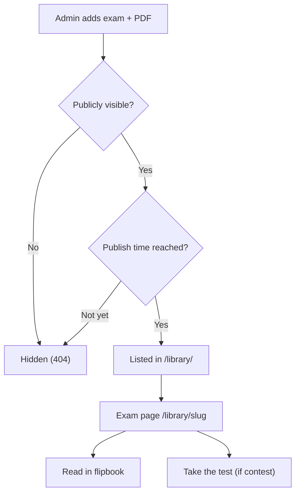
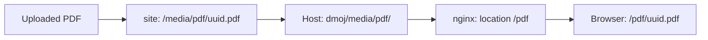

# Exam library

The exam library (`/library/`) is where LCOJ keeps official exam papers as PDFs: provincial and national olympiads, the Tin học trẻ contest, entrance exams for specialised computer science classes, and more. Readers flip through each paper in the browser with a book-style viewer (the flipbook). If an exam is linked to a contest, one click takes readers to that contest, where their submissions are graded automatically.

This page has two parts:

- **[Part 1 – For readers](#readers)**: finding, filtering and reading exams in the flipbook.
- **[Part 2 – For admins](#admins)**: adding exams, uploading PDFs, scheduling publication, managing categories, storage and troubleshooting.



---

## Part 1 – For readers {#readers}

### 1.1. Finding exams {#browse}

⏱ 2 min · 👤 Students, teachers, guests · 🔑 No login required

#### Before you start

- The library is public. You don't need an account.
- Open `/library/` directly (for example `https://luyencode.net/library/`). LCOJ's default navigation bar has **no** Library entry. Whether one exists depends on your admins.

#### Steps

1. Open `/library/`. The page header reads **"Exam library"** and shows four figures: "published exams", "exam types", "provinces and cities" and "graded automatically".
2. Type a keyword into **"Search by exam title or description..."** and click **"Search"**. The search checks both titles and descriptions and ignores case.
3. Pick a category tab below the search box, for example "HSG Tỉnh/TP" or "Đề vào 10 chuyên". The **"All"** tab shows every exam. Each tab shows how many exams it holds. Categories with no published exams have no tab.
4. Pick a province in the **"All provinces"** dropdown. The list reloads as soon as you choose.
5. Pick a year in the **"All years"** dropdown. It only lists years that have exams.
6. Check the result count next to the filters (for example "12 exams found"). Click **"Clear filters"** to reset everything.
7. Scroll to the bottom to change pages. Each page shows 12 exams, newest (by publish date) first.

All filters combine: search, category, province and year can be used together, and they stay applied when you change pages.

::: tip Sharing a filtered list
Filters are stored in the page address, so you can send the link to others:

| Parameter | Meaning | Example |
|---|---|---|
| `q` | Keyword matched against titles and descriptions | `?q=tin học trẻ` |
| `category` | Category slug | `?category=hsg-tinh-tp` |
| `province` | Province code | `?province=ha_noi` |
| `year` | Exam year (must be a number; anything else is ignored) | `?year=2024` |

Example: `/library/2?category=de-vao-10-chuyen&province=tp_ho_chi_minh` is page 2 of the specialised-class entrance exams for Ho Chi Minh City.
:::

#### Reading an exam card

Each exam in the list is a card with:

- A coloured category badge and the exam year.
- The exam title. Click the title (or anywhere on the card) to open the exam page.
- A province chip, plus a **"Full statement in PDF"** chip when the exam has a PDF.
- A description excerpt of up to 140 characters.
- A **"Take the test now"** button if the exam has a practice contest, or a **"Statement only"** label if it doesn't.

#### Verify

- The "N exams found" count matches the number of cards across all pages.
- The tab you picked is highlighted, and the address now contains `category=…`.

#### Troubleshooting

| Symptom | Fix |
|---|---|
| "No exams found." | Click "Clear filters", or try a shorter keyword. |
| The category you need has no tab | That category has no publicly listed exams yet. |
| The year dropdown doesn't list the year you want | No public exam from that year exists yet. |
| An exam you know exists doesn't show up | It may be hidden or scheduled for later. Contact an admin. |

#### Next steps

Open an exam to read it: see [1.2. Reading an exam in the flipbook](#flipbook).

### 1.2. Reading an exam in the flipbook {#flipbook}

⏱ 5 min · 👤 Students, teachers, guests · 🔑 No login required

#### Before you start

- Use a modern browser with JavaScript enabled (current Chrome, Edge, Firefox or Safari).
- Exam pages live at `/library/<slug>`, for example `/library/hsg-ha-noi-2024`.

#### Steps

1. Click an exam card in the library to open the exam page.
2. Check the header: category, province, year and the "Published on …" line.
3. Scroll to the flipbook. The viewer only starts loading once it is about to scroll into view, and shows **"Loading document…"** in the meantime. Page 1 appears first and the other pages are processed one by one in the background.
4. Turn pages by clicking the left or right edge of a page, or by dragging a page corner as you would with a real book. On phones, swipe.
5. Use the toolbar in the top-right corner of the viewer:

   | Button (icon) | What it does |
   |---|---|
   | Magnifier with minus | Zoom out in 0.25× steps, down to 1× |
   | Magnifier with plus | Zoom in in 0.25× steps, up to 2.5×. While zoomed in, the viewer gets scrollbars so you can reach the hidden parts |
   | Speaker | Turn the page-flip sound on or off. Your browser remembers the choice for next time |
   | Expand arrows | Fullscreen view on a dark background. Click it again or press `Esc` to leave |

6. Read the description below the flipbook, if there is one.
7. If the exam has a contest, click **"Take the test now"** (in the header, or in the **"Ready to try it yourself?"** box at the bottom) to enter the contest, submit solutions and get results.
8. Click **"Back to library"** to return to the list.

::: details How does the flipbook look on desktop and on phones?
- **Wide desktop screens**: two pages side by side, like an open book. The first and last pages (the covers) are shown alone and centred.
- **Narrow screens** (viewer narrower than about 600px, typically phones): one page at a time is preferred.
- The book is sized to fit the window height. Entering or leaving fullscreen rebuilds it to fit the new screen.
- The flipbook has **no keyboard shortcuts**. Use the mouse, touch and the toolbar buttons.
- The toolbar tooltips ("Zoom out", "Zoom in", "Toggle sound", "Fullscreen") are currently English-only, even on the Vietnamese interface.
:::

::: warning No download button
Exam pages have no download button. A **"Download PDF"** link only appears when JavaScript is disabled or the viewer libraries fail to load. If the PDF itself can't be read, the flipbook shows a **"Could not load preview — download PDF"** link that opens the file directly.
:::

#### Verify

- Page 1 of the exam is visible, with the toolbar in the top-right corner.
- Turning a page plays an animation and a flip sound (unless muted).

#### Troubleshooting

| Symptom | Fix |
|---|---|
| Stuck on "Loading document…" | The file is large or the network is slow. Wait a little longer, or reload the page. |
| A "Download PDF" link instead of the book | The browser couldn't load the viewer libraries (JavaScript disabled or blocked, or a very old browser). Use the link to open the PDF, or switch browsers. |
| "Could not load preview — download PDF" | The PDF couldn't be read. Use the link to open it directly, then tell an admin. |
| The exam page returns 404 | The exam is hidden, not yet published, or the address is wrong. |
| The fullscreen button does nothing | Some mobile browsers (for example Safari on iPhone) don't let part of a page go fullscreen. Rotate the phone or pinch-zoom instead. |
| No flip sound | Check the speaker button in the toolbar and your device volume. |
| The exam page has no flipbook | The exam has no PDF yet, only a description. |
| "Take the test now" shows an error or 404 | The linked contest may be private and you can't see it. Contact an admin. |

#### Next steps

- Practise in the linked contest with "Take the test now".
- Go back to `/library/` to find exams from the same category, province or year.

---

## Part 2 – For admins {#admins}

All library management happens in the Django admin (`/admin/`), under the **Online Judge** section:

| Admin entry (en) | Admin entry (vi) | Address | Model |
|---|---|---|---|
| Resources | Tài nguyên | `/admin/judge/examstatement/` | `ExamStatement` (one exam) |
| Exam categories | Danh mục đề thi | `/admin/judge/examcategory/` | `ExamCategory` (a category) |

::: warning Confusing entry name
In the admin, exams are listed as **"Resources"** (Vietnamese: "Tài nguyên"), not "Exams".
:::

### 2.1. Granting library permissions {#permissions}

⏱ 5 min · 👤 System admins · 🔑 Superuser

#### Before you start

- People who manage the library need **staff status** to reach `/admin/`.
- The library has no custom permissions. It uses Django's four default permissions per model. See the [permission system](/en/site/permission_system) page.

#### Steps

1. Go to `/admin/auth/group/` and create a group, for example "Library editors".
2. Give the group the permissions it needs:

   | Permission (codename) | Allows |
   |---|---|
   | `judge.view_examstatement` / `judge.add_examstatement` / `judge.change_examstatement` / `judge.delete_examstatement` | View / add / change / delete exams |
   | `judge.view_examcategory` / `judge.add_examcategory` / `judge.change_examcategory` / `judge.delete_examcategory` | View / add / change / delete categories |

3. Add the users to the group.
4. Make sure their accounts have staff status.

::: tip
Exam editors usually only need the exam permissions, plus `judge.view_examcategory` to pick a category. Keep category change/delete for whoever manages the library as a whole.
:::

#### Verify

- The user can log in to `/admin/` and sees "Resources" under Online Judge.

#### Troubleshooting

| Symptom | Fix |
|---|---|
| Can't open `/admin/` | Turn on staff status for the account. |
| "Resources" is missing | The user lacks `view`/`change` permission on `examstatement`. |
| The "Contest" field can't find the contest to link | It only lists contests that the editor can see. Give them access to that contest (for example `see_private_contest`). |

#### Next steps

[2.2. Adding an exam](#add-exam).

### 2.2. Adding an exam {#add-exam}

⏱ 5–10 min · 👤 Admins, exam editors · 🔑 `judge.add_examstatement`

#### Before you start

- Have the exam PDF ready. It must have a `.pdf` extension and be **at most 5 MB** (`PDF_STATEMENT_MAX_FILE_SIZE = 5242880`).
- If you want a "Take the test now" button, create the practice contest first.
- Check that a suitable category exists (see [2.4](#categories)).

#### Steps

1. Go to `/admin/judge/examstatement/` and click the add button.
2. Enter the **Title** (up to 100 characters). **Slug** fills itself in from the title, without diacritics.
3. Adjust the **Slug** if needed. It must be unique and at most 50 characters, and it becomes the exam page address `/library/<slug>`.
4. Pick a **Category** (required).
5. Pick a **Province** if the exam belongs to one. Otherwise leave it empty.
6. Enter the exam **Year** (optional, from 1990 up to next year).
7. Write a **Description** in Markdown (optional).
8. Search for the practice contest in the **Contest** field (type its key or name).
9. Tick or untick **Publicly visible**.
10. Set **Publish on** with the date/time picker. Leave it empty to use the moment you save.
11. Choose the file in **PDF file**.
12. Save.

Field reference:

| Field (en) | Field (vi) | Required | Meaning |
|---|---|---|---|
| Title | Tiêu đề | Yes | Exam name, shown on the card, the exam page and the browser tab. Up to 100 characters. |
| Slug | Slug | Yes | Exam page address `/library/<slug>`. Unique, up to 50 characters, only unaccented letters, digits, `-` and `_`. Pre-filled from the title. |
| Category | Nhóm | Yes | Exam category: decides the tab and the coloured badge. |
| Province | Tỉnh/thành phố | No | Chosen from a fixed list of provinces and cities. Used by the province filter. |
| Year | Năm | No | From 1990 up to next year. Used by the year filter. |
| Description | Mô tả | No | Markdown. Shown below the flipbook, trimmed to a 140-character excerpt on the card, included in search, and its first paragraph becomes the SEO description. |
| Contest | Contest | No | Practice contest. When set, the "Take the test now" button appears. If the contest is deleted, the link is cleared automatically. |
| Publicly visible | Hiển thị công khai | — | On by default. When off, the exam disappears from the list and its page returns 404. |
| Publish on | Publish on | No | Publication date and time. Before it, the exam is hidden as if it were not visible. Also used for ordering (newest first) and for the "Published on …" line. |
| PDF file | Tệp PDF | No | Uploaded file (`.pdf`, ≤ 5 MB). Saving with a new file replaces the exam's PDF. |
| PDF URL | Đường dẫn PDF | — | Read-only. Filled in automatically after upload, in the form `/pdf/<uuid>.pdf`. |

::: warning No external PDF links, no PDF removal
**PDF URL** is read-only, so you can't point an exam at a PDF hosted elsewhere, and you can't remove an exam's PDF from the admin. To replace a PDF, upload a new file. The old file stays on disk.
:::

::: tip Scheduling an exam
To publish an exam at a set time (for example right after the real exam ends), leave **Publicly visible** on and set **Publish on** to that time. The exam appears by itself when the time comes. Nothing else to do.
:::

::: details Built-in SEO
- The list page title follows the active filters (for example "Đề vào 10 chuyên - Hà Nội - year 2024 | Exam library"), and its description includes the number of matching exams.
- Search result pages (`?q=`) are marked `noindex, follow`. Pages filtered by category, province or year stay indexable.
- Both page types carry schema.org data (JSON-LD): `CollectionPage`/`ItemList` for the list, `LearningResource` for an exam page, plus `BreadcrumbList`.
- The SEO description of an exam page comes from the first paragraph of its **Description** (or the title if there is none). The share image is the first image in the description. The result is **cached for 24 hours**, so after you edit a description the meta tags may take up to a day to update.
- No library pages are in `sitemap.xml` yet.
:::

#### Verify

1. Open `/library/`. The new exam is at the top of the list (once its publish time has passed).
2. Its card shows "Full statement in PDF", and "Take the test now" if a contest is linked.
3. Open the exam page. The flipbook loads page 1.
4. Open `/pdf/<uuid>.pdf` (taken from the PDF URL field). The browser should display the file.

#### Troubleshooting

| Symptom | Fix |
|---|---|
| "File size is too big! Maximum file size is …" | Compress the PDF (lower image resolution) below 5 MB. The limit is `PDF_STATEMENT_MAX_FILE_SIZE`. |
| File extension error | Only `.pdf` files are accepted. |
| "Exam year must be between 1990 and …" | Enter a year within the allowed range. |
| Slug already exists | Change the slug, for example by adding the year or province. |
| Saved, but the exam isn't in `/library/` | Check that **Publicly visible** is on and **Publish on** isn't in the future. |
| The exam page has no flipbook | No PDF was uploaded (the PDF URL field is empty). |

#### Next steps

- [2.3. Editing, hiding or removing an exam](#edit-exam)
- [2.5. PDF storage and backups](#storage)

### 2.3. Editing, hiding or removing an exam {#edit-exam}

⏱ 2 min · 👤 Admins, exam editors · 🔑 `judge.change_examstatement` (delete: `judge.delete_examstatement`)

#### Before you start

- The admin exam list shows title, category, province, year, contest, visibility and publish date. It can be filtered by category, province, year and visibility, browsed by publish date, and searched by title and description.

#### Steps

1. Go to `/admin/judge/examstatement/` and find the exam.
2. Click its title to open the form.
3. To hide it for now: untick **Publicly visible**, then save.
4. To replace the PDF: choose a new file in **PDF file**, then save.
5. To remove it for good: use the delete button in the form and confirm.

::: warning Changing the slug breaks old links
The slug is the exam page address. Changing it makes every link shared earlier return 404.
:::

#### Verify

- A hidden or deleted exam is gone from `/library/`, and `/library/<slug>` returns 404.
- After replacing the PDF, the PDF URL field shows a new file name.

#### Troubleshooting

| Symptom | Fix |
|---|---|
| The flipbook still shows the old PDF | Do a hard reload (Ctrl+F5). The new file has a new address, so only the HTML page needs reloading. |
| The SEO description is still the old text | It is cached for 24 hours. Wait, or clear the Redis cache. |

#### Next steps

[2.4. Managing categories](#categories).

### 2.4. Managing categories {#categories}

⏱ 3 min · 👤 Admins · 🔑 `judge.add_examcategory` / `judge.change_examcategory`

#### Before you start

After migrations, LCOJ ships with 8 categories:

| Order | Name | Slug |
|---|---|---|
| 0 | HSG Tỉnh/TP | `hsg-tinh-tp` |
| 1 | HSG Quốc Gia | `hsg-quoc-gia` |
| 2 | Chọn đội tuyển quốc gia | `chon-doi-tuyen-quoc-gia` |
| 3 | Olympic quốc tế | `olympic-quoc-te` |
| 4 | Đề thi thử | `de-thi-thu` |
| 5 | Đề vào 10 chuyên | `de-vao-10-chuyen` |
| 6 | ICPC/OLP | `icpc-olp` |
| 7 | Khác | `khac` |

#### Steps

1. Go to `/admin/judge/examcategory/`.
2. Click the add button, or click an existing category to edit it.
3. Enter the **Name** (unique, up to 40 characters). In the Vietnamese admin this field is mistranslated as "Tên người dùng".
4. Check the **Slug** (pre-filled from the name, unique, up to 50 characters). It is the `?category=` value in page addresses.
5. Set **Order**: lower numbers come first. Categories with the same order are sorted by name.
6. Save.

::: tip Badge colours
Badge colours are assigned automatically from each category's position in the sort order (a 7-colour palette, repeating). Reordering categories changes their colours.
:::

#### Verify

- The category tab appears on `/library/` in the right order, **once the category has at least one public exam**.

#### Troubleshooting

| Symptom | Fix |
|---|---|
| A category can't be deleted | It still has exams (the link is protected). Move them to another category or delete them first. |
| A new category has no tab | It has no public exams yet. |
| An old `?category=` link no longer filters correctly | The category slug was changed. Update the link. |

#### Next steps

[2.5. PDF storage and backups](#storage).

### 2.5. PDF storage and backups {#storage}

⏱ 5 min · 👤 Server operators · 🔑 Access to the Docker host

#### Before you start

How a PDF travels:



- The file is renamed to `<uuid>.pdf` and saved in `MEDIA_ROOT/pdf/`, which is `/media/pdf/` inside the `site` container (`PDF_STATEMENT_UPLOAD_MEDIA_DIR = 'pdf'`).
- `/media/` is the host directory `dmoj/media/` (a bind mount in `docker-compose.yml`), shared by `site` and `nginx`.
- nginx serves the files directly at `/pdf/…` (`location /pdf { root /media/; }`). The exam stores the relative address `/pdf/<uuid>.pdf` (`PDF_STATEMENT_UPLOAD_URL_PREFIX = '/pdf'`), on the same domain as the page, so CORS doesn't come into play.
- Problem statement PDFs share this same directory.

#### Steps

1. Back up `dmoj/media/pdf/` together with the database. With only the database, the exams survive but their PDFs are lost. With only the directory, the PDFs survive but you can't tell which file belongs to which exam.
2. When moving to a new server, copy `dmoj/media/` over before running `docker compose up -d`.

::: warning Old PDFs are never deleted
Replacing a PDF or deleting an exam does **not** delete the file on disk, so `dmoj/media/pdf/` keeps growing. If you clean it up, first check each file against the exams' `pdf_url` column (and problem PDFs).
:::

#### Verify

```sh
cd lcoj-docker/dmoj
ls -lh media/pdf/ | tail
curl -I http://localhost:${NGINX_PORT:-8071}/pdf/<uuid>.pdf   # expect 200, Content-Type: application/pdf
```

#### Next steps

- See [Operating LCOJ](/en/site/operations) for backups.

### 2.6. Flipbook libraries (PDF.js, StPageFlip) {#static-assets}

⏱ 10 min · 👤 Server operators · 🔑 Access to the Docker host and repositories

#### Before you start

The flipbook uses these static files:

| File | Source |
|---|---|
| `lcoj/pdfjs/pdfjs-init.js`, `pdf.min.js`, `pdf.worker.min.js` (PDF.js) | Submodule `resources/lcoj` → [luyencode/lcoj-static](https://github.com/luyencode/lcoj-static) |
| `lcoj/pageflip/page-flip.browser.js` (StPageFlip) | Same `resources/lcoj` submodule |
| `flipbook.js`, `flipbook.scss`, `page-flip.mp3` | Directly in lcoj-site's `resources/` |

These libraries are **not** part of the lcoj-site repository and are not loaded from a CDN. They live in a separate submodule and are served from `/static/`.

#### Steps

1. After cloning or updating, fetch all submodules (including the ones nested inside `dmoj/repo`):

   ```sh
   cd lcoj-docker
   git submodule update --init --recursive
   ```

2. Check that the files are there:

   ```sh
   ls dmoj/repo/resources/lcoj/pdfjs dmoj/repo/resources/lcoj/pageflip
   ```

3. Copy the static files to the `assets` volume so nginx can serve them:

   ```sh
   cd dmoj
   ./scripts/copy_static
   ```

4. If you changed the nginx config, restart nginx: `docker compose restart nginx`.

#### Verify

- Open `/static/lcoj/pdfjs/pdf.min.js` and `/static/lcoj/pageflip/page-flip.browser.js` in a browser. They should return JavaScript, not a 404.
- Open an exam page with a PDF. The flipbook shows page 1.

#### Troubleshooting

| Symptom | Fix |
|---|---|
| After about 8 seconds the flipbook shows only a "Download PDF" link | PDF.js or StPageFlip failed to load. Check `/static/lcoj/...` for 404s, then repeat steps 1 and 3. |
| "Could not load preview — download PDF" | PDF.js loaded but couldn't read the file. Open the browser console and look for `[flipbook] failed to load`. Check that `/pdf/<uuid>.pdf` returns 200 and that the file isn't corrupt. |
| `/pdf/<uuid>.pdf` returns 404 | The file isn't in `dmoj/media/pdf/`, or nginx lacks `location /pdf`. Check the `./media/:/media/` mount on both `site` and `nginx`. |
| The console reports a failed load of `pdf.worker.min.js` | The worker is loaded from the same folder as `pdfjs-init.js`. Make sure `pdf.worker.min.js` was copied to `/static/lcoj/pdfjs/`. |
| The flipbook is blank or very slow for long files | Every page is rendered to an image in the browser, one at a time. Long or image-heavy PDFs use a lot of memory, especially on phones. Optimise the PDF (lower image resolution, drop unneeded pages). |
| CORS errors in the console | These only happen when the PDF is on another domain. The default setup (PDF under `/pdf/` on the same domain) avoids them. Check `MEDIA_URL`/`SITE_FULL_URL` and whether a front proxy (Cloudflare) redirects to another domain. |
| Upload fails with 413 | The request exceeded nginx's `client_max_body_size 64M`. This can't happen with files ≤ 5 MB. |

#### Next steps

- [Installing LCOJ](/en/site/installation)
- [Operating LCOJ](/en/site/operations)
