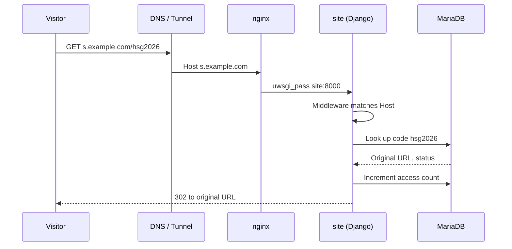
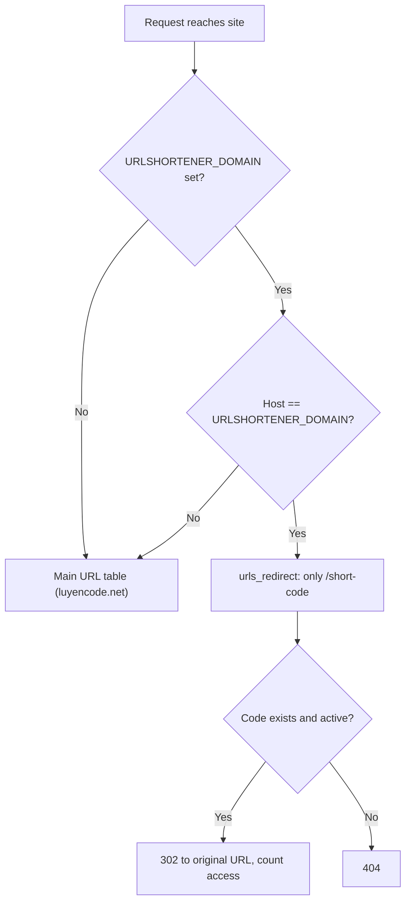

# URL shortener

LCOJ ships with a built-in URL shortener: you assign a **short code** (for example `hsg2026`) to a long address, then share a link such as `https://<short-domain>/hsg2026`. It is handy for handing out contest links, registration forms or materials on slides, posters and group chats.

This page has three parts, for three audiences:

| Part | For | Covers |
|---|---|---|
| [1. Creating and managing short links](#_1-creating-and-managing-short-links) | Staff with the permissions | Create, edit, deactivate, delete links; view access counts |
| [2. Granting access](#_2-granting-access) | Admins | Grant the 4 `urlshortener.*` permissions in the admin site |
| [3. Using a dedicated short domain](#_3-using-a-dedicated-short-domain) | Server operators | Enable the middleware, set `URLSHORTENER_DOMAIN`, `ALLOWED_HOSTS`, route the domain |

::: warning Short links only work once a dedicated domain is configured
Redirects for `/<short-code>` are handled **only** on the dedicated short domain (Part 3). The main domain (for example `luyencode.net`) has no route for `/<short-code>`, so `https://luyencode.net/hsg2026` returns 404.

LCOJ's default configuration (`dmoj/config/local_settings.py`) does **not** set `URLSHORTENER_DOMAIN` and does **not** add `URLShortenerMiddleware` to `MIDDLEWARE`. In that state you can still create and manage links, but the copied link is just the relative path `/<short-code>` and does not work. Ask your operator to complete Part 3 first.
:::

## How it works



- The middleware compares the request's Host with `URLSHORTENER_DOMAIN`. If they match, the request is routed with a separate URL table, `urlshortener.urls_redirect`, which has exactly one route: `/<short-code>`.
- Code found and link active: the counter is incremented, the access time recorded, and a **302** (temporary redirect) to the original URL is returned.
- Code not found, or link inactive: **404**.
- Visitors do **not** need to be logged in.

---

## 1. Creating and managing short links

⏱ ~2 min · 👤 Staff with the permissions · 🔑 `urlshortener.view_urlshortener`, `urlshortener.add_urlshortener`, `urlshortener.change_urlshortener`, `urlshortener.delete_urlshortener`

### Before you start

- You are logged in and have been granted the permissions (see [Part 2](#_2-granting-access)). Anonymous users are sent to the login page; logged-in users without the permission get a 403 error.
- The management pages live at **`/shorteners/`** on the main domain (for example `https://luyencode.net/shorteners/`). There is **no** menu or navbar link to them, so bookmark the address.
- For links to actually work, the short domain must already be configured (Part 3).

Management pages:

| Address | Purpose | Required permission |
|---|---|---|
| `/shorteners/` | List of all links, 20 per page | `view_urlshortener` |
| `/shorteners/create/` | Create a link | `add_urlshortener` |
| `/shorteners/<short-code>/` | View one link's details | `view_urlshortener` |
| `/shorteners/<short-code>/edit/` | Edit a link | `change_urlshortener` |
| `/shorteners/<short-code>/delete/` | Delete a link | `delete_urlshortener` |

::: tip UI labels
Most labels of this feature have no Vietnamese translation yet, so they appear in English even when the site is in Vietnamese. This page quotes the English UI labels; where a Vietnamese translation exists, the Vietnamese page quotes that instead.
:::

### Create a link

1. Open `/shorteners/` and click the **Create New** tab (the tab next to it is **List**).
2. Fill in the form:

   | Field | Required | Meaning and rules |
   |---|---|---|
   | **Original URL** | Yes | The full destination address. Must be a valid URL including `https://` (for example `https://luyencode.net/contest/hsg2026`). Entering `luyencode.net/...` without a scheme is rejected. |
   | **Short code** | Yes | The code that appears after the `/` in the link. Only unaccented Latin letters, digits, hyphens `-` and underscores `_`; at most 50 characters; must be **unique**. No spaces, Vietnamese diacritics or characters such as `@`, `!`, `.`, `/`. |
   | **Is active** | No (on by default) | On: the link redirects normally. Off: visitors get a 404, but the link is kept so you can re-enable it later. |

   The shuffle 🔀 button to the right of **Short code** fills in a random 8-character alphanumeric code. It is not checked for uniqueness until you save.
3. Click **Create**.
4. You land on the link's detail page. The box at the top shows the full short link; click **Copy** to copy it.

::: tip Choosing a short code
- Prefer codes that are easy to read and type: `hsg2026`, `dang-ky-k10`, `slide_buoi3`.
- Do not rely on letter case to tell two codes apart (`HSG` vs `hsg`); it is confusing to read and the database may treat them as duplicates.
- Avoid the code `create`: its detail page `/shorteners/create/` is shadowed by the create page (the link itself still redirects normally).
:::

### View the list and statistics

The **List** page (`/shorteners/`) shows **every** link in the system, newest first. Links are not owned by their creator; anyone with the view permission sees all of them. Columns:

| Column | Content |
|---|---|
| **Short URL** | The short code, with a 📋 icon to copy the full link |
| **Original URL** | The original URL (truncated to the first 50 characters) |
| **Accesses** | Number of accesses |
| **Status** | `Active` or `Inactive` (inactive links are shown faded) |
| **Created** | Creation time |
| **Actions** | View 👁, edit ✏️, delete 🗑 |

The detail page also shows **Last Accessed**: the most recent access time, only shown once there has been at least one access.

::: details How are accesses counted?
- Every request to an active link that is successfully redirected adds 1 to **Access Count** and updates **Last Accessed**.
- Visitors and bots are not de-duplicated: opening the link 10 times counts 10 accesses. Link-preview crawlers (Zalo, Messenger, Discord…) may be counted too.
- Requests to inactive links or unknown codes are **not** counted.
- There are no per-day, per-referrer or per-country statistics.
:::

### Edit, deactivate or delete a link

1. In the **List**, click the ✏️ icon (or the **Edit** button on the detail page).
2. Change the fields as when creating, then click **Save**.
   - Changing **Original URL**: the short link stays the same; only its destination changes. Useful when you need a new destination without redistributing the link.
   - Changing **Short code**: the old link **stops working** immediately (404); old codes are not kept.
   - Unticking **Is active**: temporarily disables the link, keeping its statistics.
3. To delete permanently, click 🗑 (or **Delete** on the detail page). The confirmation page shows the code, original URL, access count and creation date; click **Delete** to confirm. Deletion **cannot be undone**, and you are taken back to the **List**.

::: warning
Short links do not expire: they keep working until they are deactivated or deleted. When a contest or event is over, deactivate the link if you do not want it used any more.
:::

### What visitors see

- Active link: the browser goes straight to the original URL (HTTP 302), with no intermediate page.
- Inactive link or wrong code: a 404 error page.
- Query strings are **not** forwarded: `https://<short-domain>/hsg2026?ref=fb` still goes to the exact original URL; `?ref=fb` is dropped.
- A trailing `/` is **not** accepted: `/hsg2026/` returns 404; use `/hsg2026`.

### Verify

1. On the detail page, click **Copy** and paste the link into a private window (not logged in).
2. The browser should open the original URL.
3. Reload the detail page: **Access Count** has increased and **Last Accessed** appears.

### Troubleshooting

| Symptom | Fix |
|---|---|
| `/shorteners/` redirects to the login page | Log in first. |
| 403 when opening the list, creating, editing or deleting | Missing the matching permission; ask an admin (Part 2). |
| Creation succeeds but is followed by a 403 | You have `add` but not `view`: after saving you are sent to the detail page, which needs `view_urlshortener`. The link has still been created. |
| The copied link is just `/hsg2026` (no domain) | `URLSHORTENER_DOMAIN` is not configured; tell your operator (Part 3). |
| The link returns 404 | Check that the link is `Active`; the code is typed correctly; there is no trailing `/`; the link is opened on the short domain, not the main domain; the short domain is fully configured (Part 3). |
| Error on **Short code** when saving | The code already exists, contains disallowed characters, or is longer than 50 characters. |
| Error on **Original URL** | Missing `http://` / `https://`, or a malformed URL. |
| After changing the code, the old link printed on a poster returns 404 | Change the code back. If you want an additional code, create a separate link pointing to the same destination. |

---

## 2. Granting access

⏱ ~3 min · 👤 Admin (superuser, or anyone allowed to edit Users/Groups in the admin site) · 🔑 permission to change `auth.User` or `auth.Group`

The feature uses the 4 default permissions Django creates for the `URLShortener` model:

| Permission | Allows |
|---|---|
| `urlshortener.view_urlshortener` | View the list and detail pages |
| `urlshortener.add_urlshortener` | Create links |
| `urlshortener.change_urlshortener` | Edit links (including activating/deactivating) |
| `urlshortener.delete_urlshortener` | Delete links |

::: tip Grant all 4 permissions together
The **Edit**/**Delete** buttons are always shown to anyone who can view, and after creating a link the user is sent to the detail page (which needs the view permission). Granting permissions piecemeal easily leads to confusing 403 errors. For someone who only needs to see statistics, grant just `view_urlshortener`.
:::

::: details The model has no page in the Django admin
The `urlshortener` app does not register its model with the Django admin, so you will **not** find a "URL shortener" section under `/admin/` for managing links. The admin is only used to grant permissions; all link operations go through `/shorteners/`. Superusers automatically have every permission.
:::

### Before you start

- You can log in to `/admin/` with permission to edit users or groups.
- The `urlshortener` migrations have been applied (`./scripts/migrate`), so the 4 permissions exist in the database.

### Option A: grant via a group (recommended)

1. Go to `/admin/auth/group/`, open an existing group or create a new one (for example `Link Managers`).
2. In the permissions selector, type `URL shortener` to filter. The permissions appear as `URL Shortener | URL shortener | Can view URL shortener`, and likewise for `add`, `change`, `delete`.
3. Move the permissions you want into the chosen column, then save.
4. Open `/admin/auth/user/`, pick the user, add them to that group in the groups field, then save.

### Option B: grant directly to one user

1. Go to `/admin/auth/user/` and open the user.
2. In the user permissions field, type `urlshortener` to filter. LCOJ's user page shows permissions as `urlshortener.view_urlshortener | Can view URL shortener`.
3. Select the permissions you want, then save.

See [Permission system](/en/site/permission_system) for more on how permissions work.

### Verify

1. Log in with the account you just granted (or ask its owner to try).
2. Open `/shorteners/`: you should see the **List** page instead of a 403.
3. Click **Create New**: you should see the create form (if `add_urlshortener` was granted).

You can also check from the Django shell:

```sh
./scripts/manage.py shell -c "from django.contrib.auth.models import User; u = User.objects.get(username='the_username'); print(sorted(p for p in u.get_all_permissions() if p.startswith('urlshortener.')))"
```

### Troubleshooting

| Symptom | Fix |
|---|---|
| No `urlshortener` permissions in the list | Run `./scripts/migrate` to create the table and permissions, then reload the admin page. |
| Permissions granted but the user still gets 403 | Double-check the account; that the user is in the group; that the group has the permission needed for that action (see the table above). |
| The user can create but gets 403 after clicking **Create** | Also grant `view_urlshortener`. |
| No list of links anywhere in the admin | By design: manage links at `/shorteners/`. |

---

## 3. Using a dedicated short domain

⏱ ~15 min · 👤 Server operator · 🔑 access to the server, `dmoj/repo/dmoj/local_settings.py` and DNS / Cloudflare Tunnel configuration

This part configures a dedicated domain, for example `s.example.com`, so that `https://s.example.com/<short-code>` redirects to the original URL. In the examples below, replace `s.example.com` with your real domain.

### How the middleware decides

`urlshortener.middleware.URLShortenerMiddleware` does exactly one thing: if `URLSHORTENER_DOMAIN` is set **and** `request.get_host()` is **exactly equal** to it, the request is routed with `urlshortener.urls_redirect` instead of the main URL table.



Consequences:

- The comparison is an **exact string match** on Host, port included. For example `s.example.com:8071` does **not** match `s.example.com`.
- On the short domain there is **only** `/<short-code>`. The home page `/`, `/shorteners/`, `/admin/`… all return 404. Manage links on the main domain.
- `URLSHORTENER_DOMAIN` is also used to build the link shown in the management pages: if the value has no scheme, LCOJ prepends `https://` (for example `s.example.com` → `https://s.example.com/hsg2026`). However, because the middleware matches against Host, the value **must be a bare domain** (no scheme, no port). If you write `https://s.example.com`, the displayed link still looks right but the redirect will never trigger.

### Before you start

- LCOJ is running fine on the main domain (see [Installation](/en/site/installation)).
- You control DNS for the short domain, and the Cloudflare Tunnel (if used, as in production).
- In `docker-compose.yml`, nginx is published on the host at port `${NGINX_PORT:-8071}` (default `8071`). The main domain's tunnel points at this port.
- You know the live config file is `dmoj/repo/dmoj/local_settings.py` (ignored by git). `./scripts/initialize` copies it from `dmoj/config/local_settings.py`.

### Steps

1. **Point the domain at nginx.** Add a public hostname `s.example.com` in the Cloudflare Tunnel, pointing to the **same nginx service** as the main domain (`http://<server>:8071`). Do not override the Host header: Django must receive `Host: s.example.com`.

2. **(Optional) Declare it in nginx.** `dmoj/nginx/conf.d/nginx.conf` has a single `server` block (`listen 80`, `server_name luyencode.net;`), so it is the default server and already accepts any Host. Requests for `s.example.com` therefore already reach `site` through `uwsgi_pass site:8000` (with `include uwsgi_params`, so Host is forwarded). To make it explicit, add the domain to `server_name`:

   ```nginx
   server_name  luyencode.net s.example.com;
   ```

   Then run `docker compose restart nginx`.

3. **Configure Django.** Append to `dmoj/repo/dmoj/local_settings.py`:

   ```python
   # Short domain: bare domain only, no scheme, no port
   URLSHORTENER_DOMAIN = 's.example.com'

   # Django rejects Hosts not in ALLOWED_HOSTS (400 error)
   ALLOWED_HOSTS = [HOST, URLSHORTENER_DOMAIN]

   # The middleware is not enabled in dmoj/settings.py
   MIDDLEWARE += ('urlshortener.middleware.URLShortenerMiddleware',)
   ```

   - `local_settings.py` is `exec`-ed at the end of `dmoj/settings.py`, so `HOST` is available and `MIDDLEWARE += (...)` works (`MIDDLEWARE` is a tuple).
   - Appending the middleware at the end is enough, because the URL table is chosen only after every middleware has run its request phase.
   - `URLSHORTENER_DOMAIN` is **not** read from environment variables; it must be set in `local_settings.py`.
   - Do not edit `dmoj/settings.py`.

4. **Save it in the template too.** Copy the same lines into `dmoj/config/local_settings.py`, so a later `./scripts/initialize` does not lose the configuration.

5. **Restart:**

   ```sh
   cd lcoj-docker/dmoj
   docker compose restart site celery
   ```

### Verify

Create a test link (Part 1), for example code `test123` pointing to `https://luyencode.net/`, then:

```sh
# 1. Hit nginx directly on the server, faking the short domain's Host
curl -sI -H 'Host: s.example.com' http://localhost:8071/test123
# Expect: HTTP/1.1 302 Found  and  Location: https://luyencode.net/

# 2. Over the Internet (DNS / Tunnel)
curl -sI https://s.example.com/test123
# Expect: 302 with the same Location

# 3. Unknown code
curl -sI https://s.example.com/does-not-exist
# Expect: 404

# 4. The main domain is unaffected
curl -sI https://luyencode.net/
# Expect: 200 as before
```

Finally, open the link's detail page: the link box should show `https://s.example.com/test123`, and **Access Count** has increased.

### Troubleshooting

| Symptom | Fix |
|---|---|
| `400 Bad Request` on the short domain | The domain is not in `ALLOWED_HOSTS`, or `site` has not been restarted. Look for `DisallowedHost` in `docker compose logs site`. |
| The short domain shows the main site's home page or 404 | The middleware is not running: `MIDDLEWARE += ('urlshortener.middleware.URLShortenerMiddleware',)` is missing; or `URLSHORTENER_DOMAIN` differs from the real Host (has a scheme, a port, a typo, different case). |
| `curl -H 'Host: ...'` against `localhost:8071` works, but not over the Internet | Check that the tunnel/DNS public hostname points to nginx and does not override the Host header. |
| The link shown in the management pages is still `/code` | `URLSHORTENER_DOMAIN` was not loaded: check you edited the right file, `dmoj/repo/dmoj/local_settings.py`, and restarted. |
| `/code/` (trailing `/`) returns 404 | By design; use `/code`. |
| Configuration lost after re-running `./scripts/initialize` | Copy the configuration into `dmoj/config/local_settings.py` (step 4). |

See [Operations](/en/site/operations) for more operational commands.

---

## Next steps

- [Permission system](/en/site/permission_system): the other permissions in LCOJ and how to organize groups.
- [Operations](/en/site/operations): restarting services, reading logs, checking status.
- [Installation](/en/site/installation): reinstall, or set up a staging environment to test the short domain before applying it in production.
