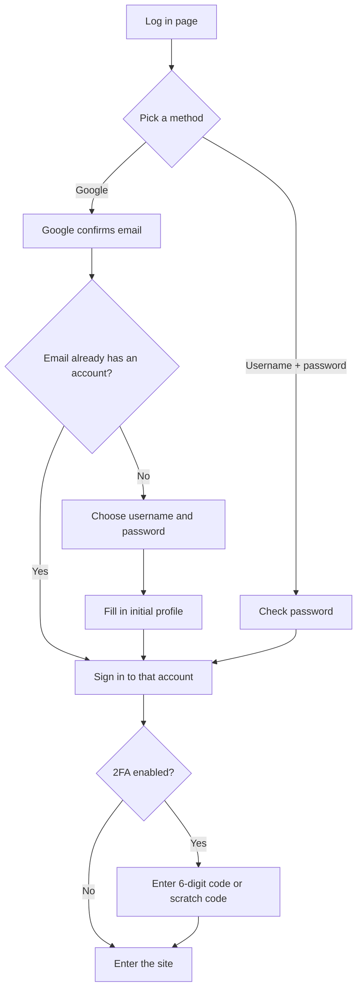

# Account and sign-in

> How to create an LCOJ account and sign in with Google, set up your profile the first time, protect your account with two-factor authentication, and download your personal data.
>
> ⏱ ~10 min · 👤 Students, all users · 🔑 Just an account

## Before you start

- [ ] You have a working **Google account** (Gmail or your school's Google Workspace).
- [ ] You have a **username** in mind. It appears on rankings and in your profile URL `/user/<username>`, and you **can't change it yourself** once it is created.
- [ ] If you plan to turn on two-factor authentication: install an authenticator app on your phone (Google Authenticator, Microsoft Authenticator, Authy, or any app that supports TOTP codes).

## How sign-in works on LCOJ

LCOJ **only accepts new sign-ups through Google**. The username-and-password sign-up form is turned off (the `OAUTH_ONLY = True` setting), so the **Sign up** page (`/accounts/register/`) only shows a **Google** button under **Sign up with Google**. Facebook and GitHub are not configured on luyencode.net.

The **Log in** page (`/accounts/login/`) still offers two ways in:

| Sign-in method | When to use it |
|---|---|
| The **Google** button under **Or log in with...** | The main way. One click, nothing to remember |
| **Username** + **Password** fields, then **Login!** | When Google is inconvenient (for example on an exam-room computer). This is the password you set yourself while creating the account through Google |

::: info Your account still has a password
When you create an account through Google, LCOJ still asks you to set a separate LCOJ password. That's why every account, admin accounts included, can sign in with a username and password. Change it under **Edit profile** → **Change your password**.
:::

## Signing up and signing in for the first time

1. Open `https://luyencode.net` and click **Log in** or **Sign up** in the top-right corner of the navigation bar.
2. Click the **Google** button and choose your Google account.
3. If this Google email is **already linked to an LCOJ account**, you are signed straight into that account. Skip the remaining steps.
4. On your first visit, the **Set up your account** page appears. Fill in:
   - **Username**: only unaccented letters, digits, and underscores `_`, up to 30 characters, and not already taken. It is prefilled with a suggestion based on your Google account.
   - **Password** and **Retype password**: your LCOJ password. It must be at least 8 characters, not entirely numeric, not too similar to your username, and not on the list of known leaked passwords.
5. Click **Register!**.
6. The **Create your profile** page shows your profile settings (time zone, default programming language, themes, organizations, and so on). Pick what you want and click **Continue >**. You can change all of this later.

::: warning Leave the self-description empty when signing up
You need at least **5 solved problems** before you can write a self-description. If you fill that field in while creating the account, the page shows **You must solve at least 5 problems before you can update your profile.** and won't let you continue. Leave it blank.
:::

Once signed in, the navigation bar shows **Hello, &lt;name&gt;.** next to your avatar. Hover over it to find **Edit profile** and **Log out**.

## Editing your profile

Open **Edit profile** from the account menu, or go straight to `/edit/profile/`. Click **Update profile** at the bottom when you're done.

| Field | What it does |
|---|---|
| **Full name** | Your real name, up to 30 characters. The navigation bar greets you with it. On contest rankings, viewers see it only after turning on **Show full name/organization** |
| **Display badge** | Only shown once you have been awarded a badge. Pick one to display next to your name |
| **Self-description:** | Markdown shown on the **About** tab of your profile. Requires at least 5 solved problems |
| **Time zone:** | The time zone used to display every date and time. Defaults to `Asia/Ho_Chi_Minh`. You can also pick it on a map |
| **Language:** | The **programming** language preselected when you submit. It is not the interface language |
| **Site theme:** | Site appearance: **Follow system default**, **Light**, or **Dark** |
| **Editor theme:** | Color scheme of the code editor |
| **Affiliated organizations** | Organizations you belong to. Unchecking one means leaving it. Up to 3 public organizations |
| **Notify me about upcoming contests** | Only shown when the site has a newsletter enabled |
| **Enable experimental features** | Try out features that are not officially released yet |
| **Change your avatar** | Links to Gravatar. LCOJ takes your avatar from Gravatar based on your email |
| **Change your password** | Changes the password used for username sign-in |
| **Download your data** | Download your source code and comments. See **Downloading your data** below |

::: tip Quick switch for interface language and dark mode
Click the **Settings** gear icon in the navigation bar:
- **Theme**: the sun (light) and moon (dark) buttons.
- **Language**: the **VI** and **EN** buttons switch the interface language.

The gear is there even when you are **not signed in**. In that case your theme choice is stored in a browser cookie for 1 year, and until you choose, the site follows your operating system's light or dark mode. When you are signed in, the choice is saved to your profile and follows you across devices.
:::

## Your public profile

Your profile lives at `https://luyencode.net/user/<username>`. Opening `/user` with no name takes you to your own profile. Everyone, including signed-out visitors, can see:

| Information | Where |
|---|---|
| Avatar (Gravatar), **Problems solved:**, **Rank by points:**, **Total points:**, **Contribution points:** | Left column |
| Number of contests written, **Rank by rating:**, **Rating:**, **Min. rating:**, **Max rating:** | Left column, only once you have a rating |
| Organizations (the **From** line), self-description, **Badges & Awards**, daily submission activity, **Rating history** | **About** tab |
| Solved problems and points per problem | **Statistics** tab |
| Blog posts | **Blogs** tab |
| Submission list | The **View submissions** link (`/submissions/user/<username>/`) |

Your **email** is only visible to you and to superusers. Others can see your submission list, but whether they can read your source code depends on each problem's settings (see [Submitting and judging](/en/learn/submissions)).

## Two-factor authentication (2FA)

With 2FA on, every sign-in (through Google or with a password) also asks for a 6-digit code generated by an app on your phone. Someone who steals your password or your Google account still can't get in without your phone.

### Turning on 2FA

1. Go to **Edit profile**, find the **Two-factor Authentication is disabled:** line, and click **Enable**.
2. Open your authenticator app and scan the QR code under **Scan this code with your authenticator app:**. If scanning doesn't work, type in the key shown on the **Or enter this code manually:** line.
3. **Write down the scratch codes** listed at the bottom of the page: 5 codes, 16 characters each. Keep them somewhere safe. The page won't show them again after you finish.
4. Type the current 6-digit code from the app into **Enter the 6-digit code generated by your app:** and click **Enable Two Factor Authentication**.

You land back on **Edit profile**, which now reads **Two-factor authentication is enabled:** with **Disable** and **Refresh** buttons (Refresh switches to a new key, for example when you change phones).

### Signing in with 2FA on

After signing in with Google or a password, the **Perform Two-factor Authentication** page appears. Enter the **6-digit code** from your app, or **one 16-character scratch code**, and click **Login!**. Each scratch code works only once.

Until you pass this step, every page sends you back to the code prompt. You can still **Log out**.

### Managing scratch codes

On **Edit profile**, the **Scratch codes:** line has a **Generate** or **Regenerate** button. Regenerating **invalidates all old codes** and shows the new set exactly once, with a **Copy** button. Regenerate when you are running low or suspect the codes have leaked.

### Turning off 2FA

Click **Disable**, enter a 6-digit code or a scratch code, and click **Disable Two Factor Authentication**. Your scratch codes are deleted too.

::: warning Staff accounts can't turn 2FA off themselves
LCOJ has `DMOJ_REQUIRE_STAFF_2FA` enabled. For a **staff** account that has 2FA on, the **Disable** button only shows the message *"The administrators for this site require all the staff to have Two-factor Authentication enabled, so it may not be disabled at this time."* This setting does **not** force staff to turn on 2FA in the first place; it only stops them from turning it off.
:::

::: info Security keys (WebAuthn) are not enabled on luyencode.net
LCOJ supports hardware security keys (the **Security keys:** section), but that section only appears when the server sets `WEBAUTHN_RP_ID`. luyencode.net doesn't set it, so authenticator apps and scratch codes are the only options.
:::

## API token

An API token lets your own programs call the LCOJ API on behalf of your account, using the `Authorization: Bearer <token>` header. A token **skips the 2FA step**, so guard it like a password.

On LCOJ, the **Edit profile** page currently has **no button to generate an API token**. If you need a token, contact an administrator. They can create one with the `generate_api_token` management command (see [Management commands](/en/reference/management-commands)). For how to call the API, see [API](/en/reference/api).

## Downloading your data

You can download a `.zip` file with the source code of your submissions and your comments.

1. On **Edit profile**, click **Download your data** (or open `/data/prepare/`).
2. Choose at least one item: **Download comments?** and/or **Download submissions?**.
3. For submissions, you can narrow things down:
   - **Filter by problem code glob:** a problem-code pattern, for example `*` (all problems) or `lc*`.
   - **Filter by result:** one or more results such as `AC` or `WA`. Leave it empty to include everything.
4. Click **Prepare download**. The server prepares your data in the background, and the page shows progress until it finishes.
5. When you see **Your data is ready!**, click **Download data** to get `<username>-data.zip`.

Inside the zip, the `submissions/` folder holds one source file per submission (named by submission ID) plus an `info.json` file listing each submission's problem, date, language, result, running time, and memory. Comments are exported together with the page each comment belongs to.

::: tip Rate limit
Each account can prepare **one new export per day**. You can download a prepared export as many times as you like. Administrators who want to know how this feature is configured on the server can read [User data download](/en/operate/user-data-download).
:::

## Deleting or deactivating your account

LCOJ has **no self-service account deletion**. To have your account removed, contact the site team at `luyencodeonline@gmail.com` or through the **Report issue** button (the yellow triangle icon in the navigation bar).

## Verify

- [ ] Log out, then log back in with Google: you land in the right account.
- [ ] Signing in with your username and password also works.
- [ ] Open `/user/<username>` in a private window: you see your public profile but **not** your email.
- [ ] If you turned on 2FA: a fresh sign-in asks for a 6-digit code, and you know where your scratch codes are.

## Troubleshooting

| Symptom | Fix |
|---|---|
| There's no password sign-up form | That's by design: LCOJ only allows sign-up through Google. Click the **Google** button |
| An **Authentication failure** page after picking a Google account | Your Google account must share an email address. Try again, or use a different Google account |
| **Invalid username or password.** | Your username is the one you chose at sign-up, not your email. If you forgot the password, sign in with Google and use **Change your password** |
| Right after signing in you are sent to the change-password page | Your password is on a list of known leaked passwords. Set a new one to continue |
| **This account has been banned. Reason: ...** | The account is blocked. Contact the site team |
| The profile won't save because of the self-description | You need at least 5 solved problems. Clear the **Self-description:** field and save again |
| The 6-digit code is rejected | Make sure your phone's clock syncs automatically. Each code works only once, so wait for the next one |
| You lost the phone with your authenticator app | Sign in with a 16-character scratch code, then disable 2FA or click **Refresh** to set up the new phone. If you are out of scratch codes, contact the site team |
| The avatar doesn't change | LCOJ pulls your avatar from Gravatar using your account's **exact email**. Register that email on Gravatar |
| You want a different username | Users can't rename themselves. Contact the site team |

## Next steps

- [Submitting and judging](/en/learn/submissions): make your first submission with your new account and read the results.
- [Taking part in contests](/en/learn/contests): register and compete on LCOJ.
- [FAQ](/en/start/faq): quick answers to other common questions.
