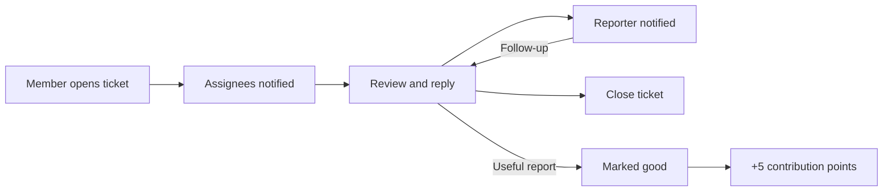

# Blog, comments and tickets

> How to read and write blog posts, comment under problems, report problem issues to their authors, follow your notifications and earn contribution points on LCOJ.
>
> ⏱ ~12 minutes · 👤 All members · 🔑 A signed-in LCOJ account (guests can only read)

## Before you start

- [ ] You are **signed in**. Guests can read blog posts and comments, but cannot comment, vote or open tickets.
- [ ] You have solved at least **5 problems**. This is required to comment and vote (staff are exempt).
- [ ] To write a blog post, you need at least **10 solved problems**.
- [ ] You know basic Markdown. Math goes in `~...~` (inline) and `$$...$$` (display).

::: info Thresholds on LCOJ
| Action | Requirement | Setting |
|---|---|---|
| Comment, vote on comments/posts | ≥ 5 solved problems | `VNOJ_INTERACT_MIN_PROBLEM_COUNT = 5` |
| Write a personal blog post | ≥ 10 solved problems | `VNOJ_BLOG_MIN_PROBLEM_COUNT = 10` |
| Comment | Contribution points ≥ −20 | `VNOJ_COMMENT_MIN_CONTRIBUTION = -20` |
| Comment length | 10 – 8196 characters | `VNOJ_COMMENT_MIN_LENGTH`, `VNOJ_COMMENT_MAX_LENGTH` |
| Tag problems from other judges | Rating ≥ 1900 or a dedicated permission | `VNOJ_TAG_PROBLEM_MIN_RATING = 1900` |

"Solved problems" counts the **public** problems you have `AC` on. Staff are not bound by the solved-count, contribution and comment-length limits.
:::

## Blog

### Reading posts

1. Open the home page at `https://luyencode.net/`. The blog box has two tabs:
   - **Newsfeed** (*Tin tức*): only posts staff marked as a **global post** (*bài đăng chung*); **sticky** (*dán*) posts stay on top.
   - **Blogs** (*Blog*): every public post, including members' personal blogs, newest first.
2. The home page remembers the tab you picked last. Further pages live at `/posts/<page number>`.
3. Click a title to open the post. Post URLs look like `/post/<id>-<slug>`.
4. To see all posts by one person, open their profile and choose the **Blogs** tab (`/user/<name>/blog/`).

The home page sidebar also shows ongoing and upcoming contests, the **Comment stream** (*Dòng bình luận*, the latest comments), new problems, the **Top contributors** table and **My open tickets** (*Báo cáo của tôi*), which lists the tickets you still have open.

### Writing a post

1. Open your profile and pick the **Create new blog post** tab (*Tạo blog mới*), or go straight to `/posts/new`.
2. Fill in the **post title** (*tiêu đề bài viết*, up to 100 characters) and the **post content** (*nội dung*) in Markdown. Use the editor's preview tab to check it before publishing.
3. Tick **public visibility** (*hiển thị công khai*). This box is **unticked by default**: if you skip it, only you (and staff who can edit all posts) can see the post.
4. Click **Create** (*Tạo*). The post is published immediately and shows up in the **Blogs** tab on the home page.

::: warning Fewer than 10 solved problems
If you have not solved 10 problems yet, the page says **You cannot create blog post. Note: You need to solve at least 10 problems to create new blog post.** (*Không thể tạo blog…*).
:::

After publishing:

- **Edit**: open the post and click **[Edit]** next to the title (`/post/<id>-<slug>/edit`). Authors can edit their own posts. Untick **public visibility** to hide the post.
- **Delete**: only users with the permission to delete posts (staff) see a **Delete** button. Regular members hide a post instead.
- **Newsfeed / pinning**: only staff with the `mark_global_post` / `pin_post` permissions see the **global post** and **sticky** boxes.

### Markdown and math

Blog posts, comments and tickets all use Markdown, with support for tables, code blocks, strikethrough and spoilers.

| To write | Syntax | Example |
|---|---|---|
| Inline math | `~...~` | `~a^2 + b^2 = c^2~` |
| Display math | `$$...$$` | `$$\sum_{i=1}^{n} i = \frac{n(n+1)}{2}$$` |
| Code block | Three backticks followed by the language name, e.g. `cpp` | Syntax-highlighted code |

::: tip Don't use `$...$`
`$a+b$` shows up as literal text. Always write inline math as `~a+b~`.
:::

In comments and tickets, raw HTML is escaped (shown as text). Blog posts allow a set of safe HTML tags.

### Voting on posts

Each post has up/down arrows and its current score.

- You need ≥ 5 solved problems to vote; guests who click see **Please log in to vote**.
- You cannot vote on your own post (**You cannot vote your own blog**).
- You get **one** vote per post; voting again returns *You cannot vote twice.* instead of changing or removing your vote.
- Votes on public posts (not organization posts) are added to the authors' **contribution points**.

### Organization blogs

Organization admins with the `edit_organization_post` permission can write posts for their organization at `/organization/<slug>/post/new`, without the 10-problem requirement. Organization posts are visible only to members of that organization and do **not** count toward contribution points. See [Organizations](/en/organize/organizations).

## Comments

### Where comments appear

| Page | Location |
|---|---|
| Problem | bottom of `/problem/<code>` |
| Editorial | bottom of `/problem/<code>/editorial` |
| Contest | on `/contest/<key>` |
| Blog post | bottom of `/post/<id>-<slug>` |
| Problem from another judge (tags) | on `/tag/<code>` |

Comments load after the page opens, 20 top-level threads per page. If you see **Comments are disabled on this page.**, comments there are locked: either staff locked them manually, or the problem/contest belongs to a running contest that uses clarifications.

### Writing and replying

1. Scroll to the **New comment** box (*Bình luận mới*) at the end of the comments.
2. Write your comment in Markdown (10 – 8196 characters) and preview it if needed.
3. Click **Post!** (*Đăng!*).
4. To reply, click the **Reply** icon (*Phản hồi*) on a comment. You can only reply to comments posted within the last **365 days** (`DMOJ_COMMENT_REPLY_TIMEFRAME`).

The **Link** icon (*Liên kết*) gives you a direct link to the comment (`#comment-<id>`).

::: tip Where to ask for help?
Ask for hints in the comments, **not** in a ticket. Tickets are only for problems with a statement, its tests or the site itself.
:::

### Votes and hidden comments

- Each comment has up/down arrows. The rules match blog voting: ≥ 5 solved problems, no voting on your own comments (**You cannot vote on your own comments.**), one vote per person.
- Each vote changes the author's **contribution points by 1** (`VNOJ_CP_COMMENT = 1`).
- Comments with a score of **−5 or lower** (`DMOJ_COMMENT_VOTE_HIDE_THRESHOLD`) are collapsed behind **This comment is hidden due to too much negative feedback.** Click **Show it anyway.** (*Nhấn để xem.*) to read it.

### Editing, deleting and reporting comments

- **Edit**: click the **Edit** icon on your own comment. Edited comments show **edited** (*chỉnh sửa*) with ← → arrows to step through earlier revisions.
- **Delete**: members **cannot delete** their comments. To take one down, edit it or ask staff.
- **Staff** also get a **Hide** button (*Ẩn*): it hides the comment and all replies under it, and the author's contribution points are recalculated (hidden comments no longer count).
- **Reporting an abusive comment**: there is no per-comment report button. Use the **Report issue** button in the navigation bar (see **Tickets** below) and paste the comment's link into the description.

::: danger Comment mute
Accounts that staff put on **comment mute** (*tắt bình luận*) cannot comment, vote, edit comments or open tickets, and see **Your part is silent, little toad.** plus the reason, if one was given.
:::

## Contribution points

Contribution points recognize how you help the community. They are calculated as follows:

| Source | Points |
|---|---|
| Each up / down vote on your comments (non-hidden comments) | +1 / −1 |
| Each up / down vote on your public posts (not organization posts) | +1 / −1 |
| Each ticket marked **good** | **+5** (`VNOJ_CP_TICKET = 5`) |
| Each time you unlock the editorial of a problem you **haven't solved** | −1 |

Where to see them:

- On your profile, the **Contribution points:** line (*Đóng góp:*).
- The contribution ranking at `/contributors/` (the **Contributors** tab next to **Leaderboard**). The **Search by handle...** box jumps to the page containing that user.
- The **Top contributors** table on the home page (top 5).

::: warning Negative points
With contribution points **below 0**, you cannot unlock editorials for problems you haven't solved. Below **−20**, you can no longer comment.
:::

## Tickets (reporting issues)

A ticket is a private channel between you and the people responsible, for reporting a wrong statement, broken tests or a site issue. Only you, the assignees and staff can see a ticket.

### Reporting a problem issue

1. Open the problem and click **Report an issue** (*Báo cáo vấn đề*) below the statement, or the **Report issue** button in the navigation bar. In a contest where comments are locked, the button below the statement reads **Request clarification** (*Gửi thắc mắc*) instead.
2. The page `/problem/<code>/tickets/new` opens. Fill in the **Ticket title** (up to 100 characters) and the **Issue description** in Markdown: which test, the expected result, and why you think the statement or test is wrong.
3. Click **Create!** (*Tạo!*). You are taken to the ticket page, `/ticket/<number>`.

The ticket is automatically **assigned** to the problem's authors and curators. If you are in a contest and the problem belongs to that contest, it goes to the **contest's** authors and curators instead.

::: danger Tickets are not for asking for help
The form says it plainly: tickets are for reporting issues with a problem, not for asking how to solve it. Ask for hints in the comments. Misusing tickets can get your account banned.
:::

### Reporting a general issue

On any page other than a problem statement, the **Report issue** button in the navigation bar opens `/tickets/new?issue_url=<current page>`. The **Link to the issue** field (*URL tới vấn đề*) is prefilled with the page you were on and is required. Add a title and description, then click **Create!**.

General tickets are not assigned to anyone in particular; staff follow them in the ticket list.

### Following up on a ticket

- See your tickets at `/tickets/`. Tick **Show my tickets only** or **Hide closed tickets** and click **Go** (*Tìm*) to filter. On a problem page, the **My tickets** link (`/problem/<code>/tickets/`) lists your tickets for that problem.
- On the ticket page, type your reply in the box at the bottom and click **Post!**. The page updates live when new messages arrive.
- As the reporter, you can **Close ticket** (*Đóng vấn đề*) once it is resolved, or **Reopen ticket** (*Mở lại vấn đề*) if the issue comes back.

### What staff and assignees see

| Who | Can see and do |
|---|---|
| Reporter | Their own tickets: reply, close/reopen |
| Assignees (authors, curators) | Tickets assigned to them; private **Assignee notes**; **Upvote** (mark good) and **Undo vote** (unmark) buttons |
| Users who can edit the problem | All tickets for the problem via **Manage tickets** on the problem page |
| Staff with `change_ticket` | Every ticket, including general ones |

Reporters **cannot mark their own ticket as good** (**You cannot vote your own ticket.**). Staff also see a **New tickets** box on the home page.

## Notifications

The bell icon in the navigation bar shows your unread notification count.

1. Click the bell to open the unread panel (up to the 10 most recent).
2. Click a notification to follow its link; it is marked as read.
3. Click **Mark all read** to mark everything as read.
4. Click **See all notifications** for the full page at `/notifications/`, with **All** / **Unread** / **Read** filters and a **Mark all as read** button.

What creates a notification:

| Event | Who receives it |
|---|---|
| New ticket on a problem/contest | Assignees |
| Someone else replies to your ticket | The reporter |
| The reporter replies to a ticket | Assignees |
| A contest posts an announcement | All official participants of the contest (not virtual ones) |

Contest announcements are sorted first, then ticket notifications. Closing or reopening a ticket does not create an inbox notification, although an open ticket page updates live.

::: info English labels
Some notification labels (**Mark all read**, **See all notifications**, **Unread**…) are not translated yet, so they appear in English in the Vietnamese interface too.
:::

## Tagging problems from other judges

The `/tags/` page is a collection of problems from **other online judges** (AtCoder, Codeforces, Codeforces Gym, Kattis, VNOJ) that the community tags with algorithm topics. These are not LCOJ problems, so you cannot submit to them here. In the list, click a problem's code or name to see its tag page; click the judge name to open the original statement.

### Finding problems

1. Open `/tags/` (**Tag problem list**, *Danh sách bài*).
2. Click a tag in the tag groups to filter by it; type a code or name into **Search problems...**; pick judges in the online judge filter.
3. Click **Go** to filter, or **Random** (*Ngẫu nhiên*) to open a random matching problem (in a new tab). **Clear search** resets all filters.
4. Each problem's page (`/tag/<code>`) lists its tags, who assigned them, and a comment section; the page title links to the original statement. Tags may be inaccurate; leave a comment or use **Report issue** if one looks wrong.

### Who can add problems and tags

You can tag problems when **both** of these hold:

- Your profile has **Allow tagging** (*Cho phép tag bài*) enabled. It is on by default; staff can turn it off per user.
- You have the `add_tagproblem` permission, **or** a rating of **1900** or more.

Otherwise the page says **Cannot tag – You are not allowed to tag problem.**

How to do it:

1. On `/tags/`, pick the **Create new tag problem** tab (*Thêm tag cho bài*, `/tags/create`), paste the problem URL from the original judge, e.g. `https://codeforces.com/problemset/problem/4/A`, and click **Create**. Fetching data from the original judge can take a few minutes.
2. If the problem already exists, you are redirected to its page.
3. On the problem's page, click **Assign new tag** (*Thêm tag mới*), choose tags and click **Assign** (*Thêm*).

## FAQ

| Question / Symptom | Answer |
|---|---|
| No comment box, only "You need to have solved at least 5 problems before your voice can be heard." | Solve enough public problems (`AC`) to reach 5, then reload. |
| Voting says "You must solve at least 5 problems before you can vote." | Same as above: you need 5 solved problems. |
| My post is published but others can't see it | You didn't tick **public visibility**. Open **[Edit]**, tick it and click **Update**. |
| My post isn't in the **Newsfeed** tab | That tab only shows posts staff marked as **global post**. Personal posts appear under **Blogs**. |
| There's no **Reply** icon on a comment | The comment is older than 365 days, or comments on that page are locked. |
| I voted by mistake and want to change it | Votes cannot be changed or removed from the interface. |
| How do I report an abusive comment? | Use **Report issue** in the navigation bar and paste the comment's link (from the **Link** icon) into the description. |

## Next steps

- [Account and profile](/en/learn/account): edit your profile and view your stats.
- [Organizations](/en/organize/organizations): join an organization and write internal posts.
- [FAQ](/en/start/faq): quick answers to other common questions.
