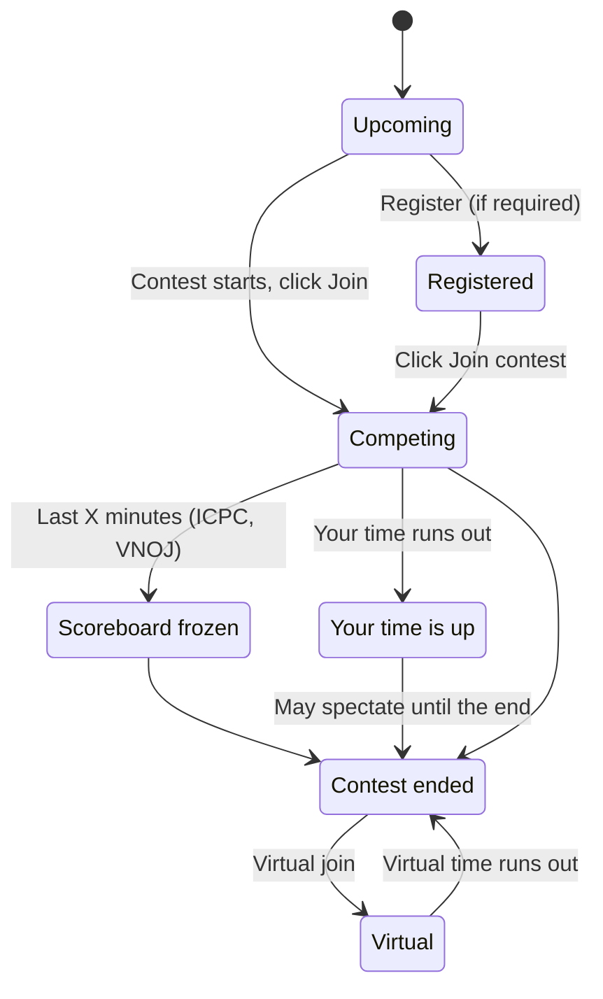

# Taking part in contests

> How to find contests on LCOJ, register and join, submit during a contest, read the rankings, compete virtually after a contest ends, and how ratings get updated.
>
> ⏱ ~15 min · 👤 Students, contestants · 🔑 A signed-in LCOJ account (guests can only browse the list and public rankings)

## Before you start

- [ ] You are **signed in** (see [Account and sign-in](/en/learn/account)). Guests see a **Log in to participate** button instead of the join button.
- [ ] You are comfortable [submitting and reading judging results](/en/learn/submissions).
- [ ] Check your **time zone** under **Edit profile**. Every start and end time on the site is shown in that time zone.
- [ ] For an organization's contest (a class, school, or club): you are already a member of that organization.

## The participation lifecycle

## Finding contests

Open the contests entry in the navigation bar, or go straight to `https://luyencode.net/contests/`. The **Contests** page is split into sections:

| Section | Contents |
|---|---|
| **Active contests** | Contests you have joined that still have time left, with a **Window ends in ...** or **Ends in ...** countdown |
| **Ongoing contests** | Contests that have started but not ended. They have a **Join** button, or **Register** if registration is required |
| **Upcoming contests** | Contests that haven't started, with **Starting in ...** and a **Register** button where applicable |
| **Past contests** | Contests that have ended, 20 per page, with a **Search contest...** box (matches key or name) and a **Virtual join** button |

Each contest shows its name, schedule, length, and labels such as **private** (visible to specific people only), **rated** (affects ratings), or the organization name. The **Users** column counts participants; the number in parentheses counts virtual participations.

Other tools on the page:

- The **Hide private contests** checkbox hides organization-only contests. The choice is remembered for your session.
- The **Calendar** tab shows contests by month (`/contests/<year>/<month>/`). Its **Export** link downloads a `contests.ics` calendar file you can add to Google Calendar or any other calendar app.
- Click a **tag** next to a contest name to see every contest with that tag (`/contests/tag/<tag name>`).

## The contest page

Each contest has its own page at `https://luyencode.net/contest/<contest key>`, with these tabs:

| Tab | Contents |
|---|---|
| **Info** | Description, schedule, countdown, problem list, **Announcements**, and **Clarifications** |
| **Rankings** | The scoreboard. If it's hidden from you, the tab becomes **Hidden Rankings** and can't be clicked |
| **Official Rankings** | Only present when the organizers imported an official ranking from elsewhere |
| **Submissions** | Submissions made in the contest |

The participation button sits at the end of the tab row and changes with the situation: **Join contest**, **Register**, **Leave contest**, **Spectate contest**, **Stop spectating**, or **Virtual join**.

If the organizers enabled the settings summary, the **Info** tab also tells you whether the contest is rated, uses partial scoring, uses pretests, limits submissions, which format it uses, whether the scoreboard is hidden, and whether an access code is needed. Read it before you join.

::: info The problem list only appears once you're competing
The **Problems** section on the **Info** tab only appears after you **join the contest**, or once the contest **has ended**. Before that you only see the description and schedule.
:::

## Who can join

| Contest type | Who can see and join | What you see if you can't |
|---|---|---|
| **Open** | Any signed-in user | |
| **Registration required** | People who register during the registration period. If registration is still open after the contest starts, you can join directly | Registration over and you didn't register: the list shows *Registration closed*, and joining says **Not registered** |
| **Access code** | People who enter the code given out by the organizers | The page asks **Please enter your access code:**; a wrong code shows **Wrong access code.** |
| **Terms** | People who tick **I agree to the terms and conditions** | You can't join without ticking it |
| **Organization only** | Members of the specified organization | An access-denied page naming the organization that may enter |
| **Specific users only** | People on the contestant list | **This contest is private to specific users.** |
| **Hidden** | Organizers and testers only | **No such contest** |

The access code and terms are asked **every time** you join or register, including virtual joins. Users the organizers have banned from a contest (for example for cheating) get **Banned from joining**.

## Registering and joining

### Registering in advance (if required)

1. Wait for registration to open. Until then, the list shows **Registration opens in ...**.
2. Click **Register** in the list or on the contest page, and confirm the dialog. Enter the access code or accept the terms if asked.
3. The list switches to *Already registered*. Registering does **not** start your timer.

### Joining

1. Once the contest has started, open the contest page and click **Join contest** (or **Join** in the list). If registration has closed, the list only says *Already registered* with no button, so go straight to the contest page.
2. A dialog warns: *Joining a contest for the first time starts your timer, after which it becomes unstoppable.* Click **OK**.
3. Enter the access code or accept the terms if asked, then click **Join Contest**.
4. A contest bar appears right below the navigation bar on every page: the contest name, your remaining time, and a **Go to Rankings** link.

::: warning One contest at a time
Joining another contest (including a virtual join or spectating) automatically **leaves** your current one. The confirmation dialog tells you so before you agree.
:::

## Time windows

LCOJ contests come in two timing styles:

| Style | The contest page says | Your time |
|---|---|---|
| **Fixed schedule** | *&lt;length&gt; long starting on &lt;start time&gt;* | Everyone competes at the same time, from the contest's start to its end. Join late and you lose the time that has passed |
| **Personal window** | *&lt;duration&gt; window between &lt;open time&gt; and &lt;close time&gt;* | **Your own** timer starts when you first join, and stops when the duration runs out **or** the contest closes, whichever comes first |

::: danger Window contests: don't join too late
If a contest gives you 3 hours but you join with only 1 hour left before it closes, you get 1 hour. The timer also **keeps running** when you leave the contest or close your browser.
:::

The status line on the **Info** tab tells you where you stand: **You have ... remaining.**, **Your time is up! Contest ends in ...**, **Contest is over.**, or **Participating virtually, ... remaining.**

## Submitting during a contest

Submitting works exactly like practice (see [Submitting and judging](/en/learn/submissions)). The differences:

- **Only submissions made while you are in the contest count.** After you click **Leave contest**, new submissions don't reach the scoreboard. Make sure the contest bar is showing at the top of the page.
- **Submission limits**: some problems allow at most N submissions. The remaining count appears under the submit button. Going over shows **Too many submissions**. Submissions that end in an internal error (`IE`) don't count.
- **Pretests**: if the contest uses pretests, submissions are judged on a small subset of tests during the contest. After the contest, the organizers rejudge everything on the full test data, so your final score can be lower.
- **Other people's submissions**: during the contest, the **Submissions** tab usually shows only your own. After the contest ends (and the scoreboard is no longer frozen), you can see everyone's.
- **Scoring and penalties** (partial points, penalty time, wrong attempts, and so on) depend on the contest format. See [Contest formats](/en/organize/contest-formats).

### Questions and announcements during a contest

- **Request clarification**: during a contest, the **Report an issue** button on a problem page becomes **Request clarification**. Your question goes straight to the contest organizers as a ticket.
- **Clarifications**: answers meant for everyone appear under **Clarifications** on the contest page and on the related problem page.
- **Announcements**: organizers post them under **Announcements** on the **Info** tab. If push announcements are enabled, contestants and spectators also get a pop-up notification on the page.
- **Comments** on the contest and problem pages are usually locked during the contest, so contestants can't discuss solutions.

## Leaving and rejoining

- Click **Leave contest** to go back to normal practice mode. The contest bar disappears.
- To come back, open the contest page and click **Join contest**. You resume the same participation, and **the clock keeps counting** from your first join.
- When your time runs out, the site takes you out of the contest automatically. If the contest is still running, the button becomes **Spectate contest**.

## Rankings

Open the **Rankings** tab, or click **Go to Rankings** in the contest bar. Each row shows the rank, username (colored by rating), total score (plus penalty time, depending on the format), and per-problem results.

Options above the table:

| Option | Effect |
|---|---|
| **Show full name/organization** | Shows full names and organizations next to usernames |
| **Filter** | Shows only contestants from the selected organizations |
| **Show virtual participations** | Includes virtual participations, ranked together with official contestants |
| **Show ghost participations** | Only on some contests. See **Replaying a contest** below |
| **Download as CSV** | Downloads the table as CSV (not available for the ICPC format) |

For the ICPC format, the table has a **Cell colours** legend: **Solved first**, **Solved**, **Tried, incorrect**, **Tried, pending**, **Untried**. Disqualified contestants always sit at the bottom.

### Hidden and frozen scoreboards

| Situation | What you see |
|---|---|
| Hidden **for the duration of the contest** | During the contest you only see your own row, with rank `???`. The full table appears when the contest ends |
| Hidden **for the duration of participation** | Same, but the full table appears as soon as your own time is up |
| **Always hidden** | Only organizers can see the full table |
| **Frozen** (ICPC and VNOJ only) | On the scoreboard, submissions from the last X minutes show as **pending**. The page says *The scoreboard was frozen with X minutes remaining...*. The scoreboard **stays frozen after the contest ends** until the organizers release the results |
| **Cached** | The page warns that the scoreboard is cached for N seconds, so a fresh submission may take a moment to appear |

Organizers can also share a public ranking link of the form `/contest/<contest key>/public_ranking/?code=<code>`, which works even when the scoreboard is hidden.

### Official rankings

For contests held elsewhere (for example graded on a separate system and then brought onto LCOJ), organizers can import the official results. An **Official Rankings** tab then appears, showing only the total and per-problem scores from the imported data.

### Replaying a contest

After a **public** contest ends, if its scoreboard is visible and not frozen and its format isn't IOI, a replay bar appears above the rankings:

- Drag the slider to see the scoreboard **at any moment** of the contest. The label next to it shows the time you're viewing and the total length.
- Click **End** to jump back to the final standings.
- ICPC and VNOJ contests also get a **Freeze min** box to preview what the table would look like with the last N minutes frozen.
- Replay is disabled while **Show virtual participations** is on.

Some contests also have **ghost participations**: results from contestants of another contest with the same problem set, merged in by an administrator for comparison. Tick **Show ghost participations** to display them. Ghosts have their own icon and no profile link.

## Spectating

**Spectating** lets you follow a running contest without competing. The contest bar says **spectating**, and the **Info** tab says **Spectating, contest ends in ...**. Spectators don't appear on the scoreboard.

You get a **Spectate contest** button in two cases:

- You are an author, curator, or tester of the contest. These people can only spectate, never compete officially.
- Your own time is up, but the contest is still running.

Click **Stop spectating** to exit.

## Virtual participation after a contest

**Virtual join** lets you retake a finished contest as if it were live: same problems, with a countdown.

1. Find the contest under **Past contests** and click **Virtual join** (or the button of the same name on the contest page).
2. Your timer starts immediately. Its length equals the contest's personal window, or the whole contest length for fixed-schedule contests.
3. Submit as usual. The **Info** tab says **Participating virtually, ... remaining.**
4. When time runs out, or when you click **Leave contest**, you're done.

Good to know:

- You can take a contest virtually **as many times** as you like. Each attempt is a new virtual participation that starts from scratch.
- Virtual participations are **never rated** and are hidden from the scoreboard by default. Viewers must tick **Show virtual participations** to see them.
- In replayable contests, the scoreboard during your virtual run places **you next to the real contestants at the same point in the contest**, refreshing every 30 seconds. The **Live** button brings the table back to your current moment.
- Some contests turn this feature off. In that case there is no **Virtual join** button, or the page says **Virtual joining is not allowed for this contest.**

## Ratings

Contests labeled **rated** change contestants' **rating**. The **Info** tab states who gets rated, for example only people who submit at least once, or only people within a certain rating range.

- Only **official** participations count. Virtual runs and spectating never affect ratings.
- Ratings **don't update the moment a contest ends**. Someone with rating permissions runs the rating calculation, usually after rejudging and finalizing results.
- Once calculated, your new rating shows on your profile (**Rating:**, **Rating history**) and on the user leaderboard, and your name changes color to match your rating tier.

## FAQ

| Situation | Explanation and fix |
|---|---|
| A contest is missing from the list | It may be hidden, organization-only, or limited to specific users. Make sure you joined the right organization, and untick **Hide private contests** |
| Joining says **Not registered** | The contest requires registration and the registration period is over. Contact the organizers |
| Joining says **Contest not ongoing** | The contest hasn't started. Wait, or **Register** first if there's a button |
| No problem list | You haven't joined yet. Click **Join contest** |
| Your submission isn't on the scoreboard | Check that you were **in** the contest when you submitted. If the scoreboard is cached or frozen, wait |
| Your rank shows `???` | The scoreboard is hidden from contestants. Results appear when the contest, or your time, ends |
| The **Hidden Rankings** tab can't be clicked | The scoreboard is hidden and you haven't taken part in this contest |
| The clock kept running after you left | By design: time counts from your first join and never pauses |
| Your score dropped after the contest | The contest used pretests, or the organizers rejudged. Check your submission against the full test data |
| The contest ended but your rating hasn't changed | Ratings are calculated manually after the contest. Wait for the organizers to publish them |
| You want to practice an old contest | Use **Virtual join**, or open individual problems if they have been made public |

## Next steps

- [Contest formats](/en/organize/contest-formats): how each format scores, penalizes, and ranks.
- [Submitting and judging](/en/learn/submissions): judging results, pretests, and submission limits.
- [Your first contest](/en/tutorials/first-contest): when you want to create a contest yourself.
