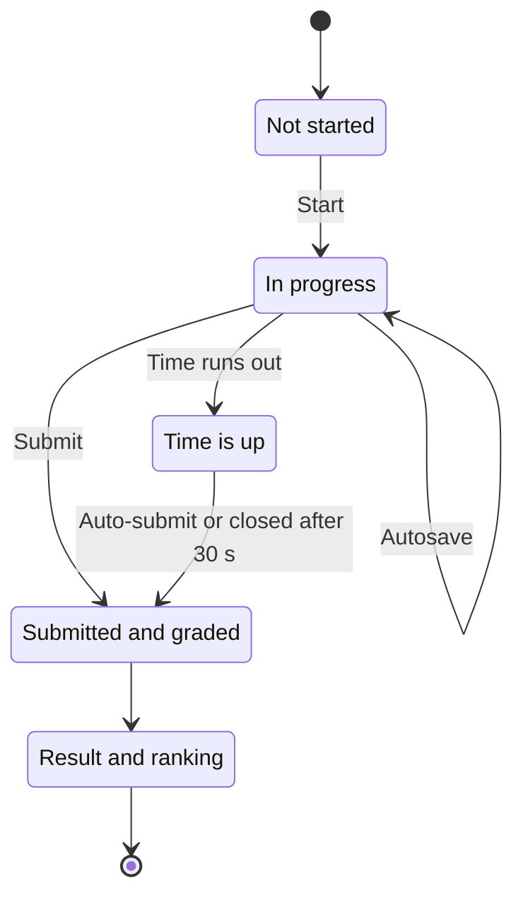

# Taking a quiz

> How to find a quiz on LCOJ, take it, submit it, and read your result and the ranking.
>
> ⏱ ~10 min · 👤 Students and learners · 🔑 A signed-in LCOJ account

## Before you start

- [ ] You are **signed in**. Guests can browse the quiz list and quiz pages, but must sign in to start an attempt.
- [ ] You use an up-to-date desktop browser (Chrome, Edge, Firefox…) on a stable connection. Answers are saved to the server as you pick them.
- [ ] If the quiz is private to an **organization** (class, school, club), you are a member of that organization.
- [ ] You have enough time. On timed quizzes the clock starts when you press start and **does not pause**, even if you close the tab.

## Attempt lifecycle

Each time you press start you create an **attempt**. It is graded automatically the moment it is submitted, and your best score is used for the ranking.

## Find a quiz

1. Click **Quizzes** in the top menu (on luyencode.net the menu item is labelled **Trắc nghiệm**), or open `https://luyencode.net/quizzes/` directly.
2. Pick a status tab: **All**, **Upcoming**, **Ongoing** or **Past**. A tab only appears when it has quizzes in it.
3. To search by name or code, type in **Search quizzes...** and click **Go** (or press Enter).
4. Tick **Hide attempted** to hide quizzes you have already submitted at least once.
5. Click a quiz code or name to open its page.

The list has these columns:

| Column | Meaning |
|---|---|
| **Code** | The quiz code, also part of the URL: `/quizzes/<code>` |
| **Quiz** | Quiz name, open/close times (or **Always open**) and a countdown |
| **Questions** | Number of questions |
| **Participants** | Number of people with at least one submitted attempt |
| **Your best** | Your best score, or `—` if you have not submitted yet |

::: tip
The list shows 50 quizzes per page. You only see quizzes you are allowed to open. Organization-private quizzes for organizations you have not joined are hidden.
:::

## Read the quiz page

The page at `/quizzes/<code>` shows:

| Item | Meaning |
|---|---|
| **Questions** | Number of questions |
| **Points** | Maximum total score |
| **Time limit** | **Minutes** per attempt. `∞` means unlimited |
| **Max attempts** | How many attempts you may submit. `∞` means unlimited |
| **Start:** / **End:** | The window in which the quiz is open. **Not set — opens immediately** and **Not set — never closes** mean no limit on that side |
| Banner | **Starting in …** (not open yet), **Ends in …** (open), or a notice that the quiz has closed |
| **Your attempts** | Your previous attempts with their score, or **in progress** |

The action bar changes with the situation:

| You see | Meaning |
|---|---|
| **Start quiz** (with "N attempt(s) remaining") | You can start a new attempt |
| **Resume attempt** | You have an unfinished attempt. Click to return to it |
| **Quiz not started yet.** | The quiz has not opened yet |
| **Quiz is closed.** | The end time has passed |
| **No attempts remaining.** | You have used all your attempts |

::: info
The quiz page does **not** tell you in advance how results are shown (score only, correctness, or full answers). You find out after your first submission. See [Read your result](#read-your-result).
:::

## Start an attempt

1. On the quiz page, click **Start quiz**.
2. If integrity monitoring is on, the **Academic Integrity Notice** dialog appears. Read the rules and click **I understand, start →**. Click **Cancel** if you are not ready; no attempt is created yet.
3. The quiz page opens. On a timed quiz the countdown is already running.

::: warning The clock never stops
Time counts from the moment you start. Closing the tab, shutting down the computer or losing the connection does **not** pause it.
:::

Questions and answer choices may be shuffled, depending on the teacher's settings. The order is fixed for your attempt, so reloading the page keeps it.

## Integrity monitoring

When the teacher enables **integrity monitoring**, the quiz page:

- Overlays a **watermark** repeating your username and the attempt start time.
- **Blocks copying** and **disables right-click**.
- Shows a short message for about 4 seconds whenever it records an event (for example `⚠ Tab switch detected. This has been recorded.`).

Recorded events:

| Event (as the teacher sees it) | Recorded when |
|---|---|
| **Tab switch** | The quiz tab becomes hidden: switching tabs, minimizing the browser |
| **Window blur** | The browser window loses focus: clicking another app, Alt+Tab |
| **DevTools opened** | The page viewport is more than 160 px smaller than the window (a sign of open DevTools) |
| **PrintScreen key** | Pressing the PrintScreen key |
| **Copy attempt** | Trying to copy (Ctrl+C…) |

The teacher sees the **event type** and **time**. Nothing is screenshotted, and nothing you do outside the tab is recorded.

::: tip Events do not change your score
As the dialog says, these events do **not** affect your score. They are information for the teacher to review.
:::

::: details Why was "DevTools opened" recorded when I never opened DevTools?
Detection compares the window size with the page viewport. An open browser side panel, some extensions or an unusual zoom level can create the same gap. Close side panels before starting. Each event type is recorded at most once every 5 seconds.
:::

## Answer each question type

Use **Previous** / **Next** to move between questions, or click a question number in the **Questions** box in the sidebar. Answered questions are highlighted on that map, and the progress bar at the top shows how far you are.

| Type (UI name) | How to answer | Grading |
|---|---|---|
| **Multiple Choice** | Pick one radio button | The right choice earns full points; anything else earns 0 |
| **Multiple Answer** | Tick one or more checkboxes | Depends on the teacher's strategy: either all-or-nothing or partial credit |
| **True/False** | Pick **True** or **False** | Full points or 0 |
| **Short Answer** | Type in **Type your answer...** | Full points if it matches an accepted answer, otherwise 0 |

Keyboard shortcuts (when you are not typing in a short-answer box):

| Key | Action |
|---|---|
| <kbd>←</kbd> / <kbd>→</kbd> | Previous / next question |
| <kbd>1</kbd>–<kbd>9</kbd> | Select (or toggle, for multiple-answer questions) choice N |

### How are short answers matched?

- Spaces **at the start and end** of your answer are ignored. Spaces **in the middle** count.
- Your **whole** answer must match one of the teacher's accepted answers; containing it is not enough. For example, an accepted `42` does not accept `x = 42`.
- Whether **upper/lower case** matters is decided by the teacher for each question. Type exactly what the question asks for.
- An empty box counts as unanswered and scores 0.

::: tip
If the question says nothing about format, keep your answer minimal: just the number or keyword, with no units or punctuation.
:::

## Autosave

- **Multiple choice, multiple answer and true/false** answers are saved as soon as you click.
- **Short answers** are saved about 0.8 seconds after you stop typing.
- If a save fails (connection lost), the sidebar shows `Save failed — retrying…` and the browser retries every 3 seconds. Do not close the tab while you see this.
- Clearing all choices of a question is saved too, and the question becomes unanswered again.

Because answers live on the server, you can reload the page or reopen it on another device without losing work: click **Resume attempt** on the quiz page.

## Time limits, time-outs and closed tabs

| Situation | What happens |
|---|---|
| The quiz has a time limit | The **Time** box turns amber under 5 minutes and red under 1 minute. At 0 the browser **submits automatically** |
| Your connection is slow right at the deadline | The server still accepts answers that arrive within **30 seconds** after the deadline |
| You close the tab with time left | The attempt keeps running. Reopen the quiz page and click **Resume attempt** |
| You close the tab and time runs out | After the deadline + 30 seconds the attempt is **closed**: the answers you saved are still graded. Closing happens when you next open the quiz page |
| The quiz has both an end time and a time limit | You get your full time limit, **even if** the end time passes meanwhile |
| The quiz has an end time but no time limit | The attempt closes exactly at the end time, with no 30-second grace and no automatic submit in the browser |
| No time limit and no end time | The attempt stays open until you submit it |

::: warning
An abandoned attempt is only closed when you come back to the quiz page. Until then it has no score and is not on the ranking. If you closed the tab by accident, reopen the quiz page as soon as you can.
:::

## Submit

1. On the last question click **Review & Submit**, or click **Submit quiz** in the sidebar at any time.
2. The browser asks **Submit the quiz now?**. If some questions are blank, it first says "You have N unanswered question(s)." Confirm to submit, or cancel to keep working.
3. The attempt is graded immediately and you are taken to the result page.

::: danger
A submitted attempt cannot be changed. To improve your score, start a new attempt (if you have any left).
:::

## Read your result

The result page (`/quizzes/<code>/attempt/<attempt id>/result`) always shows **Score: X / Y**. The rest depends on the mode the teacher chose:

| Mode | What you see |
|---|---|
| **Score only** | Total score, each question and **Your answer**. No right/wrong marks, no answer key |
| **Show correctness** (no answer key) | Adds green/red colouring and per-question points (for example `(0.5 / 1)`), but no correct answers |
| **Show correct answers and explanations** | Every choice: ✓ marks correct choices, ✗ marks wrong choices you picked, a **Your answer** tag, a **Missed** tag on correct choices you did not pick, a **Why?** toggle with per-choice explanations, the **Correct answer** (or **Accepted patterns**) for true/false and short-answer questions, and the question's overall explanation |

Blank questions show **(no answer)**.

You can always review old attempts: on the quiz page, in **Your attempts**, click **view**.

## Ranking

Click **Ranking** on the quiz page or the result page (`/quizzes/<code>/ranking`). The rules:

1. Each person has **one row**: their best attempt.
2. **Higher** score ranks first.
3. On equal scores, the **faster** attempt (time from start to submission) ranks first.
4. If still tied, the **earlier submission** ranks first.

Only **submitted** attempts count. Your own row is highlighted in yellow. The **Time** column is the duration of the attempt used for ranking.

## Attempt limits

- **Max attempts** counts **submitted** attempts only. An unfinished attempt does not use up a new one.
- You can have only **one** unfinished attempt at a time. Pressing start while one exists takes you back to it.
- When you run out, the start button disappears and you see **No attempts remaining.**

## Organization-private quizzes

Some quizzes are only for members of one or more organizations. If you are not a member, the quiz is missing from the list and opening its link directly shows **404**. Join the organization (see **Organizations** on LCOJ) or ask your teacher.

## Verify

After submitting, check that:

- [ ] The quiz page has a new row under **Your attempts** with a score (no longer **in progress**).
- [ ] The **Your best** column on `/quizzes/` shows your best score.
- [ ] Your name is on the **Ranking**.

## FAQ

| Situation | What to do |
|---|---|
| You see `Save failed — retrying…` | Your connection is unstable. Keep the tab open; the browser retries every 3 seconds. Answers saved earlier are safe |
| You closed the tab or the computer shut down | Reopen the quiz page. With time left, click **Resume attempt**. With time up, the attempt is closed with your saved answers |
| Time ran out while answering | The quiz submits itself. All saved answers (including those arriving within the 30-second grace) are graded |
| No correct answers after submitting | The teacher chose **Score only** or **Show correctness**. This is a setting, not a bug |
| No start button | Check that you are signed in, the quiz has opened (**Quiz not started yet.**), it has not closed (**Quiz is closed.**), and you have attempts left |
| The quiz link shows 404 | The quiz is hidden, or private to an organization you are not in |
| The ranking does not show my latest score | The ranking uses your **best** attempt, not your latest |
| A correct short answer was marked wrong | Check case, spaces in the middle and extra units. If you are still sure, tell the teacher: they can fix the answer key and regrade |
| An event was recorded unfairly | Events do not change your score. Explain to the teacher if needed |
| The end time has passed. Can I keep going? | Only if you already have an unfinished attempt **and** the quiz has a time limit that your attempt has not used up. You cannot start a new attempt after the end time |

## Next steps

- [Creating and managing quizzes](/en/setter/quiz-authoring): for teachers who want to write their own quizzes.
- [Permission system](/en/admin/permissions): how permissions work on LCOJ.
