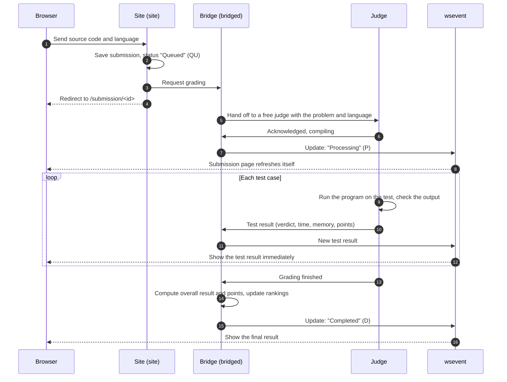

# Submitting and judging

> How to submit a solution to a programming problem on LCOJ, what happens after you click submit, how to read the results page, and the most common mistakes.
>
> ⏱ ~10 minutes · 👤 Students and practice users · 🔑 A signed-in LCOJ account

## Before you start

- [ ] You are **signed in**. Guests can read problems, but you must sign in to submit. On luyencode.net, you sign in with a Google account.
- [ ] You tested your solution locally on the problem's **sample tests**.
- [ ] You know where input comes from. By default, programs **read from standard input (stdin) and write to standard output (stdout)**, unless the statement explicitly asks for file I/O.

## Submitting

1. Open the problem page, for example `https://luyencode.net/problem/aplusb`.
2. Pick one of two options:
   - Click the **Submit solution** button in the right-hand info column to open the dedicated submit page (`/problem/<problem code>/submit`).
   - Or scroll to the bottom of the problem page and open the **Submit Solution** tab to submit in place.
3. Choose a **language** from the dropdown. It only lists languages the problem allows and that an online judge supports. The dropdown also shows compiler versions.
4. Put your source code in the editor. You can paste it, pick a file on the **Paste your source code here or load it from a file:** line, or drag a file onto the editor. The file's contents load into the editor so you can review them before submitting.
5. Click **Submit!**. Your browser goes to the submission page `/submission/<id>`, where you follow the results.

::: info File-only languages
Some special languages, such as **Scratch** (an `.sb3` file) or **Output Only** (a `.zip` file), have no editor. The submit page shows **You can only submit file for this language.** with a box to pick or drop a file. The file must have the right extension and stay under the language's size limit.
:::

### Submission limits

| Limit | Details |
|---|---|
| Source length | Up to 65536 characters |
| Pending submissions | By default, each user can have at most **2** submissions queued or grading at once. Submitting more shows **You submitted too many submissions.** Wait for earlier ones to finish, then submit again |
| Contest attempts | Some contests limit how many times you can submit each problem. The remaining count appears right under the submit button |
| Languages | You can only use languages the problem allows. If no judge can grade the problem, the page shows **No judge is available for this problem.** |

## What happens after you submit



In short (the terms *judge*, *bridge* and *verdict* are explained in the [Glossary](/en/start/glossary)):

1. The **site** saves your submission as **Queued** and sends a grading request to the **bridge**.
2. The **bridge** picks a free **judge** that has the problem's data and supports your language. If every judge is busy, the submission waits in the queue.
3. The **judge** compiles your code. If compilation fails, the submission stops at **Compile Error (CE)**.
4. The judge runs each test in a sandbox, measures time and memory, and sends back the result of **each test**.
5. The bridge writes the results to the database and notifies **wsevent**. The submission page open in your browser receives the update over a WebSocket and refreshes itself, so **you don't need to reload**.

## Reading the submission page

The `/submission/<id>` page changes as grading progresses:

| You see | Meaning |
|---|---|
| **We are waiting for a suitable judge to process your submission...** | In the queue (`QU`) |
| **Your submission is being processed...** | The judge is compiling (`P`) |
| **Compilation Error** with a message | Compile error (`CE`). Read the message to fix it |
| **Compilation Warnings** | Compiled with warnings. Grading continues |
| **Execution Results** and a list of tests | Grading in progress or finished |

### Per-test results

Each test gets one line, for example:

```
Test case #1:  Accepted               [0.012s, 3.21 MB]   (10/10)
Test case #2:  Wrong Answer           [0.015s, 3.21 MB]   (0/10)
Test case #3:  Time Limit Exceeded    [>1.000s, 3.30 MB]  (0/10)
```

| Part | Meaning |
|---|---|
| `Test case #N` | Test number. On batched problems, tests are grouped under **Batch #N**, and a batch only scores when **every** test in it passes |
| Result | The verdict name (short codes like `AC`, `WA`, `TLE`), sometimes with short feedback in parentheses. See [Status codes](/en/reference/status-codes) for every verdict |
| `[0.012s, 3.21 MB]` | Run time and memory used. For `TLE`, the time shows as `>` the limit |
| `(10/10)` | Points earned / maximum points for the test |

Above the list is a row of summary icons: a ✓ for passed tests, an ✗ for failed ones (click to jump to that test), and `–` for skipped tests.

Test rows with an arrow at the start have extra details; click to expand them. Outside contests, the first few tests may include **Judge feedback** (for example, a checker explaining what went wrong). If the problem lets you view its test data, you also see the input, the expected answer, and **Your output (clipped)**.

::: info Setters can hide some results
Depending on the problem's settings, the submission page may show results **per test**, only **per batch**, or only the **overall result**. During a running contest, detailed feedback is usually hidden.
:::

### Summary

When grading finishes, the bottom of the page shows:

- **Resources:** the longest run time and the largest memory usage across tests.
- **Final score:** the total test points, plus the problem points, for example `20/30 (6.667/10 points)`.

::: tip Partial scoring
- On problems **with partial scoring**, your score is proportional to the test points you earned. Failing a few tests still gets you points.
- On problems **without partial scoring**, you only score when you pass **every** test. Failing one test means 0 points for the problem.
:::

### Pretests in contests

Some contests only grade against **pretests** (a small subset of the tests) during the contest. The submission page then says **Pretest Execution Results**, tests show as `Pretest #N`, and the score is labeled **Final pretest score:**. Passing all pretests **does not guarantee** a full score when the full test set is run after the contest.

## Actions on the submission page

| Button / link | What it does |
|---|---|
| **View source** | See the code you submitted |
| **Resubmit** | Opens the submit page prefilled with this submission's code and language, so you can edit and submit again. Only on your own submissions |
| **Abort** | A button under the test list, shown only while grading is unfinished (shortcut: Ctrl+Enter). The submission becomes **Aborted** (`AB`) with 0 points |

On the problem page, the right-hand column has **My submissions**, **All submissions** (everyone's), and **Best submissions** links.

### Viewing other people's solutions

You can always view your own code. For other people's submissions, LCOJ's default is: **visible only after you solve the problem** (an `AC` with full points). Problem setters can change this per problem, letting everyone see solutions or nobody.

Submitting many times doesn't cost you points in practice: only your best score on each problem counts. In contests, scoring and penalties depend on the [contest format](/en/organize/contest-formats).

## Troubleshooting

| Symptom | Common cause | Fix |
|---|---|---|
| `WA` although it works locally | Printing extra text like `Enter n:` or `The answer is:` | Print **exactly** what the statement asks for. The default checker ignores extra spaces, but not extra text |
| `WA` on large tests, small tests pass | Integer overflow (`int` only holds up to about 2·10⁹) | Use `long long` in C/C++ or `long` in Java when the result or an intermediate product can get large |
| `WA`, `IR`, or `RTE` on the first test | Reading/writing files when the problem uses stdin/stdout (or vice versa) | Follow the statement. Remove `freopen(...)` unless the problem asks for files |
| `TLE` | The algorithm is too slow for the input limits | Estimate complexity: roughly 10⁸ simple operations per second |
| `TLE` with large input or output | Slow I/O: unsynced `cin`/`cout`, frequent `endl`, `input()` in Python | C++: `ios::sync_with_stdio(false); cin.tie(nullptr);` and use `'\n'` instead of `endl`. Python: `sys.stdin.readline`, or try `PyPy 3` |
| `TLE` with a correct algorithm | An infinite loop, or the program waiting for input that never comes | Check loop exit conditions and read exactly as much input as the problem provides |
| `RTE` (`segmentation fault`) | Out-of-bounds array access, recursion too deep | Size arrays according to the limits in the statement |
| `CE` in Java | The main class isn't declared `public class`, or there's a `package` line | Declare the main class as `public class` and remove the `package` line |
| `CE` although the code is fine | Wrong language or version selected (e.g. C++ code submitted as C) | Click **Resubmit**, pick the right language, and submit |

For every verdict in detail, see [Status codes](/en/reference/status-codes). For the language list, see [Supported languages](/en/reference/languages).

## Next steps

- [Taking part in contests](/en/learn/contests): submitting during a contest, reading the ranking and virtual participation.
- [Taking part in contests](/en/learn/contests): submitting, pretests and the scoreboard during a contest.
- [FAQ](/en/start/faq): quick answers to other common questions.
