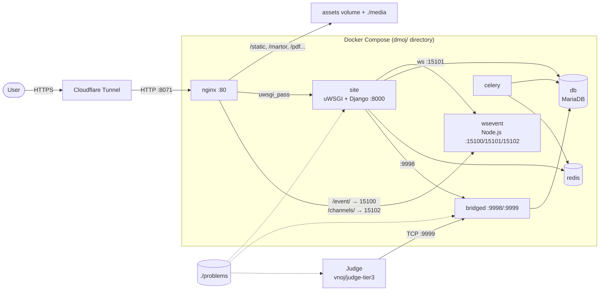

# Architecture

This page is for operators who want to understand how LCOJ runs before installing, debugging, or scaling it. Everything here comes from the [lcoj-docker](https://github.com/luyencode/lcoj-docker) repository: `dmoj/docker-compose.yml`, the `Dockerfile`s in `dmoj/*/`, `dmoj/nginx/conf.d/nginx.conf`, and `dmoj/config/`.

LCOJ is based on [DMOJ](https://github.com/DMOJ/online-judge) and [VNOJ](https://github.com/VNOI-Admin/OJ). The whole website runs under Docker Compose; the judges run separately and connect to the system on port 9999.

## Request flow overview



A request in short:

1. A user opens `https://luyencode.net`. HTTPS terminates at **Cloudflare Tunnel**, which forwards plain HTTP to the nginx port on the host (default `8071`).
2. **nginx** serves static files (`/static`, icons, `robots.txt`, ...) and media files (`/martor`, `/pdf`, `/submission_file`, ...) directly. Everything else goes to **site** over the uwsgi protocol (`site:8000`).
3. `/event/` (WebSocket) and `/channels/` (long polling) are proxied to **wsevent**, which pushes live updates for submissions and scoreboards.
4. When someone submits, **site** sends the grading request to **bridged** (port 9998). bridged picks an idle judge (judges connect on port 9999), receives the results, and writes them to **db**.
5. Heavy or background work (mass rejudges, data exports, ...) is queued in Redis and processed by **celery**.

::: warning HTTPS lives at Cloudflare, not nginx
In production, nginx only serves HTTP (`listen 80`) internally. Certificates and HTTPS are handled by Cloudflare Tunnel. The tunnel (`cloudflared`) is not part of `docker-compose.yml`; it runs separately on the host and points at the published nginx port.
:::

## Services

| Service | Container | Image / build | Command | Role |
|---|---|---|---|---|
| `nginx` | `lcoj_nginx` | `nginx:alpine` | image default | Reverse proxy, serves static and media |
| `site` | `lcoj_site` | `lcoj/lcoj-site` (`site/Dockerfile`) | `uwsgi --ini uwsgi.ini` | Django website, uwsgi on `:8000` |
| `celery` | `lcoj_celery` | `lcoj/lcoj-celery` (`celery/Dockerfile`) | `celery -A dmoj_celery worker -l info --concurrency=2` | Background tasks |
| `bridged` | `lcoj_bridged` | `lcoj/lcoj-bridged` (`bridged/Dockerfile`) | `python3 manage.py runbridged` | Bridge between site and judges |
| `wsevent` | `lcoj_wsevent` | `lcoj/lcoj-wsevent` (`wsevent/Dockerfile`, from `node:alpine`) | `node /app/site/websocket/daemon.js` | WebSocket event server |
| `db` | `lcoj_mysql` | `mariadb` | image default | Database |
| `redis` | `lcoj_redis` | `redis:alpine` | image default | Cache (DB 0), Celery queue (DB 1) |
| `base` | — | `lcoj/lcoj-base` (`base/Dockerfile`) | never runs (`network_mode: none`) | Base image for `site`, `celery`, `bridged` |

Service details:

- **base**: built from `python:3.11-slim-bullseye`; installs Node.js 18, build tools, and the MariaDB client, then installs lcoj-site's `requirements.txt`, `additional_requirements.txt`, and `package.json`. `site`, `celery`, and `bridged` are all `FROM lcoj/lcoj-base:latest`, so when dependencies change you must rebuild `base` first.
- **site**: adds `pandoc` on top of the base image and runs uWSGI with the `uwsgi.ini` in `/site` (see [uWSGI](#uwsgi)).
- **celery**: shares the site code and runs 2 concurrent workers (`--concurrency=2`).
- **bridged**: listens on 9998 for Django and 9999 for judges. The bind host comes from `BRIDGED_HOST` (see [Environment variables](/en/operate/environment)).
- **wsevent**: reads `websocket/config.js` (template at `dmoj/config/config.js`): port `15100` for browsers receiving events, `15101` for the site posting events, `15102` for HTTP long polling.
- **judges**: not part of `docker-compose.yml`. They usually run the `vnoj/judge-tier3` image (the upstream VNOJ image) and connect to bridged on port 9999. See [Setting up judges](/en/operate/judge-setup).

## Networks

Compose creates three internal networks; a service can only reach services on a network it shares.

| Network | Members |
|---|---|
| `nginx` | nginx, site, bridged, wsevent |
| `site` | site, celery, bridged, wsevent, redis |
| `db` | db, site, celery, bridged |

Within a network, services reach each other by service name: `db`, `redis`, `bridged`, `wsevent`, `site`. That is why the defaults in `site.env` look like `redis://redis:6379/0`, `ws://wsevent:15101/`, and `BRIDGED_HOST=bridged`.

## Ports

| Port | Service | Published to host? | Used for |
|---|---|---|---|
| `${NGINX_PORT:-8071}` → 80 | nginx | Yes | The only web entry point; Cloudflare Tunnel points here |
| 9999 | bridged | Yes (`9999:9999`) | Judges connect here |
| 9998 | bridged | Yes (`9998:9998`) | Site sends grading requests |
| 8000 | site | No | nginx → uWSGI |
| 15100 / 15101 / 15102 | wsevent | No (commented out) | WebSocket / event posting / long polling |
| 3306 | db | No (commented out) | MariaDB |
| 6379 | redis | No (commented out) | Redis |

::: warning Don't expose 9998/9999 to the internet
Both bridged ports are published on every host address. Use a firewall so that only your judge machines can reach 9999, and block 9998 from outside.
:::

`NGINX_PORT` is substituted by Docker Compose when it parses `docker-compose.yml`, so it must be set in your shell or in a `dmoj/.env` file, not in `environment/site.env`. See [Environment variables](/en/operate/environment#nginx-port).

## Data: volumes and bind mounts

Bind mounts are host directories (paths relative to `dmoj/`); named volumes are managed by Docker.

| Source | Type | Mounted at | Services | Contents |
|---|---|---|---|---|
| `./repo/` | bind | `/site/` (wsevent: `/app/site/`) | site, celery, bridged, wsevent | lcoj-site source (git submodule) |
| `./problems/` | bind | `/problems/` | site, bridged | Problem test data (`DMOJ_PROBLEM_DATA_ROOT`) |
| `./media/` | bind | `/media/` | site, nginx | User uploads (`MEDIA_ROOT`) |
| `./database/` | bind | `/var/lib/mysql/` | db | MariaDB data |
| `./nginx/conf.d/` | bind | `/etc/nginx/conf.d/` | nginx | nginx config |
| `assets` | volume | `/assets/` | site, nginx | Built static files (`/assets/static`, `/assets/resources`) |
| `userdatacache` | volume | `/userdatacache/` | site, celery, nginx | User data exports |
| `contestdatacache` | volume | `/contestdatacache/` | site, celery, nginx | Contest data exports |
| `cache` | volume | `/cache/` | site, nginx | Cache (django-compressor) |

Things to keep in mind:

- Because `./repo/` is bind-mounted, Python code changes only need a container restart, not an image rebuild.
- Judges must read the same test data as the site. If a judge runs on the same host, mount `dmoj/problems` into it; on another host, keep that directory in sync.
- `/userdatacache` and `/contestdatacache` are `internal` in nginx: Django returns an `X-Accel-Redirect` header and nginx then sends the file.
- The `assets` volume is filled by `./scripts/copy_static` (see [Helper scripts](/en/operate/scripts)).

::: tip Backups
The data worth backing up lives in `dmoj/database/`, `dmoj/problems/`, `dmoj/media/`, and `dmoj/environment/`. The named volumes can all be regenerated (`copy_static`, or on the next export request). See also [Day-to-day operations](/en/operate/operations).
:::

## uWSGI

The `site` container runs `uwsgi --ini uwsgi.ini` in `/site`, which means it reads `dmoj/repo/uwsgi.ini` on the host. `./scripts/initialize` copies that file from the template `dmoj/config/uwsgi.ini` (lcoj-site's `.gitignore` excludes it). The current template:

```ini
[uwsgi]
# Socket and pid file location/permission.
socket = :8000
pidfile = /tmp/dmoj-site.pid
chmod-pidfile = 666

# Paths.
chdir = .

# Details regarding DMOJ application.
protocol = uwsgi
master = true
plugins = python
env = DJANGO_SETTINGS_MODULE=dmoj.settings
module = dmoj.wsgi:application
optimize = 2

# Logging
disable-logging = true
log-4xx = true
log-5xx = true

# Scaling settings. Tune as you like.
memory-report = true
reload-on-rss = 512M
workers = 8
```

| Option | Meaning |
|---|---|
| `socket = :8000` | Listen on TCP port 8000 on all container interfaces; nginx uses `uwsgi_pass site:8000` |
| `protocol = uwsgi` | Binary uwsgi protocol (not HTTP), so you can't open `:8000` in a browser |
| `master = true` | A master process supervises and respawns workers |
| `module = dmoj.wsgi:application` | Django's WSGI application |
| `disable-logging`, `log-4xx`, `log-5xx` | Don't log every request; only log 4xx/5xx responses |
| `workers = 8` | Number of processes serving requests in parallel |
| `reload-on-rss = 512M` | Restart a worker once it uses more than 512 MB of RAM, to contain memory leaks |
| `memory-report = true` | Include memory usage in the logs |

nginx sets `uwsgi_read_timeout 600`, so a slow request can run up to 10 minutes before nginx returns a 504.

### Tuning uWSGI

1. Edit `dmoj/repo/uwsgi.ini` (the live copy). Make the same change in `dmoj/config/uwsgi.ini` to keep the template in sync.
2. Apply it by restarting the site:

   ```sh
   cd dmoj
   docker compose restart site
   ```

3. Watch the logs to confirm the site came back up:

   ```sh
   docker compose logs -f site
   ```

Tuning tips:

- **`workers`**: each worker is a separate Django process, typically a few hundred MB of RAM. Raise it when the CPU has headroom but requests queue up; lower it when RAM is tight. Worst-case RAM is roughly `workers × reload-on-rss`.
- **`reload-on-rss`**: lower it on small machines; raise it if the logs show workers being recycled constantly.
- On a development machine you can add `py-autoreload = 1` so uWSGI reloads when Python files change. Don't enable it in production.

::: warning `initialize` overwrites config
Re-running `./scripts/initialize` copies `dmoj/config/uwsgi.ini` over `dmoj/repo/uwsgi.ini`. If you only edited the copy in `repo/`, your changes are lost.
:::

::: details 502 Bad Gateway
nginx serves `502.html` when it can't reach `site:8000` (for example while the site is starting, or when Django fails to load). Check:

```sh
docker compose ps site
docker compose logs --tail=100 site
```

Common causes are a syntax error in `local_settings.py` or a missing environment variable. See [Environment variables](/en/operate/environment).
:::

::: tip Need help?
- Open an issue on [GitHub Issues](https://github.com/luyencode/lcoj-docker/issues)
- More resources at [behitek.com](https://behitek.com)
- LCOJ offers free installation help: [luyencode.net/about/#lien-he](https://luyencode.net/about/#lien-he)
:::
