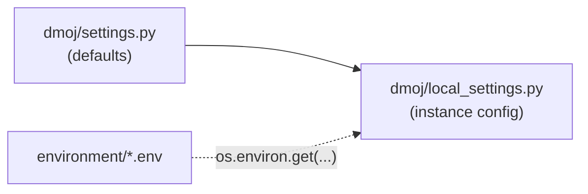

# Environment variables

This page is for anyone installing or operating LCOJ with Docker. It covers the configuration files in `dmoj/environment/`, what each variable does, its default, and how to apply changes.

All paths below are relative to the `dmoj/` directory of the [lcoj-docker](https://github.com/luyencode/lcoj-docker) repository.

## Environment files

| File | Created from template | Loaded into services | Contents |
|---|---|---|---|
| `environment/site.env` | `environment/site.env.example` | site, celery, bridged, wsevent, nginx | Django site configuration |
| `environment/mysql.env` | `environment/mysql.env.example` | db, site, celery, bridged, wsevent | Database name, user, password |
| `environment/mysql-admin.env` | `environment/mysql-admin.env.example` | db | MariaDB root password |

The `*.env` files hold secrets and are listed in `.gitignore`. Only the `*.example` files are committed.

### Creating the files

1. Copy the templates:

   ```sh
   cd dmoj
   cp environment/site.env.example environment/site.env
   cp environment/mysql.env.example environment/mysql.env
   cp environment/mysql-admin.env.example environment/mysql-admin.env
   ```

2. Replace `<secret key>` and `<password>` with real values (see [Generating SECRET_KEY](#secret-key)).
3. Set `HOST`, `SITE_FULL_URL`, and `MEDIA_URL` to match your domain.

::: tip
`./scripts/initialize` does **not** create the `.env` files. It only creates directories and copies the config templates (see [Helper scripts](/en/operate/scripts)).
:::

## How LCOJ reads environment variables

Django loads its configuration in this order:



1. `dmoj/repo/dmoj/settings.py` holds the defaults. Don't edit it.
2. At the end, `settings.py` executes `dmoj/repo/dmoj/local_settings.py`. `./scripts/initialize` copies that file from `dmoj/config/local_settings.py`.
3. Inside `local_settings.py`, some settings are read with `os.environ.get('VAR_NAME', 'default')`. For those settings, the value in the `.env` file wins; if the variable is unset, the default written in the code is used.

In other words, environment variables only override **the settings that `local_settings.py` reads from the environment**, listed in the tables below. Everything else must be edited in `local_settings.py` directly (see [Settings that aren't environment variables](#hardcoded-settings)).

## `site.env`

| Variable | Required? | Default (if unset) | Meaning |
|---|---|---|---|
| `HOST` | Yes | `localhost` | Public domain name, without `http://`. Used for `ALLOWED_HOSTS = [HOST]` and the WebSocket addresses `ws://HOST/event/` and `wss://HOST/event/` |
| `SITE_FULL_URL` | Recommended | `http://localhost/` | Full site URL, used to build absolute links (for example in webhooks) |
| `MEDIA_URL` | Yes | `http://localhost/` | Base URL for media files. nginx serves media at the site root (`/martor`, `/pdf`, ...), so this usually matches `SITE_FULL_URL`. Must end with `/` |
| `DEBUG` | No | `0` | Enabled only when the value is **exactly** `1`. Anything else (`true`, `yes`, ...) means off |
| `SECRET_KEY` | Yes | empty | Django's secret key. If it's empty, Django refuses to start |
| `EVENT_DAEMON_POST` | No | `ws://wsevent:15101/` | Where the site posts events to wsevent |
| `REDIS_CACHING_URL` | No | `redis://redis:6379/0` | Redis used as the cache |
| `CELERY_BROKER_URL` | No | `redis://redis:6379/1` | Celery task queue |
| `CELERY_RESULT_BACKEND` | No | `redis://redis:6379/1` | Where Celery stores task results |
| `BRIDGED_HOST` | No | `bridged` | Hostname of bridged. The site connects to `BRIDGED_HOST:9998`; bridged listens for judges on `BRIDGED_HOST:9999` |
| `SOCIAL_AUTH_GOOGLE_OAUTH2_KEY` | Yes (on LCOJ) | empty | Google OAuth client ID |
| `SOCIAL_AUTH_GOOGLE_OAUTH2_SECRET` | Yes (on LCOJ) | empty | Google OAuth client secret |
| `MOSS_API_KEY` | No | empty | [MOSS](https://theory.stanford.edu/~aiken/moss/) key for contest plagiarism checks |

Example production `site.env` (secrets shown as placeholders):

```ini
HOST=luyencode.net
SITE_FULL_URL=https://luyencode.net/
MEDIA_URL=https://luyencode.net/

DEBUG=0
SECRET_KEY=<long random string>

# Event server
EVENT_DAEMON_POST=ws://wsevent:15101/

# Redis and Celery
REDIS_CACHING_URL=redis://redis:6379/0
CELERY_BROKER_URL=redis://redis:6379/1
CELERY_RESULT_BACKEND=redis://redis:6379/1

# Bridge
BRIDGED_HOST=bridged

# Google sign-in
SOCIAL_AUTH_GOOGLE_OAUTH2_KEY=<client-id>.apps.googleusercontent.com
SOCIAL_AUTH_GOOGLE_OAUTH2_SECRET=<client-secret>

# Plagiarism checks (optional)
MOSS_API_KEY=<moss-user-id>
```

Things to note:

- **One domain only.** `ALLOWED_HOSTS` contains exactly `HOST`. To serve another domain as well (for example `www.luyencode.net`), edit `ALLOWED_HOSTS` in `local_settings.py`.
- **OAuth-only sign-up.** LCOJ sets `OAUTH_ONLY = True` in `local_settings.py`, so password registration is disabled. Without the two Google OAuth variables, new users have no way to sign up.
- **`SITE_FULL_URL` and the trailing `/`.** The template ends with `/` and the site works fine. However, some code (webhooks) concatenates strings directly, such as `SITE_FULL_URL + '/user/...'`, which can produce `//` in links. If you use webhooks, consider dropping the trailing `/`.
- **Empty `MOSS_API_KEY`.** The code only checks `MOSS_API_KEY is not None`, and the default is an empty string, so the MOSS tab still shows on contest pages (for users with the `moss_contest` permission) even without a key, and fails when used.
- **Internal Docker values** (`EVENT_DAEMON_POST`, `REDIS_*`, `CELERY_*`, `BRIDGED_HOST`) use service names from `docker-compose.yml`. Only change them if you move services to other machines.

::: danger Never enable DEBUG in production
`DEBUG=1` makes Django show detailed error pages that expose configuration and internal paths to anyone. Use it only on development machines.
:::

### `NGINX_PORT` {#nginx-port}

`docker-compose.yml` publishes nginx with `${NGINX_PORT:-8071}:80`. This is a **Docker Compose substitution variable**, read when Compose parses the YAML file, not a variable inside the container.

- Default: `8071` (Cloudflare Tunnel points at this port).
- Compose only takes the value from your shell environment or a `dmoj/.env` file (next to `docker-compose.yml`). Setting `NGINX_PORT` in `environment/site.env` does **not** change the published port; it just ends up inside the nginx container, where nothing uses it.

To change the port, create or edit `dmoj/.env`:

```ini
NGINX_PORT=8080
```

then run `docker compose up -d nginx` to recreate the nginx container.

## `mysql.env` and `mysql-admin.env`

| Variable | File | Required? | Django default | Meaning |
|---|---|---|---|---|
| `MYSQL_HOST` | `mysql.env` | No | `db` | Database host Django connects to. The MariaDB image ignores it |
| `MYSQL_DATABASE` | `mysql.env` | Yes | `dmoj` | Database name |
| `MYSQL_USER` | `mysql.env` | Yes | `dmoj` | Application database user |
| `MYSQL_PASSWORD` | `mysql.env` | Yes | empty | Password for `MYSQL_USER` |
| `MYSQL_ROOT_PASSWORD` | `mysql-admin.env` | Yes | — | MariaDB root password, only passed to the `db` container |

Example:

```ini
# environment/mysql.env
MYSQL_HOST=db
MYSQL_DATABASE=dmoj
MYSQL_USER=dmoj
MYSQL_PASSWORD=<strong password>
```

```ini
# environment/mysql-admin.env
MYSQL_ROOT_PASSWORD=<different root password>
```

The database and user are named `dmoj` by DMOJ convention; you can keep them.

::: warning Changing passwords after installation
The MariaDB image only uses `MYSQL_DATABASE`, `MYSQL_USER`, `MYSQL_PASSWORD`, and `MYSQL_ROOT_PASSWORD` for the **first** initialization, when `dmoj/database/` is empty. Changing them later does not change the passwords in the database; Django will just connect with the new password and be refused. To change a password, change it in MariaDB first (`ALTER USER ...`), then update the `.env` file.
:::

`./scripts/moderate_comments` also reads `MYSQL_USER`, `MYSQL_PASSWORD`, and `MYSQL_DATABASE` directly from `environment/mysql.env`.

## Settings that aren't environment variables {#hardcoded-settings}

These settings are hardcoded in `local_settings.py` and can't be changed through `.env` files:

| Setting | Current value | Notes |
|---|---|---|
| `SITE_NAME` | `'LCOJ'` | Short name shown on the site |
| `SITE_LONG_NAME` | `'LCOJ: Luyện Code Online Judge'` | Full name |
| `SITE_ADMIN_EMAIL` | `'luyencodeonline@gmail.com'` | Admin email |
| `SERVER_EMAIL` | `'LCOJ: Luyện Code Online Judge <luyencodeonline@gmail.com>'` | Sender for error emails |
| `LANGUAGE_CODE` | `'vi'` | Default language |
| `DEFAULT_USER_TIME_ZONE` | `'Asia/Ho_Chi_Minh'` | Default user time zone |
| `OAUTH_ONLY` | `True` | Disables password registration |
| `ALLOWED_HOSTS` | `[HOST]` | Derived from `HOST` |
| `EVENT_DAEMON_GET`, `EVENT_DAEMON_GET_SSL` | `ws://{HOST}/event/`, `wss://{HOST}/event/` | Derived from `HOST` |
| `EVENT_DAEMON_POLL` | `'/channels/'` | Long-polling path |
| `DMOJ_PROBLEM_DATA_ROOT`, `MEDIA_ROOT`, `STATIC_ROOT` | `/problems/`, `/media/`, `/assets/static/` | Match the volumes in `docker-compose.yml` |
| `VNOJ_CP_TICKET` | `5` | Setting inherited from VNOJ |
| Email (`EMAIL_BACKEND`, ...), `ADMINS` | not configured (commented out) | |

To change them:

1. Edit the live file `dmoj/repo/dmoj/local_settings.py`.
2. Make the same change in the template `dmoj/config/local_settings.py`, because re-running `./scripts/initialize` copies the template over the live file.
3. Restart the services that run Django:

   ```sh
   cd dmoj
   docker compose restart site celery bridged
   ```

::: tip Keep secrets out of local_settings.py
If you need a new secret setting, read it from the environment the same way `MOSS_API_KEY` does: `MY_KEY = os.environ.get('MY_KEY', '')`, then put the value in `site.env`.
:::

::: details Variables for the `generate_editorials` command
The `generate_editorials` management command reads `OPENAI_API_KEY` (required) and `OPENAI_BASE_URL` (optional) directly from the environment. They aren't in the templates and `docker-compose.yml` doesn't load them. If you need them, pass them when running the command, for example `docker compose exec -e OPENAI_API_KEY=<key> site python3 manage.py generate_editorials ...`.
:::

## Applying changes

`docker compose restart` does **not** re-read `env_file`s. A container keeps the environment it was created with. After editing a `.env` file, recreate the containers with `docker compose up -d`:

| You changed | Run (in `dmoj/`) |
|---|---|
| `environment/site.env` | `docker compose up -d site celery bridged` |
| `environment/mysql.env` | `docker compose up -d site celery bridged` (see the password warning above) |
| `dmoj/.env` (`NGINX_PORT`) | `docker compose up -d nginx` |
| `local_settings.py` | `docker compose restart site celery bridged` |

`docker compose up -d` only recreates containers whose configuration changed; the rest keep running.

## Generating SECRET_KEY {#secret-key}

`SECRET_KEY` signs sessions and tokens. Generate a long random string, and don't reuse it across environments (production, dev).

::: code-group

```sh [Host (Python 3)]
python3 -c 'import secrets; print(secrets.token_urlsafe(50))'
```

```sh [Inside the site container]
cd dmoj
docker compose exec site python3 -c 'from django.core.management.utils import get_random_secret_key; print(get_random_secret_key())'
```

:::

The first command only produces `A–Z a–z 0–9 - _`, which is safe to paste into a `.env` file. The second is Django's own helper (mentioned in a comment in `local_settings.py`), but it can produce characters like `$`, `#`, and `(`; if you use it, double-check the value after pasting.

::: warning Changing SECRET_KEY
Changing `SECRET_KEY` on a running site invalidates existing sessions (everyone gets logged out). Keep the key secret: don't commit it to git or paste it into issues or chat.
:::

::: tip Need help?
- Open an issue on [GitHub Issues](https://github.com/luyencode/lcoj-docker/issues)
- More resources at [behitek.com](https://behitek.com)
- LCOJ offers free installation help: [luyencode.net/about/#lien-he](https://luyencode.net/about/#lien-he)
:::
