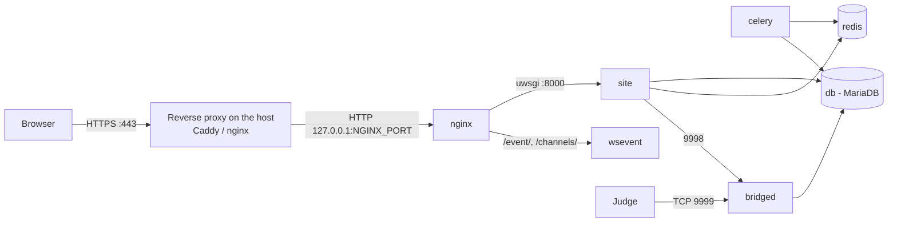
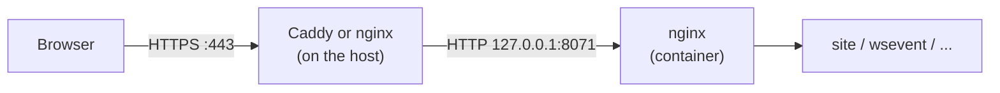

# Installing LCOJ with Docker

> Bring up a complete LCOJ instance (web app, database, cache, judge bridge, WebSocket) on a Linux server with Docker Compose, in 7 steps.
>
> ⏱ ~60 min (the image build alone takes 10–20 min) · 👤 Operators · 🔑 SSH access to a Linux server with `sudo`

This page walks you through a fresh LCOJ install with [lcoj-docker](https://github.com/luyencode/lcoj-docker) on a VPS with a public IP. Everything (web app, database, cache, judge bridge, WebSocket server) runs under Docker Compose, so you don't need Python or MariaDB on the host.

::: info Judges are installed separately
This Compose stack does **not** include a judge. It only runs `bridged`, which judges connect to. Once the site is up, see [Judge Setup](/en/operate/judge-setup).
:::

## Before you start

- [ ] A 64-bit Linux server that meets the minimum specs below, which you can SSH into with `sudo`
- [ ] Outbound Internet access from the server (to pull Docker images, Python/Node.js packages and the source from GitHub)
- [ ] A domain (for example `lcoj.example.com`) where you can create a DNS A/AAAA record pointing at the VPS's public IP, if you'll run it publicly over HTTPS. Without a domain you can still try it by IP; see [Testing without a domain](#no-domain)
- [ ] A Google account to create an OAuth client (see [Step 4.4](#google-oauth)), since new users can only register with Google
- [ ] Basic familiarity with containers, images and volumes; if not, see the [Glossary](/en/start/glossary)

| | Minimum | Recommended |
|---|---|---|
| CPU | 2 cores | 4+ cores |
| RAM | 4 GB | 8 GB+ |
| Disk | 20 GB free | 50 GB+ SSD (test data grows over time) |
| OS | 64-bit Linux (Ubuntu 22.04+ is easiest) | |

Software: **Docker** with the **Docker Compose v2** plugin (the `docker compose` command, not `docker-compose`) and **Git**.

The diagram below shows the services you'll bring up. See [Architecture](/en/operate/architecture) for details on each one.



## Step 1: Install Docker

On Ubuntu/Debian:

```sh
curl -fsSL https://get.docker.com -o get-docker.sh
sudo sh get-docker.sh

# Let the current user run docker without sudo
sudo usermod -aG docker $USER
# Log out and back in for the group change to take effect
```

Verify:

```sh
docker --version
docker compose version
```

## Step 2: Get the source

```sh
git clone --recursive https://github.com/luyencode/lcoj-docker.git
cd lcoj-docker/dmoj
```

`--recursive` is required: the Django code lives in the `dmoj/repo` submodule (the [lcoj-site](https://github.com/luyencode/lcoj-site) repo). If you forgot it, run `git submodule update --init --recursive`.

::: tip
From here on, **run every command from the `dmoj/` directory**. The scripts in `scripts/` and all `docker compose` commands expect it.
:::

## Step 3: Run the init script

```sh
./scripts/initialize
```

The script does exactly two things:

1. Creates the `problems/` (test data) and `media/` (user uploads) directories.
2. Copies the config templates from `config/` into the source tree:

| Source | Destination | Used by |
|---|---|---|
| `config/local_settings.py` | `repo/dmoj/local_settings.py` | Django settings |
| `config/uwsgi.ini` | `repo/uwsgi.ini` | uWSGI (worker count, etc.) |
| `config/config.js` | `repo/websocket/config.js` | WebSocket server |

::: warning
Re-running `initialize` **overwrites** the three destination files above. Back them up first if you've edited them.
:::

See [Helper Scripts](/en/operate/scripts) for the other scripts.

## Step 4: Configure

### 4.1. Create the environment files

The templates ship in `environment/`:

```sh
cp environment/mysql-admin.env.example environment/mysql-admin.env
cp environment/mysql.env.example environment/mysql.env
cp environment/site.env.example environment/site.env
```

The `*.env` files are excluded by `.gitignore`, so they never get committed.

### 4.2. Database

These two files configure MariaDB. `site`, `celery` and `bridged` also read `mysql.env` to connect, so do **not** repeat the `MYSQL_*` variables in `site.env`.

::: code-group

```env [environment/mysql.env]
MYSQL_HOST=db
MYSQL_DATABASE=dmoj
MYSQL_USER=dmoj
MYSQL_PASSWORD=<strong password>
```

```env [environment/mysql-admin.env]
MYSQL_ROOT_PASSWORD=<a different root password>
```

:::

MariaDB only creates the database and user from these variables **on first start**, while the `database/` directory is still empty. Changing the password later has to be done in SQL; see [Operations](/en/operate/operations#change-db-password).

### 4.3. Site

A minimal `environment/site.env` for an install served at `lcoj.example.com` (use your own domain):

```env
HOST=lcoj.example.com
SITE_FULL_URL=https://lcoj.example.com/
MEDIA_URL=https://lcoj.example.com/

DEBUG=0
SECRET_KEY=<long random string>

EVENT_DAEMON_POST=ws://wsevent:15101/
REDIS_CACHING_URL=redis://redis:6379/0
CELERY_BROKER_URL=redis://redis:6379/1
CELERY_RESULT_BACKEND=redis://redis:6379/1
BRIDGED_HOST=bridged

# Google sign-in (required for new users to register, see 4.4)
SOCIAL_AUTH_GOOGLE_OAUTH2_KEY=<client id>
SOCIAL_AUTH_GOOGLE_OAUTH2_SECRET=<client secret>
```

Common pitfalls:

- `DEBUG` is on only when the value is exactly `1`. `True` counts as off. Production should always use `0`.
- `HOST` is the bare domain (no `https://`, no port). It becomes `ALLOWED_HOSTS` and is used to build the WebSocket URLs. For a local test, use `localhost` and set both URLs to `http://localhost:8071/`.
- `SITE_FULL_URL` and `MEDIA_URL` use `https://` when the site runs behind an HTTPS reverse proxy (see [HTTPS on a VPS](#https)).
- `SITE_NAME`, `SITE_LONG_NAME` and `SITE_ADMIN_EMAIL` are **not** environment variables. They're hardcoded in `local_settings.py`.
- The Redis, Celery, WebSocket and bridge values above match the service names in `docker-compose.yml`. Leave them as-is unless you've changed the stack.

Generate a `SECRET_KEY`:

```sh
python3 -c "import secrets; print(secrets.token_urlsafe(50))"
```

For the full list of variables (including `MOSS_API_KEY` and `NGINX_PORT`), see [Environment Variables](/en/operate/environment).

::: warning NGINX_PORT is not read from site.env
`docker-compose.yml` publishes nginx on `${NGINX_PORT:-8071}`. Compose substitutes that variable from your shell or from a `dmoj/.env` file, **not** from `environment/site.env`. To change the port, create `dmoj/.env` containing `NGINX_PORT=8080` (or `export NGINX_PORT=8080` before running commands), then run `docker compose up -d nginx`. If nothing is set, the port is **8071**.
:::

### 4.4. Google sign-in (OAuth) {#google-oauth}

The bundled `local_settings.py` sets `OAUTH_ONLY = True`. That hides the password-based sign-up form, so new users can only register with Google. The username/password **login** form is still there, so admin accounts created from the command line can log in normally.

To get the keys:

1. In the [Google Cloud Console](https://console.cloud.google.com/apis/credentials), create an **OAuth client ID** of type *Web application*.
2. Add the **Authorized redirect URI** `https://lcoj.example.com/complete/google-oauth2/` (use your own domain).
3. Put the *Client ID* and *Client secret* into `SOCIAL_AUTH_GOOGLE_OAUTH2_KEY` and `SOCIAL_AUTH_GOOGLE_OAUTH2_SECRET` in `site.env`.

### 4.5. Nginx

In `nginx/conf.d/nginx.conf`, change `server_name` (`luyencode.net` by default) to your domain:

```nginx
server {
    listen       80;
    server_name  lcoj.example.com;  # your domain
    # ... leave the rest unchanged
}
```

The containerized nginx only listens for HTTP on port 80. HTTPS is handled by a reverse proxy on the host; see [HTTPS on a VPS](#https).

## Step 5: Build the images

The `lcoj/lcoj-base` image holds Python, Node.js and all dependencies (`requirements.txt`, `package.json`). The `site`, `celery` and `bridged` images are built **on top of** it, so build `base` first:

```sh
docker compose build base
docker compose build
```

The first build takes roughly 10–20 minutes depending on your network.

## Step 6: Initialize the database and static files

1. Start the services you need:

   ```sh
   docker compose up -d site db redis celery
   ```

   On first start MariaDB needs some time to create the database. Watch `docker compose logs -f db` until you see `ready for connections`.

2. Create the tables:

   ```sh
   ./scripts/migrate
   ```

3. Build the CSS and collect static files (compiles SCSS, runs `collectstatic`, compiles translations, copies everything to the `assets` volume nginx serves):

   ```sh
   ./scripts/copy_static
   ```

4. Load the initial data:

   ```sh
   ./scripts/manage.py loaddata navbar
   ./scripts/manage.py loaddata language_small
   ./scripts/manage.py loaddata demo
   ```

   | Fixture | Contents |
   |---|---|
   | `navbar` | Default navigation menu |
   | `language_small` | A handful of common languages (use `language_all` for the full set) |
   | `demo` | Sample data, **including an `admin` account with password `admin`** |

   ::: danger Change the admin password
   The `demo` fixture creates the superuser `admin` / `admin`. On a public server, change its password or delete it right away, or skip the `demo` fixture.
   :::

5. Create your own admin account:

   ```sh
   ./scripts/manage.py createsuperuser
   ```

   Log in at `/accounts/login/` with that username and password. Google isn't needed.

## Step 7: Start everything

```sh
docker compose up -d
docker compose ps
```

The `lcoj_site`, `lcoj_celery`, `lcoj_bridged`, `lcoj_wsevent`, `lcoj_mysql`, `lcoj_redis` and `lcoj_nginx` containers should all be **Up**. The `base` service only exists to build the shared image and exits right after starting, which is expected.

## Verify

1. Every container is **Up** in `docker compose ps` (except `base`, as noted above).
2. nginx answers on the server:

   ```sh
   curl -I http://localhost:8071/
   ```

3. Open `http://<server-ip>:8071/` in a browser to see the LCOJ home page (if `HOST` is already set to a domain, see [Testing without a domain](#no-domain) to browse by IP). If you loaded `demo`, go to **Admin → Sites** and change the default domain (`localhost:8081`) to your real one.
4. Log in at `/accounts/login/` with the account you created in Step 6 and open `/admin/`.
5. No judge yet is expected: submissions are only graded once you [connect a judge](/en/operate/judge-setup).

## Ports

| Service | Container | Port | Published on the host? |
|---|---|---|---|
| nginx | `lcoj_nginx` | `${NGINX_PORT:-8071}` → 80 | Yes |
| bridged | `lcoj_bridged` | 9999 (judges connect), 9998 (site-to-bridge) | Yes |
| site | `lcoj_site` | 8000 (uwsgi) | No |
| wsevent | `lcoj_wsevent` | 15100, 15101, 15102 | No, reached through nginx `/event/` and `/channels/` |
| db | `lcoj_mysql` | 3306 | No |
| redis | `lcoj_redis` | 6379 | No |
| celery | `lcoj_celery` | — | No |

::: warning Firewall
Only judges need port 9999. Port 9998 and the nginx port (`8071`) don't need to be reachable from the Internet. Note that Docker-published ports **bypass `ufw` rules**. See [Step H2](#bind-localhost) and [Step H6](#firewall) for how to restrict them.
:::

## HTTPS on a VPS {#https}

The Docker nginx serves plain HTTP only: port 80 inside the container, published on the host as `${NGINX_PORT:-8071}`. To go public over HTTPS, run a **TLS reverse proxy directly on the VPS**. It terminates HTTPS on ports 80/443, gets Let's Encrypt certificates automatically, and forwards to `127.0.0.1:8071`:



The steps below use the example domain `lcoj.example.com` and the default port `8071`. Substitute your own values.

::: warning Don't run certbot against the containerized nginx
The container's nginx config lives inside Docker and has no port 443. Certificates must be managed by the proxy on the host.
:::

### Step H1: Point your domain at the VPS

At your DNS provider, create an **A** record pointing `lcoj.example.com` at the VPS's public IPv4 address (and an **AAAA** record if the VPS has IPv6). Check it:

```sh
dig +short lcoj.example.com
```

It should print the VPS's IP. Let's Encrypt only issues a certificate once the domain resolves correctly and port 80 on the VPS is reachable from the Internet.

### Step H2: Bind the nginx port to localhost only {#bind-localhost}

By default Compose publishes nginx on every host address, so anyone can reach `http://<VPS-IP>:8071` and bypass HTTPS. Create `dmoj/docker-compose.override.yml` (Compose reads it automatically alongside `docker-compose.yml`):

```yaml
services:
  nginx:
    ports: !override
      - "127.0.0.1:${NGINX_PORT:-8071}:80"
  bridged:
    ports: !override
      - "127.0.0.1:9998:9998"
      - "9999:9999"
```

- `!override` replaces the original `ports` list instead of appending to it. It requires Docker Compose **v2.24.4** or later (`docker compose version`).
- Port 9998 is only used between `site` and `bridged`, so binding it to `127.0.0.1` is enough.
- If every judge runs on this same VPS (`--network=host`, connecting to `localhost:9999`), change the last line to `"127.0.0.1:9999:9999"`. If some judges run on other machines, keep `"9999:9999"` and restrict it by IP in [Step H6](#firewall).

Apply and check:

```sh
docker compose up -d nginx bridged
docker compose ps nginx bridged
```

The `PORTS` column for nginx should show `127.0.0.1:8071->80/tcp`.

### Step H3: Install a TLS reverse proxy

Pick **one** of the two options. Both need ports 80 and 443 free on the VPS, so don't set `NGINX_PORT` to 80 or 443.

#### Option A: Caddy (simplest)

Caddy obtains and renews certificates, redirects HTTP to HTTPS, proxies WebSockets, and sets the `X-Forwarded-For` and `X-Forwarded-Proto` headers, all out of the box.

1. Install Caddy on Ubuntu/Debian (from the [official docs](https://caddyserver.com/docs/install#debian-ubuntu-raspbian)):

   ```sh
   sudo apt install -y debian-keyring debian-archive-keyring apt-transport-https curl
   curl -1sLf 'https://dl.cloudsmith.io/public/caddy/stable/gpg.key' | sudo gpg --dearmor -o /usr/share/keyrings/caddy-stable-archive-keyring.gpg
   curl -1sLf 'https://dl.cloudsmith.io/public/caddy/stable/debian.deb.txt' | sudo tee /etc/apt/sources.list.d/caddy-stable.list
   sudo apt update
   sudo apt install caddy
   ```

2. Replace the contents of `/etc/caddy/Caddyfile` with:

   ```txt
   lcoj.example.com {
       reverse_proxy 127.0.0.1:8071
   }
   ```

   That single `reverse_proxy` line covers both the website and the `/event/` WebSocket.

3. Reload the config and watch the certificate being issued:

   ```sh
   sudo systemctl reload caddy
   sudo journalctl -u caddy -f
   ```

#### Option B: host nginx + certbot

1. Install nginx and certbot:

   ```sh
   sudo apt install -y nginx certbot python3-certbot-nginx
   ```

2. Create `/etc/nginx/sites-available/lcoj`:

   ```nginx
   server {
       listen 80;
       listen [::]:80;
       server_name lcoj.example.com;

       client_max_body_size 64M;

       location / {
           proxy_pass http://127.0.0.1:8071;
           proxy_set_header Host $host;
           proxy_set_header X-Real-IP $remote_addr;
           proxy_set_header X-Forwarded-For $proxy_add_x_forwarded_for;
           proxy_set_header X-Forwarded-Proto $scheme;
           proxy_read_timeout 600;
       }

       # Live-update WebSocket
       location /event/ {
           proxy_pass http://127.0.0.1:8071;
           proxy_http_version 1.1;
           proxy_set_header Upgrade $http_upgrade;
           proxy_set_header Connection "upgrade";
           proxy_set_header Host $host;
           proxy_set_header X-Forwarded-For $proxy_add_x_forwarded_for;
           proxy_set_header X-Forwarded-Proto $scheme;
           proxy_read_timeout 86400;
       }
   }
   ```

   `client_max_body_size 64M` and `proxy_read_timeout 600` match the limits of the containerized nginx, so large test-data uploads and long requests aren't cut off by the proxy.

3. Enable the site and reload nginx:

   ```sh
   sudo ln -s /etc/nginx/sites-available/lcoj /etc/nginx/sites-enabled/lcoj
   sudo rm -f /etc/nginx/sites-enabled/default
   sudo nginx -t && sudo systemctl reload nginx
   ```

4. Get a certificate. certbot adds `listen 443 ssl` and an HTTP-to-HTTPS redirect to the file above:

   ```sh
   sudo certbot --nginx -d lcoj.example.com
   sudo certbot renew --dry-run   # check that automatic renewal works
   ```

### Step H4: Switch `site.env` to https

In `environment/site.env`:

```env
HOST=lcoj.example.com
SITE_FULL_URL=https://lcoj.example.com/
MEDIA_URL=https://lcoj.example.com/
```

`HOST` has no `https://` and no port. Run `docker compose up -d` (not `restart`) so the containers pick up the new values.

You don't need to set the WebSocket URLs separately: `local_settings.py` builds `EVENT_DAEMON_GET = 'ws://<HOST>/event/'` and `EVENT_DAEMON_GET_SSL = 'wss://<HOST>/event/'` from `HOST`. The site uses the `wss://` URL when it recognizes the request as HTTPS, which requires `SECURE_PROXY_SSL_HEADER` from the next step.

### Step H5: Configure Django for HTTPS {#django-https}

Open `repo/dmoj/local_settings.py` (the running copy) and add at the end:

```python
# Running behind an HTTPS reverse proxy
CSRF_TRUSTED_ORIGINS = ['https://lcoj.example.com']
SECURE_PROXY_SSL_HEADER = ('HTTP_X_FORWARDED_PROTO', 'https')
```

Then restart the site:

```sh
docker compose restart site
```

- **`CSRF_TRUSTED_ORIGINS` is required.** Django checks the `Origin` header of every form submission. Without this setting, forms posted from `https://lcoj.example.com` are rejected. LCOJ's CSRF failure handler just redirects back to the same page without an error message, so the symptom is **clicking Submit, Save or Log in only reloads the page and nothing changes**. If you serve another domain too (such as `www`), add it to this list and to `ALLOWED_HOSTS`.
- **`SECURE_PROXY_SSL_HEADER` is recommended.** It tells Django the original request was HTTPS, based on the `X-Forwarded-Proto` header. Without it, HTTPS pages open the WebSocket over `ws://`, the browser blocks it as mixed content, and submission results stop updating live. Only enable it when the container's nginx port is **not** reachable from outside ([Step H2](#bind-localhost)) and the proxy always sets this header. Caddy does so by default; the nginx config in Option B sets `X-Forwarded-Proto $scheme`. Otherwise anyone could forge the header to make Django treat a request as HTTPS.

::: tip Keep these settings when re-running `initialize`
`./scripts/initialize` copies `config/local_settings.py` over `repo/dmoj/local_settings.py`. Add the two lines above to `config/local_settings.py` too so they aren't lost.
:::

### Step H6: Firewall {#firewall}

| Port | Open to the Internet? | Notes |
|---|---|---|
| 22 | Yes | SSH |
| 80, 443 | Yes | Reverse proxy. Port 80 is needed to obtain/renew certificates and to redirect to HTTPS |
| `8071` (`NGINX_PORT`) | No | `127.0.0.1` only ([Step H2](#bind-localhost)) |
| 9998 | No | Only used between `site` and `bridged` |
| 9999 | Only if judges run on other machines | Restrict to the judges' IPs |
| 3306, 6379 | — | `db` and `redis` aren't published on the host |

With `ufw`:

```sh
sudo ufw allow 22/tcp
sudo ufw allow 80/tcp
sudo ufw allow 443/tcp
sudo ufw enable
```

::: warning ufw can't block Docker-published ports
Docker adds its own iptables rules for everything under `ports:`, so `ufw` has no effect on `8071`, `9998` or `9999`. Bind them to `127.0.0.1` instead ([Step H2](#bind-localhost)). To restrict port 9999 to your judges' IPs, use your VPS provider's firewall (the easiest option) or the iptables `DOCKER-USER` chain:

```sh
# eth0 is the public interface; <judge-ip> is the allowed address
sudo iptables -I DOCKER-USER -i eth0 -p tcp -m conntrack --ctorigdstport 9999 --ctdir ORIGINAL ! -s <judge-ip> -j DROP
```

This iptables rule is lost on reboot; use the `iptables-persistent` package to save it.
:::

### Verify HTTPS

1. `curl -I https://lcoj.example.com/` returns `200`, and `curl -I http://lcoj.example.com/` returns a redirect (`301`/`308`) to `https://`.
2. From another machine, `curl -m 5 http://<VPS-IP>:8071/` fails (times out or is refused).
3. Log in, edit your profile and save: the change sticks.
4. Open a submission page, then DevTools → **Network** → filter **WS**: the `wss://lcoj.example.com/event/` connection has status `101`.

### Testing without a domain {#no-domain}

Before you have a domain, you can try the site by IP over plain HTTP (unencrypted, for testing only). Do this **before** Step H2, since port `8071` must be reachable from outside. In `environment/site.env`:

```env
HOST=<VPS-IP>
SITE_FULL_URL=http://<VPS-IP>:8071/
MEDIA_URL=http://<VPS-IP>:8071/
```

Run `docker compose up -d`, then open `http://<VPS-IP>:8071/`. In this mode:

- Forms work without `CSRF_TRUSTED_ORIGINS`, because the browser sends `Origin: http://...`, which matches the HTTP request. Don't enable `SECURE_PROXY_SSL_HEADER`.
- The WebSocket URL built from `HOST` has no port (`ws://<VPS-IP>/event/`). For live updates to work, add `EVENT_DAEMON_GET = 'ws://<VPS-IP>:8071/event/'` at the end of `repo/dmoj/local_settings.py` and run `docker compose restart site`. Remove that line when you switch to a domain.
- Your VPS provider's firewall may block port `8071`; if so, open it temporarily.

Once you have a domain, go through Steps H1 to H6.

## Performance tuning

- **uWSGI workers** (web requests): change `workers = 8` in `repo/uwsgi.ini` (the template is `config/uwsgi.ini`), then `docker compose restart site`. Each worker may use up to 512 MB of RAM before it's recycled (`reload-on-rss = 512M`).
- **Celery concurrency**: `--concurrency=2` is set in the `ENTRYPOINT` of `celery/Dockerfile`. Change it there, then run `docker compose up -d --build celery`.

## Go-live checklist

- [ ] `DEBUG=0`, a random `SECRET_KEY`, strong MariaDB passwords
- [ ] The `demo` fixture's `admin` account has a new password or is deleted
- [ ] HTTPS works and `SITE_FULL_URL`/`MEDIA_URL` use `https://`
- [ ] `CSRF_TRUSTED_ORIGINS` (and `SECURE_PROXY_SSL_HEADER`) are set in `local_settings.py`
- [ ] The Docker nginx port is bound to `127.0.0.1` only
- [ ] Google sign-in works
- [ ] The firewall only exposes the ports you need
- [ ] [Scheduled backups](/en/operate/operations#backup) are set up
- [ ] [At least one judge is connected](/en/operate/judge-setup)

## Troubleshooting

| Symptom | Fix |
|---|---|
| `permission denied` when running `docker` | You haven't logged out and back in after `usermod -aG docker` (Step 1) |
| `dmoj/repo` is empty, the build complains about missing files | You cloned without `--recursive`: run `git submodule update --init --recursive` |
| `./scripts/migrate` can't connect to the database | MariaDB is still initializing: wait for `ready for connections` in `docker compose logs -f db`, then retry |
| Building `site`/`celery`/`bridged` can't find `lcoj/lcoj-base` | Run `docker compose build base` first (Step 5) |
| The site loads without CSS | Re-run `./scripts/copy_static` |
| Clicking Submit / Save / Log in does nothing, the page just reloads | `CSRF_TRUSTED_ORIGINS` is missing or wrong in `repo/dmoj/local_settings.py`: it must contain exactly `https://<your-domain>`. Then run `docker compose restart site` ([Step H5](#django-https)) |
| Results don't update live; the browser console shows `Mixed Content` or `ws://` errors | `SECURE_PROXY_SSL_HEADER` is missing ([Step H5](#django-https)), or the proxy doesn't forward the `Upgrade`/`Connection` headers for `/event/` |
| Caddy/certbot can't obtain a certificate | The domain doesn't resolve to the VPS IP yet (`dig +short <your-domain>`), or your provider's firewall blocks ports 80/443 |
| The host proxy returns 502 | The nginx container isn't running or the port is wrong: run `curl -I http://127.0.0.1:8071/` on the VPS |
| 502 Bad Gateway | `site` is still starting or failed to load Django: check `docker compose logs --tail=100 site` ([details](/en/operate/architecture#uwsgi)) |
| 400 Bad Request | `HOST` in `site.env` doesn't match the domain you're browsing |
| Port 8071 is already in use | Change it with `NGINX_PORT` in `dmoj/.env` (see the warning in Step 4.3) |
| Edits to `site.env` have no effect | Run `docker compose up -d` (not `restart`) to recreate the containers |

## Next steps

- [Judge Setup](/en/operate/judge-setup): connect a judge so submissions get graded.
- [Site configuration](/en/admin/site-config): set your domain, menu and home page content.
- [Day-to-day Operations](/en/operate/operations): restarts, logs, backups.
- Reference: [Environment Variables](/en/operate/environment), [Helper Scripts](/en/operate/scripts), [Updating LCOJ](/en/operate/updating).

::: tip Need help?
Open an issue on [lcoj-docker](https://github.com/luyencode/lcoj-docker/issues), or reach us via [behitek.com](https://behitek.com) or [luyencode.net/about/#lien-he](https://luyencode.net/about/#lien-he).
:::
