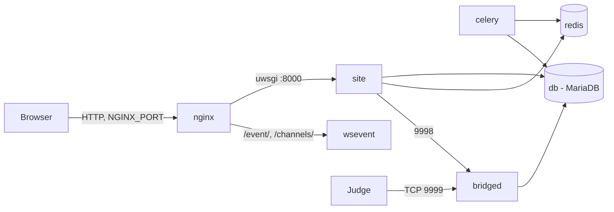

# Installing LCOJ with Docker

This page walks you through a fresh LCOJ install with [lcoj-docker](https://github.com/luyencode/lcoj-docker), the same setup that runs luyencode.net. Everything (web app, database, cache, judge bridge, WebSocket server) runs under Docker Compose, so you don't need Python or MariaDB on the host.

::: info Judges are installed separately
This Compose stack does **not** include a judge. It only runs `bridged`, which judges connect to. Once the site is up, see [Judge Setup](/en/operate/judge-setup).
:::

## Requirements

| | Minimum | Recommended |
|---|---|---|
| CPU | 2 cores | 4+ cores |
| RAM | 4 GB | 8 GB+ |
| Disk | 20 GB free | 50 GB+ SSD (test data grows over time) |
| OS | 64-bit Linux (Ubuntu 22.04+ is easiest) | |

Software: **Docker** with the **Docker Compose v2** plugin (the `docker compose` command, not `docker-compose`) and **Git**.

The diagram below shows the services you'll bring up. See [Architecture](/en/operate/architecture) for details on each one.



## Step 1: Install Docker

On Ubuntu/Debian:

```sh
curl -fsSL https://get.docker.com -o get-docker.sh
sudo sh get-docker.sh

# Let the current user run docker without sudo
sudo usermod -aG docker $USER
# Log out and back in for the group change to take effect
```

Verify:

```sh
docker --version
docker compose version
```

## Step 2: Get the source

```sh
git clone --recursive https://github.com/luyencode/lcoj-docker.git
cd lcoj-docker/dmoj
```

`--recursive` is required: the Django code lives in the `dmoj/repo` submodule (the [lcoj-site](https://github.com/luyencode/lcoj-site) repo). If you forgot it, run `git submodule update --init --recursive`.

::: tip
From here on, **run every command from the `dmoj/` directory**. The scripts in `scripts/` and all `docker compose` commands expect it.
:::

## Step 3: Run the init script

```sh
./scripts/initialize
```

The script does exactly two things:

1. Creates the `problems/` (test data) and `media/` (user uploads) directories.
2. Copies the config templates from `config/` into the source tree:

| Source | Destination | Used by |
|---|---|---|
| `config/local_settings.py` | `repo/dmoj/local_settings.py` | Django settings |
| `config/uwsgi.ini` | `repo/uwsgi.ini` | uWSGI (worker count, etc.) |
| `config/config.js` | `repo/websocket/config.js` | WebSocket server |

::: warning
Re-running `initialize` **overwrites** the three destination files above. Back them up first if you've edited them.
:::

See [Helper Scripts](/en/operate/scripts) for the other scripts.

## Step 4: Configure

### 4.1. Create the environment files

The templates ship in `environment/`:

```sh
cp environment/mysql-admin.env.example environment/mysql-admin.env
cp environment/mysql.env.example environment/mysql.env
cp environment/site.env.example environment/site.env
```

The `*.env` files are excluded by `.gitignore`, so they never get committed.

### 4.2. Database

These two files configure MariaDB. `site`, `celery` and `bridged` also read `mysql.env` to connect, so do **not** repeat the `MYSQL_*` variables in `site.env`.

::: code-group

```env [environment/mysql.env]
MYSQL_HOST=db
MYSQL_DATABASE=dmoj
MYSQL_USER=dmoj
MYSQL_PASSWORD=<strong password>
```

```env [environment/mysql-admin.env]
MYSQL_ROOT_PASSWORD=<a different root password>
```

:::

MariaDB only creates the database and user from these variables **on first start**, while the `database/` directory is still empty. Changing the password later has to be done in SQL; see [Operations](/en/operate/operations#change-db-password).

### 4.3. Site

A minimal `environment/site.env` for an install served at `luyencode.net`:

```env
HOST=luyencode.net
SITE_FULL_URL=https://luyencode.net/
MEDIA_URL=https://luyencode.net/

DEBUG=0
SECRET_KEY=<long random string>

EVENT_DAEMON_POST=ws://wsevent:15101/
REDIS_CACHING_URL=redis://redis:6379/0
CELERY_BROKER_URL=redis://redis:6379/1
CELERY_RESULT_BACKEND=redis://redis:6379/1
BRIDGED_HOST=bridged

# Google sign-in (required for new users to register, see 4.4)
SOCIAL_AUTH_GOOGLE_OAUTH2_KEY=<client id>
SOCIAL_AUTH_GOOGLE_OAUTH2_SECRET=<client secret>
```

Common pitfalls:

- `DEBUG` is on only when the value is exactly `1`. `True` counts as off. Production should always use `0`.
- `HOST` is the bare domain (no `https://`) and becomes `ALLOWED_HOSTS`. For a local test, use `localhost` and set both URLs to `http://localhost:8071/`.
- `SITE_NAME`, `SITE_LONG_NAME` and `SITE_ADMIN_EMAIL` are **not** environment variables. They're hardcoded in `local_settings.py`.
- The Redis, Celery, WebSocket and bridge values above match the service names in `docker-compose.yml`. Leave them as-is unless you've changed the stack.

Generate a `SECRET_KEY`:

```sh
python3 -c "import secrets; print(secrets.token_urlsafe(50))"
```

For the full list of variables (including `MOSS_API_KEY` and `NGINX_PORT`), see [Environment Variables](/en/operate/environment).

::: warning NGINX_PORT is not read from site.env
`docker-compose.yml` publishes nginx on `${NGINX_PORT:-8071}`. Compose substitutes that variable from your shell or from a `dmoj/.env` file, **not** from `environment/site.env`. To change the port, create `dmoj/.env` containing `NGINX_PORT=8080` (or `export NGINX_PORT=8080` before running commands), then run `docker compose up -d nginx`. If nothing is set, the port is **8071**.
:::

### 4.4. Google sign-in (OAuth)

LCOJ's `local_settings.py` sets `OAUTH_ONLY = True`. That hides the password-based sign-up form, so new users can only register with Google. The username/password **login** form is still there, so admin accounts created from the command line can log in normally.

To get the keys:

1. In the [Google Cloud Console](https://console.cloud.google.com/apis/credentials), create an **OAuth client ID** of type *Web application*.
2. Add the **Authorized redirect URI** `https://luyencode.net/complete/google-oauth2/` (use your own domain).
3. Put the *Client ID* and *Client secret* into `SOCIAL_AUTH_GOOGLE_OAUTH2_KEY` and `SOCIAL_AUTH_GOOGLE_OAUTH2_SECRET` in `site.env`.

### 4.5. Nginx

In `nginx/conf.d/nginx.conf`, set `server_name` to your domain:

```nginx
server {
    listen       80;
    server_name  luyencode.net;  # change to your domain
    # ... leave the rest unchanged
}
```

The containerized nginx only listens for HTTP on port 80. HTTPS is handled in front of it; see [HTTPS](#https).

## Step 5: Build the images

The `lcoj/lcoj-base` image holds Python, Node.js and all dependencies (`requirements.txt`, `package.json`). The `site`, `celery` and `bridged` images are built **on top of** it, so build `base` first:

```sh
docker compose build base
docker compose build
```

The first build takes roughly 10–20 minutes depending on your network.

## Step 6: Initialize the database and static files

1. Start the services you need:

   ```sh
   docker compose up -d site db redis celery
   ```

   On first start MariaDB needs some time to create the database. Watch `docker compose logs -f db` until you see `ready for connections`.

2. Create the tables:

   ```sh
   ./scripts/migrate
   ```

3. Build the CSS and collect static files (compiles SCSS, runs `collectstatic`, compiles translations, copies everything to the `assets` volume nginx serves):

   ```sh
   ./scripts/copy_static
   ```

4. Load the initial data:

   ```sh
   ./scripts/manage.py loaddata navbar
   ./scripts/manage.py loaddata language_small
   ./scripts/manage.py loaddata demo
   ```

   | Fixture | Contents |
   |---|---|
   | `navbar` | Default navigation menu |
   | `language_small` | A handful of common languages (use `language_all` for the full set) |
   | `demo` | Sample data, **including an `admin` account with password `admin`** |

   ::: danger Change the admin password
   The `demo` fixture creates the superuser `admin` / `admin`. On a public server, change its password or delete it right away, or skip the `demo` fixture.
   :::

5. Create your own admin account:

   ```sh
   ./scripts/manage.py createsuperuser
   ```

   Log in at `/accounts/login/` with that username and password. Google isn't needed.

## Step 7: Start everything

```sh
docker compose up -d
docker compose ps
```

The `lcoj_site`, `lcoj_celery`, `lcoj_bridged`, `lcoj_wsevent`, `lcoj_mysql`, `lcoj_redis` and `lcoj_nginx` containers should all be **Up**. The `base` service only exists to build the shared image and exits right after starting, which is expected.

Check it:

```sh
curl -I http://localhost:8071/
```

Open `http://<server-ip>:8071/` in a browser to see the LCOJ home page. If you loaded `demo`, go to **Admin → Sites** and change the default domain (`localhost:8081`) to your real one.

## Ports

| Service | Container | Port | Published on the host? |
|---|---|---|---|
| nginx | `lcoj_nginx` | `${NGINX_PORT:-8071}` → 80 | Yes |
| bridged | `lcoj_bridged` | 9999 (judges connect), 9998 (site-to-bridge) | Yes |
| site | `lcoj_site` | 8000 (uwsgi) | No |
| wsevent | `lcoj_wsevent` | 15100, 15101, 15102 | No, reached through nginx `/event/` and `/channels/` |
| db | `lcoj_mysql` | 3306 | No |
| redis | `lcoj_redis` | 6379 | No |
| celery | `lcoj_celery` | — | No |

::: warning Firewall
Only judges need port 9999. Port 9998 doesn't need to be reachable from the Internet. Note that Docker-published ports **bypass `ufw` rules**, so filter them with your cloud provider's firewall or the iptables `DOCKER-USER` chain.
:::

## HTTPS

The nginx container serves plain HTTP only. To get HTTPS, put a TLS layer in front of `NGINX_PORT`.

### What luyencode.net uses: Cloudflare Tunnel

luyencode.net runs behind [Cloudflare Tunnel](https://developers.cloudflare.com/cloudflare-one/connections/connect-networks/). `cloudflared` runs on the server, connects out to Cloudflare and forwards requests to nginx. The server doesn't open ports 80/443 and you don't manage certificates yourself.

1. Install `cloudflared` and create a tunnel following Cloudflare's docs.
2. Add a *Public hostname* `luyencode.net` pointing to the service `http://localhost:8071` (your `NGINX_PORT`).
3. In `site.env`, make `SITE_FULL_URL` and `MEDIA_URL` use `https://`, then run `docker compose up -d` so the containers pick up the new values.

WebSockets (`/event/`) work through Cloudflare Tunnel with no extra configuration.

### Alternative: a TLS reverse proxy

Any reverse proxy on the host (Caddy, host-level Nginx with certbot, etc.) can terminate HTTPS on port 443 and forward to `http://127.0.0.1:8071`. Make sure it forwards the `Upgrade`/`Connection` headers so the `/event/` WebSocket works. Don't point `certbot --nginx` at the containerized nginx: its config lives inside Docker and it has no port 443.

## Performance tuning

- **uWSGI workers** (web requests): change `workers = 8` in `repo/uwsgi.ini` (the template is `config/uwsgi.ini`), then `docker compose restart site`. Each worker may use up to 512 MB of RAM before it's recycled (`reload-on-rss = 512M`).
- **Celery concurrency**: `--concurrency=2` is set in the `ENTRYPOINT` of `celery/Dockerfile`. Change it there, then run `docker compose up -d --build celery`.

## Go-live checklist

- [ ] `DEBUG=0`, a random `SECRET_KEY`, strong MariaDB passwords
- [ ] The `demo` fixture's `admin` account has a new password or is deleted
- [ ] HTTPS works and `SITE_FULL_URL`/`MEDIA_URL` use `https://`
- [ ] Google sign-in works
- [ ] The firewall only exposes the ports you need
- [ ] [Scheduled backups](/en/operate/operations#backup) are set up
- [ ] [At least one judge is connected](/en/operate/judge-setup)

## See also

- [Environment Variables](/en/operate/environment)
- [Helper Scripts](/en/operate/scripts)
- [Day-to-day Operations](/en/operate/operations)
- [Updating LCOJ](/en/operate/updating)
- [Judge Setup](/en/operate/judge-setup)

::: tip Need help?
Open an issue on [lcoj-docker](https://github.com/luyencode/lcoj-docker/issues), or reach us via [behitek.com](https://behitek.com) or [luyencode.net/about/#lien-he](https://luyencode.net/about/#lien-he).
:::
