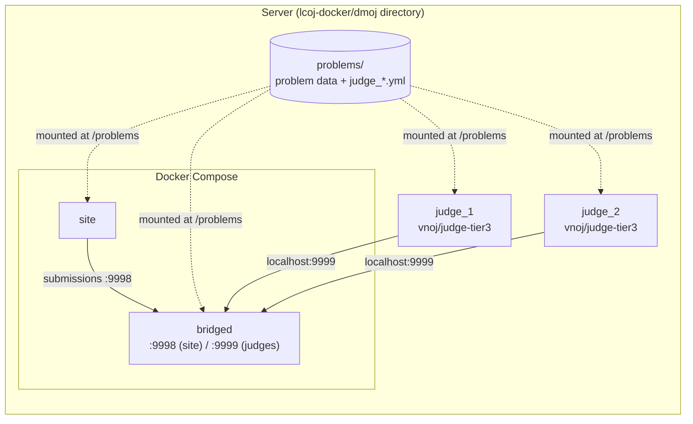

# Setting up judges

A judge is the program that receives submissions, compiles them, runs them against each test case, and reports the results back to the site. In LCOJ, judges are **not part of Docker Compose**: each judge runs in its own container and connects to the `bridged` service on port `9999`.

This page shows you how to register a judge on the site, run it with Docker, run several judges side by side, and confirm that a judge is connected.

::: info Before you start
- The site is installed as described in [Installing with Docker](/en/operate/installation), and the `bridged` service is running.
- The judge machine runs **Linux** (the judge sandbox needs a Linux kernel) and has Docker installed.
- You have an administrator (superuser) account on the site.
:::

## How judges connect



Key points (from `dmoj/docker-compose.yml` and `dmoj/config/local_settings.py`):

- `bridged` publishes port `9999` on the host (`ports: 9999:9999`). Judges run with `--network host`, so they just connect to `localhost:9999`.
- The `dmoj/problems` directory is mounted into `site` and `bridged` at `/problems` (`DMOJ_PROBLEM_DATA_ROOT = '/problems/'`). Judges mount **the same directory** at `/problems`. When you upload test data on the site, the judges see it right away.
- A judge logs in to the bridge with a **name** and an **authentication key**. Both must match the judge record on the site.

## Choosing a Docker image

LCOJ uses **`vnoj/judge-tier3`**, the judge image from the upstream [VNOJ](https://github.com/VNOI-Admin/judge-server) project. Images come in "tiers" by how many languages they include:

| Image | Contents |
|---|---|
| `vnoj/judge-tier1` | Core languages: C/C++ (GCC), Python 2/3, Java, Pascal |
| `vnoj/judge-tier2` | Tier 1 plus a selection of other common languages |
| `vnoj/judge-tier3` | The most complete set, covering nearly every runtime the judge supports. **LCOJ uses this one** |

The exact contents of each tier come from the base images `vnoj/runtimes-tier1/2/3` (see the `Dockerfile`s under `judge-server/.docker/`). The languages **actually available** on your site are whatever your judges report. See [Supported languages](/en/reference/languages).

::: tip Building the image yourself (optional)
To run LCOJ's judge code ([luyencode/judge-server](https://github.com/luyencode/judge-server)) instead of the upstream build:

```sh
git clone https://github.com/luyencode/judge-server.git
cd judge-server/.docker
make judge-tier3
```

The `Makefile` tags the result as `vnoj/judge-tier3` and `vnoj/judge-tier3:latest`, so the commands below stay the same. The tier3 `Dockerfile` downloads the source of `luyencode/judge-server` at `GIT_TAG` (default `master`), for example `make judge-tier3 GIT_TAG=master TAG=latest`.
:::

## Step 1: Register the judge on the site

Each judge needs a record on the site with a **name** and an **authentication key**. Pick one of these two methods.

### Option A: Admin panel

1. Sign in as a superuser and open `https://luyencode.net/admin/judge/judge/` (use your own domain).
2. Click **Add judge**.
3. Fill in **Name**, for example `judge1`. Use a hostname-style name: letters, digits, and hyphens, no spaces.
4. In the **Authentication key** field, click **Regenerate** to have the browser create a random key, then copy it.
5. Click **Save**.

### Option B: Management command

From the `dmoj/` directory:

```sh
./scripts/manage.py addjudge <name> <key>
```

`addjudge` takes two arguments: the judge name and the authentication key. You generate the key yourself, for example with `openssl rand -base64 48`.

::: warning Keep the key secret
Anyone with the name and key can connect to the bridge as a legitimate judge. Never commit keys to Git or paste them into issues or docs.
:::

::: info The "tier" field in the admin panel
A judge record has a **Judge tier** field (default `1`). It is a failover priority: the bridge only sends work to online judges with the **lowest** tier. It has nothing to do with the `judge-tier3` image name. If you don't need failover, leave every judge at tier `1`.
:::

## Step 2: Create the configuration file

Put the configuration file inside `dmoj/problems`, so the judge can read it at `/problems/...` inside the container. For example, create `dmoj/problems/judge_judge1.yml`:

```yaml
# Must match the judge name on the site
id: "judge1"
# The authentication key from Step 1
key: "<key>"
# Where problems live: any directory matching a glob that contains init.yml is a problem
problem_storage_globs:
  - /problems/*
```

You don't need to list languages: the Docker image detected its runtimes at build time. Every key is explained in [Judge configuration](/en/operate/judge-configuration).

::: tip
The `judge_*.yml` files sit next to the problem directories, but they are never mistaken for problems: the judge only treats a directory as a problem when it contains an `init.yml`.
:::

## Step 3: Run the judge

Run this from `dmoj/`, so that `$PWD/problems` points at the shared problems directory:

```sh
cd lcoj-docker/dmoj

docker run \
    --name judge_judge1 \
    --network=host \
    -v "$PWD/problems":/problems \
    --cap-add=SYS_PTRACE \
    -d \
    --restart=always \
    vnoj/judge-tier3 \
    run -p 9999 -c /problems/judge_judge1.yml -a 12345 \
    localhost judge1 "<key>"
```

`docker run` options:

| Option | Meaning |
|---|---|
| `--name judge_judge1` | Container name, unique per judge |
| `--network=host` | Use the host's network, so `localhost:9999` reaches the port `bridged` publishes |
| `-v "$PWD/problems":/problems` | Mount the shared problems directory (the same one `site` and `bridged` use) |
| `--cap-add=SYS_PTRACE` | Required: the judge sandbox uses `ptrace` to supervise contestant programs |
| `-d`, `--restart=always` | Run in the background and restart automatically after a reboot or crash |
| `vnoj/judge-tier3` | The judge image |

Everything after the image name goes to the judge. The `run` keyword starts the `dmoj` command (the image's `entry` script also accepts `cli` and `test`). The `dmoj` arguments, from `dmoj/judgeenv.py`:

| Argument | Meaning |
|---|---|
| `-p 9999` | Bridge port (default `9999`) |
| `-c /problems/judge_judge1.yml` | Path to the configuration file **inside the container** |
| `-a 12345` | The judge's internal API port. With `-a`, the API listens on `127.0.0.1` only. Without `-a`, the Docker image defaults to `0.0.0.0:15001` |
| `localhost` | Bridge address (the required positional `server_host` argument) |
| `judge1` | Judge name (optional). Overrides `id` in the config file |
| `"<key>"` | Authentication key (optional). Overrides `key` in the config file |

You can put the name and key in the config file **or** pass them on the command line. If they're in the file, drop the last two arguments. Quote the key, because keys created with **Regenerate** may contain `+`, `/`, and `=`.

::: details Running a judge on another machine
Judges don't have to run on the site server. On a separate machine:

1. Replace `localhost` with the IP address or hostname of the site server.
2. Give the judge machine its own copy of the problem data at `/problems` (for example, sync `dmoj/problems` with `rsync` or use network storage), since judges read test data from their own disk.
3. On the firewall, open port `9999` only to your judge machines' IP addresses.
:::

::: warning Port 9998
`docker-compose.yml` also publishes port `9998` on the host. That port is for `site` to send commands to `bridged` and **never** needs outside access. Block `9998` (and `9999` if you have no remote judges) on the server firewall.
:::

## Running multiple judges

Each judge grades one submission at a time. To grade faster, run more judges. Each judge needs:

1. **Its own record on the site** (a distinct name and key), created as in Step 1.
2. **Its own config file** in `dmoj/problems`, such as `judge_judge2.yml` with `id: "judge2"`.
3. **Its own container** with a distinct `--name`.
4. **A distinct API port `-a`**, because all judges share the host network.

A second judge, for example:

```sh
docker run \
    --name judge_judge2 \
    --network=host \
    -v "$PWD/problems":/problems \
    --cap-add=SYS_PTRACE \
    -d \
    --restart=always \
    vnoj/judge-tier3 \
    run -p 9999 -c /problems/judge_judge2.yml -a 12346 \
    localhost judge2 "<key2>"
```

::: tip How many judges?
A judge uses roughly one CPU core while grading. A simple rule: run no more judges than your CPU cores, minus one or two for the site and the database. Too many judges on one machine makes measured run times less stable.
:::

## Verifying the connection

1. **Check the judge's log:**

   ```sh
   docker logs -f judge_judge1
   ```

   The judge self-tests each language, prints `Running live judge...`, and then reports a successful connection with a line like `Judge "judge1" online: [localhost]:9999`.

2. **Check the bridge's log** (from `dmoj/`):

   ```sh
   docker compose logs -f bridged
   ```

   A successful login shows `Judge authenticated: ...`. A wrong key shows `Judge authentication failure: ...`.

3. **Check the site:**
   - `/status/` lists online judges and their runtimes. Administrators also see offline judges.
   - `/admin/judge/judge/` shows an **Online** column, ping, system load, and the last connected IP.

4. **Submit a solution to a problem that has test data** and watch the result come back. The `aplusb` problem from the `demo` fixture only has a statement, so upload tests first (see [Managing problems](/en/setter/managing-problems)).

## Day-to-day judge management

| Task | How |
|---|---|
| View logs | `docker logs -f judge_judge1` |
| Restart (after editing the config file) | `docker restart judge_judge1` |
| Stop and remove the container | `docker rm -f judge_judge1` |
| Update the image | `docker pull vnoj/judge-tier3` (or rebuild), then remove and re-run the container |
| Temporarily stop sending work to a judge | Judge admin page → **Disable** button |
| Block a judge from connecting | Judge admin page → check **Block judge** |

::: info
The site won't let you delete or rename a judge while it is **online**. Stop the container first.
:::

## Troubleshooting

| Symptom | Common cause | Fix |
|---|---|---|
| Judge log keeps printing `Attempting reconnection in ...` | The judge can't reach the bridge | Run `docker compose ps bridged` in `dmoj/` to confirm the bridge is running. Check that the judge has `--network=host` and `-p 9999` |
| Bridge logs `Judge authentication failure` | Name or key mismatch | Compare `id`/`key` (or the command-line arguments) with the record at `/admin/judge/judge/`. Make sure the judge isn't **Blocked** |
| Judge exits right away with `no problems available to grade` | `problem_storage_globs` is missing | Add `problem_storage_globs` to the config file |
| Judge is online, but a problem says **No judge is available for this problem** | The judge can't see the problem directory, or supports none of the problem's allowed languages | Check that `docker exec judge_judge1 ls /problems/<problem code>` shows an `init.yml`. Check the languages on `/status/` |
| A second judge won't start | API port conflict | Give each judge a different `-a` |
| Judge can't read test data | File permissions | Inside the container, the judge runs as the `judge` user (not root). Grant read access: `chmod -R a+rX dmoj/problems` |
| Many submissions end in **IE** | A problem misconfiguration or a judge failure | Check `docker logs judge_judge1` and the error on the submission page |

Quickly inspect a problem's data from the judge's point of view:

```sh
docker exec judge_judge1 ls -la /problems/aplusb
docker exec judge_judge1 cat /problems/aplusb/init.yml
```

::: tip Need help?
- Open an issue on [GitHub Issues](https://github.com/luyencode/lcoj-docker/issues)
- More resources at [behitek.com](https://behitek.com)
- LCOJ offers free installation help: [luyencode.net/about/#lien-he](https://luyencode.net/about/#lien-he)
:::
