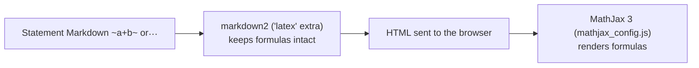

# Math Formulas (MathJax and Mathoid)

> LCOJ renders math with MathJax right in the browser, with no extra service to install. This page explains how it works, the formula syntax, and why you shouldn't enable Mathoid.
>
> ⏱ ~10 min · 👤 Operators, problem setters · 🔑 Just a browser; SSH + docker if you need to fix static files

::: info Do you need this?
This page explains **how LCOJ renders math** in problem statements, blog posts, and comments, and **why you don't need to install Mathoid**.

- LCOJ renders formulas **out of the box** with MathJax running in the browser. No extra service is required.
- Mathoid is DMOJ's server-side formula renderer. LCOJ currently **doesn't use it when rendering Markdown**, and enabling it can actually make formulas **stop rendering** (see [below](#mathoid-in-lcoj-today)).

If you are a problem setter, you only need the [Formula syntax](#formula-syntax) section.
:::

## Status in LCOJ

| Component | Status in the shipped config (`dmoj/config/local_settings.py`) |
|---|---|
| MathJax 3.2.0 (in the browser) | **Enabled**, static files served from `/static/vnoj/mathjax/3.2.0/` |
| Mathoid (`MATHOID_URL`) | **Disabled**: not set, so the `False` default from `dmoj/settings.py` applies |
| Mathoid service in `docker-compose.yml` | **Not present** |

## How LCOJ renders formulas



1. The server uses `markdown2` (VNOI's fork) with the `latex` extra. It recognizes `~...~` and `$$...$$` and **protects** the formula so Markdown doesn't mangle characters such as `_`, `*`, and `\`.
2. The HTML is sent to the browser with the original formula text.
3. MathJax (configured in `resources/mathjax_config.js`) renders the formulas in the browser.

## Formula syntax

| Type | Syntax | Notes |
|---|---|---|
| Inline math | `~...~` | The primary syntax; use this |
| Display math | `$$...$$` | Centered, on its own line |
| Inline (alternative) | `\(...\)` | Supported by MathJax, but Markdown may eat the `\`, so prefer `~...~` |

::: warning A single `$` is NOT math
`$a+b$` is displayed literally as `$a+b$`. Use `~a+b~` for inline math and `$$...$$` for display math.
:::

### Inline math

```markdown
Given two integers ~a~ and ~b~ ~(1 \le a, b \le 10^9)~.
```

### Display math

```markdown
The Fibonacci sequence is defined as:

$$F(n) = \begin{cases}
0, & n = 0 \\
1, & n = 1 \\
F(n-1) + F(n-2), & n \ge 2
\end{cases}$$
```

### Full example

```markdown
Given an integer ~N~ ~(1 \le N \le 10^{18})~, find the ~N~-th Fibonacci number
modulo ~10^9 + 7~.

$$F(n) = F(n-1) + F(n-2)$$

**Note:** For ~30\%~ of the points, ~N \le 10^6~.
```

### Common symbols

| Meaning | Write | Meaning | Write |
|---|---|---|---|
| Less than or equal | `~a \le b~` | Fraction | `~\frac{a}{b}~` |
| Greater than or equal | `~a \ge b~` | Power, subscript | `~a^{10}~`, `~a_{i,j}~` |
| Not equal | `~a \ne b~` | Sum | `~\sum_{i=1}^{n} a_i~` |
| Multiply | `~a \times b~` | Product | `~\prod_{i=1}^{n} a_i~` |
| Congruence | `~a \equiv b \pmod{m}~` | Root | `~\sqrt{x}~`, `~\sqrt[3]{x}~` |
| Floor / ceiling | `~\lfloor x \rfloor~`, `~\lceil x \rceil~` | Logarithm | `~\log n~` |

::: tip Colors
LCOJ's MathJax config loads the `color` package, so you can write `~\color{red}{x}~`.
:::

## Mathoid in LCOJ today

Mathoid ([upstream source](https://gitlab.wikimedia.org/repos/mediawiki/services/mathoid), formerly `github.com/wikimedia/mathoid`) is a Wikimedia Node.js service that renders TeX to SVG/MathML. DMOJ used it for server-side math rendering.

LCOJ currently doesn't use Mathoid when rendering Markdown. Setting `MATHOID_URL` only affects two things:

1. It shows the **Math engine** option on the edit-profile page.
2. When a user's engine is `auto` (the default) and the browser supports MathML, the engine becomes `mml`. The page then **does not load MathJax**, and the server doesn't render the formula either. Result: formulas show up as raw `~...~`.

::: danger Do not enable Mathoid
For now, setting `MATHOID_URL` does **not** improve formulas and can make them disappear for many browsers. Keep the default configuration.
:::

### If you are re-implementing this feature (optional, for developers)

Only do this on a development machine, after wiring the `MathoidMathParser` class (in `judge/utils/mathoid.py` in `dmoj/repo`) into the Markdown renderer.

1. Build a Mathoid image yourself from the upstream source following its README. Mathoid listens on port **10044** according to its `config.dev.yaml`. LCOJ does not ship this image.
2. Add the service to `dmoj/docker-compose.override.yml` (Compose merges this file with `docker-compose.yml` automatically when run from `dmoj/`) and attach it to the `site` network so the `site` container can reach it:

   ```yaml
   services:
     mathoid:
       image: my-mathoid:latest   # the image you built
       restart: unless-stopped
       networks: [site]
   ```

3. Set these in your settings file (see [Environment and configuration](/en/operate/environment)):

   ```python
   MATHOID_URL = 'http://mathoid:10044/'
   MATHOID_CACHE_ROOT = '/cache/mathoid/'   # a directory the site can write to
   MATHOID_CACHE_URL = '/mathoid/'          # public URL for that directory (needs an nginx location)
   ```

4. Run `docker compose up -d mathoid`, then `docker compose restart site`.

Other settings and their defaults (in `dmoj/settings.py`): `MATHOID_GZIP = False`, `MATHOID_MML_CACHE = None`, `MATHOID_CSS_CACHE = 'default'`, `MATHOID_DEFAULT_TYPE = 'auto'`, `MATHOID_MML_CACHE_TTL = 86400`.

## Verify

1. Open a problem statement with a formula written as `~...~` or `$$...$$`: it renders as math, with no raw `~` characters left.
2. Open DevTools (Network tab) and reload: `/static/vnoj/mathjax/3.2.0/es5/tex-chtml.min.js` returns status 200.
3. `dmoj/config/local_settings.py` has no `MATHOID_URL` line (the default `False` stays in effect).

## Troubleshooting

| Symptom | Common cause | Fix |
|---|---|---|
| `$a+b$` is shown literally | Single `$` delimiters | Change to `~a+b~` |
| `~a+b~` is shown literally on every page | MathJax failed to load | Open DevTools and check `/static/vnoj/mathjax/3.2.0/es5/tex-chtml.min.js`; if it returns 404, run `./scripts/copy_static`, then `docker compose restart nginx` |
| `~a+b~` is shown literally after setting `MATHOID_URL` | Engine switched to `mml`, so MathJax isn't loaded | Remove `MATHOID_URL`, then `docker compose restart site` |
| A formula shows a red error | Invalid LaTeX | Try the formula in an online LaTeX editor |
| Old statements look unchanged after a config change | Statement HTML is cached for up to 1 day | Save the problem again (saving clears the cache), or wait for it to expire |

## Next steps

- [Problem format](/en/setter/problem-format): write a complete statement, formulas included.
- [TikZ diagrams (Texoid)](/en/operate/texoid): the server-side renderer for TikZ/LaTeX diagrams.
- [Helper scripts](/en/operate/scripts): `copy_static` when MathJax static files return 404.

::: tip Need help?
Open an issue at [github.com/luyencode/lcoj-docker/issues](https://github.com/luyencode/lcoj-docker/issues), find more at [behitek.com](https://behitek.com), or contact us via [luyencode.net/about/#lien-he](https://luyencode.net/about/#lien-he).
:::
