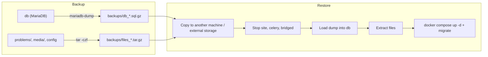

# Operating LCOJ

> Day-to-day tasks for a Docker-based LCOJ install: starting and stopping, reading logs, applying config changes, clearing the cache, backing up and restoring.
>
> ⏱ ~15 min to read; backup/restore time depends on data size · 👤 Operators · 🔑 SSH + permission to run `docker` on the server

::: tip
Run every command on this page from `lcoj-docker/dmoj/`. For the list of services and ports, see [Architecture](/en/operate/architecture); for the scripts in `scripts/`, see [Helper Scripts](/en/operate/scripts).
:::

## Before you start

- [ ] You have [installed LCOJ](/en/operate/installation) and the services are running (`docker compose ps`).
- [ ] You have SSH access to the server and can run `docker compose` (member of the `docker` group, or via `sudo`).
- [ ] Your shell is in `lcoj-docker/dmoj/`.
- [ ] You roughly know what a *service*, *container* and *volume* are. See the [Glossary](/en/start/glossary) if not.

## Start, stop and restart

| Task | Command |
|---|---|
| Start everything (recreates containers whose config changed) | `docker compose up -d` |
| Show status | `docker compose ps` |
| Restart one service | `docker compose restart site` |
| Pause / resume one service | `docker compose stop site` / `docker compose start site` |
| Stop and remove containers, keep data | `docker compose down` |

The `base` service only exists to build the shared image and always shows as exited. That's not an error.

### What does `docker compose down -v` delete? {#down-v}

The `-v` flag removes the **named volumes** declared in `docker-compose.yml`. LCOJ's primary data lives in bind-mounted host directories, which are not touched.

| Data | Stored in | Deleted by `down -v`? |
|---|---|---|
| Database | `./database/` (bind mount) | No |
| Test data | `./problems/` (bind mount) | No |
| Uploaded files | `./media/` (bind mount) | No |
| Source and config | `./repo/`, `./environment/`, `./nginx/` | No |
| Built CSS/JS, static files | `assets` volume | **Yes**, rebuild with `./scripts/copy_static` |
| User / contest data downloads | `userdatacache`, `contestdatacache` volumes | **Yes**, users have to request them again |
| Cache shared by site and nginx | `cache` volume | **Yes** |
| Redis data (cache, Celery queue) | `redis`'s anonymous volume | **Yes** |

::: danger
After `docker compose down -v`, the site has no CSS until you run `./scripts/copy_static` again. Wiping the database means deleting the `./database/` directory, which **cannot be undone**. [Back up](#backup) first.
:::

## Logs

```sh
docker compose logs -f site            # follow the site log
docker compose logs --tail=100 celery  # last 100 lines
docker compose logs --since 1h bridged # the last hour
docker compose logs -f                 # every service
```

Which service to check for each symptom:

| Symptom | Service |
|---|---|
| 500 errors, pages not loading | `site` |
| Background jobs (rejudges, data exports) stuck | `celery` |
| Judges can't connect, submissions stay queued | `bridged` |
| Results don't update live on the page | `wsevent` |
| 502 errors, static files 404 | `nginx` |

## Getting a shell

```sh
./scripts/enter_site               # bash shell in the site container
./scripts/manage.py dbshell        # SQL shell as the site's DB user
./scripts/manage.py <command>      # run a Django management command
```

To open a MariaDB shell as root without typing the password on the command line (the variables are already set inside the `db` container):

```sh
docker compose exec db sh -c 'MYSQL_PWD="$MYSQL_ROOT_PASSWORD" mariadb -u root "$MYSQL_DATABASE"'
```

::: info
The `db` service uses the `mariadb` image (latest tag). Use `mariadb`, `mariadb-dump`, `mariadb-admin` and `mariadb-check`. Since MariaDB 11, the official image no longer ships the legacy `mysql`, `mysqldump`, etc. names.
:::

For the list of management commands, see [Management Commands](/en/reference/management-commands).

## Applying config changes

| You changed | Then run |
|---|---|
| `environment/*.env` | `docker compose up -d` (`restart` does **not** reload env files) |
| `repo/dmoj/local_settings.py` | `docker compose restart site celery bridged` |
| `repo/uwsgi.ini` | `docker compose restart site` |
| `repo/websocket/config.js` | `docker compose restart wsevent` |
| `nginx/conf.d/nginx.conf` | `docker compose restart nginx` |
| SCSS, JS or images in `repo/resources/`, translations | `./scripts/copy_static`, then `docker compose restart site` |
| Python code, templates | `docker compose restart site celery bridged` |

Code changes don't need an image rebuild because `./repo` is bind-mounted into the containers. For when a rebuild is needed, see [Updating LCOJ](/en/operate/updating).

## Cache

LCOJ uses Redis: database 0 for the Django cache (`REDIS_CACHING_URL`) and database 1 for the Celery queue (`CELERY_BROKER_URL`). There is no `clear_cache` command. To clear the cache, use either of these:

::: code-group

```sh [Through Django]
docker compose exec site python3 manage.py shell -c "from django.core.cache import cache; cache.clear()"
```

```sh [Through Redis]
docker compose exec redis redis-cli -n 0 FLUSHDB
```

:::

::: warning
Don't use `FLUSHALL`. It also wipes database 1 and drops any pending Celery tasks.
:::

## Celery

```sh
docker compose exec celery celery -A dmoj_celery inspect active     # running tasks
docker compose exec celery celery -A dmoj_celery inspect scheduled  # scheduled tasks
docker compose restart celery
```

Celery runs with `--concurrency=2` (set in `celery/Dockerfile`).

## Backups {#backup}

Back up four things:

| Component | Location | Notes |
|---|---|---|
| Database | `db` container | Dump it with `mariadb-dump` while running; don't copy the raw `database/` directory |
| Test data | `problems/` | Usually the largest part |
| Uploaded files | `media/` | Images, PDFs, attachments |
| Configuration | `environment/*.env`, `repo/dmoj/local_settings.py`, `repo/uwsgi.ini`, `repo/websocket/config.js`, `nginx/conf.d/` | Contains secrets, so store it securely |

The overall backup and restore flow:



### Manual backup

1. Dump the database:

   ```sh
   mkdir -p backups
   docker compose exec -T db sh -c \
     'MYSQL_PWD="$MYSQL_ROOT_PASSWORD" exec mariadb-dump -u root --single-transaction "$MYSQL_DATABASE"' \
     | gzip > backups/db_$(date +%F_%H%M).sql.gz
   ```

2. Archive test data, uploads and config:

   ```sh
   tar -czf backups/files_$(date +%F_%H%M).tar.gz \
     problems media environment nginx/conf.d \
     repo/dmoj/local_settings.py repo/uwsgi.ini repo/websocket/config.js
   ```

3. Copy `backups/` to another machine or off-site storage. A backup on the same server won't help if the disk fails.

::: warning
`dmoj/backups/` contains secrets and is **not** in `.gitignore`. Add it to `.gitignore` (or keep backups outside the repo) so you never commit it by accident.
:::

### Automated backup

Save this as `dmoj/backup.sh` and `chmod +x` it:

```bash
#!/usr/bin/env bash
set -euo pipefail
cd "$(dirname "$0")"          # the dmoj/ directory

DEST=backups
STAMP=$(date +%F_%H%M)
mkdir -p "$DEST"

docker compose exec -T db sh -c \
  'MYSQL_PWD="$MYSQL_ROOT_PASSWORD" exec mariadb-dump -u root --single-transaction "$MYSQL_DATABASE"' \
  | gzip > "$DEST/db_$STAMP.sql.gz"

tar -czf "$DEST/files_$STAMP.tar.gz" \
  problems media environment nginx/conf.d \
  repo/dmoj/local_settings.py repo/uwsgi.ini repo/websocket/config.js

# Keep 7 days of backups
find "$DEST" -type f -mtime +7 -delete
```

Run it daily at 2 a.m. (`crontab -e`):

```cron
0 2 * * * /path/to/lcoj-docker/dmoj/backup.sh >> /var/log/lcoj_backup.log 2>&1
```

The `-T` flag on `docker compose exec` is required under cron, which has no terminal.

## Restoring {#restore}

### On the running server

1. Stop the services that write to the database, leaving `db` running:

   ```sh
   docker compose stop site celery bridged
   ```

2. Load the dump (this overwrites existing tables):

   ::: danger
   This step replaces the current data with the data in the backup.
   :::

   ```sh
   gunzip -c backups/db_2026-09-19_0200.sql.gz | docker compose exec -T db sh -c \
     'MYSQL_PWD="$MYSQL_ROOT_PASSWORD" exec mariadb -u root "$MYSQL_DATABASE"'
   ```

3. If needed, extract the files (run in `dmoj/`; paths in the archive are relative):

   ```sh
   tar -xzf backups/files_2026-09-19_0200.tar.gz
   ```

4. Start everything and check:

   ```sh
   docker compose up -d
   ./scripts/migrate          # only needed if the code is newer than the backup
   ```

### On a new server

1. Follow Steps 1–2 of [Installation](/en/operate/installation): install Docker, clone the repo.
2. In `dmoj/`, extract the file archive. This restores `problems/`, `media/`, `environment/`, the nginx config and the config files in `repo/` (no need to run `initialize`).
3. Build the images: `docker compose build base && docker compose build`.
4. Start `db` with an empty `database/` directory so MariaDB creates the database and user from `mysql.env`:

   ```sh
   docker compose up -d db
   docker compose logs -f db   # wait for "ready for connections"
   ```

5. Load the dump as in step 2 above.
6. Start the rest and rebuild static files:

   ```sh
   docker compose up -d site celery
   ./scripts/migrate
   ./scripts/copy_static
   docker compose up -d
   ```

## Maintenance page {#maintenance}

nginx is configured with `error_page 502 504 /502.html`, so when `site` is down, users see that page instead of a bare error. The simplest "maintenance mode" is therefore:

```sh
docker compose stop site      # users see 502.html
# ... do your maintenance ...
docker compose start site
```

The page lives at `repo/502.html`. After editing it, run `./scripts/copy_static` to copy it into the `assets` volume.

## Changing the database password {#change-db-password}

1. Change the password in MariaDB (replace `dmoj` if your `MYSQL_USER` differs):

   ```sh
   docker compose exec db sh -c 'MYSQL_PWD="$MYSQL_ROOT_PASSWORD" mariadb -u root'
   ```

   ```sql
   ALTER USER 'dmoj'@'%' IDENTIFIED BY '<new password>';
   ```

2. Update `MYSQL_PASSWORD` in `environment/mysql.env`.
3. Recreate the containers so they pick up the new password:

   ```sh
   docker compose up -d
   ```

## Verify

After a backup:

- `ls -lh backups/` shows new `db_*.sql.gz` and `files_*.tar.gz` files with a non-zero size.
- `gunzip -t backups/db_<timestamp>.sql.gz` reports no error (the archive is intact).
- `tar -tzf backups/files_<timestamp>.tar.gz | head` lists `problems/`, `media/`, `environment/`…

After starting/stopping, changing config or restoring:

- `docker compose ps` shows the services running (`base` being exited is normal).
- The home page loads with CSS; you can log in; a test submission gets a result that updates live.

::: tip
Every so often, restore a backup onto a test machine. A backup that has never been test-restored may not actually work.
:::

## Troubleshooting

| Symptom | Fix |
|---|---|
| CSS missing, static files 404 | `./scripts/copy_static && docker compose restart nginx` |
| Database connection errors | `docker compose ps db`, `docker compose logs db`, check `environment/mysql.env` |
| Celery tasks stuck | `docker compose logs -f celery`, then `docker compose restart celery` |
| Judging results don't update live | `docker compose ps wsevent`, check `EVENT_DAEMON_POST` |
| A container keeps restarting | `docker compose logs --tail=100 <service>` |
| Disk full | `docker image prune`, `docker builder prune`, check the size of `problems/` and `backups/` |

## Next steps

- [Updating LCOJ](/en/operate/updating): pull new code and rebuild images; back up first.
- [Environment Variables](/en/operate/environment): what each variable in `environment/*.env` means.
- [Management Commands](/en/reference/management-commands): the `./scripts/manage.py` commands used for administration.
- [Installation](/en/operate/installation): if you need to rebuild from scratch on a new server.

::: tip Need help?
Open an issue on [lcoj-docker](https://github.com/luyencode/lcoj-docker/issues), or reach us via [behitek.com](https://behitek.com) or [luyencode.net/about/#lien-he](https://luyencode.net/about/#lien-he).
:::
