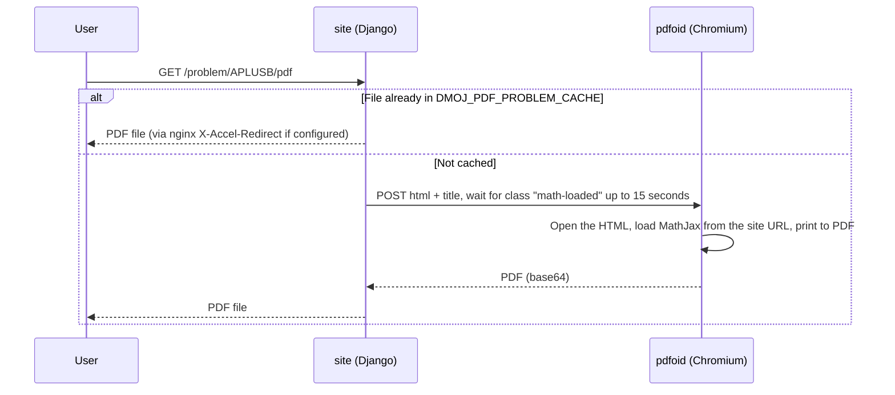

# Problem PDFs (Pdfoid)

> Install Pdfoid (optional) so the server generates statement PDFs at `/problem/<code>/pdf`. Without it, LCOJ still lets users print statements to PDF from the browser.
>
> ⏱ ~45 min · 👤 Operators · 🔑 SSH + docker access on the server

::: info Do you need this?
Pdfoid is a DMOJ service that uses headless Chromium to turn a problem statement's HTML into a PDF on the server.

- **LCOJ works fine without Pdfoid.** In that case, the **View as PDF** button on a problem page opens the print view `/problem/<code>/raw` and triggers the browser's print dialog, where users choose "Save as PDF".
- Only install Pdfoid if you need **stable, server-generated PDF links** (`/problem/<code>/pdf`), for example to hand out or batch-print statements for an onsite contest.
- If you already have a PDF of the statement, you don't need Pdfoid: use the PDF statement upload field (`statement_file`) when editing the problem.
:::

## Status in LCOJ

| Component | Status in the shipped config |
|---|---|
| `DMOJ_PDF_PDFOID_URL` | **Disabled**: only a commented-out example in `dmoj/config/local_settings.py` |
| `DMOJ_PDF_PROBLEM_CACHE`, `DMOJ_PDF_PROBLEM_INTERNAL` | **Disabled**: commented out |
| Pdfoid service in `docker-compose.yml` | **Not present** |
| "View as PDF" button | Uses the browser's print feature |

## How it works



Things to know:

- The HTML sent to Pdfoid is the `problem/raw.html` template. It loads MathJax **from your site's absolute URL** (for example `https://lcoj.example.com/static/...`), so the Pdfoid container **must be able to reach your website**.
- If `DMOJ_PDF_PROBLEM_CACHE` is set, PDFs are stored as `<CODE>.<language>.pdf` and are **deleted automatically when the problem is saved**. The next view renders a fresh copy.
- Rendering happens inside the uWSGI request (not in Celery).

## Before you start

- [ ] You really need server-generated PDF links (otherwise the browser's print button is enough).
- [ ] You can SSH in and run `docker compose` in the `dmoj/` directory.
- [ ] The server has enough RAM for headless Chromium, since every uncached render launches a new Chromium.
- [ ] The Pdfoid container will be able to reach your website (to load MathJax).
- [ ] You know how to change settings: see [Environment and configuration](/en/operate/environment).

## Installation (optional)

Pdfoid is not part of `docker-compose.yml`. You run it as a separate container on the same `site` network as the `site` container.

### Step 1: Build a Pdfoid image

Pdfoid is not on PyPI; install it directly from [github.com/DMOJ/pdfoid](https://github.com/DMOJ/pdfoid). It needs Chromium, ChromeDriver, and exiftool, and reads their paths from `CHROME_PATH`, `CHROMEDRIVER_PATH`, and `EXIFTOOL_PATH`.

Create `dmoj/addons/pdfoid/Dockerfile` (a starting point; try it on a development machine before using it for real):

```dockerfile
FROM python:3.11-slim
RUN apt-get update && \
    apt-get install -y --no-install-recommends \
        chromium chromium-driver libimage-exiftool-perl \
        fonts-dejavu fonts-liberation git && \
    rm -rf /var/lib/apt/lists/* && \
    pip install --no-cache-dir git+https://github.com/DMOJ/pdfoid.git && \
    useradd -m pdfoid
ENV CHROME_PATH=/usr/bin/chromium \
    CHROMEDRIVER_PATH=/usr/bin/chromedriver \
    EXIFTOOL_PATH=/usr/bin/exiftool
USER pdfoid
EXPOSE 8888
CMD ["pdfoid", "--port=8888", "--address=0.0.0.0"]
```

::: warning
Pdfoid listens on `localhost` by default. Inside a container you must pass `--address=0.0.0.0`.
:::

### Step 2: Add the service to Compose

Create (or extend) `dmoj/docker-compose.override.yml`. Compose merges it with `docker-compose.yml` automatically when you run commands from the `dmoj/` directory.

```yaml
services:
  pdfoid:
    build: ./addons/pdfoid
    restart: unless-stopped
    networks: [site]
```

### Step 3: Configure settings

The site reads `dmoj/repo/dmoj/local_settings.py`, which `./scripts/initialize` copies from `dmoj/config/local_settings.py`. Edit the file in `config/` and copy it again (or edit both); see [Environment and configuration](/en/operate/environment).

```python
DMOJ_PDF_PDFOID_URL = 'http://pdfoid:8888/'
```

### Step 4: Start it

```sh
cd dmoj
docker compose up -d --build pdfoid
docker compose restart site
```

## Enable the PDF cache (recommended once you use Pdfoid)

Without a cache, every PDF view launches a new Chromium. To cache:

1. Add a volume shared by `site` and `nginx` in `dmoj/docker-compose.override.yml`:

   ```yaml
   services:
     site:
       volumes:
         - pdfcache:/pdfcache/
     nginx:
       volumes:
         - pdfcache:/pdfcache/
   volumes:
     pdfcache:
   ```

2. Add an internal location to `dmoj/nginx/conf.d/nginx.conf`, the same way `/userdatacache` works today:

   ```nginx
   location /pdfcache {
       internal;
       root /;
   }
   ```

3. Configure settings:

   ```python
   DMOJ_PDF_PROBLEM_CACHE = '/pdfcache'      # must exist and be writable by the site
   DMOJ_PDF_PROBLEM_INTERNAL = '/pdfcache'   # nginx path used for X-Accel-Redirect
   ```

4. Recreate the `site` and `nginx` containers to attach the new volume (nginx also rereads its config when recreated):

   ```sh
   docker compose up -d site nginx
   ```

## Verify

1. Open any problem, for example `https://lcoj.example.com/problem/APLUSB`.
2. The **View as PDF** button now points to `/problem/APLUSB/pdf`.
3. Click it; after a few seconds the browser shows the PDF.
4. If you enabled the cache: the cache directory contains `APLUSB.<language>.pdf`, and the second view returns almost instantly.

## Pdfoid settings

| Setting | Default (`dmoj/settings.py`) | Meaning |
|---|---|---|
| `DMOJ_PDF_PDFOID_URL` | `None` | Pdfoid URL. Anything other than `None` enables the feature |
| `DMOJ_PDF_PROBLEM_CACHE` | `None` | PDF cache directory (optional) |
| `DMOJ_PDF_PROBLEM_INTERNAL` | `None` | Internal nginx path mapped to the cache directory (optional) |

::: warning Only the three settings above have any effect
Some other DMOJ guides mention `DMOJ_PDF_PROBLEM_TIMEOUT`, `DMOJ_PDF_PROBLEM_EXTRA_CSS`, `DMOJ_PDF_PROBLEM_HEADER`, `DMOJ_PDF_PROBLEM_FOOTER`, `DMOJ_PDF_PROBLEM_CACHE_TIME`, `DMOJ_PDF_PROBLEM_COMPRESS`, and `DMOJ_PDF_PDFOID_URLS`. LCOJ **does not read** any of them, so setting them does nothing. The MathJax wait is fixed at 15 seconds; to change it, edit `judge/utils/pdfoid.py` in `dmoj/repo`.
:::

## Usage

| How | Example |
|---|---|
| Current UI language | `https://lcoj.example.com/problem/APLUSB/pdf` |
| Specific language (`vi` or `en`) | `https://lcoj.example.com/problem/APLUSB/pdf/vi` |
| Management command, writes `APLUSB.pdf` into `dmoj/repo/` | `./scripts/manage.py render_pdf APLUSB -l vi` |

::: tip
The PDF view checks access the same way the problem page does: anyone who can't see the problem gets a 404.
:::

## Troubleshooting

| Symptom | Common cause | Fix |
|---|---|---|
| `/problem/<code>/pdf` returns 404 | `DMOJ_PDF_PDFOID_URL` not set, or `site` not restarted | Check settings, run `docker compose restart site` |
| Error 500 with `ConnectionError` in the `site` log | The site can't reach Pdfoid | `docker compose ps pdfoid`; make sure it's on the `site` network and listening on `0.0.0.0` |
| Log says `PDF rendering timed out` | Chromium couldn't load MathJax from the site URL within 15 seconds | Make sure the Pdfoid container can reach your website (DNS, internet access, firewall) |
| Pdfoid log shows Chromium failing to start (sandbox) | Docker restrictions on the Chromium sandbox | Run as a non-root user (as in the Dockerfile above); if it still fails, see Chromium's docs on sandboxing in containers |
| Vietnamese text renders with wrong glyphs | Missing fonts in the image | Install more fonts (`fonts-dejavu`, `fonts-noto`) and rebuild |
| An edited statement still shows the old PDF | Cached files are only removed when the problem is saved | Save the problem again, or delete `<CODE>.<language>.pdf` from the cache directory |

View logs with `docker compose logs -f pdfoid` and `docker compose logs -f site` (logger `judge.problem.pdf`).

## Next steps

- [Math formulas](/en/operate/mathoid): MathJax is also what Pdfoid waits for.
- [Architecture](/en/operate/architecture): where `site`, `nginx` and the networks sit in the stack.
- [Management commands](/en/reference/management-commands): `render_pdf` and other commands.

::: tip Need help?
Open an issue at [github.com/luyencode/lcoj-docker/issues](https://github.com/luyencode/lcoj-docker/issues), find more at [behitek.com](https://behitek.com), or contact us via [luyencode.net/about/#lien-he](https://luyencode.net/about/#lien-he).
:::
