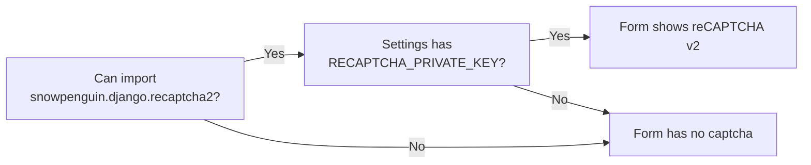

# Blocking Signup Spam with reCAPTCHA

> Turn on the "I'm not a robot" box (reCAPTCHA v2) for the password signup form. You only need this after turning off `OAUTH_ONLY`; LCOJ's default configuration doesn't need it.
>
> ⏱ ~30 min · 👤 Operators · 🔑 SSH + docker access on the server, a Google account

::: info Do you need this?
reCAPTCHA adds an "I'm not a robot" box to the **username/password signup form** to stop bots from creating junk accounts.

- **LCOJ doesn't need reCAPTCHA today.** The shipped config sets `OAUTH_ONLY = True`, so the traditional signup form is hidden and users can only sign up through OAuth (Google). Google already verifies those accounts for you.
- Only read on if you **turn off `OAUTH_ONLY`** to reopen password-based signup.
:::

## Status in LCOJ

| Component | Status |
|---|---|
| `OAUTH_ONLY` in `dmoj/config/local_settings.py` | `True`: the traditional signup form is hidden |
| Python package `django-recaptcha2` | **Not installed**: not in `requirements.txt` or `additional_requirements.txt` |
| `RECAPTCHA_PUBLIC_KEY`, `RECAPTCHA_PRIVATE_KEY` | **Not set** |
| Result | reCAPTCHA is **off** |

## How LCOJ integrates reCAPTCHA

LCOJ decides whether to show a captcha like this:

1. LCOJ tries to import `snowpenguin.django.recaptcha2`. That module comes from the PyPI package **`django-recaptcha2`**.
2. If the import succeeds **and** settings has a `RECAPTCHA_PRIVATE_KEY` attribute, the signup form gets a `captcha` field (a reCAPTCHA **v2 checkbox** widget).
3. If either condition is missing, the form has no captcha and nothing is reported.



::: warning Don't mix up the two packages
- LCOJ uses **`django-recaptcha2`** (module `snowpenguin.django.recaptcha2`), which supports reCAPTCHA v2 only.
- The **`django-recaptcha`** package (module `django_recaptcha`, which has reCAPTCHA v3) is **not** used by LCOJ. Installing it won't make a captcha appear.
:::

::: details A note on `OAUTH_ONLY`
`OAUTH_ONLY` currently only hides the input fields on the signup page; `/accounts/register/` still accepts a signup form posted to it directly. If you're worried about bots posting the form directly, enable reCAPTCHA as described on this page.
:::

## Before you start

- [ ] You plan to turn off `OAUTH_ONLY` to reopen password signup (see [OAuth](/en/start/glossary)).
- [ ] You can SSH into the server and run `docker compose` in the `dmoj/` directory.
- [ ] You have a Google account to create reCAPTCHA keys.
- [ ] You have a development machine to try it first (`django-recaptcha2` only declares support up to Django 2.1).

## Enabling reCAPTCHA (only after turning off `OAUTH_ONLY`)

::: warning Try it on a development machine first
`django-recaptcha2` (latest release 1.4.1) only declares support up to Django 2.1, while LCOJ runs Django 4.2. Try it on a development machine before enabling it in production.
:::

### Step 1: Get keys from Google

1. Go to the [reCAPTCHA admin](https://www.google.com/recaptcha/admin) and sign in with a Google account.
2. Create a new site:
   - **Label**: `LCOJ`
   - **Type**: reCAPTCHA **v2**, _"I'm not a robot" Checkbox_
   - **Domains**: your domain, for example `lcoj.example.com` (add your dev domain if needed)
3. Keep the **Site key** (public) and **Secret key** (private).

### Step 2: Install the Python package

Add one line to `dmoj/repo/additional_requirements.txt`:

```text
django-recaptcha2
```

Then rebuild the images (from the `dmoj/` directory):

```sh
docker compose up -d --build base site celery
```

### Step 3: Put the keys in the configuration

`local_settings.py` does **not** read `RECAPTCHA_*` from environment variables on its own. To keep secrets out of the file, read them from the environment explicitly.

1. Add to `dmoj/environment/site.env`:

   ```env
   RECAPTCHA_PUBLIC_KEY=<site key>
   RECAPTCHA_PRIVATE_KEY=<secret key>
   ```

2. Add to `dmoj/config/local_settings.py`, then copy it to `dmoj/repo/dmoj/local_settings.py` (the file the site actually reads):

   ```python
   if os.environ.get('RECAPTCHA_PRIVATE_KEY'):
       INSTALLED_APPS += ('snowpenguin.django.recaptcha2',)
       RECAPTCHA_PUBLIC_KEY = os.environ['RECAPTCHA_PUBLIC_KEY']
       RECAPTCHA_PRIVATE_KEY = os.environ['RECAPTCHA_PRIVATE_KEY']
   ```

   - The `if` block matters: LCOJ enables the captcha as soon as `RECAPTCHA_PRIVATE_KEY` **exists**, even if it's empty.
   - `INSTALLED_APPS` needs this app so the `snowpenguin/recaptcha/recaptcha_init.html` template can be found.

3. Set `OAUTH_ONLY = False` if you want to reopen the password signup form.

See also [Environment and configuration](/en/operate/environment).

### Step 4: Restart

`docker compose restart` does **not** reread `site.env`. Use `up -d` to recreate the containers:

```sh
cd dmoj
docker compose up -d site celery
```

## Verify

1. Open `https://lcoj.example.com/accounts/register/` in a private window.
2. The "I'm not a robot" box appears at the bottom of the form.
3. Try registering a test account.

## Troubleshooting

| Symptom | Cause | Fix |
|---|---|---|
| No captcha box | `OAUTH_ONLY = True` (form hidden), `django-recaptcha2` not installed, or `RECAPTCHA_PRIVATE_KEY` missing | Check each condition above |
| Error 500 `TemplateDoesNotExist` | `'snowpenguin.django.recaptcha2'` missing from `INSTALLED_APPS` | Add it as in Step 3 |
| Import error when `site` starts | The package is incompatible with Django 4.2 | Remove it from `additional_requirements.txt`, rebuild, and keep `OAUTH_ONLY = True` |
| Google says "Invalid domain for site key" | Domain not registered in the reCAPTCHA admin | Add the domain and retry |
| Captcha always fails | Wrong secret key, or the container has no internet access | Check `site.env`, see `docker compose logs -f site` |

## Security

- Never commit the secret key to git. Keep it in `dmoj/environment/site.env` (already gitignored).
- Watch new-account counts to catch spam early.

## Next steps

- [Environment and configuration](/en/operate/environment): how `site.env` and `local_settings.py` work together.
- [Updating LCOJ](/en/operate/updating): rebuild images after changing `additional_requirements.txt`.
- [Managing users](/en/admin/users): clean up junk accounts that slipped through.

::: tip Need help?
Open an issue at [github.com/luyencode/lcoj-docker/issues](https://github.com/luyencode/lcoj-docker/issues), find more at [behitek.com](https://behitek.com), or contact us via [luyencode.net/about/#lien-he](https://luyencode.net/about/#lien-he).
:::
