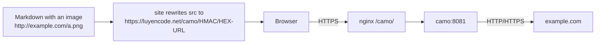

# Proxying External Images over HTTPS (Camo)

::: info Do you need this?
When a statement, blog post, or comment embeds an image from another website (especially an `http://` image), browsers may block it or show a "mixed content" warning because LCOJ is served over HTTPS. The image host also sees every viewer's IP address.

[Camo](https://github.com/atmos/camo) is an image proxy: LCOJ rewrites external image links so browsers load them through your own Camo server, over HTTPS.

- **LCOJ works fine without Camo.** External images still show up when their source uses HTTPS.
- A simpler approach: encourage people to **upload images to LCOJ** with the editor's image button instead of linking external ones.
:::

## Status in LCOJ

| Component | Status |
|---|---|
| `DMOJ_CAMO_URL`, `DMOJ_CAMO_KEY`, `DMOJ_CAMO_EXCLUDE`, `DMOJ_CAMO_HTTPS` | **Commented out** in `dmoj/config/local_settings.py` (disabled) |
| Camo service in `docker-compose.yml` | **Not present** |
| `location /camo/` in `dmoj/nginx/conf.d/nginx.conf` | **Not present** |

## How it works



- While rendering Markdown, LCOJ (`judge/utils/camo.py`) rewrites the `src` and `data-src` attributes of `` tags and the `data` attribute of `<object>` tags.
- The new URL looks like `<DMOJ_CAMO_URL>/<HMAC-SHA1 signature>/<hex-encoded original URL>`. Camo verifies the signature with `CAMO_KEY`, so outsiders can't use your Camo to proxy arbitrary links.
- **Not** rewritten: relative paths (for example `/martor/a.png`), URLs starting with `DMOJ_CAMO_URL`, and URLs starting with any prefix in `DMOJ_CAMO_EXCLUDE`.
- Every LCOJ Markdown style (statements, blogs, comments, profiles, and so on) has `use_camo` enabled, so once configured it applies everywhere.

## Installation (optional)

Camo is not part of `docker-compose.yml`. You run it as a separate container on the `nginx` network so nginx can forward `/camo/` to it.

### Step 1: Generate a secret key

```sh
openssl rand -hex 32
```

The same key is used by Camo (`CAMO_KEY`) and by LCOJ (`DMOJ_CAMO_KEY`).

### Step 2: Store the key in env files

Create `dmoj/environment/camo.env` (this directory is already gitignored):

```env
CAMO_KEY=<the key you generated>
```

Add to `dmoj/environment/site.env`:

```env
DMOJ_CAMO_KEY=<the same key>
```

::: warning
Use a separate env file for Camo. Don't let the Camo container read `site.env`, since it contains the site's secrets.
:::

### Step 3: Add the service to Compose

The [atmos/camo](https://github.com/atmos/camo) repo ships a `Dockerfile` (based on `node:8.4`, which is quite old). Compose can build straight from Git. Create or extend `dmoj/docker-compose.override.yml`:

```yaml
services:
  camo:
    build: https://github.com/atmos/camo.git
    restart: unless-stopped
    env_file: [environment/camo.env]
    environment:
      CAMO_LENGTH_LIMIT: "5242880"   # 5 MB limit (the default)
    networks: [nginx]
```

### Step 4: Add an nginx location

Inside the `server` block of `dmoj/nginx/conf.d/nginx.conf`:

```nginx
location /camo/ {
    proxy_pass http://camo:8081/;
}
```

The trailing `/` on `proxy_pass` strips the `/camo` prefix before the request reaches Camo.

### Step 5: Configure LCOJ

Add to `dmoj/config/local_settings.py`, then copy it to `dmoj/repo/dmoj/local_settings.py` (the file the site actually reads; see [Environment and configuration](/en/operate/environment)):

```python
DMOJ_CAMO_URL = 'https://luyencode.net/camo'
DMOJ_CAMO_KEY = os.environ.get('DMOJ_CAMO_KEY')
# URL prefixes that should not be proxied. MUST be a tuple (not a list).
DMOJ_CAMO_EXCLUDE = ('https://luyencode.net/', 'http://luyencode.net/')
# Treat //host/... URLs as https://
DMOJ_CAMO_HTTPS = True
```

| Setting | Default (`dmoj/settings.py`) | Notes |
|---|---|---|
| `DMOJ_CAMO_URL` | `None` | Public URL of Camo, no trailing `/` needed |
| `DMOJ_CAMO_KEY` | `None` | Must match `CAMO_KEY`. If the URL or key is missing, Camo is off |
| `DMOJ_CAMO_EXCLUDE` | `()` | A tuple of **URL prefixes** (including `https://`), not bare domain names |
| `DMOJ_CAMO_HTTPS` | `False` | Use `https:` for URLs starting with `//` |

### Step 6: Start it

```sh
cd dmoj
docker compose up -d --build camo
docker compose up -d site nginx      # recreate site so it reads the new site.env
docker compose restart nginx         # load location /camo/ if nginx wasn't recreated
```

### Step 7: Verify

1. Generate a Camo URL with the management command:

   ```sh
   ./scripts/manage.py camo http://example.com/image.png
   ```

   It prints a URL like `https://luyencode.net/camo/<hmac>/<hex>`. If it says `Camo not available`, `DMOJ_CAMO_URL` or `DMOJ_CAMO_KEY` has no value.
2. Open that URL in a browser; the image should load.
3. Post a test comment with an external image and view the page source: `src` should start with `https://luyencode.net/camo/`.

::: tip Old pages still show the original links?
Statement HTML and some other pages are cached for up to 1 day. Save the problem again or wait for the cache to expire.
:::

## Camo environment variables

From the [atmos/camo](https://github.com/atmos/camo#configuration) README:

| Variable | Default | Meaning |
|---|---|---|
| `PORT` | `8081` | Port Camo listens on |
| `CAMO_KEY` | a publicly known default key | Key used to verify HMAC signatures. **Always set it**; never rely on the default |
| `CAMO_LENGTH_LIMIT` | `5242880` | Maximum `Content-Length` (bytes) that will be proxied |
| `CAMO_MAX_REDIRECTS` | `4` | Maximum number of redirects to follow |
| `CAMO_SOCKET_TIMEOUT` | `10` | Seconds to wait before giving up |
| `CAMO_LOGGING_ENABLED` | `disabled` | Set to `debug` for verbose logs |
| `CAMO_HEADER_VIA` | `Camo Asset Proxy <version>` | Value of the `Via` and `User-Agent` headers sent to image hosts |
| `CAMO_TIMING_ALLOW_ORIGIN` | (not set) | Value of the `Timing-Allow-Origin` header returned to browsers |
| `CAMO_HOSTNAME` | `unknown` | Value of the `Camo-Host` header |
| `CAMO_KEEP_ALIVE` | `false` | Enable keep-alive |

Camo **filters** content types against its built-in list of image MIME types (`mime-types.json`); there is no variable to change that list.

## Caching and load limits

Camo has **no cache of its own**. `CAMO_HEADER_VIA` and `CAMO_TIMING_ALLOW_ORIGIN` are just headers and have nothing to do with caching. If you need them:

- **Rate limiting** with nginx. Put `limit_req_zone` at the top of `nginx.conf` (outside the `server` block), then use it in the location:

  ```nginx
  limit_req_zone $binary_remote_addr zone=camo:10m rate=10r/s;

  server {
      # ...
      location /camo/ {
          limit_req zone=camo burst=20;
          proxy_pass http://camo:8081/;
      }
  }
  ```

- **Caching** with nginx `proxy_cache`, or a Cloudflare cache rule for the `/camo/` path.

## Troubleshooting

| Symptom | Cause | Fix |
|---|---|---|
| Image links aren't rewritten | `DMOJ_CAMO_URL`/`DMOJ_CAMO_KEY` missing, or the page is cached | Run `./scripts/manage.py camo <url>` to check; save the problem again |
| `TypeError` mentioning `startswith` | `DMOJ_CAMO_EXCLUDE` is a list | Make it a tuple |
| `/camo/...` returns an LCOJ 404 | No `location /camo/` in nginx | Add the location, then `docker compose restart nginx` |
| `/camo/...` returns 502 | The Camo container isn't running or isn't on the `nginx` network | `docker compose ps camo`, `docker compose logs -f camo` |
| Camo returns 404 (set `CAMO_LOGGING_ENABLED=debug` to see a `checksum mismatch` log) | `CAMO_KEY` differs from `DMOJ_CAMO_KEY` | Use the same key and recreate the containers |
| Some images still don't load | The host blocks proxies, the image is over 5 MB, or it isn't an image | Upload the image to LCOJ instead of linking it |

## Notes

- Camo uses your bandwidth, because every external image passes through your server.
- Camo only proxies images; don't use it for video.

::: tip Need help?
Open an issue at [github.com/luyencode/lcoj-docker/issues](https://github.com/luyencode/lcoj-docker/issues), find more at [behitek.com](https://behitek.com), or contact us via [luyencode.net/about/#lien-he](https://luyencode.net/about/#lien-he).
:::
