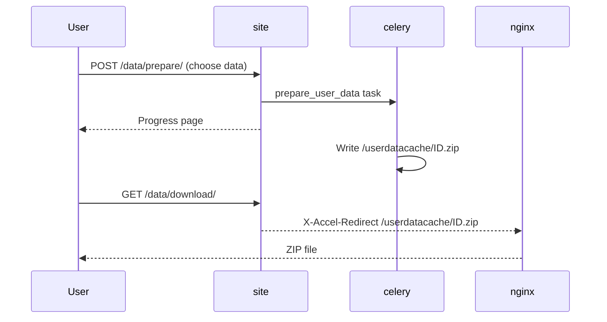

# User Data Download

::: info Do you need this?
This feature lets each user download a ZIP file with the **source code of their submissions** and **their comments**.

- **LCOJ ships with this feature enabled**, with nginx and the Docker volume already configured. You don't need to do anything to make it work.
- Read this page if you want to **change the rate limit**, **turn the feature off**, **clean up old files**, or troubleshoot user reports.
:::

## Status in LCOJ

| Component | Value in the shipped config |
|---|---|
| `DMOJ_USER_DATA_DOWNLOAD` | `True` (the default in `dmoj/settings.py` is `False`) |
| `DMOJ_USER_DATA_CACHE` | `'/userdatacache'` |
| `DMOJ_USER_DATA_INTERNAL` | `'/userdatacache'` |
| `DMOJ_USER_DATA_DOWNLOAD_RATELIMIT` | `datetime.timedelta(days=1)` |
| `userdatacache` volume | Mounted into `site`, `celery`, and `nginx` at `/userdatacache/` |
| nginx | Already has `location /userdatacache { internal; root /; }` |

## How it works



1. The ZIP file is built by **Celery**, not by `site`. That's why `celery` also needs access to the cache directory.
2. Each user has only **one file**, named `<profile id>.zip`. A new request overwrites the previous file.
3. The nginx location is marked `internal`, so nobody can fetch files directly via `/userdatacache/...`. Files are only served through `/data/download/`, which requires login and only returns the requesting user's own file.

## Guide for users

1. Sign in and open **Edit profile** (`/edit/profile/`).
2. Click the **Download your data** link. It leads to `/data/prepare/`.
3. Choose what to download:
   - **Download comments?**: your comments.
   - **Download submissions?**: your submissions. You can filter by problem code (a glob such as `APLUS*`; default `*`) and by result (AC, WA, ...; leave empty to include everything).
4. Submit the form and wait for the progress page to finish.
5. Click the download button. The file is named `<username>-data.zip`.

::: tip Rate limit
After each request, a user has to wait `DMOJ_USER_DATA_DOWNLOAD_RATELIMIT` (1 day) before preparing a new file. An already prepared file can be downloaded again at any time. If the file is removed from the cache, the user may prepare a new one immediately.
:::

## ZIP contents

```text
<username>-data.zip
├── submissions/
│   ├── info.json          # details for every submission, keyed by id
│   ├── 123456.cpp         # source code, extension depends on the language
│   └── ...
└── comments/
    ├── info.json          # details for every comment, keyed by id
    ├── 789.txt            # comment body
    └── ...
```

Each entry in `submissions/info.json`:

```json
{
    "123456": {
        "problem": "APLUSB",
        "date": "2026-01-01T00:00:00+00:00",
        "time": 0.01,
        "memory": 2048.0,
        "language": "CPP17",
        "status": "D",
        "result": "AC",
        "case_points": 100.0,
        "case_total": 100.0
    }
}
```

Each entry in `comments/info.json` has `date`, `related_object` (`problem`, `contest`, `blog post`, or `problem editorial`), `page`, and `score`.

## Changing the configuration

These settings live in `dmoj/config/local_settings.py`. The site reads the copy at `dmoj/repo/dmoj/local_settings.py` (copied by `./scripts/initialize`). Edit the file in `config/` and copy it again, or edit both. `local_settings.py` does **not** read these settings from environment variables. See [Environment and configuration](/en/operate/environment).

| Goal | Change |
|---|---|
| Allow a new file every 7 days | `DMOJ_USER_DATA_DOWNLOAD_RATELIMIT = datetime.timedelta(days=7)` |
| Turn the feature off | `DMOJ_USER_DATA_DOWNLOAD = False` (the link disappears and `/data/...` returns 404) |

After editing, restart both `site` and `celery` (celery builds the files, so it needs the new config too):

```sh
cd dmoj
docker compose restart site celery
```

::: warning Don't change the paths unless you have to
`/userdatacache` must match the volume in `docker-compose.yml` and the location in `nginx.conf`. If you change `DMOJ_USER_DATA_CACHE` or `DMOJ_USER_DATA_INTERNAL`, update both of those as well, then run `docker compose up -d site celery nginx`.
:::

## Cleaning up old files

LCOJ **does not delete** ZIP files automatically. Each user has only one file, so storage doesn't grow without bound, but files stay in the volume after users download them. Clean up periodically.

Run it manually (from the `dmoj/` directory):

```sh
docker compose exec -T site find /userdatacache/ -type f -name '*.zip' -mtime +2 -delete
```

Or add a cron job on the host (`crontab -e`), adjusting the path:

```cron
0 */4 * * * cd /path/to/lcoj-docker/dmoj && docker compose exec -T site find /userdatacache/ -type f -name '*.zip' -mtime +2 -delete
```

- `0 */4 * * *`: runs at minute 0, every 4 hours.
- `-mtime +2`: only deletes files older than about 2 days.

::: tip Choosing a retention time
Keep files **longer** than `DMOJ_USER_DATA_DOWNLOAD_RATELIMIT`. Since users can prepare a new file as soon as theirs is deleted, deleting too early defeats the rate limit.
:::

## Troubleshooting

| Symptom | Cause | Fix |
|---|---|---|
| No "Download your data" link | Feature disabled, or the account is muted (muted users get 404) | Check `DMOJ_USER_DATA_DOWNLOAD` and the mute status |
| Progress page never finishes | Celery isn't running | `docker compose ps celery`, `docker compose logs -f celery` |
| Task fails with `No such file or directory` | Celery can't see `/userdatacache` | Make sure the `userdatacache` volume is mounted into `celery` |
| `/data/download/` returns 404 | The file hasn't been prepared or was cleaned up | Prepare it again from `/data/prepare/` |
| Download is empty or nginx returns 404 | nginx can't see the file | Make sure the volume is mounted into `nginx` and the `/userdatacache` location exists in `nginx.conf` |
| User is told to wait | `DMOJ_USER_DATA_DOWNLOAD_RATELIMIT` hasn't elapsed | Wait, or download the previously prepared file |

::: tip Need help?
Open an issue at [github.com/luyencode/lcoj-docker/issues](https://github.com/luyencode/lcoj-docker/issues), find more at [behitek.com](https://behitek.com), or contact us via [luyencode.net/about/#lien-he](https://luyencode.net/about/#lien-he).
:::
