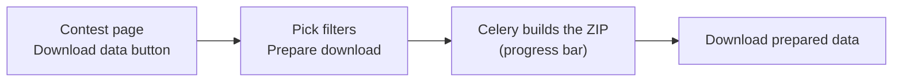

# Contest Data Download

After a contest ends, its organizers can download **the source code of contestants' submissions** as a ZIP file, for example to archive it, re-judge it offline or check for cheating.

## Who can use it?

You must be logged in and able to edit the contest, meaning one of:

| Case | Requirement |
|---|---|
| Contest author or curator | Has the `judge.edit_own_contest` permission |
| Administrator | Has the `judge.edit_all_contest` permission |

See also [Permissions](/en/admin/permissions).

In addition:

- The contest must have **ended**. Before that, the page says *"Please wait until the contest has ended to download data."*
- The feature must be enabled (`DMOJ_CONTEST_DATA_DOWNLOAD = True`). When it is off, the URLs below return 404.

## How to download



1. Open the contest page. Users who can edit the contest see a **Download data** button on it.
2. The **Download contest data** page (`/contest/<contest key>/data/prepare/`) has these options:
   - **Download submissions?** (checked by default): must be checked.
   - **Filter by problem code glob:** a glob on problem codes, `*` (everything) by default. For example, `LC*` only includes problems whose code starts with `LC`.
   - **Filter by result:** result codes (AC, WA…). *Leave empty to include all submissions.*
3. Click **Prepare download**. You are taken to a progress page while Celery builds the archive.
4. When it is done, click **Download prepared data** (`/contest/<contest key>/data/download/`). The file is named `<contest key>-data.zip`.

::: warning Result filter
In the current code, **Filter by result** filters the contest submission table, which has no `result` field, so the task may fail when you use it. If the task fails, leave the result filter empty.
:::

## Rate limit

Each **contest** (not each user) can prepare new data once per `DMOJ_CONTEST_DATA_DOWNLOAD_RATELIMIT` (1 day by default). You can prepare again sooner if the previous ZIP file is no longer on disk. You cannot start a new task while one is still running.

While you wait, the page still lets you download the previously prepared file.

## What's in the ZIP

The archive only contains the **source code** of submissions from **official** participants (no virtual participants or spectators). There is no CSV, scoreboard or score data.

```
<contest key>-data.zip
├── alice/
│   ├── APLUSB.cpp               ← alice's highest-scoring submission for APLUSB
│   ├── SORTING.py
│   └── $History/
│       ├── APLUSB_123457.cpp    ← other submissions: <problem code>_<submission ID>.<ext>
│       └── APLUSB_123460.py
└── bob/
    └── APLUSB.java
```

| Rule | Details |
|---|---|
| Top-level folder | The contestant's username |
| `<problem code>.<ext>` | The highest-scoring submission for that problem (ties go to the lowest submission ID) |
| `$History/<problem code>_<ID>.<ext>` | Every other submission for that problem |
| File extension | The extension of the chosen language (e.g. `cpp`, `py`, `java`) |
| File-upload languages | For languages that submit a file, LCOJ puts the original uploaded file in the ZIP |

## Configuration (for operators)

The settings live in the site's `dmoj/local_settings.py` (with Docker, `dmoj/repo/dmoj/local_settings.py`, copied from `dmoj/config/local_settings.py` by `./scripts/initialize`). They are **not** read from environment variables, so putting them in `environment/site.env` has no effect.

| Setting | Default in `settings.py` | Value in LCOJ's Docker config | Meaning |
|---|---|---|---|
| `DMOJ_CONTEST_DATA_DOWNLOAD` | `False` | `True` | Turns the feature on or off |
| `DMOJ_CONTEST_DATA_CACHE` | `''` | `'/contestdatacache'` | Directory for the ZIP files, one `<contest ID>.zip` per contest |
| `DMOJ_CONTEST_DATA_INTERNAL` | `''` | `'/contestdatacache'` | nginx internal path used for `X-Accel-Redirect` |
| `DMOJ_CONTEST_DATA_DOWNLOAD_RATELIMIT` | `timedelta(days=1)` | `timedelta(days=1)` | Minimum time between two preparations for the same contest |

```python
# dmoj/local_settings.py
DMOJ_CONTEST_DATA_DOWNLOAD = True
DMOJ_CONTEST_DATA_CACHE = '/contestdatacache'
DMOJ_CONTEST_DATA_INTERNAL = '/contestdatacache'
DMOJ_CONTEST_DATA_DOWNLOAD_RATELIMIT = datetime.timedelta(days=1)
```

In `docker-compose.yml`, the `contestdatacache` volume is mounted at `/contestdatacache/` in all three of `site`, `celery` (which writes the file) and `nginx` (which serves it). nginx already has an internal location:

```nginx
location /contestdatacache {
    internal;
    root /;
}
```

When the site runs behind nginx, Django only returns an `X-Accel-Redirect` header and nginx sends the file directly. Otherwise, Django reads and returns the file itself.

After editing `local_settings.py`, restart site and celery (run from `dmoj/`):

```sh
docker compose restart site celery
```

## Cleaning up old files

Each contest has only one ZIP file (a new preparation overwrites the old one), but LCOJ does **not** delete these files. You can periodically remove files older than 2 days:

::: warning
This command permanently deletes prepared ZIP files. Organizers will have to prepare them again if needed.
:::

```sh
# Run from dmoj/
docker compose exec site find /contestdatacache/ -type f -mtime +2 -delete
```

Example cron entry that runs every 4 hours:

```
0 */4 * * * docker compose -f /path/to/lcoj-docker/dmoj/docker-compose.yml exec -T site find /contestdatacache/ -type f -mtime +2 -delete
```

## Troubleshooting

| Symptom | Cause / fix |
|---|---|
| No **Download data** button | The feature is off, or you cannot edit the contest. |
| 403 page saying to wait until the contest ends | The contest has not ended yet. |
| Progress bar does not move | Check `docker compose ps celery` and `docker compose logs -f celery`. |
| Task fails right after starting | Try leaving **Filter by result** empty (see the warning above); check write permissions on the cache directory. |
| Download returns 404 | The ZIP has not been built yet or was cleaned up; prepare it again. |

## Security and privacy

- The ZIP contains contestants' source code. Do not share it publicly without their consent.
- The file can only be downloaded through the Django URL (which checks permissions); the nginx location is `internal`, so it cannot be accessed directly.
- Users download their own personal data with a separate feature, see [User Data Download](/en/operate/user-data-download).
