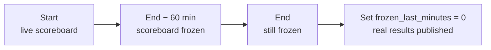

# Contest Formats

A contest format decides **how points are calculated** and **how ties are broken** on the scoreboard. LCOJ ships 7 formats, inherited from DMOJ and VNOJ.

## Which format should I pick?

| Key (`format_name`) | Display name | Score per problem | Tie-break | Default penalty | Scoreboard freeze | Problem labels | Good for |
|---|---|---|---|---|---|---|---|
| `default` | Default | Best score | Sum of **last** submission times on scored problems | None | No | 1, 2, 3… | Practice rounds, simple contests |
| `ioi` | IOI (pre-2016) | Best score of a single submission | Optional (default: no tie-break) | None | No | 1, 2, 3… | Old-style IOI, problems without subtasks |
| `ioi16` | IOI | Sum of the best score of **each subtask** across all submissions | Optional (default: no tie-break) | None | No | 1, 2, 3… | Olympiad-style contests with subtasks |
| `ecoo` | ECOO | **Last** submission's score + bonuses | Optional (default: no tie-break) | None (bonuses instead) | No | 1, 2, 3… | Contests that reward early solves |
| `atcoder` | AtCoder | Best score | Time of last score change + penalty | 5 min per wrong try | No | 1, 2, 3… | AtCoder-style contests |
| `icpc` | ICPC | Best score | Total time + penalty, then time of last solve | 20 min per wrong try | **Yes** | A, B, C… | ICPC-style team contests |
| `vnoj` | VNOJ | Best score | Total time + penalty (or last solve only with `LSO`), then time of last solve | 5 min per wrong try | **Yes** | 1, 2, 3… | VNOJ/Codeforces-style contests that need a frozen scoreboard |

::: tip Quick picks
- A regular contest with no penalties: **`default`**.
- Problems with subtasks and partial scoring: **`ioi16`**.
- Penalize wrong submissions and freeze the scoreboard near the end: **`vnoj`** (time in seconds, numeric labels) or **`icpc`** (time in minutes, letter labels).
:::

## Setting the format

The format is configured in the Django admin (**Admin → Contests → pick a contest**), in the **Format** section:

| Field | Admin label | Meaning |
|---|---|---|
| `format_name` | contest format | One of the keys in the table above. Defaults to `default`. |
| `format_config` | contest format configuration | A JSON object with the format's options. Leave empty to use the defaults. |
| `frozen_last_minutes` | frozen last minutes | Number of minutes before the end during which the scoreboard is frozen. Only works for `icpc` and `vnoj`. `0` = no freeze. |
| `problem_label_script` | contest problem label script | (Optional) A Lua function that generates problem labels, overriding the format's default labels. |

A few related fields:

- `points_precision` (default `3`): number of decimal digits scores are rounded to.
- `show_short_display` (**show short form settings display**): shows a summary of the format's scoring rules on the contest page.

`format_config` validation rules (for every format that takes options):

- It must be a JSON object (or empty).
- Keys that the format does not know are **rejected** (`unknown config key`). You **cannot** mix options from several formats into one config.
- Value types must match the default: an integer (`5`, not `5.0`) or a boolean (`true`/`false`).
- `default` only accepts an empty config (`null` or `{}`).

::: warning Full rescore
When you save a contest and `format_name`, `format_config` or `frozen_last_minutes` changed, LCOJ recalculates every participation. On a large contest this can take a while.
:::

## How ranking works

Every format stores three values per participant: **score** (`score`), **cumulative time** (`cumtime`) and a **tie-breaker** (`tiebreaker`). The scoreboard is sorted by:

1. Disqualified participants always go last.
2. `score`, descending.
3. `cumtime`, ascending.
4. `tiebreaker`, ascending.

Participants equal on all three values **share a rank**. Formats differ only in how they compute these values.

In the sections below, a submission's "time" is the number of seconds (minutes for `icpc`) since the participant started. "Wrong tries" only count judged submissions: compile errors (CE) and internal errors (IE) are **not** counted.

## Default (`default`)

**Scoring:** each problem's score is the best score among your submissions; your total is the sum over problems.

**Tie-break:** `cumtime` = sum of the time of your **last submission** on each problem with a non-zero score. Submitting again to a problem you already scored on (even without improving) increases your time.

**Configuration:** none. `format_config` must be empty.

**Example:**

| Participant | Problem 1 | Problem 2 | Problem 3 | Total | `cumtime` |
|---|---|---|---|---|---|
| Alice | 100 (last submit at 10 min) | 80 (25 min) | 60 (40 min) | 240 | 75 min |
| Bob | 100 (15 min) | 80 (20 min) | 60 (35 min) | 240 | 70 min |

Bob ranks higher because his total time is lower.

## IOI (pre-2016) (`ioi`)

The legacy IOI format: each problem takes the score of your **single best submission** (subtask scores are not combined across submissions).

**Configuration:**

| Option | Type | Default | Meaning |
|---|---|---|---|
| `cumtime` | boolean | `false` | Break ties by the sum of the times you **first** reached your best score on each scored problem. |
| `last_score_altering` | boolean | `false` | Break ties by the time of your **latest** score-changing submission. |

| `cumtime` | `last_score_altering` | Tie-break |
|---|---|---|
| `false` | `false` | None: equal scores share a rank. |
| `true` | `false` | Sum of the times you reached your best score on each problem. |
| `false` | `true` | Time of the last score-changing submission. |
| `true` | `true` | Sum of times, then time of the last score-changing submission. |

```json
{
  "cumtime": true,
  "last_score_altering": false
}
```

## IOI (`ioi16`)

The IOI format used since 2016: for each **subtask** (test batch), LCOJ takes your best score on that subtask across **all** fully judged submissions, then adds them up to get the problem score.

::: tip Use it only for problems with subtasks
This format works per batch. Test cases outside any batch are lumped into a single group, which is usually not what you want. Group the tests of every problem in the contest into batches (see [Problem Format](/en/setter/problem-format)).
:::

**Example:** a problem with 2 subtasks (30 and 70 points):

| Submission | Subtask 1 | Subtask 2 | Submission score |
|---|---|---|---|
| #1 | 30 | 0 | 30 |
| #2 | 0 | 70 | 70 |
| **Problem score** | **30** | **70** | **100** |

**Configuration:**

| Option | Type | Default | Meaning |
|---|---|---|---|
| `cumtime` | boolean | `false` | Break ties by total time. A problem's time is the latest of the times you **first** reached your best score on each of its subtasks. |

With `cumtime` set to `false`, equal scores share a rank. `ioi16` does not accept `last_score_altering`.

```json
{
  "cumtime": true
}
```

::: info
Contests using `ioi16` cannot be replayed (scoreboard replay).
:::

## ECOO (`ecoo`)

**Scoring:** each problem takes the score of your **last submission** (ignoring CE and IE), plus bonuses. Bonuses only apply when that last submission scored more than 0:

- **First-try bonus:** if you have exactly one submission on the problem (not counting CE/IE) and it got full points, you get `first_ac_bonus` extra points.
- **Time bonus:** you get ⌊minutes left in your contest window ÷ `time_bonus`⌋ extra points.

**Configuration:**

| Option | Type | Default | Meaning |
|---|---|---|---|
| `cumtime` | boolean | `false` | Break ties by the sum of your last submission times on **all** problems (including 0-point ones). |
| `first_ac_bonus` | integer ≥ 0 | `10` | Bonus for getting AC on the first try. |
| `time_bonus` | integer ≥ 0 | `5` | +1 point for every `time_bonus` minutes before the end of your window. `0` disables it. |

```json
{
  "cumtime": false,
  "first_ac_bonus": 10,
  "time_bonus": 5
}
```

**Example:** your last submission scores 50/100 with 23 minutes left and `time_bonus = 5`: bonus ⌊23 ÷ 5⌋ = 4, problem score = 54. No first-try bonus because it wasn't full points.

## AtCoder (`atcoder`)

**Scoring:** best score on each problem.

**Penalty:** on each problem with a non-zero score, every submission (excluding CE/IE) **before** the first one that reached the best score costs `penalty` minutes. Problems with 0 points are not penalized (the number of tries is still shown).

**Tie-break:** `cumtime` = the latest of the times you reached your best score (your last score change) + total penalty.

**Configuration:**

| Option | Type | Default | Meaning |
|---|---|---|---|
| `penalty` | integer ≥ 0 | `5` | Penalty minutes per wrong try. `0` disables penalties. |

```json
{
  "penalty": 5
}
```

**Example:** problem 1 reaches full score at 10 min (0 wrong tries), problem 2 at 25 min (2 wrong tries), problem 3 at 50 min (1 wrong try). `cumtime` = 50 + 3 × 5 = **65 min**.

## ICPC (`icpc`)

**Scoring:** best score on each problem. For classic ICPC rules (count solved problems), give every problem 1 point and disable partial scoring.

**Penalty:** same as AtCoder, 20 minutes by default for each wrong try before the first best-score submission.

**Tie-break:**
1. `cumtime` = sum of the times (in **minutes**, rounded down) you reached your best score on scored problems + total penalty.
2. `tiebreaker` = the latest of those times.

**Problem labels:** A, B, …, Z, AA, AB…

**Scoreboard freeze:** supported (see [below](#scoreboard-freeze)).

**Configuration:**

| Option | Type | Default | Meaning |
|---|---|---|---|
| `penalty` | integer ≥ 0 | `20` | Penalty minutes per wrong try. `0` disables penalties. |

```json
{
  "penalty": 20
}
```

**Example:**

| Problem | Solved at | Wrong tries | Penalty |
|---|---|---|---|
| A | 10 min | 0 | 0 |
| B | 25 min | 2 | 40 |
| C | 50 min | 1 | 20 |

`cumtime` = 10 + 25 + 50 + 60 = **145 min**, `tiebreaker` = 50.

## VNOJ (`vnoj`)

A format developed by VNOJ. It is close to ICPC but measures time in seconds, uses a lighter penalty and can count only the last solve.

**Scoring:** best score on each problem.

**Penalty:** on each scored problem, every submission (excluding CE/IE) before the first best-score submission costs `penalty` minutes.

**Tie-break:**
1. `cumtime` = sum of the times you reached your best score on scored problems + total penalty. With `LSO` on, only the **latest** of those times is used instead of the sum.
2. `tiebreaker` = the latest of those times.

**Problem labels:** 1, 2, 3…

**Scoreboard freeze:** supported. For problems with submissions after the freeze, the scoreboard shows the pre-freeze result plus the number of pending submissions. If the participant already had full points before the freeze, the real result is shown.

**Configuration:**

| Option | Type | Default | Meaning |
|---|---|---|---|
| `penalty` | integer ≥ 0 | `5` | Penalty minutes per wrong try. `0` disables penalties. |
| `LSO` | boolean | `false` | *Last Submission Only*: `cumtime` uses only the latest best-score time, not the sum. |

```json
{
  "penalty": 5,
  "LSO": false
}
```

**Example:** the ICPC example data with `penalty = 5`: total penalty = 3 × 5 = 15 min.

- `LSO = false`: `cumtime` = 10 + 25 + 50 + 15 = **100 min**.
- `LSO = true`: `cumtime` = 50 + 15 = **65 min**.

## Scoreboard freeze {#scoreboard-freeze}

Only `icpc` and `vnoj` support freezing. Set **frozen last minutes** (`frozen_last_minutes`) to a value greater than 0 to turn it on. Example with `frozen_last_minutes = 60`:



- From `end time − frozen_last_minutes` on, participants and visitors only see results of submissions made **before** that moment.
- Users who can edit the contest (authors, curators) always see the real scoreboard.
- The scoreboard **stays frozen after the contest ends**. To reveal the results, set `frozen_last_minutes` back to `0` and save; LCOJ recalculates the scoreboard.
- While frozen, the contest's full submission list is hidden from users who cannot edit the contest.
- Only contests with `frozen_last_minutes = 0` can be replayed.
