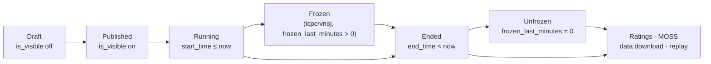

# Creating and managing contests

> The complete reference for contests on LCOJ: who can create them, where, what every field does, and what to do during and after a contest (ratings, MOSS, disqualification, data download).
>
> ⏱ ~30 min · 👤 Contest organizers, teachers · 🔑 `judge.add_contest`, `judge.edit_own_contest` (or `judge.create_private_contest` for organization contests)

::: tip Creating your first contest?
Follow the short [First contest](/en/tutorials/first-contest) tutorial first, then come back here when you need to look up a specific field or feature.
:::

## Before you start

- [ ] Your account has the right permissions (see [Who can create and edit contests](#who-can-create-and-edit-contests)).
- [ ] The problems you plan to use already exist and have been test-judged (see [Managing problems](/en/setter/managing-problems)).
- [ ] You have picked a scoring format (see [Contest formats](/en/organize/contest-formats)).
- [ ] For a class contest: the class [organization](/en/organize/organizations) exists and you are one of its admins.

## Contest lifecycle

| Stage | Condition | Who sees what |
|---|---|---|
| Draft | **Publicly visible** (`is_visible`) is off | Only authors, curators, testers and users with `see_private_contest` / `edit_all_contest`. |
| Published | `is_visible` on, before `start_time` | Allowed users (per [access rules](#visibility-and-access)) see the contest page and can register (if enabled), but not the problems. |
| Running | `start_time` ≤ now ≤ `end_time` | Contestants click **Join contest** to start their timer. |
| Frozen | `icpc`/`vnoj` only, during the last `frozen_last_minutes` minutes | Contestants see the scoreboard as of the freeze. It **stays frozen after the contest ends**. |
| Ended | `end_time` < now | Anyone who can see the contest can read the problems and **Virtual join**. |

## Who can create and edit contests {#who-can-create-and-edit-contests}

| Action | Required permission |
|---|---|
| Create a contest at `/contests/new` | `judge.add_contest` |
| Create an organization-private contest | Organization admin (or `edit_all_organization`) **and** `judge.create_private_contest` |
| Edit contests you author/curate (site or admin) | `judge.edit_own_contest` |
| Edit any contest | `judge.edit_all_contest` |
| Open the admin at `/admin/judge/contest/` | **Staff** account + `edit_own_contest` or `edit_all_contest` |
| Make a contest private / organization-private in the admin | `judge.create_private_contest` |
| Make any contest visible in the admin | `judge.change_contest_visibility` |
| Set an access code in the admin | `judge.contest_access_code` |
| Enable rating, click **Rate** | `judge.contest_rating` |
| Clone a contest | `judge.clone_contest` |
| Run MOSS | `judge.moss_contest` |
| Lock submissions (`locked_after`) | `judge.lock_contest` |
| Edit the problem label script | `judge.contest_problem_label` |
| Set a duration longer than `VNOJ_CONTEST_DURATION_LIMIT` | `judge.long_contest_duration` |

For details and how to grant them, see [Permissions](/en/admin/permissions).

::: info Authors, curators and testers
- **Authors** (`authors`) and **curators** (`curators`) can edit the contest (with `edit_own_contest`). Curators are not listed as authors.
- **Testers** (`testers`) can see the contest and its problems before it starts, but cannot edit it.
- Authors, curators and testers **cannot compete**: when they join, they can only **Spectate contest** and are not ranked.
:::

## Where to create a contest

There are three places, which differ in how many fields they expose:

| Place | Path | Use it for |
|---|---|---|
| Site create page | `/contests/new` (the **Add new contest** tab on `/contests/`) | Regular contests that only need the basic fields. |
| Organization page | `/organization/<slug>/contest-create` (the **Create new contest** tab in the organization) | Contests only for organization members. |
| Django admin | `/admin/judge/contest/add/` | **Every** field: registration, time limit, freeze, rating, pretests, and more. |

The site create/edit form only has: key, name, start/end time, publicly visible, use clarifications instead of comments, hide tags, hide authors, show the settings summary, scoreboard visibility, format, description, access code, private and private contestants, plus the problem table (problem, points, order, max submissions). **Staff** users also see an **Edit contest in admin panel for more options** link on the edit page.

### Option 1: Create on the site

1. Go to `/contests/` and click the **Add new contest** tab.
2. Fill in **Contest id**, **Contest name**, **Start time** and **End time**.
3. Choose the **Contest format** and the display options.
4. In the **Problems** table, add each problem: pick it, enter its **points**, its **order** (a different number for each problem) and the **Max submission** count (blank for no limit). The **Switch to drag and drop mode** button lets you reorder by dragging.
5. Click **Create**. You automatically become an author of the contest.
6. For more options (time limit, freeze, rating, pretests…), open the contest in the admin.

### Option 2: Organization-private contest

1. Open the organization page `/organization/<slug>` and click the **Create new contest** tab. The tab is only shown to organization admins who have `create_private_contest`.
2. The **Contest id** box is prefilled with the organization prefix; for example, the slug `lop-10a1` gives the prefix `lop10a1_`. **Keep the prefix** and type the rest, for example `lop10a1_quiz1`.
3. Fill in the other fields as in Option 1. The **Private contestants** box only suggests organization members.
4. Click **Create**. The contest is automatically marked **private to organizations** and linked to this organization.
5. Turn on **Publicly visible** (on the form or later) so members can see the contest.

::: warning Key prefix rule
The prefix is the organization slug in lowercase with every non-alphanumeric character removed, followed by `_`. The **edit** page for an organization contest always checks this rule and shows **Contest id must starts with `<prefix>`** if the key is wrong. The create page currently does **not** check it, so if you delete the prefix while creating, later edits are blocked until you change the key.
:::

### Option 3: Django admin

1. Go to `/admin/judge/contest/` and click **Add**.
2. Fill in the fields by group (see the sections below). Fields you lack permission for are shown read-only.
3. In the **Problems** block at the bottom, add problems and drag to reorder them.
4. Click **Save**. The admin does not add you as an author; pick authors in the **Authors** field.

## Basic information

| Field (admin) | English label | Meaning |
|---|---|---|
| `key` | Contest id | Unique, up to 32 characters, only `a-z`, `0-9`, `_`. Used in the URL `/contest/<key>`. |
| `name` | Contest name | Up to 100 characters. |
| `authors`, `curators`, `testers` | Authors, Curators, Testers | See the [box above](#who-can-create-and-edit-contests). |
| `description` | Description | Markdown shown on the contest page. |
| `terms` | Terms | If set, contestants must tick **I agree to the terms and conditions** before joining or registering. |
| `summary` | Contest summary | Plain text for the meta description (social media previews). |
| `og_image`, `logo_override_image` | OpenGraph image, Logo override image | Share image, and a logo that replaces the site logo while users are in the contest. If empty, the organization's logo (if any) is used. |
| `tags` | Contest tags | Classification tags, created at `/admin/judge/contesttag/`. |

## Timing

| Field | English label | Meaning |
|---|---|---|
| `start_time` | Start time | Contestants can join from this moment. |
| `end_time` | End time | Must be after `start_time`. Every live participation ends by this time. |
| `time_limit` | Time limit | (Admin only) Blank: everyone competes until `end_time`. Set (for example `03:00:00`): each contestant gets exactly that much time **from when they click join**, but never past `end_time`. |
| `registration_start`, `registration_end` | Registration start time, Registration end time | (Admin only) If at least one is set, the contest **requires registration**: contestants click **Register** within this window. Once registration closes, only registered users can join. The window must start before `start_time` and end before `end_time`. |

With `time_limit`, `start_time`–`end_time` becomes a **window**: contestants choose when to start inside it. Late starters get less time if the rest of the window is shorter than `time_limit`. Virtual contestants (joining after the contest ends) get `time_limit`, or the full contest length if none is set.

::: info Mistranslated labels
In the Vietnamese admin, both `registration_start` and `registration_end` are labeled **Thời gian tạo** ("creation time"). The first is the registration start and the second is the registration end.
:::

::: warning Duration limit
On the site create/edit form, a contest cannot last more than `VNOJ_CONTEST_DURATION_LIMIT` days (**14 days** on luyencode.net) unless you have `long_contest_duration`. The admin does not apply this limit. Note that contestants can keep practicing the problems after the contest ends, so a long duration is rarely needed.
:::

## Visibility and access {#visibility-and-access}

| Field | English label | Meaning |
|---|---|---|
| `is_visible` | Publicly visible | Must be on for **anyone outside the organizers** to see the contest, including private and organization-private contests. |
| `is_private` | Private to specific users | Only users in `private_contestants` can see the contest. |
| `private_contestants` | Private contestants | The allowed users. You can paste a list of usernames into this box. |
| `is_organization_private` | Private to organizations | Only members of `organization` can see the contest. |
| `organization` | Organization | The organization that owns the contest. |
| `access_code` | Access code | If set, contestants must enter it when joining or registering (users who can edit the contest skip it). |
| `view_contest_scoreboard` | View contest scoreboard | These users can always see the full scoreboard, and can open the contest even if it is private. |
| `banned_users` | Personae non gratae | Barred from joining the contest (the **Justice** group in the admin). |
| `disallow_virtual` | Disallow virtual joining | Blocks **Virtual join** after the contest ends. |
| `banned_judges` | Banned judges | These judge servers will not grade the contest. |

Who can open a contest that has `is_visible` on:

| `is_private` | `is_organization_private` | Allowed users |
|---|---|---|
| Off | Off | Everyone, including anonymous visitors |
| Off | On | Organization members |
| On | Off | Users in `private_contestants` |
| On | On | Users who are organization members **and** in `private_contestants` |

Organizers (authors, curators, testers), users in `view_contest_scoreboard` and users with `see_private_contest` or `edit_all_contest` can always open it.

::: warning Admin permissions
In the admin, users without `create_private_contest` cannot edit `is_private`, `private_contestants`, `is_organization_private` or `organization`; users with neither `change_contest_visibility` nor `create_private_contest` cannot edit `is_visible`. Users with only `create_private_contest` can only publish private or organization-private contests. The admin also has the bulk actions **Mark contests as visible** / **Mark contests as hidden**.
:::

## Scoreboard and display options

| Field | English label | Meaning |
|---|---|---|
| `scoreboard_visibility` | Scoreboard visibility | See the table below. |
| `ranking_access_code` | Ranking access code | Unlocks the [public ranking](#official-public-and-frozen-rankings) with a code. |
| `show_submission_list` | Show submission list | Lets contestants see others' submissions during the contest. After the contest, the list is always open (unless the scoreboard is frozen or hidden). |
| `scoreboard_cache_timeout` | Scoreboard cache timeout | Seconds to cache the scoreboard; `0` disables caching. Set a few seconds for large contests. |
| `hide_problem_tags` | Hide problem tags | Hide problem tags by default. |
| `hide_problem_authors` | Hide problem authors | Hide problem authors by default. |
| `show_short_display` | Show short form settings display | Show a rules summary on the contest page. |
| `points_precision` | Precision points | Decimal digits to round points to (0–10, default 3). |
| `use_clarifications` | No comments | Use the clarification system instead of comments (on by default). See [During the contest](#during-the-contest-announcements-and-clarifications). |
| `push_announcements` | Push announcements | Send a pop-up notification to contestants when there is a new announcement. |

**Scoreboard visibility** options:

| Value | English label | Behavior |
|---|---|---|
| `V` | Visible | The scoreboard is open throughout the contest. |
| `C` | Hidden for duration of contest | Hidden until the contest ends; during the contest, contestants only see their own row. |
| `P` | Hidden for duration of participation | Like `C`, but contestants whose **own time has run out** (for example with a `time_limit`) can see the full scoreboard before the contest ends. The Vietnamese label wrongly mentions virtual contests; this setting is about live participations. |
| `H` | Always hidden | Never public; only organizers and users in `view_contest_scoreboard` see it. |

## Format

The admin **Format** group holds **Contest format**, **Frozen last minutes**, **Contest format configuration** (JSON) and **Contest problem label script**. The site form only has **Contest format**. For choosing and configuring formats, see [Contest formats](/en/organize/contest-formats).

## Contest problems

| Field | English label | On the site? | Meaning |
|---|---|---|---|
| `problem` | Problem | Yes | The problem. On the site you can only pick problems you can see. |
| `points` | Points | Yes | Maximum score for the problem **in this contest** (integer), independent of the problem's own points. |
| `order` | Order | Yes | Display order; each problem needs a different value. |
| `max_submissions` | Max submission | Yes | Maximum number of submissions; blank means unlimited. |
| `partial` | Partial | Admin only | Award partial points (on by default). Only effective if the problem itself allows partial points. |
| `is_pretested` | Is pretested | Admin only | The problem has pretests. Only effective when the contest has `run_pretests_only` on. |
| `output_prefix_override` | Output prefix length override | Admin only | How many characters of output contestants see in their results; overrides the problem setting. |

Pretest judging:

1. In the admin, tick **Is pretested** for problems with pretests and turn on **Run pretests only** (`run_pretests_only`) in the **Settings** group.
2. During the contest, submissions are judged on pretests only.
3. After the contest, turn `run_pretests_only` **off**, save, then click **Rejudge** on each problem in the **Problems** block to judge on the full test set.

::: tip Rejudge and rescore
In the admin, each problem row has **Rejudge** (rejudge every contest submission for that problem) and **Rescore** (recompute points without rejudging). When you save a contest in the admin after changing the format, format configuration, freeze minutes or the problem table, LCOJ recomputes the whole scoreboard. **The site edit page does not rescore**; if you change points or the format on the site after submissions exist, use **Rescore** in the admin.
:::

After the contest, users who can edit it see a **Make All Problems Public** button on the contest page: it makes every private problem in the contest public (you must be able to edit those problems) and publishes the editorials of problems you can edit.

## Cloning a contest

The **Clone** tab on the contest page (requires `clone_contest` and edit access) makes a copy with a new key:

1. Enter the new key under **Enter a new key for the cloned contest:** and click **Clone!**.
2. The copy keeps the settings, problems and points, tags, organization, private contestants and `view_contest_scoreboard`; it is **hidden**, **unlocked**, and has **you** as its only author (curators and testers are not copied).
3. You are taken to its edit page to adjust the dates.

For organization contests, the new key must also follow the [prefix rule](#option-2-organization-private-contest).

::: warning Cloning on the site currently fails
The **Clone** tab (`/contest/<key>/clone`) currently shows a server error. For now, create a new contest and add the problems manually.
:::

## During the contest: announcements and clarifications {#during-the-contest-announcements-and-clarifications}

**Announcements** go to every contestant:

1. On the contest page, in the **Announcements** section, click **Add an announcement** (`/contest/<key>/announce`).
2. Enter the **Announcement title** and **Announcement body** (Markdown), then click **Announce**.
3. If the contest has **Push announcements** (`push_announcements`) on, every live contestant and spectator gets a pop-up notification right away (via Celery and WebSocket). Virtual contestants do not.

Announcements can also be added or edited in the admin (the announcement block at the bottom of the contest page); its **Resend** button sends one again.

**Clarifications** are attached to individual problems:

1. Open the problem in the admin (`/admin/judge/problem/<id>/change/`) and add a clarification with a **Clarification body**.
2. Clarifications appear in the **Clarifications** section of the contest page and on the problem page (when viewed in the contest). They do **not** send a pop-up notification; add an announcement if you need one.

With `use_clarifications` on, comments on the contest page are locked during the contest (and for anyone currently in it).

## Official, public and frozen rankings {#official-public-and-frozen-rankings}

| Kind | Path | Notes |
|---|---|---|
| Regular ranking | `/contest/<key>/ranking/` | Follows `scoreboard_visibility`. Has **Show virtual participations**, an organization filter and **Download as CSV**. |
| Public ranking | `/contest/<key>/public_ranking/?code=<code>` | Shows the full ranking to anyone with the `ranking_access_code`, ignoring `scoreboard_visibility`. Viewers still need access to the contest (private contests stay blocked). |
| Official ranking | `/contest/<key>/official_ranking/` | The **Official Rankings** tab, shown only when the **Official ranking** field (`csv_ranking`, **Ranking** group in the admin) has data: a CSV exported from CMS (columns `Username`, `User`, optional `Team`, per-problem columns, `Global`), or a URL starting with `http` to redirect to. |

**Freezing:** only `icpc` and `vnoj`. During the last `frozen_last_minutes` minutes, contestants only see results from before the freeze; organizers still see the real scoreboard. It stays frozen after the contest. To reveal it, set `frozen_last_minutes = 0` and save in the admin. See [Scoreboard freeze](/en/organize/contest-formats#scoreboard-freeze).

## Ranking replay and ghost participations

A contest is **replayable** when all of these hold: anonymous visitors can open it (public, not private), it has ended, `frozen_last_minutes = 0`, the scoreboard is visible, and the format is not `ioi16`. The ranking page then shows a time slider (⏱) to view the scoreboard at any moment, an **End** button to jump to the end and, for `icpc`/`vnoj`, a **Freeze min** box to try out freeze lengths. A virtual contestant in a replayable contest sees the scoreboard as of their own elapsed time (the **Live** button).

- Replay data is built on first view and stored as `MEDIA_ROOT/contest_replay/<key>_v<version>.json`; browsers cache it forever. On luyencode.net, `DMOJ_CONTEST_REPLAY_INTERNAL` is not set, so Django serves the file directly.
- If you rejudge or change results after the replay was built, open the contest in the admin and click **Invalidate Replay** (requires `change_contest`) to bump the version and rebuild it.
- **Ghost participations**: an operator can merge another contest's contestants (for example the original of a mirror) into the replay with the [`merge_replay_data`](/en/reference/management-commands#merge-replay-data) command. The ranking page then gets a **Show ghost participations** checkbox.

## After the contest

### Rating

Ratings are **not** computed automatically. A user with `contest_rating` does this:

1. In the admin, make sure the **Rating** group has **Contest rated** (`is_rated`) on, and adjust:

   | Field | English label | Meaning |
   |---|---|---|
   | `rate_all` | Rate all | Also rate users who made no submissions. |
   | `rate_disqualified` | Rate disqualified | Also rate disqualified users (on by default; they rank last). |
   | `rating_floor`, `rating_ceiling` | Rating floor, Rating ceiling | Skip users whose current rating is below / above this. |
   | `rate_exclude` | Exclude from ratings | Exclude individual users (only participants can be picked). |

2. After the contest ends, open it in the admin and click the **Rate** button in the bottom bar.
3. LCOJ deletes the ratings of this contest **and every rated contest that ended after it**, then recomputes them in end-time order. Only live participations (not virtual) are rated.

The **Rate all ratable contests** button on the admin contest list deletes **all** ratings and recomputes everything from scratch; use it only when you really need to.

### MOSS plagiarism check

1. On the contest page, open the **MOSS** tab (`/contest/<key>/moss`). It appears if you can edit the contest and have `moss_contest`. MOSS needs a valid `MOSS_API_KEY` configured by the operator; without one, the tab still shows but running MOSS fails.
2. Click **MOSS contest**. LCOJ runs it in the background and shows a progress page.
3. The result is a problem × language table (C, C++, Java, Python, Pascal), each cell linking to the MOSS report. For each contestant, LCOJ sends their highest-scoring submission; a cell only has a result with at least 2 submissions.
4. **Delete MOSS results** clears old results; running again replaces them.

Operators can also run the [`runmoss`](/en/reference/management-commands#runmoss) command.

### Disqualification and automatic bans

- On the ranking page, users who can edit the contest see a trash icon (**Disqualify**) next to each contestant; click and confirm to disqualify. Click the undo icon (**Un-Disqualify**) to reverse it. You can also do this in the admin at `/admin/judge/contestparticipation/` (the **Is disqualified** box).
- A disqualified contestant's score becomes `-9999` (ranked last), they are removed from the contest if they are in it, and they are added to the contest's **Personae non gratae**. If the contest already has ratings, they are recomputed immediately.
- **Automatic ban**: when `VNOJ_SHOULD_BAN_FOR_CHEATING_IN_CONTESTS` is on, a user disqualified in `VNOJ_MAX_DISQUALIFICATIONS_BEFORE_BANNING` or more contests that are **not** organization-private (starting on or after `VNOJ_BAN_COUNT_FROM_DATE`) gets their account banned. Un-disqualifying below the threshold lifts the ban (if the ban reason is exactly this message).

| Setting | Default | luyencode.net |
|---|---|---|
| `VNOJ_SHOULD_BAN_FOR_CHEATING_IN_CONTESTS` | `False` | `False`: **no** automatic bans |
| `VNOJ_MAX_DISQUALIFICATIONS_BEFORE_BANNING` | `3` | `3` |
| `VNOJ_BAN_COUNT_FROM_DATE` | `2026-01-01` (UTC) | `2026-01-01` |
| `VNOJ_CONTEST_CHEATING_BAN_MESSAGE` | `Banned for multiple cheating offenses during contests` | default |

### Locking submissions

The **Contest lock** field (`locked_after`, requires `lock_contest`) prevents the contest's submissions from being rejudged after that time. The bulk actions **Lock contest submissions** / **Unlock contest submissions** on the admin list lock them now or unlock them.

### Downloading data

Contest authors can download every submission's source code as a ZIP file. See [Contest data download](/en/organize/contest-data-download).

## Related site-wide settings

Operators set these in `local_settings.py` (see [Environment and configuration](/en/operate/environment)):

| Setting | luyencode.net | Effect |
|---|---|---|
| `VNOJ_CONTEST_DURATION_LIMIT` | `14` | Maximum duration (days) on the site form, unless the user has `long_contest_duration`. |
| `MAX_CONTEST_PROBLEMS_COUNT` | `None` | Maximum problems per contest (site form); `None` means unlimited. |
| `VNOJ_OFFICIAL_CONTEST_MODE` | `False` | Site-wide official contest mode: hides comments (except for superusers), blocks creating/editing blog posts, blocks editing the profile "about" and full name, stops contestants from aborting their own submissions, removes the join confirmation dialog, and logs the IP of every submission. Only enable it on a server dedicated to one official contest. |
| `DMOJ_CONTEST_DATA_DOWNLOAD` | `True` | Allows contest data downloads. |
| `MOSS_API_KEY` | from environment | MOSS key; must be valid for MOSS to run. |

## Verify

- [ ] The contest shows up at `/contests/` when logged in as a contestant (or at `/organization/<slug>/contests/` for organization contests).
- [ ] The contest page shows the right start/end time in your time zone.
- [ ] A tester account can open the problems before the start; an unauthorized account is refused.
- [ ] A test submission appears on the ranking with the correct score.
- [ ] After the contest: the scoreboard is unfrozen (if needed), **Rate** has been clicked (if rated) and MOSS has run (if needed).

## Troubleshooting

| Symptom | Cause and fix |
|---|---|
| Contestants cannot see the contest | **Publicly visible** is off; or the contest is private/organization-private and they are not in the list/organization. |
| **Contest id must starts with `…`** | An organization contest has the wrong key prefix. Change the key to use the reported prefix. |
| **Contest duration cannot be longer than 14 days** | Shorten the contest, edit it in the admin, or ask for `long_contest_duration`. |
| **Problems must have distinct order.** | Two problems share the same **order**. Give each a different number. |
| The **Clone** tab shows a server error | Cloning on the site currently fails; create a new contest and add the problems manually, see [Cloning a contest](#cloning-a-contest). |
| No **Rate** button | Requires `contest_rating`; the contest must have `is_rated` on and must have ended. |
| No **MOSS** tab | Missing `moss_contest`, or no edit access. |
| Running MOSS fails | The server has no valid `MOSS_API_KEY`. Ask the operator to configure one. |
| The scoreboard is still frozen after the contest | Expected. Set `frozen_last_minutes = 0` in the admin. |
| Points/format changed on the site but the scoreboard did not update | The site form does not rescore. Use **Rescore** in the admin or save the contest in the admin. |
| Replay shows old results after a rejudge | Click **Invalidate Replay** in the admin. |
| No replay slider | The contest is not replayable (private, frozen, hidden scoreboard, or `ioi16` format). |
| Authors cannot compete | Expected: organizers can only **Spectate contest**. Use another account to test. |
| Clicking join shows **Not registered** with "You are not registered for this contest." (in Vietnamese, a wrong translation about edit permissions) | The contest requires registration, the user did not register, and registration has closed. Widen the registration window or leave both registration fields blank. |

## Next steps

- [First contest](/en/tutorials/first-contest): a step-by-step tutorial.
- [Contest formats](/en/organize/contest-formats): scoring, penalties and freezing.
- [Organizations (groups, classes)](/en/organize/organizations): contests for a class.
- [Contest data download](/en/organize/contest-data-download).
- [Permissions](/en/admin/permissions).
