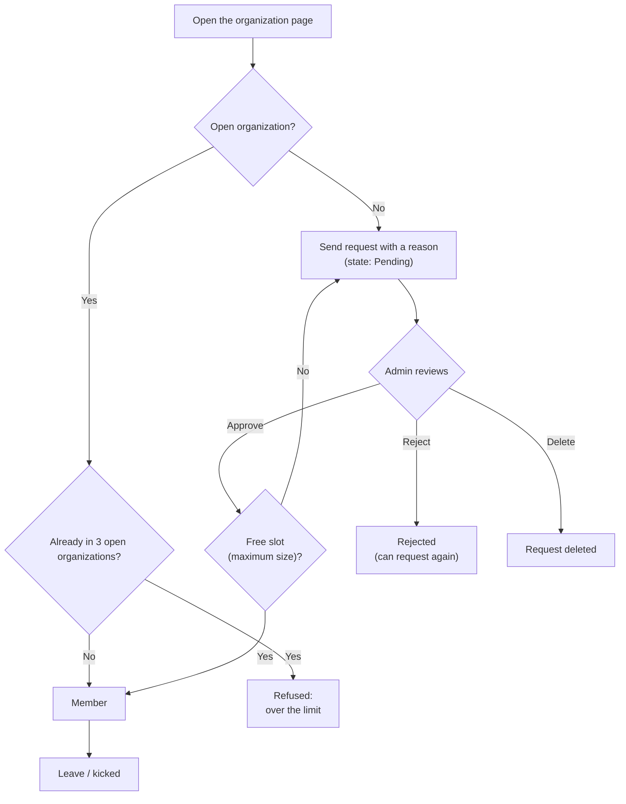

# Organizations (groups, classes)

> An organization groups users (a class, a school team, a club) so they get their own ranking and members-only problems, contests, quizzes and posts. This page is for members and organization managers alike.
>
> ⏱ ~20 min · 👤 Teachers, club leaders, members · 🔑 None to join; `judge.add_organization` to create one

## Before you start

- [ ] You have an LCOJ account and are logged in (see [Account](/en/learn/account)).
- [ ] To **join**: you know the organization's name or link (like `https://luyencode.net/organization/<slug>`).
- [ ] To **manage**: you are an admin of the organization, or you have asked an LCOJ administrator to create one for you.

## What an organization is

Each organization has its own page at `/organization/<slug>` with the tabs **Home**, **Users**, **Problems list**, **Contests list** and **Submissions**.

| Use | Example |
|---|---|
| Class | A teacher assigns problems and tests to class 10A1 and checks which problems each student has solved. |
| School team | The school's informatics team runs private mock contests with an internal ranking. |
| Club | Club news is posted as members-only posts. |

What members and visitors can see:

| Content | Visitors / non-members | Members | Organization admins |
|---|---|---|---|
| About page, member list | ✅ | ✅ | ✅ |
| Organization posts | ❌ | ✅ (published posts) | ✅ (including their own drafts) |
| Organization problems, contests, submissions | ❌ | ✅ | ✅ |
| Review requests, kick, edit, view costs | ❌ | ❌ | ✅ |

## Joining and leaving

There are two kinds of organization, set by the **Is open organization?** box (`is_open`):

- **Open** (`is_open` on): click **Join organization** and you are in.
- **Closed** (`is_open` off): click **Request membership**, give a reason, and wait for an admin to approve.



### Joining an open organization

1. Go to `/organizations/` (or the organization link you were given).
2. Open the organization and click **Join organization** in the **Controls** box.

You can also pick open organizations in the organizations box on your profile edit page `/edit/profile/`.

::: info Organization limit
Each user can be in at most `DMOJ_USER_MAX_ORGANIZATION_COUNT` **open** organizations (LCOJ: **3**). Closed organizations do not count toward this limit.
:::

### Requesting to join a closed organization

1. Open the organization page and click **Request membership**.
2. Fill in **Your reason for joining:** (required), for example "I'm Nguyen Van A from class 10A1", then click **Request!**.
3. You land on the **Join request detail** page (`/organization/<slug>/request/<id>`), which shows its **State**: **Pending**, **Approved** or **Rejected**. LCOJ does not notify you when it is approved; check the organization page again later.

While one request is pending you cannot send another. If it is rejected, you can request again.

### Leaving

Click **Leave organization** on the organization page. Admins cannot leave their own organization (**You cannot leave an organization you own.**).

## Creating an organization

Organizations are usually created by an LCOJ administrator. There are two ways:

| Way | Path | Permission |
|---|---|---|
| On the site | `/organizations/create` (the **Create new organization** tab on `/organizations/`) | `judge.add_organization` |
| Django admin | `/admin/judge/organization/add/` | Staff + `judge.add_organization` |

Main fields:

| Field | English label | Meaning |
|---|---|---|
| `name` | Organization title | Display name, up to 128 characters. |
| `slug` | Organization slug | Used in the URL `/organization/<slug>` and as the [key prefix](#key-prefix) for problems and contests. Unique, must start with a letter; only letters, digits, `-`, `_`. |
| `short_name` | Short name | Up to 20 characters, shown beside usernames in contests. When created on the site, LCOJ sets it to the first 20 characters of the slug; it can only be changed in the admin. |
| `about` | Organization description | Required. Markdown shown on the organization home page. |
| `is_open` | Is open organization? | Open or closed (see above). |
| `is_unlisted` | Is unlisted organization? | (Admin only) Hides it from the `/organizations/` list. **On by default**, so a new organization is not listed until someone unticks this in the admin. |
| `slots` | Maximum size | (Admin only) Member limit, only checked when approving requests to a closed organization. |
| `admins` | Administrators | The people who manage the organization. |
| `logo_override_image` | Logo override image | Image URL that replaces the site logo while viewing the organization. |
| `paid_credit`, `monthly_free_credit_limit` | — | Judging credit, see [Storage, quotas and credit](#storage-quotas-and-credit). |

::: warning The creator does not become an admin automatically
The **Administrators** box (and the two credit boxes) on the site form is only shown to users with `judge.organization_admin`. If you create an organization without that permission, it ends up with **no admins at all**, not even you. Ask an LCOJ administrator to add you in the admin. Likewise, in the admin, **Administrators**, **Is open organization?** and **Maximum size** are only editable with `organization_admin`.
:::

::: info Limits and the "Org Admin" group
- Users who already administer `VNOJ_ORGANIZATION_ADMIN_LIMIT` organizations (LCOJ: **3**) cannot create more on the site. The `spam_organization` permission is meant to lift this limit but currently only works for superusers (see [Permissions](/en/admin/permissions)).
- Whenever the organization form is saved **on the site**, every admin is added to the Django group named by `GROUP_PERMISSION_FOR_ORG_ADMIN` (default `Org Admin`). Operators must create this group beforehand and give it the permissions organization admins need, such as `create_organization_problem`, `create_private_contest`, `edit_organization_post`. If the group does not exist, saving the form fails. Admins added **in the Django admin** are **not** added to the group; add them by hand.
:::

## Organization admin tasks

Organization admins are the users in the **Administrators** list (or users with `edit_all_organization`). The management links are in the **Controls** box on the organization home page and in the tabs on the right.

### Reviewing join requests

1. On the organization page, click **View requests** (the badge shows the number of pending requests). The page is `/organization/<slug>/requests/pending`.
2. For each request, read the **Reason** (click the time to see details), then set the **State** to **Approved** or **Rejected**, or tick **Delete?** to remove it.
3. Click **Update**. Approved users become members immediately.
4. Review the history in the **Log**, **Approved** and **Rejected** tabs.

If the organization has a **Maximum size** and you approve more people than the free slots, LCOJ rejects the whole update and tells you how many slots are left.

::: info
Only users in the **Administrators** list can open the request pages; `edit_all_organization` is not enough.
:::

### Kicking members

1. Open the **Users** tab (`/organization/<slug>/users/`).
2. Click **Kick** on the member's row and confirm.

Other admins cannot be kicked.

### Editing the organization

Click **Edit organization** (`/organization/<slug>/edit`). On the site, admins can change the title, slug, **Is open organization?**, description and logo. Users with `organization_admin` can also change the admin list and credit. Users with `add_organizationquota` also see a **Quota Grants** section (see [below](#storage-quotas-and-credit)). The other fields (short name, unlisted, maximum size) can only be changed via **Admin organization** (the admin page).

::: warning Changing the slug
Changing the slug changes the organization URL and the [key prefix](#key-prefix) for new problems and contests. Existing problems and contests keep their keys, but they cannot be edited on the site until their keys match the new prefix.
:::

### Key prefix {#key-prefix}

Problems and contests created in an organization must have a key that starts with the **organization prefix**: the slug in lowercase with every non-alphanumeric character removed, followed by `_`. For example, the slug `THPT-Chuyen-A` gives the prefix `thptchuyena_`. The key box on the create forms is prefilled with the prefix.

### Organization problems

1. On the organization page, click the **Create new problem** tab (`/organization/<slug>/problem-create`). Requires `create_organization_problem`.
2. Keep the prefix in the problem code. A wrong prefix shows **Problem id code must starts with `<prefix>`**.
3. The problem is marked organization-private. Tick public so all members can see it, or leave it private and pick the **Private users** who may see it.
4. Attach **organization tags** to it (see [Organization problem tags](#organization-problem-tags)).

Members see the organization's public problems in the **Problems list** tab, plus problems they author, curate or test. For writing statements and tests, see [Managing problems](/en/setter/managing-problems).

### Organization contests

Click the **Create new contest** tab (`/organization/<slug>/contest-create`, requires `create_private_contest`). The contest is automatically **private to organizations**; remember to turn on **Publicly visible** so members can see it. Organization contests appear in the **Contests list** tab and also on `/contests/` (users can tick **Hide private contests** to hide them). Details: see [Creating and managing contests](/en/organize/contest-setup#option-2-organization-private-contest).

### Organization quizzes

There is no quiz create page inside organizations. When authoring a quiz, tick **Publicly visible** and **Private to organizations**, then pick the organization. See [Creating and managing quizzes](/en/setter/quiz-authoring).

### Organization posts

1. Click **Create blog post** in the **Controls** box (`/organization/<slug>/post/new`). Requires `edit_organization_post`.
2. Write the post and set the publish time (defaults to now).

Posts appear on the organization home page and only members can read them. Unlike personal blog posts, there is no minimum solved-problem count.

### Organization problem tags {#organization-problem-tags}

Each organization has its own tag set, separate from LCOJ's global problem tags.

1. Click the **Manage tags** tab (`/organization/<slug>/tags/`).
2. Click **Create new tag**, enter a name (unique within the organization) and save. Rename or delete tags in the **Actions** column; the **Problems** column shows how many problems use each tag.
3. Attach tags when creating or editing organization problems.

Members can filter problems by tag (or show untagged problems) in the **Problems list** tab.

### Member solved problems

In the **Users** tab, admins see an extra **Solved problems** column; click **View** (`/organization/<slug>/user/<username>/solved`) to see which **organization** problems that member has solved, grouped by organization tag (untagged problems last).

## Member ranking and organization points

The **Users** tab is an internal ranking, sorted by performance points by default; it can also be sorted by points, solved count or rating. Users who set themselves as unlisted do not appear. The link `/organization/<slug>/users/find?handle=<username>` jumps straight to that user's page of the ranking.

An organization's **Points** (the **Points** column on `/organizations/`) come from the performance points of its top 100 members:

```text
org points = VNOJ_ORG_PP_SCALE × (pp[0] + 0.95 × pp[1] + 0.95² × pp[2] + … + 0.95⁹⁹ × pp[99])
```

where `pp[i]` is the performance points of the member ranked `i` (starting at 0). The constants are `VNOJ_ORG_PP_STEP = 0.95`, `VNOJ_ORG_PP_ENTRIES = 100`, `VNOJ_ORG_PP_SCALE = 1` (LCOJ uses the defaults). Points update when members join or leave; the admin has a **Recalculate scores** action.

## Storage, quotas and credit {#storage-quotas-and-credit}

Admins click **Organization cost** (`/organization/<slug>/usage`) to see:

- **Quotas**: problem count and test data storage used versus the limits, plus the active quota packages (**Active Quota Grants**).
- **Pie charts** of problem count and storage by last submission time (no submissions, 12+ months, 9–12, 6–9, 3–6, under 3 months), to find old problems to clean up.
- **A problem table** sorted by test data size, filterable by author (among the admins) or last submission time.
- **Bulk delete**: tick problems and click **Delete Selected** (up to 200 at a time). Non-superusers can only delete problems they author or curate. Problems are only marked as deleted (soft delete); the periodic garbage collector removes them for good after `VNOJ_PROBLEM_DELETION_GRACE_PERIOD` (7 days).
- **Judging credit**: the **Organization Monthly Credit usage** and **Organization Monthly cost** charts, plus the remaining free and paid credit.

**Quotas:** maximum problems = `VNOJ_ORGANIZATION_DEFAULT_MAX_PROBLEMS` + active packages; maximum storage = `VNOJ_ORGANIZATION_DEFAULT_MAX_STORAGE` + packages. Storage is the total size of the test data zip files of non-deleted problems. Users with `add_organizationquota` add packages on the **Edit organization** page (the **Add Quota Grant** section: start date, **Number of packages**, end date, one year by default) or in the admin (storage in GB).

**Credit:** every submission to an organization-private problem, or inside an organization-private contest, consumes credit equal to its total judging time. The monthly free credit is used first, then paid credit. The cost chart computes `(seconds used − VNOJ_MONTHLY_FREE_CREDIT) / 3600 × VNOJ_PRICE_PER_HOUR` thousand VND.

| Setting | Default | LCOJ | Meaning |
|---|---|---|---|
| `VNOJ_ENABLE_ORGANIZATION_CREDIT_LIMITATION` | `False` | `False` | When on, blocks submissions once the organization is out of credit. LCOJ does **not** block; credit is tracked only. |
| `VNOJ_MONTHLY_FREE_CREDIT` | `10800` (3 hours) | 3 hours | Free credit per month (seconds). |
| `VNOJ_PRICE_PER_HOUR` | `50` | `50` | Price per judging hour above the free amount (thousand VND), used only for the chart. |
| `VNOJ_ORGANIZATION_DEFAULT_MAX_PROBLEMS` | `1000` | `1000` | Default problem limit. |
| `VNOJ_ORGANIZATION_DEFAULT_MAX_STORAGE` | 5 GB | 5 GB | Default test data storage limit. |
| `VNOJ_QUOTA_ENFORCEMENT_ENABLED` | `False` | `False` | When on, blocks creating problems/uploading tests over quota. LCOJ only **warns**. |
| `VNOJ_QUOTA_WARNING_THRESHOLD` | `0.8` | `0.8` | Warn from 80% of the quota. |
| `VNOJ_QUOTA_WARNING_SUFFIX` | `''` | `''` | HTML appended to quota warnings (for example a link to a guide). |
| `VNOJ_QUOTA_PACKAGE_PROBLEMS`, `VNOJ_QUOTA_PACKAGE_STORAGE` | `1000`, 5 GB | default | Problems and storage added by each quota package. |

::: info For operators
Closing the month's figures and refilling free credit on the 1st of each month is the `organization_monthly_reset` periodic task, run by Celery beat. LCOJ's Docker setup only runs a Celery worker, so this task (like the deleted-problem garbage collector) does not run unless you add beat. The [`backfill_current_credit`](/en/reference/management-commands#backfill-current-credit) and [`backfill_monthly_credit`](/en/reference/management-commands#backfill-monthly-credit) commands recompute credit figures.
:::

## Organization subdomains

LCOJ ships an `OrganizationSubdomainMiddleware` for opening organizations on subdomains (like `<slug>.example.com`), but it is **not** in LCOJ's `MIDDLEWARE`, so the feature is **inactive** on luyencode.net. To enable it, an operator must add the middleware, set up DNS/proxy for the subdomains, and list non-organization subdomains in `VNOJ_IGNORED_ORGANIZATION_SUBDOMAINS` (default `['oj', 'www', 'localhost']`). For luyencode.net the first host label is `luyencode`, so `luyencode` (and `dev`) must be added to that list, or every page returns 404.

## Verify

- [ ] The organization is listed at `/organizations/` (once **Is unlisted organization?** is off) or opens at `/organization/<slug>`.
- [ ] A member account sees the **Problems list** and **Contests list** tabs; a non-member gets **Cannot view organization's private data**.
- [ ] A test join request shows up under **View requests** and can be approved.
- [ ] The **Organization cost** page shows the right problem count and storage.

## Troubleshooting

| Symptom | Cause and fix |
|---|---|
| The organization is not listed at `/organizations/` | It is **unlisted** (the default). Ask an administrator to untick **Is unlisted organization?** in the admin, or share the direct link. |
| **You may not be part of more than 3 public organizations.** | You are already in 3 open organizations. Leave one. |
| No **Join organization** button, only **Request membership** | The organization is closed. Send a request and wait. |
| A second request is refused | You already have a pending request. Wait for an admin. |
| Approving says the organization can only receive N more members | **Maximum size** is reached. Raise it in the admin or approve fewer people. |
| Created an organization but cannot manage it | The creator is not made an admin automatically. Ask an LCOJ administrator to add you to **Administrators**. |
| A **Can't create organization** page lists the organizations you manage | You already administer 3 organizations (`VNOJ_ORGANIZATION_ADMIN_LIMIT`). Ask a superuser to create it. |
| Saving the organization form on the site gives a server error | The `Org Admin` group does not exist. An operator creates it at `/admin/auth/group/`. |
| Admins do not see **Create new problem** / **Create new contest** / **Create blog post** | Missing `create_organization_problem` / `create_private_contest` / `edit_organization_post`. Grant them via the `Org Admin` group or directly. |
| **Problem id code must starts with `…`** | Wrong problem code prefix. See [Key prefix](#key-prefix). |
| **Kick** says the user is an admin of the organization | Admins cannot be kicked. Remove them from **Administrators** in the admin first. |
| Members cannot see an organization problem | The problem is private. Make it public, or add them to **Private users**. |

## Next steps

- [Creating and managing contests](/en/organize/contest-setup): private contests for a class.
- [Managing problems](/en/setter/managing-problems): writing problems for the organization.
- [Creating and managing quizzes](/en/setter/quiz-authoring): organization-only quizzes.
- [Permissions](/en/admin/permissions): permissions for organization admins.
