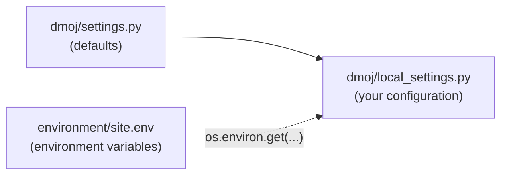

# Settings reference

> A lookup table for the Django settings specific to LCOJ, VNOJ, and DMOJ: the default in `settings.py`, the value on luyencode.net, what each setting does, and which page explains it in detail.
>
> ⏱ ~5 min · 👤 Operators · 🔑 Permission to edit `local_settings.py` on the server

## When you need this page

- You want to know which setting controls a site behavior (the pending-submission limit, the maximum number of test cases, who can comment...).
- You plan to turn on a feature that's currently off (contest data download, MOSS, the sync API, Discord webhooks...).
- You ran into a setting in the source code and want to know whether the bundled configuration overrides it.

This page only covers settings specific to the judge platform. Generic Django settings (`SECRET_KEY`, `DEBUG`, `DATABASES`, `CACHES`...) and the variables in the `.env` files are covered in [Environment variables](/en/operate/environment).

How to read the tables:

- **Default**: the value in `dmoj/repo/dmoj/settings.py`. "not defined" means `settings.py` has no such line and the code falls back to a built-in value.
- **luyencode.net**: the value in the bundled `local_settings.py` (template `dmoj/config/local_settings.py`), which is also what runs on luyencode.net. `=` means that file doesn't override the default. `env X` means the value is read from the environment variable `X`. `` `<secret>` `` marks a secret value you set yourself.

## How to change a setting

Django loads configuration in three layers, and each layer overrides the one before it:



1. `dmoj/repo/dmoj/settings.py` holds the defaults. Don't edit it; it belongs to the lcoj-site submodule.
2. The running file is `dmoj/repo/dmoj/local_settings.py`. `./scripts/initialize` copies it from the template `dmoj/config/local_settings.py`, and **re-running `initialize` overwrites** the running copy. When you make a change, apply it to both files.
3. Some settings in `local_settings.py` are read from environment variables (`HOST`, `SITE_FULL_URL`, `MEDIA_URL`, `EVENT_DAEMON_POST`, `CELERY_BROKER_URL`, `BRIDGED_HOST`, `MOSS_API_KEY`, the Google OAuth credentials...). Change those in `environment/site.env` instead; see [Environment variables](/en/operate/environment).

Add a new setting at the end of `local_settings.py` (the `Custom Configuration` section), for example:

```python
DMOJ_SUBMISSION_LIMIT = 3
```

For secrets, read the value from the environment instead of hard-coding it:

```python
GLOBAL_API_KEY = os.environ.get('GLOBAL_API_KEY', '')
```

After editing `local_settings.py`, restart the services that run Django (from `dmoj/`):

```sh
docker compose restart site celery
# also restart bridged if you changed BRIDGED_* or anything related to the judging queue
docker compose restart bridged
```

If you edit a `.env` file, recreate the containers with `docker compose up -d ...`, because `restart` doesn't re-read `env_file` (see [Applying changes](/en/operate/environment#applying-changes)).

## Site and branding

| Setting | Default | luyencode.net | What it does | Docs |
|---|---|---|---|---|
| `SITE_NAME` | `'DMOJ'` | `'LCOJ'` | Short name shown in page titles, the navbar, and emails | [Site configuration](/en/admin/site-config) |
| `SITE_LONG_NAME` | `'DMOJ: Modern Online Judge'` | `'LCOJ: Luyện Code Online Judge'` | Full site name | [Site configuration](/en/admin/site-config) |
| `HOST` | not defined | env `HOST` (default `'localhost'`) | Site domain; used to build `ALLOWED_HOSTS` and `EVENT_DAEMON_GET(_SSL)` | [Environment variables](/en/operate/environment) |
| `SITE_FULL_URL` | `None` | env `SITE_FULL_URL` (default `'http://localhost/'`) | Absolute base URL, used to build links in Discord webhooks and links to PDF and submission files | [Environment variables](/en/operate/environment) |
| `MEDIA_URL` | `''` (Django) | env `MEDIA_URL` | Base URL for user-uploaded files | [Environment variables](/en/operate/environment) |
| `SITE_ADMIN_EMAIL` | `''` | `'luyencodeonline@gmail.com'` | Admin contact email shown on the site | |
| `SERVER_EMAIL` | `'root@localhost'` (Django) | `'LCOJ: Luyện Code Online Judge <luyencodeonline@gmail.com>'` | Sender address for error emails | [Environment variables](/en/operate/environment#hardcoded-settings) |
| `LANGUAGE_CODE` | `'en'` | `'vi'` | Default UI language | |
| `DEFAULT_USER_TIME_ZONE` | `'America/Toronto'` | `'Asia/Ho_Chi_Minh'` | Time zone for new accounts | |
| `DMOJ_SSL` | `1` | = | Scheme for canonical links: `0` always `http`, `1` follows the request, `2` always `https` | [Settings with gotchas](#gotchas) |
| `DMOJ_CANONICAL` | `'oj.luyencode.net'` | = | Domain used in `<link rel="canonical">` and `og:url` | [Settings with gotchas](#gotchas) |
| `TIMEZONE_MAP` | an image on `static.dmoj.ca` | the Blue Marble image on Wikimedia | Map used to pick a time zone on the profile page | |
| `ACE_URL`, `JQUERY_JS`, `SELECT2_JS_URL`, `SELECT2_CSS_URL` | copies in `/static/vnoj/` and the Google CDN | copies on `cdnjs.cloudflare.com` | Where the Ace code editor, jQuery, and Select2 load from | |
| `DMOJ_THEME_CSS`, `DMOJ_THEME_DEFAULT_ACE_THEME`, `DMOJ_SELECT2_THEME` | CSS `style.css` / `dark/style.css`, Ace `github` / `twilight`, Select2 `dmoj` | = | CSS files and editor themes for the light and dark themes | |
| `SITE_THEME_COOKIE_NAME`, `SITE_THEME_COOKIE_AGE` | `'site_theme'`, 1 year | = | Cookie that remembers the light/dark theme for logged-out visitors | |
| `VNOJ_HOMEPAGE_TOP_USERS_COUNT` | `5` | = | Number of users in the compact leaderboard on the home page | |
| `DMOJ_BLOG_NEW_PROBLEM_COUNT` | `7` | = | Number of new problems in the sidebar of the home page and organization pages | |

## Accounts and sign-in

| Setting | Default | luyencode.net | What it does | Docs |
|---|---|---|---|---|
| `OAUTH_ONLY` | `False` | `True` | Hides the password sign-up form, leaving only the Google sign-up button | [Your account](/en/learn/account) |
| `REGISTRATION_OPEN` | `True` | = | `False` hides the **Sign up** link and blocks `/accounts/register/` | [Managing users](/en/admin/users) |
| `ACCOUNT_ACTIVATION_DAYS` | `7` | = | How many days an email activation link stays valid | |
| `SEND_ACTIVATION_EMAIL` | not defined (code treats it as `True`) | = | `False` activates password sign-ups immediately, without an email | |
| `TERMS_OF_SERVICE_URL` | `None` | `None` | Terms of service link on the sign-up form | |
| `BAD_MAIL_PROVIDERS`, `BAD_MAIL_PROVIDER_REGEX` | `()`, `()` | `set()`, = | Email domains (or regexes) rejected at password sign-up | |
| `SOCIAL_AUTH_GOOGLE_OAUTH2_KEY`, `SOCIAL_AUTH_GOOGLE_OAUTH2_SECRET` | not defined | `<secret>` (env vars of the same name) | Google OAuth app credentials for sign-in and sign-up | [Environment variables](/en/operate/environment) |
| `DMOJ_REQUIRE_STAFF_2FA` | `True` | = | Stops staff from turning off their last two-factor authentication (2FA) method | [Settings with gotchas](#gotchas) |
| `DMOJ_2FA_HARDCORE` | `False` | = | Shows a warning that admins won't help recover 2FA | |
| `DMOJ_TOTP_TOLERANCE_HALF_MINUTES` | `1` | = | Allowed clock drift for TOTP codes, in 30-second steps | [Your account](/en/learn/account) |
| `DMOJ_SCRATCH_CODES_COUNT` | `5` | = | Number of backup codes generated when 2FA is enabled | [Your account](/en/learn/account) |
| `WEBAUTHN_RP_ID` | `None` | = | Domain for security keys (WebAuthn); `None` hides the feature | [Your account](/en/learn/account) |
| `DMOJ_PASSWORD_RESET_LIMIT_WINDOW`, `DMOJ_PASSWORD_RESET_LIMIT_COUNT` | `3600`, `10` | = | Each IP address can send at most 10 password reset requests per 3600 seconds | |
| `IMPERSONATE_REQUIRE_SUPERUSER`, `IMPERSONATE_DISABLE_LOGGING` | `True`, `True` | = | Meant to restrict impersonation to superusers and turn off its log, but **have no effect** | [Managing users](/en/admin/users) |
| `DMOJ_USER_DATA_DOWNLOAD` | `False` | `True` | Lets users download their own data | [User data download](/en/operate/user-data-download) |
| `DMOJ_USER_DATA_CACHE`, `DMOJ_USER_DATA_INTERNAL` | `''`, `''` | `'/userdatacache'`, `'/userdatacache'` | Directory for the ZIP files and the internal nginx path (X-Accel-Redirect) that serves them | [User data download](/en/operate/user-data-download) |
| `DMOJ_USER_DATA_DOWNLOAD_RATELIMIT` | 1 day | 1 day | Minimum time between two data requests | [User data download](/en/operate/user-data-download) |
| `VNOJ_DISPLAY_RANKS` | `user`, `setter`, `daor`, `staff`, `banned`, `admin`, `teacher` | = | Display ranks shown next to usernames | [Managing users](/en/admin/users) |
| `DMOJ_NEWSLETTER_ID_ON_REGISTER` | `None` | = | Subscribes new users to a newsletter (needs the `newsletter` app, which isn't installed) | |
| `IP_BASED_AUTHENTICATION_HEADER` | `'REMOTE_ADDR'` | = | Header holding the IP for IP-based login; only takes effect if you add `IPBasedAuthMiddleware` (it isn't in the default `MIDDLEWARE`) | |

## Problems and test data

| Setting | Default | luyencode.net | What it does | Docs |
|---|---|---|---|---|
| `DMOJ_PROBLEM_DATA_ROOT` | `None` | `'/problems/'` | Test data directory inside the container, matching the `problems` volume | [Managing problems](/en/setter/managing-problems) |
| `DMOJ_PROBLEM_DATA_INTERNAL` | not defined | = | Internal nginx path for serving test files; when not defined, Django serves them itself | |
| `DMOJ_PROBLEM_MIN_TIME_LIMIT`, `DMOJ_PROBLEM_MAX_TIME_LIMIT` | `0.01`, `60` (seconds) | = | Allowed range for the time limit | [Managing problems](/en/setter/managing-problems) |
| `DMOJ_PROBLEM_MIN_MEMORY_LIMIT`, `DMOJ_PROBLEM_MAX_MEMORY_LIMIT` | `0`, `1048576` (KB) | = | Allowed range for the memory limit | [Managing problems](/en/setter/managing-problems) |
| `DMOJ_PROBLEM_MIN_PROBLEM_POINTS` | `0` | = | Minimum point value of a problem | |
| `VNOJ_PROBLEM_TIMELIMIT_LIMIT` | `5` (seconds) | = | Highest time limit you can set without the `high_problem_timelimit` permission | [Permissions](/en/admin/permissions) |
| `VNOJ_TESTCASE_HARD_LIMIT` | `100` | = | Maximum number of test cases without the `create_mass_testcases` permission | [Permissions](/en/admin/permissions) |
| `VNOJ_TESTCASE_SOFT_LIMIT` | `50` | = | Above this many test cases, users without that permission get a warning | [Permissions](/en/admin/permissions) |
| `VNOJ_TESTCASE_VISIBLE_LENGTH` | `60` | = | Number of leading bytes of a test file shown in the preview | |
| `DMOJ_PROBLEM_STATEMENT_DISALLOWED_CHARACTERS` | curly quotes, the Unicode minus sign, ligatures such as `fi`, `fl`... | = | Characters rejected in problem statements; saving a statement that contains them fails | [Managing problems](/en/setter/managing-problems) |
| `DMOJ_PROBLEM_HOT_PROBLEM_COUNT` | `7` | = | Number of "hot problems" (based on the last 24 hours) on the problem list | |
| `VNOJ_TAG_PROBLEM_MIN_RATING` | `1900` | = | Minimum rating needed to tag problems | [Community](/en/learn/community) |
| `ENABLE_FTS` | `False` | `False` | Enables full-text search on the problem list | |
| `DATA_UPLOAD_MAX_NUMBER_FIELDS` | `3000` | = | Maximum number of fields in one form, raised so long test case tables can be saved | |
| `VNOJ_PROBLEM_DELETION_GRACE_PERIOD` | 7 days | = | Soft-deleted problems older than this may be purged by the garbage collector | [Organizations](/en/organize/organizations) |
| `VNOJ_PROBLEM_GARBAGE_COLLECTOR_TIME_LIMIT` | 1 hour | = | Maximum run time of one garbage collection pass | |
| `VNOJ_PROBLEM_GARBAGE_COLLECTOR_CRONTAB_KWARGS` | `{'minute': 0, 'hour': 0}` | = | Garbage collector schedule (needs Celery beat, see [the gotcha](#gotchas)) | |

## Submissions and judging

| Setting | Default | luyencode.net | What it does | Docs |
|---|---|---|---|---|
| `DMOJ_SUBMISSION_LIMIT` | `2` | = | Maximum pending submissions per user without the `spam_submission` permission | [Permissions](/en/admin/permissions) |
| `DMOJ_SUBMISSIONS_REJUDGE_LIMIT` | `10` | = | Maximum submissions rejudged at once from the admin without the `rejudge_submission_lot` permission | [Permissions](/en/admin/permissions) |
| `DMOJ_SUBMISSION_SOURCE_VISIBILITY` | `'all-solved'` | = | Who can view other users' source code on problems set to "follow global setting": `'all'`, `'all-solved'`, or `'only-own'` | [Managing problems](/en/setter/managing-problems) |
| `DEFAULT_USER_LANGUAGE` | `'CPP20'` | = | Default programming language for new accounts | |
| `BRIDGED_JUDGE_ADDRESS` | `[('localhost', 9999)]` | `[(env BRIDGED_HOST, 9999)]`, host defaults to `bridged` | Where bridged listens for judge connections | [Judge setup](/en/operate/judge-setup) |
| `BRIDGED_DJANGO_ADDRESS` | `[('localhost', 9998)]` | `[(env BRIDGED_HOST, 9998)]`, host defaults to `bridged` | Where bridged listens for judging requests from the site | [Architecture](/en/operate/architecture) |
| `BRIDGED_DJANGO_CONNECT`, `BRIDGED_JUDGE_PROXIES` | `None`, `None` | = | Address the site uses to reach bridged (if it differs from the listen address); trusted proxies in front of the judges | |
| `VNOJ_LONG_QUEUE_ALERT_THRESHOLD` | `10` | = | When the judging queue grows past this size, the `on_long_queue` webhook fires | |
| `VNOJ_LOW_POWER_MODE` | `False` | = | Low-power mode: caps the number of submission list pages and skips the heat map for users with too many submissions | |
| `VNOJ_LOW_POWER_MODE_CONFIG` | `{'max_page': 5, 'heat_map_limit': 20000}` | = | Parameters for low-power mode | |
| `DMOJ_STATS_SUBMISSION_RESULT_COLORS` | colors for `AC`, `WA`, `TLE`... | = | Result colors in statistics charts | |

## Contests and rating

| Setting | Default | luyencode.net | What it does | Docs |
|---|---|---|---|---|
| `VNOJ_CONTEST_DURATION_LIMIT` | `14` (days) | = | Longest contest you can create without the `long_contest_duration` permission | [Contest setup](/en/organize/contest-setup) |
| `MAX_CONTEST_PROBLEMS_COUNT` | `None` | = | Maximum number of problems in a contest; `None` means no limit | [Contest setup](/en/organize/contest-setup) |
| `VNOJ_OFFICIAL_CONTEST_MODE` | `False` | = | Official contest mode: locks the name and "about" fields, logs the IP of every submission, and skips forced password changes | [Contest setup](/en/organize/contest-setup) |
| `VNOJ_SHOULD_BAN_FOR_CHEATING_IN_CONTESTS` | `False` | = | Automatically bans users who are disqualified repeatedly | [Managing users](/en/admin/users) |
| `VNOJ_MAX_DISQUALIFICATIONS_BEFORE_BANNING` | `3` | = | Number of disqualifications before a ban | [Managing users](/en/admin/users) |
| `VNOJ_CONTEST_CHEATING_BAN_MESSAGE` | `'Banned for multiple cheating offenses during contests'` | = | Ban reason written to the profile | [Managing users](/en/admin/users) |
| `VNOJ_BAN_COUNT_FROM_DATE` | Jan 1, 2026 (UTC) | = | Only disqualifications from contests starting on or after this date count; `None` counts all of them | [Managing users](/en/admin/users) |
| `DMOJ_CONTEST_DATA_DOWNLOAD` | `False` | `True` | Allows contest data downloads | [Contest data download](/en/organize/contest-data-download) |
| `DMOJ_CONTEST_DATA_CACHE`, `DMOJ_CONTEST_DATA_INTERNAL` | `''`, `''` | `'/contestdatacache'`, `'/contestdatacache'` | Directory for the ZIP files and the internal nginx path that serves them | [Contest data download](/en/organize/contest-data-download) |
| `DMOJ_CONTEST_DATA_DOWNLOAD_RATELIMIT` | 1 day | 1 day | Minimum time between two contest data requests | [Contest data download](/en/organize/contest-data-download) |
| `CONTEST_REPLAY_MEDIA_DIR`, `DMOJ_CONTEST_REPLAY_INTERNAL` | `'contest_replay'`, `None` | = | Directory (under `MEDIA_ROOT`) for scoreboard replay data; internal nginx path that serves it | [Contest setup](/en/organize/contest-setup) |
| `DMOJ_PP_STEP`, `DMOJ_PP_ENTRIES` | `0.98514`, `300` | = | Decay factor and number of best problems counted toward a user's performance points | |
| `DMOJ_PP_BONUS_FUNCTION` | `0.05 * n` | = | Bonus points based on the number of solved problems `n` | |
| `DMOJ_RATING_COLORS` | `True` | = | Colors usernames by rating | |

## Organizations and quotas

| Setting | Default | luyencode.net | What it does | Docs |
|---|---|---|---|---|
| `DMOJ_USER_MAX_ORGANIZATION_COUNT` | `3` | = | Maximum number of public (open) organizations a user can join | [Organizations](/en/organize/organizations) |
| `VNOJ_ORGANIZATION_ADMIN_LIMIT` | `3` | = | How many organizations a user can administer and still create a new one, without the `spam_organization` permission | [Organizations](/en/organize/organizations) |
| `VNOJ_ORG_PP_STEP`, `VNOJ_ORG_PP_ENTRIES`, `VNOJ_ORG_PP_SCALE` | `0.95`, `100`, `1` | = | Organization points formula, computed from its top members' points | [Organizations](/en/organize/organizations) |
| `VNOJ_ENABLE_ORGANIZATION_CREDIT_LIMITATION` | `False` | = | Enables the credit system: an organization out of credit can't submit to its private problems | [Organizations](/en/organize/organizations) |
| `VNOJ_MONTHLY_FREE_CREDIT` | `10800` (3 judging hours) | = | Free credit per organization per month | [Organizations](/en/organize/organizations) |
| `VNOJ_PRICE_PER_HOUR` | `50` | = | Price (in thousand VND) per judging hour beyond the free credit, used in the cost chart | [Organizations](/en/organize/organizations) |
| `VNOJ_ORGANIZATION_DEFAULT_MAX_PROBLEMS`, `VNOJ_ORGANIZATION_DEFAULT_MAX_STORAGE` | `1000`, 5 GB | = | Default quota for problem count and test data storage of a new organization | [Organizations](/en/organize/organizations) |
| `VNOJ_QUOTA_WARNING_THRESHOLD` | `0.8` | = | Shows a warning once 80% of a quota is used | [Organizations](/en/organize/organizations) |
| `VNOJ_QUOTA_WARNING_SUFFIX` | `''` | = | HTML appended to every quota warning (for example, a link to a guide) | [Organizations](/en/organize/organizations) |
| `VNOJ_QUOTA_ENFORCEMENT_ENABLED` | `False` | = | `True` blocks creating problems and uploading test data over quota; `False` only warns | [Organizations](/en/organize/organizations) |
| `VNOJ_QUOTA_PACKAGE_STORAGE`, `VNOJ_QUOTA_PACKAGE_PROBLEMS` | 5 GB, `1000` | = | Storage and problem count added by each extra quota package | [Organizations](/en/organize/organizations) |
| `GROUP_PERMISSION_FOR_ORG_ADMIN` | `'Org Admin'` | = | Django permission group automatically given to organization admins | [Permissions](/en/admin/permissions) |
| `DESCRIPTION_MAX_LENGTH` | `200` | = | Length of the meta description taken from an organization's "about" text | |
| `VNOJ_IGNORED_ORGANIZATION_SUBDOMAINS` | `['oj', 'www', 'localhost']` | = | Subdomains not treated as organizations; only takes effect if you add `OrganizationSubdomainMiddleware` (it isn't in the default `MIDDLEWARE`) | |

## Comments, blog, and contribution

| Setting | Default | luyencode.net | What it does | Docs |
|---|---|---|---|---|
| `VNOJ_INTERACT_MIN_PROBLEM_COUNT` | `5` | = | Problems a user must solve before they can comment, vote, and edit their profile | [Community](/en/learn/community) |
| `VNOJ_BLOG_MIN_PROBLEM_COUNT` | `10` | = | Problems a user must solve before they can write blog posts | [Community](/en/learn/community) |
| `VNOJ_COMMENT_MIN_CONTRIBUTION` | `-20` | = | Minimum contribution points needed to comment (doesn't apply to staff) | [Community](/en/learn/community) |
| `VNOJ_COMMENT_MIN_LENGTH`, `VNOJ_COMMENT_MAX_LENGTH` | `10`, `8196` | = | Minimum and maximum comment length (doesn't apply to staff) | [Community](/en/learn/community) |
| `VNOJ_COMMENT_BLACKLIST_TERMS` | `[]` | = | Case-insensitive terms that are banned in comments | |
| `VNOJ_COMMENT_RATE_LIMIT_COUNT`, `VNOJ_COMMENT_RATE_LIMIT_WINDOW` | `None`, 600 seconds | = | Maximum comments within a time window; `None` means no limit | |
| `DMOJ_COMMENT_VOTE_HIDE_THRESHOLD` | `-5` | = | Comments scored at or below this threshold are collapsed | [Community](/en/learn/community) |
| `DMOJ_COMMENT_REPLY_TIMEFRAME` | 365 days | = | Users can only reply to comments posted within this period (except those allowed to edit comments) | [Community](/en/learn/community) |
| `VNOJ_CP_COMMENT` | `1` | = | Contribution points per vote point on comments and blog posts | [Community](/en/learn/community) |
| `VNOJ_CP_TICKET` | `10` | `5` | Contribution points per ticket marked as helpful | [Community](/en/learn/community) |
| `VNOJ_CP_EDITORIAL_REVEAL` | not defined (code uses `1`) | = | Contribution points deducted each time a user opens an editorial before solving the problem | [Editorials](/en/setter/editorials) |
| `TICKET_AUTOFILL_REPLIES` | a list of canned replies | = | Canned replies offered when handling someone else's ticket | |
| `NOFOLLOW_EXCLUDED` | `set()` | = | Domains that don't get `rel="nofollow"` when Markdown is rendered | |
| `GOOGLE_SEARCH_ENGINE_URL` | `None` | = | Google Custom Search URL for the search box on the home page | |

## Quiz, exam library, and URL shortener

Quizzes have no settings of their own; everything is configured in the admin (see [Quiz authoring](/en/setter/quiz-authoring)).

| Setting | Default | luyencode.net | What it does | Docs |
|---|---|---|---|---|
| `URLSHORTENER_DOMAIN` | not defined | = | Custom domain for short links; without it, copied links are just `/<code>` | [URL shortener](/en/admin/url-shortener) |
| `PDF_STATEMENT_MAX_FILE_SIZE` | `5242880` (5 MB) | = | Maximum size of a PDF statement or exam library file | [Exam library](/en/learn/exam-library) |
| `PDF_STATEMENT_SAFE_EXTS` | `{'pdf'}` | = | File extensions allowed for upload | [Exam library](/en/learn/exam-library) |
| `PDF_STATEMENT_UPLOAD_MEDIA_DIR`, `PDF_STATEMENT_UPLOAD_URL_PREFIX` | `'pdf'`, `'/pdf'` | = | Directory (under `MEDIA_ROOT`) and URL prefix for uploaded PDFs | [Exam library](/en/learn/exam-library) |

## Rendering (math, PDF, images)

| Setting | Default | luyencode.net | What it does | Docs |
|---|---|---|---|---|
| `MATHOID_URL` | `False` | = | Mathoid service URL; with `False`, math is rendered in the browser by MathJax | [Mathoid](/en/operate/mathoid) |
| `MATHOID_GZIP`, `MATHOID_MML_CACHE`, `MATHOID_CSS_CACHE`, `MATHOID_DEFAULT_TYPE`, `MATHOID_MML_CACHE_TTL`, `MATHOID_CACHE_ROOT`, `MATHOID_CACHE_URL` | `False`, `None`, `'default'`, `'auto'`, `86400`, `''`, `False` | = | Mathoid caching and output type | [Mathoid](/en/operate/mathoid) |
| `TEXOID_URL` | not defined | = | Texoid service URL (TikZ drawings); not currently wired into statement rendering | [Texoid](/en/operate/texoid) |
| `TEXOID_GZIP`, `TEXOID_META_CACHE`, `TEXOID_META_CACHE_TTL`, `TEXOID_CACHE_ROOT`, `TEXOID_CACHE_URL` | `False`, `'default'`, `86400`, not defined, not defined | = | Texoid caching | [Texoid](/en/operate/texoid) |
| `DMOJ_PDF_PDFOID_URL` | `None` | = | Pdfoid service URL; anything other than `None` enables PDF statement downloads | [Pdfoid](/en/operate/pdfoid) |
| `DMOJ_PDF_PROBLEM_CACHE`, `DMOJ_PDF_PROBLEM_INTERNAL` | `None`, `None` | = | PDF cache directory and the internal nginx path that serves it | [Pdfoid](/en/operate/pdfoid) |
| `DMOJ_CAMO_URL`, `DMOJ_CAMO_KEY` | `None`, `None` | = | Camo image proxy for external images in Markdown; the key is a `<secret>` | [SSL content proxy](/en/operate/ssl-content-proxy) |
| `DMOJ_CAMO_HTTPS`, `DMOJ_CAMO_EXCLUDE` | `False`, `()` | = | Use `https` for protocol-relative URLs; domains that bypass Camo | [SSL content proxy](/en/operate/ssl-content-proxy) |

## Integrations and API

| Setting | Default | luyencode.net | What it does | Docs |
|---|---|---|---|---|
| `MOSS_API_KEY` | `None` | `<secret>` (env `MOSS_API_KEY`, default `''`) | MOSS key for contest plagiarism checks | [Contest setup](/en/organize/contest-setup) |
| `MOSS_HOST`, `MOSS_PORT` | `'moss.stanford.edu'`, `7690` | = | MOSS server | |
| `OPENAI_API_KEY`, `OPENAI_BASE_URL` | not Django settings | environment variables at run time | Key and base URL of an OpenAI-compatible API, read straight from the environment by the `generate_editorials` command | [Editorials](/en/setter/editorials), [Management commands](/en/reference/management-commands) |
| `VNOJ_ENABLE_SYNC_API` | `False` | = | Enables the contest sync API under `/api/v2/` | [API](/en/reference/api) |
| `GLOBAL_API_KEY` | a public test value | = | Shared key that every sync API request must send | [API](/en/reference/api) |
| `DISCORD_WEBHOOK` | every key is `None` | = | Discord webhook URL per event (tickets, comments, new problems, long queue...); the values are `<secret>` | [Settings with gotchas](#gotchas) |
| `VNOJ_DISCORD_WEBHOOK_THROTTLING` | `(10, 60)` | = | At most 10 error messages to Discord per 60 seconds | |
| `OJ_PROBLEM_PRESET`, `OJ_LIST` | Codeforces, Codeforces Gym, AtCoder, VNOJ, Kattis | = | External judges and their problem URL patterns, recognized by the problem tagging feature | |
| `OJ_REQUESTS_TIMEOUT`, `OJAPI_CACHE_TIMEOUT` | `5` seconds, `3600` seconds | = | Request timeout and cache lifetime for calls to external judge APIs | |

## Background tasks and caching

| Setting | Default | luyencode.net | What it does | Docs |
|---|---|---|---|---|
| `CELERY_BROKER_URL`, `CELERY_RESULT_BACKEND` | not defined | env vars of the same name, default `redis://redis:6379/1` | Celery task queue and result store | [Environment variables](/en/operate/environment) |
| `CELERY_BROKER_URL_SECRET` | not defined | = | If set, overrides the broker URL (for URLs that contain a password) | |
| `CELERY_TIMEZONE`, `CELERY_WORKER_HIJACK_ROOT_LOGGER` | `'UTC'`, `False` | = | Time zone for periodic task schedules; keeps Celery from taking over the root logger | |
| `CACHES` | `{}` | Redis, env `REDIS_CACHING_URL` | Django cache | [Environment variables](/en/operate/environment) |
| `EVENT_DAEMON_USE` | `False` | `True` | Enables live updates (judging results, scoreboards) through wsevent | [Architecture](/en/operate/architecture) |
| `EVENT_DAEMON_POST` | `'ws://localhost:9997/'` | env `EVENT_DAEMON_POST` (default `'ws://wsevent:15101/'`) | Where the site publishes events to wsevent | [Environment variables](/en/operate/environment) |
| `EVENT_DAEMON_GET`, `EVENT_DAEMON_GET_SSL` | `'ws://localhost:9996/'`, not defined | `ws://{HOST}/event/`, `wss://{HOST}/event/` | WebSocket URL browsers connect to | [Environment variables](/en/operate/environment#hardcoded-settings) |
| `EVENT_DAEMON_POLL` | `'/channels/'` | `'/channels/'` | Long-polling path used when WebSockets aren't available | |
| `EVENT_DAEMON_KEY`, `EVENT_DAEMON_AMQP`, `EVENT_DAEMON_AMQP_EXCHANGE` | `None`, not defined, `'dmoj-events'` | = | Auth key for wsevent; settings for the AMQP-based event server (not used with wsevent) | |
| `EVENT_DAEMON_SUBMISSION_KEY`, `EVENT_DAEMON_CONTEST_KEY`, `EVENT_DAEMON_TICKET_KEY`, `EVENT_DAEMON_NOTIFICATION_KEY` | fixed strings in `settings.py` | = | HMAC keys that derive the private event channel names for submissions, contests, tickets, and notifications | [Settings with gotchas](#gotchas) |
| `DMOJ_EMAIL_THROTTLING` | `(10, 60)` | = | At most 10 error emails per 60 seconds | |

## Settings with gotchas {#gotchas}

- **`IMPERSONATE_*` is ignored.** django-impersonate (1.9.x in the image) only reads the `IMPERSONATE = {...}` dict, not `IMPERSONATE_REQUIRE_SUPERUSER` or `IMPERSONATE_DISABLE_LOGGING`. As a result, any staff member can impersonate non-superusers, and impersonation is still logged. [Managing users](/en/admin/users) shows how to fix it.
- **Setting `MATHOID_URL` breaks math.** With `MATHOID_URL` set, the renderer switches to `mml` output and MathJax isn't loaded, so many browsers show the raw `~a+b~`. Keep the default `False` (see [Mathoid](/en/operate/mathoid)).
- **`TEXOID_URL` is checked with `hasattr`.** To turn it off, delete the line; `TEXOID_URL = None` still counts as enabled.
- **`GLOBAL_API_KEY` defaults to a public value.** The value in `settings.py` is in a public repository, and the bundled `local_settings.py` doesn't override it. The sync API is off, so this is harmless today, but before you set `VNOJ_ENABLE_SYNC_API = True` you must set your own key, read from an environment variable (see [API](/en/reference/api)).
- **The `EVENT_DAEMON_*_KEY` values are public too.** They derive the private event channel names, so anyone who knows them can compute a channel name. Set your own values, read from environment variables.
- **`DMOJ_REQUIRE_STAFF_2FA` only blocks turning 2FA off.** Staff without 2FA can still sign in and work normally; the setting only stops staff from removing their last 2FA method (TOTP or security key).
- **`OAUTH_ONLY` only hides the form.** Only the sign-up template reads it, to hide the input fields; the `/accounts/register/` view still accepts a POST. To block password sign-ups completely, also set `REGISTRATION_OPEN = False` (which also hides the **Sign up** link in the navbar). Password login keeps working either way.
- **An empty `MOSS_API_KEY` still counts as configured.** The code checks `MOSS_API_KEY is not None`, while the bundled `local_settings.py` reads `os.environ.get('MOSS_API_KEY', '')`. Without the environment variable, the value is `''`, so the **MOSS** tab still shows for users with `moss_contest`, but running MOSS fails.
- **`DMOJ_SSL = 1` when HTTPS ends before nginx.** If a proxy, CDN, or load balancer in front of nginx handles HTTPS and forwards plain HTTP, Django can't tell the original request was HTTPS (`SECURE_PROXY_SSL_HEADER` isn't set). As a result, canonical links use `http://`, and pages get the `EVENT_DAEMON_GET` (`ws://`) address instead of `EVENT_DAEMON_GET_SSL`. If the site is only served over HTTPS, set `DMOJ_SSL = 2`; for pages to use `wss://`, have the proxy send a scheme header and set `SECURE_PROXY_SSL_HEADER` to match. The `#DMOJ_HTTPS` line in `local_settings.py` is only a comment; the code reads `DMOJ_SSL`.
- **`DMOJ_CANONICAL` defaults to `oj.luyencode.net`.** The value lives in `settings.py` and isn't derived from `HOST`. If you run the site on a different domain, set `DMOJ_CANONICAL` to your domain, or canonical links and `og:url` will point to someone else's domain.
- **There is no Celery beat.** The `celery` container runs only `celery worker`, not beat. Periodic tasks (purging soft-deleted problems on the `VNOJ_PROBLEM_GARBAGE_COLLECTOR_CRONTAB_KWARGS` schedule, resetting organization credit on the 1st of each month, the daily queue time stats) never run on their own, so changing those schedule settings does nothing.
- **`DISCORD_WEBHOOK['default']` isn't a fallback.** The code only reads the exact key for each event (`on_new_ticket`, `on_new_ticket_message`, `on_new_comment`, `on_new_problem`, `on_new_tag_problem`, `on_new_tag`, `on_new_contest`, `on_new_blogpost`, `on_long_queue`, `queue_time_stats`, `on_error`). Webhooks are also only sent when `SITE_FULL_URL` isn't `None`; message links are built as `SITE_FULL_URL + '/user/...'`, so a trailing `/` in the URL produces `//`.
- **`VNOJ_DISPLAY_RANKS` is used in a migration.** Changing the list requires a new migration (`./scripts/manage.py makemigrations`).
- **`NGINX_PORT` isn't a Django setting.** It's a Docker Compose variable that belongs in `dmoj/.env`, not in `local_settings.py` or `site.env` (see [Environment variables](/en/operate/environment#nginx-port)).

## Next steps

- [Environment variables](/en/operate/environment): the settings read from `site.env` and how to apply changes.
- [Architecture](/en/operate/architecture): how the `site`, `celery`, `bridged`, and `wsevent` services use these settings.
- [Site configuration](/en/admin/site-config): settings you can change in the admin, without editing files.
- [Management commands](/en/reference/management-commands): commands such as `generate_editorials` and `backfill_current_credit`.
