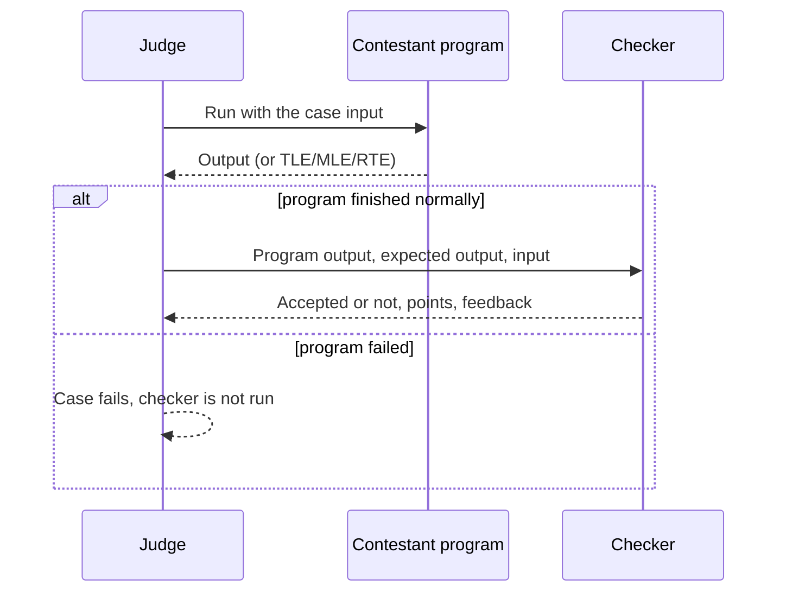

# Checkers

> Pick a built-in checker or write your own (C++/testlib, Python) to decide whether a contestant's output is correct and how many points it earns.
>
> ⏱ ~15 min · 👤 Problem setters · 🔑 Edit rights on the problem (Python checkers: the problem must be **manually managed**)

## When you need this page

Use this page when a problem has several correct answers, prints floating-point numbers, has output whose order does not matter, or needs partial points within a single case. If the problem has exactly one correct output, the default `standard` checker is enough and you do not need to change anything.

A **checker** decides whether the contestant's output for one test case is correct. It runs after the contestant's program has finished; it only reads the output and never talks to the program. (If you need to talk to the program while it runs, use an [interactive grader](/en/setter/graders) instead.)



## Choosing a checker

- **In the web editor** (**Edit test data**), pick a checker from the **Checker** drop-down. It offers `standard`, `floats`, `floatsabs`, `floatsrel`, `identical`, `linecount`, and custom checker programs (`bridged`). See [Managing problems](/en/setter/managing-problems#step-4-choose-a-checker).
- **In `init.yml`**, set the `checker` key at the top level (for all cases) or on a single case. Every checker on this page can be used this way.

Without arguments:

```yaml
checker: floats
```

With arguments:

```yaml
checker:
  name: floats
  args:
    precision: 4
```

## Built-in checkers

| Name | In web editor | Summary |
|---|---|---|
| `standard` | yes | Compare tokens, ignore all whitespace. **Default.** |
| `floats` | yes | Compare numbers with a tolerance. |
| `floatsabs` | yes | `floats` with absolute error only. |
| `floatsrel` | yes | `floats` with relative error only. |
| `identical` | yes | Byte-for-byte comparison. |
| `linecount` | yes | Compare line by line. |
| `sorted` | no | Ignore the order of lines or tokens. |
| `unordered` | no | Deprecated alias of `sorted` with `split_on: whitespace`. |
| `easy` | no | Compare character counts, ignoring whitespace and case. |
| `linematches` | no | Partial points per matching line. |
| `rstripped` | no | Compare lines, ignoring trailing whitespace. |
| `bridged` | yes (Custom checker) | Run your own checker program. |

### `standard`

The default checker when `checker` is not set.

1. Split both outputs into tokens separated by any whitespace (spaces, tabs, newlines).
2. Compare the tokens one by one; they must be exactly equal.

Line breaks and extra blank lines do not matter, so `1 2\n3` and `1\n2 3` are both accepted for the expected output `1 2 3`. The feedback tells the contestant which token differs.

### `floats`

For output containing real numbers. Tokens that parse as numbers in the expected output are compared with a tolerance; other tokens must match exactly.

**Arguments:**

| Argument | Default | Meaning |
|---|---|---|
| `precision` | `6` | The tolerance is ε = 10<sup>-precision</sup>. |
| `error_mode` | `default` | `default`, `absolute`, or `relative`. |

With `p` = contestant's number and `j` = expected number, a token is accepted when:

| `error_mode` | Accepted if |
|---|---|
| `absolute` | \|p − j\| ≤ ε |
| `relative` | p lies between j·(1 − ε) and j·(1 + ε) |
| `default` | \|p − j\| ≤ ε, **or** \|j\| ≥ ε and \|1 − p/j\| ≤ ε |

Additional rules:

- Both outputs must have the same number of non-empty lines, and each line must have the same number of tokens. Otherwise the result is a presentation error.
- `NaN` is never accepted.

```yaml
checker:
  name: floats
  args:
    precision: 4
    error_mode: absolute
```

The web editor only lets you set `precision`; it always uses the `default` mode.

### `floatsabs` and `floatsrel`

Shortcuts for `floats` with `error_mode: absolute` and `error_mode: relative`. They accept `precision` too.

### `identical`

The output must be exactly identical to the expected output, byte for byte, including whitespace.

| Argument | Default | Meaning |
|---|---|---|
| `pe_allowed` | `true` | If the output would have passed `standard` but differs in whitespace, show "Presentation Error, check your whitespace" as feedback. The case still fails. |

### `linecount`

Compares the output line by line. Within a line, tokens are separated by whitespace and must match exactly; the number of tokens on each line must match. The feedback reports the first line and token that differ. It takes no arguments.

### `sorted`

Accepts the output if it contains the same items as the expected output, in any order.

| Argument | Default | Meaning |
|---|---|---|
| `split_on` | `lines` | `lines`: compare the lines as a multiset (tokens inside a line keep their order). `whitespace`: compare all tokens as a multiset. |

`unordered` is a deprecated alias of `sorted` with `split_on: whitespace`.

### `easy`

Removes all whitespace, lowercases everything, and checks that each character occurs the same number of times in both outputs. Use it only when the order really does not matter.

### `linematches`

Awards partial points for each line that matches exactly.

| Argument | Default | Meaning |
|---|---|---|
| `point_distribution` | `[1]` | Weight of each line. Its length must equal the number of non-empty lines in the expected output. |
| `filler_lines_required` | `true` | If `true`, the output must have exactly as many non-empty lines as the expected output. |

The case earns `case points × (weights of matching lines) / (sum of all weights)`.

### `rstripped`

Compares line by line after removing trailing whitespace from each line. Set `filter_new_line: true` to ignore empty lines.

## Custom checker programs (`bridged`)

A custom checker is a program you write (C++, Pascal, Java, ...) that the judge compiles and runs for every test case. This is how the web editor's **Custom checker** option works: upload a `.cpp`, `.pas`, or `.java` file and choose its type.

In `init.yml`:

```yaml
checker:
  name: bridged
  args:
    files: checker.cpp
    lang: CPP20
    type: testlib
```

**Arguments:**

| Argument | Default | Meaning |
|---|---|---|
| `files` | required | Checker source file, or a list of files (first one is the main file). Relative to the problem directory. |
| `lang` | `CPP17` | Language to compile with, e.g. `CPP20`, `PAS`, `JAVA8`. The web editor sets `CPP20` for `.cpp`. |
| `type` | `default` | How the checker is called and how its result is read (see below). |
| `time_limit` | `20` | Checker time limit, in seconds. |
| `memory_limit` | `524288` | Checker memory limit, in KB. |
| `compiler_time_limit` | judge default | Compilation time limit, in seconds. |
| `flags` | none | Extra compiler flags. |
| `feedback` | `true` | Show the checker's stdout as feedback and stderr as extended feedback. |
| `args_format_string` | depends on `type` | Custom argument order, e.g. `'{input_file} {output_file} {answer_file}'`. |
| `treat_checker_points_as_percentage` | `false` | `testlib` only: read partial points as a percentage (0-100) of the case's points. |

::: tip testlib is already installed
The judge images include [testlib](https://github.com/VNOI-Admin/testlib) at `/usr/include/testlib.h`, so `#include "testlib.h"` works without uploading the header.
:::

### Checker types

| `type` | Command-line arguments | Result |
|---|---|---|
| `default` | `input_file output_file answer_file` | Exit code 0 = accepted, 1 = wrong answer. |
| `testlib` | `input_file output_file answer_file` | 0 = accepted, 1 = wrong answer, 2 = presentation error, 3 = checker failure, 7 = partial points (see below). |
| `coci` | `input_file output_file answer_file` | Same as `testlib`, but for exit code 7 stderr must contain a line `partial A/B`, which gives A/B of the points. |
| `cms` | `input_file answer_file output_file` | Exit code 0, and stdout starts with a number from 0 to 1 (the fraction of points). Compiled with `-DCMS`. |
| `peg` | `answer_file output_file input_file` | 0 = accepted, 1 = wrong answer. Partial points: print two lines `a` and `b` to stdout to get a/b of the points. |
| `themis` | none; two lines on stdin | See below. Compiled with `-DTHEMIS`. |

Here `output_file` is the contestant's output and `answer_file` is the expected output.

For every type except `default`, any other exit code (or a crash or timeout of the checker) makes the case fail with the feedback `Checker exitcode N`. With `default`, it causes an Internal Error.

**Partial points with testlib:** exit with code 7 and write a line `points X` to stderr. testlib's `quitp(X, ...)` does this. `X` is the number of points (from 0 to the case's points), or a percentage from 0 to 100 if `treat_checker_points_as_percentage` is set.

**Themis checkers:** the checker reads two lines from stdin: the directory containing the input and answer files (with their original names from `in` and `out`) and the directory containing the contestant's output (named like `out`). It must exit with code 0, and the last line of its stdout is a number from 0 to 1, the fraction of points. The test case must have both `in` and `out`.

### Example: testlib checker

The problem: given `n`, print two non-negative integers whose sum is `n`. Any such pair is correct.

```cpp
#include "testlib.h"

int main(int argc, char* argv[]) {
    registerTestlibCmd(argc, argv);

    long long n = inf.readLong();   // input file
    long long a = ouf.readLong();   // contestant's output
    long long b = ouf.readLong();

    if (a < 0 || b < 0)
        quitf(_wa, "numbers must be non-negative");
    if (a + b != n)
        quitf(_wa, "%lld + %lld != %lld", a, b, n);
    quitf(_ok, "%lld + %lld = %lld", a, b, n);
}
```

Use `ans` to read the expected output file when you need it.

### Example: plain C++ checker (`default` type)

```cpp
#include <fstream>
#include <iostream>

int main(int argc, char* argv[]) {
    std::ifstream input(argv[1]);    // input file
    std::ifstream output(argv[2]);   // contestant's output
    std::ifstream answer(argv[3]);   // expected output

    long long n, a, b;
    input >> n;
    if (!(output >> a >> b) || a < 0 || b < 0 || a + b != n) {
        std::cout << "Wrong answer" << std::endl;   // feedback
        return 1;                                   // WA
    }
    std::cout << "OK" << std::endl;
    return 0;                                       // AC
}
```

## Python checkers

A Python checker is a `.py` file in the problem directory. The web editor cannot upload it, so the problem must be **manually managed** and use a hand-written `init.yml` (see [Problem format](/en/setter/problem-format)):

```yaml
checker: checker.py
```

Any extra keys under `args` are passed to your function as keyword arguments:

```yaml
checker:
  name: checker.py
  args:
    tolerance: 3
```

The file must define a `check` function:

```python
def check(process_output, judge_output, **kwargs):
    ...
```

`process_output` (the contestant's output) and `judge_output` (the expected output) are `bytes`.

**Keyword arguments provided by the judge:**

| Name | Meaning |
|---|---|
| `judge_input` | The case's input (bytes). |
| `point_value` | Points of this case. |
| `submission_source` | The contestant's source code (bytes). |
| `submission_language` | Language key, e.g. `CPP17`. |
| `case_position` | Position of the case, starting at 0. |
| `batch` | Batch number, or 0 if the case is not batched. |
| `execution_time` | Running time in seconds. |
| `binary_data` | Whether `binary_data` is set for the case. |
| `problem_id` | The problem code. |
| `case` | The test case object. |
| `result` | The `Result` object for this case, before checking. |
| `input_name` / `output_name` | The `in` and `out` file names, if the case has them. |

Accept `**kwargs` so your checker keeps working if more arguments are added.

**Return value:** either a boolean (`True` = full points, `False` = 0), or a `CheckerResult`:

```python
from dmoj.result import CheckerResult

CheckerResult(passed, points, feedback=None, extended_feedback=None)
```

`passed` must be a `bool`, `points` a number, and the feedback values strings (or `None`).

**Running on errors:** by default the checker is not called when the program got TLE, MLE, RTE, and so on. Set `check.run_on_error = True` to call it anyway.

### Example

The same "two non-negative numbers with sum `n`" problem, as a Python checker:

```python
from dmoj.result import CheckerResult
from dmoj.utils.unicode import utf8text


def check(process_output, judge_output, judge_input, point_value, **kwargs):
    n = int(utf8text(judge_input).split()[0])
    tokens = utf8text(process_output).split()

    if len(tokens) != 2:
        return CheckerResult(False, 0, 'Expected exactly two numbers')
    try:
        a, b = int(tokens[0]), int(tokens[1])
    except ValueError:
        return CheckerResult(False, 0, 'Output is not an integer')

    if a < 0 or b < 0 or a + b != n:
        return CheckerResult(False, 0, 'Wrong answer')
    return CheckerResult(True, point_value, 'OK')
```

For a complete problem that uses a Python checker, see the `signature/fastbit` example in [Problem examples](/en/setter/examples).

## Troubleshooting

| Symptom | Fix |
|---|---|
| Correct output gets Presentation Error with `floats` | Both outputs must have the same number of non-empty lines and the same number of tokens per line. Check the expected output and how the solution prints. |
| Submissions get Internal Error with a `default`-type checker | A `default` checker may only exit with 0 or 1; any other exit code, a crash, or a timeout causes Internal Error. Test the checker locally first. |
| A case fails with `Checker exitcode N` feedback | The checker (any type other than `default`) returned an invalid exit code, crashed, or timed out. See the [Checker types](#checker-types) table. |
| The web editor cannot upload `checker.py` | The web editor does not support Python checkers. Enable **manually managed** and write `init.yml` by hand. |
| The checker is not called when the program gets TLE/RTE | This is the default. For a Python checker, set `check.run_on_error = True`. |

## Next steps

- [Graders](/en/setter/graders): when you need to talk to the program while it runs (interactive problems).
- [Problem format](/en/setter/problem-format): how to set the `checker` key in `init.yml`.
- [Problem examples](/en/setter/examples): complete problems that use custom checkers.
