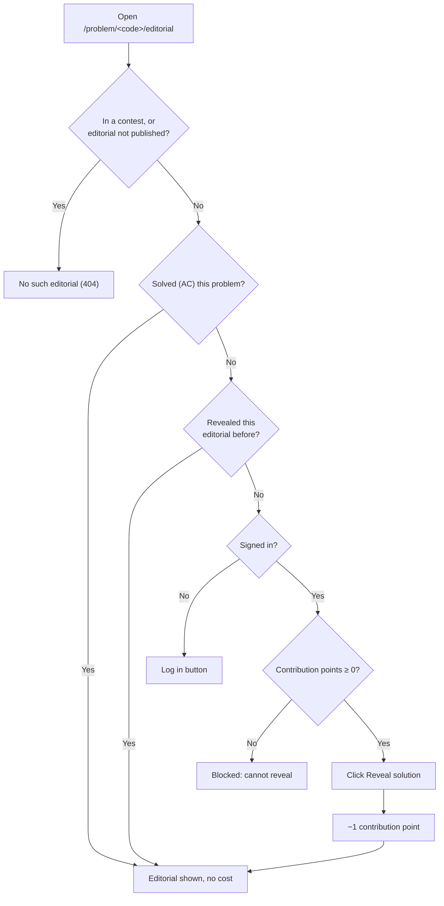

# Editorials

> Read a problem's editorial when you are stuck (and what it costs if you haven't solved the problem yet), or write and publish the editorial for your own problem, including AI-generated drafts with the `generate_editorials` command.
>
> ⏱ ~5 min (reading) · ~20 min (writing) · 👤 Solvers, problem setters, admins · 🔑 Reading: an LCOJ account; writing: permission to edit the problem (`judge.edit_own_problem` and being one of its authors/curators)

Each problem on LCOJ can have **one** editorial: a Markdown write-up that explains the idea, the approach, the complexity, and reference code. This page has two parts:

- **[Reading editorials](#reading-editorials)** is for solvers: where to find an editorial, when you can see it, and what revealing it costs.
- **[Writing editorials](#writing-editorials)** is for problem setters and admins: who can write one, where, which fields to fill in, a recommended layout, and how to generate AI drafts.

## Before you start

- [ ] **To read:** you are signed in. Guests can open an editorial page, but the content stays blurred and they cannot reveal it.
- [ ] **To read:** you have genuinely tried the problem. Revealing the editorial of a problem you haven't solved **costs contribution points** (see [Blog, comments and tickets](/en/learn/community)).
- [ ] **To write:** your account can edit the problem (see [Managing Problems](/en/setter/managing-problems) and [Permissions](/en/admin/permissions)).
- [ ] **To write:** you know basic Markdown. Inline math goes in `~...~` and display math in `$$...$$`.

## Reading editorials

### Where to find an editorial

The editorial for a problem with code `<code>` lives at `/problem/<code>/editorial` (for example, `https://luyencode.net/problem/aplusb/editorial`). The page title reads **Editorial for &lt;problem name&gt;** (Vietnamese UI: *Hướng dẫn giải của &lt;tên bài&gt;*).

There are three ways in:

1. **Problem page:** the right sidebar has a **Read editorial** link (*Đọc lời giải*), right below **All submissions** / **Best submissions**.
2. **Problem list** (`/problems/`): the last column has a book icon. A green check means the problem has a public editorial; click it to open the editorial. A gray minus means there is none. Click the column header to sort by it, or tick **Has editorial** (*Có lời giải*) in the search panel to show only problems with an editorial.
3. **Page of a finished contest:** the problem table gets an extra **Editorials** column (*Lời giải*) once at least one public problem in the contest has a public editorial.

### When you can see an editorial

The editorial page opens only when **all** of the following hold:

| Condition | Details |
|---|---|
| You can see the problem | If the problem is private or you don't have access to it, its editorial is hidden too. |
| The editorial is published | The editorial has **public visibility** turned on and its **publish date** has passed. Users with the `judge.see_private_solution` permission, and anyone who can edit the problem, can see it before that. |
| You are **not** in a contest | While you are participating in a contest (any contest, not just one that contains this problem), every editorial page shows **No such editorial** (*Không có lời giải*) and the **Read editorial** link disappears. Leave the contest or wait for it to end. |

::: info What counts as "solved"?
You have **solved** a problem once at least one of your submissions to it is `AC` (Accepted). See [Submitting and judging](/en/learn/submissions).
:::

### Revealing an editorial

If you **have solved** the problem, the editorial shows right away at no cost.

If you **haven't**, the content is blurred and a warning box says **This editorial is hidden until you reveal it.** (*Lời giải này đang bị ẩn cho đến khi bạn chọn mở ra.*). To reveal it:

1. Read the warning. It states: **Revealing this editorial before solving the problem will reduce your contribution score by 1 point(s). This penalty is applied only once per problem.**
2. Click **Reveal solution** (*Mở lời giải*).
3. The content appears, and **1 point** is taken off your contribution points.



Rules to keep in mind:

- **One penalty per problem.** Opening an editorial you already revealed does not cost anything more.
- **The penalty is permanent**, even if you solve the problem yourself later.
- **Negative points block reveals.** If your contribution points are **below 0**, the warning box shows *You cannot reveal this editorial while your contribution score is negative.* (not yet translated, so Vietnamese users see it in English too) and there is no reveal button. Exactly 0 still lets you reveal (and drops you to −1).
- **Guests** see **You must log in to reveal this editorial.** (*Bạn phải đăng nhập để mở lời giải này.*) and a **Log in** button.
- On luyencode.net the penalty is 1 point, the default value of `VNOJ_CP_EDITORIAL_REVEAL`. See [Site settings](/en/reference/settings).

::: warning Use editorials responsibly
Until you solve the problem, the top of the editorial always shows a red box: **Remember to use this editorial only when stuck, and not to copy-paste code from it. Please be respectful to the problem author and editorialist.** followed by **Submitting an official solution before solving the problem yourself is a bannable offence.** Read for the idea, then write your own code.
:::

### Comments on editorials

The bottom of each editorial page has its own comment section, separate from the comments under the problem statement. It loads automatically when you open the page and follows the usual comment rules (minimum solved problems, contribution points ≥ −20, voting, comment locks; see [Blog, comments and tickets](/en/learn/community)).

::: danger Watch out for spoilers
Comments are shown **even while the editorial is still blurred**. If you don't want the idea spoiled, don't scroll down. When you comment, don't paste a full solution.
:::

Editorial comments follow the same access rule as the editorial itself: anyone who can't see the editorial (not published yet, or in a contest) can't see its comments either.

## Writing editorials

### Who can write an editorial

An editorial belongs to its problem, so anyone who **can edit the problem** can write its editorial:

- `judge.edit_own_problem` **and** being one of the problem's authors or curators; or
- additionally `judge.edit_all_problem` (any problem) or `judge.edit_public_problem` (any public problem).

Anyone who can edit a problem can always see its editorial, even before it is published. To let someone see every unpublished editorial without edit rights, grant **See hidden solutions** (`judge.see_private_solution`). See [Permissions](/en/admin/permissions).

### Editorial fields

| Field (en / vi) | Meaning |
|---|---|
| **Public visibility** (*hiển thị công khai*) | When on, the editorial is published once the publish date arrives. When off, only problem editors and users with `see_private_solution` can see it. Default: off. |
| **Publish date** (*ngày công bố*) | Required. A public editorial becomes visible to everyone only **after** this moment. Use it to schedule publication, for example after a contest ends. |
| **Authors** (*tác giả*) | The people who wrote the editorial, shown at the top as **Author:** / **Authors:** (*Tác giả:* / *Các tác giả:*). Optional. |
| **Editorial content** (*nội dung lời giải*) | Required. Markdown, with a live preview. |

The content supports the same Markdown as problem statements: syntax-highlighted code blocks, tables, images, and math:

| Kind | Syntax | Example |
|---|---|---|
| Inline math | `~...~` | `~O(n \log n)~` |
| Display math | `$$...$$` | `$$dp_i = \max_{j < i} (dp_j + a_i)$$` |

::: warning `$...$` is not math
Just like in statements, `$a + b$` renders literally, dollar signs included. Always use `~a + b~` for inline math.
:::

### Option 1: On the site (recommended)

1. Open the problem and click **Edit problem** (*Sửa đề bài*) in the right sidebar (URL: `/problem/<code>/edit`).
2. Scroll to the bottom of the form, to the **Editorial** section (*Lời giải*).
3. Fill in **Editorial content**, pick a **Publish date**, and add **Authors** if needed.
4. Tick **Public visibility** to publish (leave it unticked while it's a draft).
5. Click **Update** (*Cập nhật*). The site takes you back to the problem page.
6. Open `/problem/<code>/editorial` to check how it renders.

::: info The site form only takes a date
The **Publish date** field on the site picks a **date** only, with no time, so the editorial goes live at the start of that day. To publish at an exact time (say, the moment a contest ends), use the admin panel.
:::

To delete the editorial, tick **Delete** (*Xoá*) in the **Editorial** section and click **Update**.

### Option 2: Django admin

1. Go to `/admin/`, open **Problems**, and pick the problem. (Problem editors also see an **[Edit]** link in the top-right corner of the editorial page that goes straight there.)
2. Scroll down to the **Solutions** section (*Lời giải*) at the bottom. If the problem has no editorial yet, click the link to add one at the end of that section.
3. Fill in the fields as above. Here **Publish date** has both a date and a time.
4. Click **Save**.

### Publishing editorials with a contest

After a contest, anyone who can edit the contest gets a **Make All Problems Public** button (not translated) in the **Problems** section (*Danh sách bài*) of the contest page. The button:

- makes every private problem in the contest public (you must be able to edit those problems);
- for every problem you can edit, turns on **Public visibility** for a hidden editorial and sets its **Publish date** to now. This also applies to problems that were already public.

See [Managing Problems](/en/setter/managing-problems) for more on making problems public.

### Recommended editorial template

A good editorial walks the reader from the idea to the code, so they can stop as soon as they have enough of a hint:

````markdown
## Idea

The key observation in a sentence or two, without giving away the whole approach.
Example: the answer depends only on the ~\gcd~ of the whole array.

## Approach

### Subtask 1 (~n \le 1000~)

Try every pair ~(i, j)~, which is ~O(n^2)~.

### Subtask 2 (no extra constraints)

Describe the optimal algorithm step by step. Put formulas on their own line:

$$dp_i = \max_{j < i} (dp_j + a_i)$$

## Complexity

- Time: ~O(n \log n)~
- Memory: ~O(n)~

## Code

```cpp
#include <bits/stdc++.h>
using namespace std;

int main() {
    // ...
}
```
````

Tips:

- Put the **idea** first and the code last: many readers only need a hint to finish on their own.
- Split by **subtask** if the problem has subtasks, from the simplest approach to the optimal one.
- Call out the **edge cases** (overflow, ~n = 1~, ...) that cause most `WA` verdicts.
- The reference code should be code that got `AC` on this very problem.

### AI-generated drafts (`generate_editorials`)

The `generate_editorials` management command sends the statement plus a few `AC` submissions to an OpenAI-compatible chat API and saves the Vietnamese editorial it gets back. See [Management Commands](/en/reference/management-commands#generate-editorials) for the full list of options.

::: danger Editorials go live immediately
The command saves each editorial with **Public visibility** on and **Publish date** set to the moment it runs, so users see it right away, with **no** review step. AI-written content can be wrong. Always run with `--dry-run` first, and review every generated editorial right after the real run (turn **Public visibility** off if it needs fixing).
:::

**Requirements**

- Run it from `dmoj/` with `./scripts/manage.py` (the command runs inside the `site` container).
- The environment variables `OPENAI_API_KEY` (required) and `OPENAI_BASE_URL` (optional, for a different OpenAI-compatible endpoint) must be set **inside the `site` container**. `docker-compose.yml` does not load them by default. Pass them per run with `COMPOSE_EXEC_FLAGS`, or add them to `environment/site.env` and recreate the container (see [Environment variables](/en/operate/environment)).
- The default model is `mimo-v2-flash`. If your endpoint doesn't serve it, pick another with `--model`.
- The `openai` and `pydantic` packages are already installed in the Docker image.

**Steps**

1. Preview one problem without saving anything:

   ```sh
   COMPOSE_EXEC_FLAGS="-e OPENAI_API_KEY=<key> -e OPENAI_BASE_URL=<url>" \
     ./scripts/manage.py generate_editorials --problem aplusb --dry-run --verbose
   ```

2. Read the preview in the log (roughly the first 500 characters of the content).
3. Generate it for real (drop `--dry-run`), or for several problems with `--limit N`.
4. Open `/problem/<code>/editorial` to proofread it, then edit it on the site or in the admin panel as in [Option 1](#option-1-on-the-site-recommended).

**Problems the command skips**

- Problems that are **not public**.
- Problems that **already have an editorial** (the command never overwrites one you wrote).
- Problems with no suitable `AC` submission to learn from. The command takes up to 3 of the latest `AC` submissions, preferring different users, and truncates code longer than 1000 characters before sending it. Currently only submissions in the language named exactly `C` are used; C++, C11, and so on are not, even though the log calls them "C/C++" submissions.

**What the output looks like**

The generated content has fixed Vietnamese sections: **Hiểu bài toán** (understanding the problem), **Các cách tiếp cận** (approaches; one `### Cách <name>` subsection each, with code, complexity, and explanation), **Phân tích độ phức tạp** (a complexity table), **Bài học kinh nghiệm** (key insights), and **Lỗi thường gặp** (common pitfalls). The authors are set to the `admin` user (or the first superuser), followed by **the owners of the sampled submissions**.

::: tip After generating
- Remove or adjust **Authors** if the people whose submissions were sampled don't want their names on it.
- Double-check the complexity and the code: AI often slips on problems that need a proof.
- Rework the content into the [recommended template](#recommended-editorial-template) if you want a consistent style.
:::

## Troubleshooting

| Symptom | Fix |
|---|---|
| The editorial page says **No such editorial** | The problem has no editorial, **Public visibility** is off, the **Publish date** hasn't arrived, or you are in a contest. Leave the contest and try again. |
| No **Read editorial** link on the problem page | Same causes as above: the link only shows when you can see the editorial and aren't in a contest. |
| No **Reveal solution** button, just a line about *contribution score is negative* | Your contribution points are negative. Earn points with helpful comments or good tickets (see [Blog, comments and tickets](/en/learn/community)), or solve the problem yourself. |
| Clicking **Reveal solution** shows **Could not reveal the editorial right now. Please try again.** | Reload the page and click again. If the earlier attempt went through, you won't be charged a second time. |
| A setter is asked to reveal the editorial of their own problem | The blur applies to everyone who hasn't gotten `AC` on the problem, problem editors included. Submit the reference solution first; revealing still costs a point otherwise. |
| A scheduled editorial went live earlier than planned | The site's date field has no time. Set the **Publish date** with a time in the admin panel. |
| `generate_editorials` says `OPENAI_API_KEY environment variable not set` | The variable isn't in the `site` container. Pass it with `COMPOSE_EXEC_FLAGS`, or add it to `environment/site.env` and recreate the container. |
| `generate_editorials` says `Problem '<code>' not found or already has editorial` | The code is wrong or the problem isn't public. If the problem already has an editorial, the log says `Editorial already exists` instead; delete the old one first if you want to regenerate it. |
| `generate_editorials` says `Insufficient AC C/C++ solutions` | The problem has no `AC` submission in a language named `C` (see the skip rules above). Submit a reference solution in C, or write the editorial by hand. |

## Next steps

- [Managing Problems](/en/setter/managing-problems): create problems, write statements, make problems public.
- [Blog, comments and tickets](/en/learn/community): how contribution points are calculated.
- [Management Commands](/en/reference/management-commands#generate-editorials): every option of `generate_editorials`.
- [Permissions](/en/admin/permissions): grant problem-editing rights and `see_private_solution`.
- [Site settings](/en/reference/settings): `VNOJ_CP_EDITORIAL_REVEAL` and other contribution-point settings.
