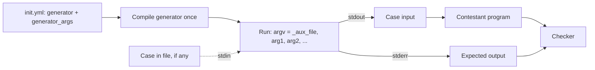

# Generators

A **generator** is a program that creates the input and the expected output of a test case when the judge needs them. Instead of storing large test files, you store a small program and its arguments.

::: warning Hand-written init.yml only
The web test data editor has no generator option. To use a generator, mark the problem as **manually managed** in the admin and write `init.yml` yourself, with the generator source in the problem directory (see [Problem format](/en/setter/problem-format)).
:::

## How the judge runs a generator



1. The judge compiles the generator (the compiled binary is cached).
2. For each test case that needs it, the judge runs the generator **once** with that case's arguments.
3. Everything the generator prints to **stdout** becomes the case's **input**.
4. Everything it prints to **stderr** becomes the case's **expected output**.
5. If the case has an `in` file, its contents are passed to the generator's **stdin**.

Because input and expected output come from the **same run**, the answer you print to stderr must be computed from exactly the values you printed to stdout.

::: warning Make generators deterministic
The generator runs again every time a submission is judged. If it uses a time-based seed (`srand(time(0))`), every submission gets different tests. Always derive the seed from the arguments.
:::

::: danger Do not print debug messages to stderr
stderr **is** the expected output. Any extra text written there makes every submission fail.
:::

If the generator exits with a non-zero code, crashes, or exceeds its limits, the submission gets an Internal Error.

## The `generator` key

The `generator` key can be written in three ways.

**1. A single file:**

```yaml
generator: gen.cpp
```

**2. A list of files** (the first is the main file, the others are helper files such as headers):

```yaml
generator: [gen.cpp, utils.h]
```

**3. An object:**

```yaml
generator:
  source: gen.cpp        # or a list: [gen.cpp, utils.h]
  language: CPP17
  flags: ['-DLOCAL_GEN']
  compiler_time_limit: 60
  time_limit: 10
  memory_limit: 262144
```

| Key | Default | Meaning |
|---|---|---|
| `source` | required | Generator file, or a list of files. Relative to the problem directory. |
| `language` | detected | Language to compile with. `.cpp`/`.cc` files use the newest available C++ (CPP20, CPP17, ...), `.c` files use C11 or C, other files are detected from the extension. |
| `flags` | none | Extra compiler flags. |
| `compiler_time_limit` | `30` | Compilation time limit, in seconds. |
| `time_limit` | `20` | Time limit for one generator run, in seconds. |
| `memory_limit` | `524288` | Memory limit for one generator run, in KB. |
| `args` | none | Default arguments for cases that have no `generator_args`. |

The defaults come from the judge configuration (`generator_compiler_time_limit`, `generator_time_limit`, `generator_memory_limit`). Only C and C++ generators can consist of several files.

## Generator arguments

Give each test case its arguments with `generator_args`:

```yaml
generator: gen.cpp
test_cases:
- {generator_args: [false, 123, "a b"], points: 10}
- {generator_args: [true, 456], points: 20}
- {points: 30}
```

Each value is converted to a string with Python's `str()`, so YAML `true` becomes `"True"` and `123` becomes `"123"`. The program's `argv` is then:

| Case | `argv[0]` | `argv[1]` | `argv[2]` | `argv[3]` |
|---|---|---|---|---|
| 1 | `_aux_file` | `False` | `123` | `a b` |
| 2 | `_aux_file` | `True` | `456` | |
| 3 | `_aux_file` | | | |

`argv[0]` is always the program name `_aux_file`; **your first argument is `argv[1]`**.

## Complete example

A problem: read `n` integers and print their sum.

**init.yml:**

```yaml
generator:
  source: gen.cpp
  time_limit: 5
test_cases:
- {generator_args: [10, 100, 1], points: 20}
- {generator_args: [1000, 1000000, 2], points: 30}
- {generator_args: [200000, 1000000000, 3], points: 50}
```

The three arguments are `n`, the largest value, and the random seed.

**gen.cpp:**

```cpp
#include <cstdlib>
#include <iostream>
#include <random>
#include <vector>

int main(int argc, char* argv[]) {
    // argv[0] is "_aux_file"; generator_args start at argv[1].
    int n = std::atoi(argv[1]);
    int max_value = std::atoi(argv[2]);
    unsigned seed = std::strtoul(argv[3], nullptr, 10);

    // Fixed seed from the arguments: the same case is generated every time.
    std::mt19937 rng(seed);
    std::uniform_int_distribution<int> dist(0, max_value);

    // Generate the values once and keep them.
    std::vector<int> a(n);
    long long sum = 0;
    for (int& x : a) {
        x = dist(rng);
        sum += x;
    }

    // Input -> stdout
    std::cout << n << '\n';
    for (int i = 0; i < n; i++) {
        std::cout << a[i] << (i + 1 < n ? ' ' : '\n');
    }

    // Expected output -> stderr, computed from the same values
    std::cerr << sum << '\n';
    return 0;
}
```

## Generators with testlib

[testlib](https://github.com/VNOI-Admin/testlib) is installed on the judge at `/usr/include/testlib.h`. `registerGen` seeds testlib's `rnd` from the command-line arguments, so the output is deterministic.

```cpp
#include "testlib.h"
#include <iostream>
#include <vector>

int main(int argc, char* argv[]) {
    registerGen(argc, argv, 1);

    int n = atoi(argv[1]);
    std::vector<int> a(n);
    long long sum = 0;
    for (int& x : a) {
        x = rnd.next(1, 100);
        sum += x;
    }

    std::cout << n << '\n';
    for (int i = 0; i < n; i++) {
        std::cout << a[i] << (i + 1 < n ? ' ' : '\n');
    }
    std::cerr << sum << '\n';
}
```

```yaml
generator:
  source: gen.cpp
  compiler_time_limit: 60
test_cases:
- {generator_args: [10], points: 50}
- {generator_args: [100000], points: 50}
```

Compiling testlib can be slow, so raise `compiler_time_limit` if compilation times out. You can also ship your own copy of the header by listing it: `source: [gen.cpp, testlib.h]`.

## Per-case generators

`generator` can also be set on a single case (or a batch), overriding the top-level one:

```yaml
test_cases:
- generator: gen_small.cpp
  generator_args: [10]
  points: 30
- generator: gen_large.cpp
  generator_args: [100000]
  points: 70
```

## Mixing generators and files

- If a case has **both** `in` and `out`, the generator is not run for it.
- If a case has only `in`, the generator runs with that file on stdin, and its stdout and stderr are used as usual. This lets you keep generator parameters in small files instead of `generator_args`.

```yaml
archive: data.zip
generator: gen.cpp
test_cases:
- {in: sample.in, out: sample.out, points: 0}   # stored files, no generator
- {generator_args: [50, 1000, 7], points: 100}   # generated
```

## Why use a generator?

- **Less storage:** no large test files to keep and sync to every judge.
- **Easy changes:** edit the generator or its arguments instead of regenerating files.
- **Consistent answers:** the expected output is computed by the same program that created the input.

For a real problem that uses a generator, see `generator/ds3` in [Problem examples](/en/setter/examples).
