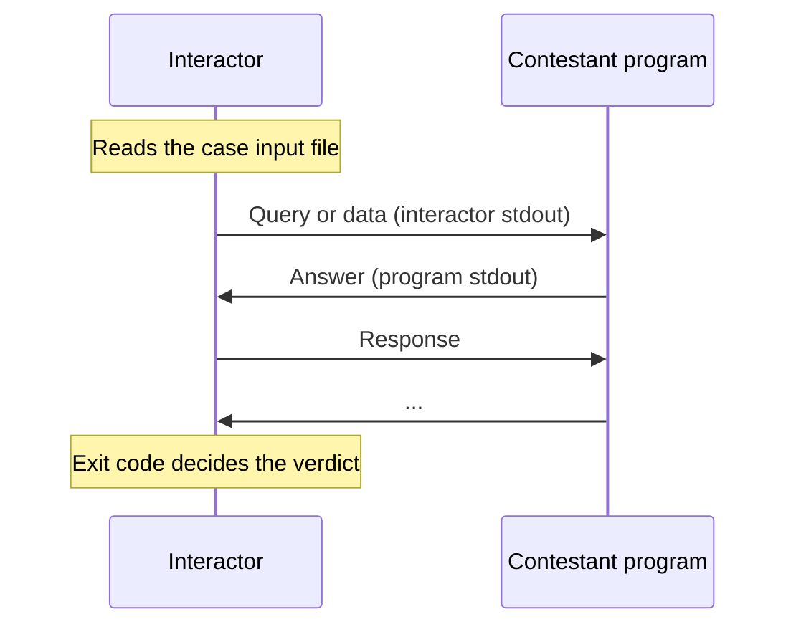

# Graders

A **grader** controls how the contestant's program is run for each test case: what it reads, who it talks to, and how the result is decided. Most problems use the standard grader, which feeds the input file to stdin and passes stdout to a [checker](/en/setter/checkers). You only need another grader for interactive problems, IOI-style function problems, output-only problems, or truly unusual grading.

::: tip Checker or grader?
If you only need to decide whether an output is correct (for example, many correct answers), a [checker](/en/setter/checkers) is enough. Use a different grader only when the program has to be run differently.
:::

## Grader types

| Grader | `init.yml` key | Web editor option | Use it for |
|---|---|---|---|
| Standard | none | **Standard** | Normal problems (stdin/stdout, or files with `file_io`). |
| Native interactive | `interactive` | **Interactive** | Interactive problems with a C++ interactor. |
| Function signature | `signature_grader` | **Function Signature Grading (IOI-style)** | Contestants implement functions instead of `main`. |
| Output only | `output_only` | **Output Only** | Contestants submit output files instead of code. |
| Custom Python grader | `custom_judge` | none | Python interactors or fully custom grading logic. |
| Communication | `communication` | none | A manager program talks to one or more copies of the submission (CMS style). |

If `init.yml` contains several of these keys, the judge uses the first one in this order: `custom_judge`, `signature_grader`, `interactive`, `output_only`, `communication`, then standard.

Graders without a web editor option require a hand-written `init.yml` on a **manually managed** problem (see [Problem format](/en/setter/problem-format)).

## Standard grader

The default. For each case, the judge:

1. Runs the program with the case's input on stdin.
2. Collects stdout (up to `output_limit_length`).
3. If the program exited normally, runs the checker on the output.

If the program must read from and write to files instead, set `file_io`:

```yaml
file_io:
  input: post.inp
  output: post.out
test_cases:
- {in: post.inp, out: post.out, points: 1}
```

In the web editor, this is **IO Method: Via files** with **Input from file** and **Output to file**.

## Native interactive grading (`interactive`)

The contestant's program talks to an **interactor**, a program you write (usually in C++ with testlib). The interactor's stdout goes to the program's stdin, and the program's stdout goes to the interactor's stdin.



In `init.yml`:

```yaml
unbuffered: true
archive: seed2.zip
interactive:
  files: interactor.cpp
  type: testlib
  lang: CPP20
test_cases:
- {in: seed2.1.in, points: 50}
- {in: seed2.2.in, points: 50}
```

In the web editor, choose **Interactive** and upload a `.cpp` interactor; LCOJ writes `files`, `type: testlib`, and `lang: CPP20` for you.

**Keys under `interactive`:**

| Key | Default | Meaning |
|---|---|---|
| `files` | required | Interactor source file, or a list of files. Relative to the problem directory. |
| `type` | `default` | `default`, `testlib`, or `coci`: how the interactor is called and how its exit code is read. |
| `lang` | detected from the file extension | Language to compile the interactor with. |
| `flags` | none | Extra compiler flags. |
| `compiler_time_limit` | judge default | Compilation time limit, in seconds. |
| `preprocessing_time` | `2` | Extra seconds the interactor gets on top of the problem's time limit. |
| `memory_limit` | `524288` | Interactor memory limit, in KB. |
| `args_format_string` | depends on `type` | Custom argument order. |
| `unbuffered` | `true` | Run the interactor with unbuffered output. |

**Interactor arguments and results:**

| `type` | Arguments | Result |
|---|---|---|
| `default` | `input_file answer_file` | Exit code 0 = accepted, 1 = wrong answer. |
| `testlib` | `input_file log_file answer_file` | Same exit codes as a [testlib checker](/en/setter/checkers#checker-types) (0 AC, 1 WA, 2 PE, 7 partial points). |
| `coci` | `input_file answer_file` | Same as `testlib`, with `partial A/B` for partial points. |

`answer_file` contains the case's `out` file (empty if the case has none).

::: warning Flushing
The top-level `unbuffered: true` makes the **contestant's** output unbuffered. The web editor does not set it, so for problems created on the site, tell contestants in the statement to flush after every line (`fflush(stdout)`, `cout << endl`, `sys.stdout.flush()`, ...). Your interactor must always flush too.
:::

### Example: testlib interactor

The contestant must guess a secret number between 1 and 100 in at most 10 attempts. The input file contains the secret number.

```cpp
#include "testlib.h"
#include <iostream>

int main(int argc, char* argv[]) {
    registerInteraction(argc, argv);

    int secret = inf.readInt();   // from the input file
    for (int attempt = 1; attempt <= 10; attempt++) {
        int guess = ouf.readInt(1, 100);   // from the contestant
        if (guess == secret) {
            std::cout << "Correct!" << std::endl;
            quitf(_ok, "found in %d attempts", attempt);
        }
        std::cout << (guess < secret ? "Higher" : "Lower") << std::endl;
    }
    quitf(_wa, "too many attempts");
}
```

## Function signature grading (`signature_grader`)

For IOI-style problems. The contestant implements one or more functions; your **entry** file contains `main`, reads the input, calls the contestant's functions, and prints the output. The output is then checked by the checker as usual.

```yaml
signature_grader:
  entry: handler.cpp
  header: header.h
test_cases:
- {in: 1.in, out: 1.out, points: 50}
- {in: 2.in, out: 2.out, points: 50}
```

**Keys:**

| Key | Meaning |
|---|---|
| `entry` | The file with `main` (C or C++). |
| `header` | Header declaring the functions the contestant must implement. |
| `allow_main` | Optional, default `false`. If `true`, the contestant's own `main` is kept. |
| `java` | For Java submissions: `{entry: <file>}`. |

How it works:

1. The judge adds `#include "<header>"` to the top of the submission.
2. Unless `allow_main` is set, it also adds `#define main main_<random>`, so a `main` written by the contestant for local testing does not clash.
3. The submission, the header, and the entry file are compiled together **in the submission's language**, with `SIGNATURE_GRADER` defined. A C++ entry therefore only works for C++ submissions; write the entry in C if C submissions must work too.

**Supported languages:** C, C11, CPP03, CPP11, CPP14, CPP17, CPP20, CPPTHEMIS, CLANG, CLANGX, and Java (JAVA, JAVA8 to JAVA17, which need the `java` key).

In the web editor, choose **Function Signature Grading (IOI-style)**, upload a `.cpp` entry and a `.h` header, and put `{"allow_main": true}` in **grader arguments** if needed.

::: info
With `signature_grader`, `output_prefix_length` defaults to `0`, so contestants do not see the output of your entry program.
:::

### Example

**header.h:**

```cpp
#ifndef HEADER_H
#define HEADER_H
long long sum(int n, const int a[]);
#endif
```

**handler.cpp** (entry):

```cpp
#include "header.h"
#include <cstdio>

int a[200000];

int main() {
    int n;
    std::scanf("%d", &n);
    for (int i = 0; i < n; i++) std::scanf("%d", &a[i]);
    std::printf("%lld\n", sum(n, a));   // calls the contestant's function
    return 0;
}
```

**Contestant's submission:**

```cpp
long long sum(int n, const int a[]) {
    long long s = 0;
    for (int i = 0; i < n; i++) s += a[i];
    return s;
}
```

## Output-only problems (`output_only`)

The contestant does not submit code. Instead, they submit with the output-only language by uploading a zip containing one file per test case, named exactly like that case's `out` file. Each file is checked by the checker as if a program had printed it.

```yaml
output_only: true
test_cases:
- {in: 1.in, out: 1.out, points: 50}
- {in: 2.in, out: 2.out, points: 50}
```

If a file is missing from the zip, that case gets WA. In the web editor, choose **Output Only**.

## Custom Python graders (`custom_judge`)

A custom grader is a Python file in the problem directory that defines a class named `Grader`. The judge loads it for every submission.

```yaml
custom_judge: grader.py
test_cases:
- {in: 1.in, points: 100}
```

### Python interactive grader

The easiest kind of custom grader: subclass `InteractiveGrader` and implement `interact`. The judge starts the program and gives you an `interactor` connected to its stdin and stdout.

```python
from dmoj.graders.interactive import InteractiveGrader


class Grader(InteractiveGrader):
    def interact(self, case, interactor):
        n = int(case.input_data())      # the secret number from the input file
        guesses = 0
        while True:
            guess = interactor.readint(1, 2000000000)
            guesses += 1
            if guess == n:
                interactor.writeln('OK')
                break
            interactor.writeln('FLOATS' if guess > n else 'SINKS')
        return guesses <= 31            # True = full points
```

Set `unbuffered: true` in `init.yml` so contestants do not have to flush.

**`interactor` methods:**

| Method | Meaning |
|---|---|
| `read()` | Read all remaining output. |
| `readln(strip_newline=True)` | Read one line. |
| `readtoken(delim=None)` | Read one token. |
| `readint(lo=-inf, hi=inf, delim=None)` | Read an integer; if it is not an integer or not in `[lo, hi]`, the case gets WA. |
| `readfloat(lo=-inf, hi=inf, delim=None)` | Same for a real number. |
| `write(val)` | Send `str(val)` to the program (flushed immediately). |
| `writeln(val)` | Send `str(val)` followed by a newline. |
| `close()` | Close the program's stdin. |

The `read*` methods return `bytes`. `interact` returns a boolean or a `CheckerResult` (see [Checkers](/en/setter/checkers#python-checkers)). If the program closes its output early, reading stops and the case gets WA.

### Fully custom grader

For anything else, subclass `StandardGrader` and override `grade(self, case)`, which must return a `Result`. Useful attributes:

| Name | Meaning |
|---|---|
| `case.position` | Position of the case, starting at 0. |
| `case.points` | Points of the case. |
| `case.input_data()` | Input file contents (bytes). |
| `case.output_data()` | Expected output contents (bytes). |
| `self.binary` | The compiled submission; `self.binary.launch(...)` starts it. |
| `self.problem.time_limit`, `self.problem.memory_limit` | The problem's limits. |
| `self.source` | The submission's source code (bytes). |

Example: the program must echo back the line it receives.

```python
import subprocess

from dmoj.graders.standard import StandardGrader
from dmoj.result import Result


class Grader(StandardGrader):
    def grade(self, case):
        result = Result(case)
        case_input = b'Hello, World!\n'

        # Run the program
        self._current_proc = self.binary.launch(
            time=self.problem.time_limit,
            memory=self.problem.memory_limit,
            stdin=subprocess.PIPE,
            stdout=subprocess.PIPE,
            stderr=subprocess.PIPE,
        )
        output, error = self._current_proc.communicate(case_input)
        self.binary.populate_result(error, result, self._current_proc)

        # Grade the output
        if output == case_input:
            if result.result_flag == Result.AC:
                result.points = case.points
        else:
            result.result_flag |= Result.WA
            result.feedback = 'Wrong!'

        return result
```

`Result` fields you can set: `result_flag` (`Result.AC`, `Result.WA`, `Result.TLE`, ...), `points`, `feedback`, `extended_feedback`, and `proc_output`.

You can also override smaller pieces, such as `check_result(self, case, result)`. The `grader/shortest1` example in [Problem examples](/en/setter/examples) does this.

## Communication problems (`communication`)

A **manager** program you write reads the case input on stdin and talks to one or more copies of the contestant's program through named pipes (FIFOs). For every copy, the manager receives two paths as arguments: the pipe from that copy and the pipe to that copy.

```yaml
communication:
  manager:
    files: manager.cpp
  num_processes: 2
  type: cms
test_cases:
- {in: 1.in, points: 100}
```

| Key | Default | Meaning |
|---|---|---|
| `manager.files` | required | Manager source file or list of files. |
| `manager.lang`, `manager.flags`, `manager.compiler_time_limit`, `manager.memory_limit` | | Same as for interactors. |
| `num_processes` | `1` | How many copies of the submission to start. |
| `type` | `default` | How the manager's result is read, as for [checker types](/en/setter/checkers#checker-types). |
| `signature` | none | Optional `{entry, header, allow_main}`, as in `signature_grader`, to compile the submission with a stub. |

The combined running time of all copies must stay within the time limit.
