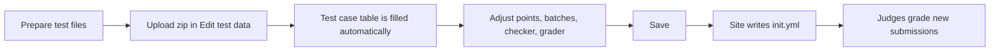

# Managing Problems

LCOJ lets you create problems, write statements, and upload test data from the web interface. This page walks through the whole process, from an empty problem to a problem that is ready to be solved on luyencode.net.

::: tip Who can do this?
- Creating a problem requires the `judge.add_problem` permission.
- Editing a problem requires `judge.edit_own_problem` **and** being one of the problem's authors or curators (or having `judge.edit_all_problem`).
- Rejudging requires `judge.rejudge_submission`, and rejudging many submissions at once requires `judge.rejudge_submission_lot`.

See [Permissions](/en/admin/permissions) for how to grant these.
:::

## Where problem data is stored

Every problem has its own directory named after the problem code. That directory holds `init.yml` (the judge configuration), the test data zip file, and any helper files (checker, interactor, header, ...).

### With Docker (recommended)

Problem data is stored in `dmoj/problems/` and mounted into the containers as `/problems/`. The default config already sets:

```python
DMOJ_PROBLEM_DATA_ROOT = '/problems/'
```

No extra configuration is needed.

### With bare metal

In `local_settings.py`, point `DMOJ_PROBLEM_DATA_ROOT` at the directory that the judges also read from:

```python
DMOJ_PROBLEM_DATA_ROOT = '/home/lcoj/problems/'
```

::: warning
The judges must see the same files as the site. If a judge cannot read `<problem_code>/init.yml`, submissions to that problem cannot be graded. See [Judge setup](/en/operate/judge-setup).
:::

## Creating a problem

There are three ways to create a problem.

### Option 1: On the site (recommended)

1. Open **Problems** and click the **Create new problem** tab (URL: `/problems/create`).
2. Fill in the form (see [Problem settings](#problem-settings) below). The statement box is pre-filled with the example from the site configuration.
3. Click **Save**. You are added as a **curator** of the problem, and every language marked "include in problem" is allowed automatically.
4. You are taken to the problem page. The right-hand sidebar now shows **Edit problem**, **Delete problem**, and **Edit test data**.

::: info
New problems are private (not publicly visible) until an administrator makes them public, so you can prepare everything before anyone sees it.
:::

### Option 2: Django admin

1. Go to `/admin/` and open **Problems**.
2. Click **Add problem**.
3. Fill in the fields. The admin form has a few extra fields compared to the site form: **creators** (authors), **curators**, **publicly visible**, **manually managed**, **allowed languages**, **banned users**, and so on.
4. Click **Save**, then **View on site**.

::: warning
In the admin, add yourself to **creators** or **curators**. Otherwise you will not be able to edit the problem later (unless you have `judge.edit_all_problem`).
:::

### Option 3: Import a Codeforces Polygon package

If your problem already exists on [Polygon](https://polygon.codeforces.com/), you can import it:

1. On `/problems/create`, click **Import problem from Codeforces Polygon package** (URL: `/problems/import-polygon`). You need the `judge.import_polygon_package` permission.
2. Enter the new problem code and upload the **full** package zip (Linux package) downloaded from Polygon.
3. Choose options such as **Ignore zero-point batches**, **Ignore zero-point cases**, and **Append main solution to tutorial**, and map Polygon statement languages to site languages.
4. Submit. The importer creates the problem, statements, test data, and checker (a C++ testlib checker, or a C++ interactor for interactive problems).

To update an existing problem from a newer package, use `/problem/<problem_code>/update-polygon`.

::: info
The importer converts LaTeX statements with `pandoc`, which must be installed on the server (version 3.0.0 or newer).
:::

## Problem settings

| Field | Meaning |
|---|---|
| **Problem code** | Unique ID, used in the URL `/problem/<code>`. Only lowercase letters, digits, and underscores (`^[a-z0-9_]+$`), at most 32 characters. Example: `aplusb`. |
| **Problem name** | The title shown in the problem list, e.g. "Sum of Two Numbers". |
| **Time limit** | In **seconds**; fractions such as `1.5` are allowed. Without the `judge.high_problem_timelimit` permission you cannot set more than 5 seconds. |
| **Memory limit** | In **kilobytes**. The default for new problems is `262144` (256 MB). |
| **Points** | Points for solving the problem completely. |
| **Allows partial points** | If enabled, a submission earns points in proportion to the test cases it passes (see [Scoring](#scoring)). Enabled by default on the create form. |
| **Problem types** / **Problem group** | Used for classification and filtering in the problem list. |
| **Statement file** | Optional PDF statement (requires the `judge.upload_file_statement` permission). |
| **Source** | Where the problem comes from; please credit the original source. |
| **Testers** | Users who can see the private problem but cannot edit it. |
| **Description** | The Markdown statement (see below). |

## Writing the statement

Statements are written in Markdown with a few extensions:

- Math formulas, rendered with MathJax
- Fenced code blocks with syntax highlighting
- Tables, images, and ~~strikethrough~~

The editor has a live preview, so check how the statement looks before saving.

### Math syntax

| Purpose | Syntax | Example |
|---|---|---|
| Inline math | `~...~` | `~1 \le n \le 10^5~` |
| Display math (own line) | `$$...$$` | `$$\sum_{i=1}^{n} a_i$$` |

::: warning Do not use single dollar signs
`$a + b$` is **not** inline math on LCOJ; it shows up as plain text with the dollar signs. Always use `~a + b~` for inline formulas.
:::

### Complete statement template

Copy this template into the **Description** field and replace the content. You do not need to write the time and memory limits in the statement; they are shown automatically in the problem sidebar.

````markdown
Given two integers ~a~ and ~b~, compute their sum.

## Input

A single line containing two integers ~a~ and ~b~ (~-10^9 \le a, b \le 10^9~).

## Output

Print a single integer: the value of ~a + b~.

## Scoring

- Subtask 1 (~30\%~ of the points): ~0 \le a, b \le 100~.
- Subtask 2 (~70\%~ of the points): no additional constraints.

## Sample

### Input

```
3 5
```

### Output

```
8
```

### Explanation

We have ~3 + 5 = 8~. In general, the answer is

$$
S = a + b.
$$
````

## Managing test data

Test data is managed in the web test data editor at `/problem/<problem_code>/test_data` (the **Edit test data** link on the problem page). When you save, the site generates `init.yml` for the judge automatically.



### Step 1: Prepare the zip file

Put all input and output files in one zip file. The editor recognizes these naming styles automatically:

| Style | Input files | Output files |
|---|---|---|
| Common / Themis | `aplusb.1.in`, `1.inp` | `aplusb.1.out`, `1.ok`, `1.ans` |
| CMS | `input.1` | `output.1` |
| Polygon | `01` | `01.a` |

Example for problem `aplusb`:

```
aplusb.1.in
aplusb.1.out
aplusb.2.in
aplusb.2.out
aplusb.3.in
aplusb.3.out
```

::: tip
- Use one naming style for the whole zip. Inputs and outputs are sorted naturally (1, 2, 10) and paired in order.
- The upload limit is 100 MB per zip.
- Without the `judge.create_mass_testcases` permission, a problem can have at most 100 test cases (the editor warns you after 50).
:::

### Step 2: Upload the zip

1. On the problem page, click **Edit test data**.
2. In **Data zip file**, choose your zip. If you only have loose files, use **or click here to build zip file** to choose files or a whole folder; the browser zips them for you.
3. The test case table is filled automatically. A yellow notice reminds you that the table is **not saved yet**.

### Step 3: Review the test case table

Each row is one entry:

| Column | Meaning |
|---|---|
| **Type** | **Normal case**, **Batch start**, or **Batch end**. |
| **Input file** / **Output file** | File names inside the zip. Names that are not in the zip are highlighted. |
| **Points** | Points for a normal case, or for the whole batch on a **Batch start** row. |
| **Pretest?** | Only visible to staff. Marks the case as a pretest. |
| **Delete?** | Removes the row when you save. |

To create a subtask (batch):

1. Add a **Batch start** row and give it the points for the whole subtask.
2. Add the **Normal case** rows of the subtask below it (leave their points empty).
3. Add a **Batch end** row.

```
Batch start      (30 points)
  Normal case    aplusb.1.in / aplusb.1.out
  Normal case    aplusb.2.in / aplusb.2.out
Batch end
Batch start      (70 points)
  Normal case    aplusb.3.in / aplusb.3.out
  ...
Batch end
```

A batch awards its points only if **every** case in it passes.

### Step 4: Choose a checker

The **Checker** drop-down offers:

| Option | init.yml name | When to use |
|---|---|---|
| Standard | `standard` | Default. Compares tokens and ignores whitespace. |
| Floats | `floats` | Floating-point output with an error tolerance. Set the **precision** (number of decimal digits) next to the drop-down. |
| Floats (absolute) | `floatsabs` | Floating-point output, absolute error only. |
| Floats (relative) | `floatsrel` | Floating-point output, relative error only. |
| Byte identical | `identical` | The output must match byte for byte. |
| Line-by-line | `linecount` | Compares line by line. |
| Custom checker | `bridged` | Your own checker program (`.cpp`, `.pas`, or `.java`). Choose its type: Testlib, Themis, CMS, COCI, PEG, or DMOJ. |

For a testlib checker you can also tick **Treat checker points as percentage**. See [Checkers](/en/setter/checkers) for how each checker works and how to write a custom one.

### Step 5: Choose a grader

| Option | What it does |
|---|---|
| **Standard** | The program reads from stdin and writes to stdout. Set **IO Method** to **Via files** if the program must read and write named files (for example `post.inp` / `post.out`). |
| **Interactive** | Upload a C++ interactor written with testlib. |
| **Function Signature Grading (IOI-style)** | Upload a `.cpp` entry file and a `.h` header. In **grader arguments**, `{"allow_main": true}` allows contestants to write their own `main`. |
| **Output Only** | Contestants submit output files instead of source code. |

See [Graders](/en/setter/graders) for details.

### Step 6: Save and check the generated init.yml

1. Click **Save**.
2. If something is wrong (a missing file, a batch without points, ...), an error message appears at the top of the page and `init.yml` is **not** written.
3. If everything is fine, a **View YAML** link appears next to the title (URL: `/problem/<problem_code>/test_data/init`).

A typical generated `init.yml`:

```yaml
archive: aplusb.zip
checker: standard
test_cases:
- in: aplusb.1.in
  out: aplusb.1.out
  points: 30
- batched:
  - in: aplusb.2.in
    out: aplusb.2.out
  - in: aplusb.3.in
    out: aplusb.3.out
  points: 70
```

The format is described in [Problem format](/en/setter/problem-format).

### What the web editor cannot do

Some features exist in the judge but have no form in the editor:

- [Generators](/en/setter/generators)
- Python checkers (`checker.py`)
- Custom Python graders (`custom_judge`) and communication problems
- Automatic test case detection with regexes

For these, write `init.yml` by hand:

1. In the admin, enable **manually managed** for the problem. The **Edit test data** link then disappears, so the site will never overwrite your files.
2. Put `init.yml` and every file it references into the problem directory, e.g. `dmoj/problems/<problem_code>/` in Docker.

## Scoring

1. Each case (or batch) earns its points if it passes. A batch earns the **minimum** score among its cases, so one failed case gives 0 for the batch.
2. The submission's score is:

```
Score = (points earned from cases / total case points) × problem points
```

3. If **Allows partial points** is disabled, anything less than a full score counts as 0, and the judge stops at the first failed case.

**Example:** the problem is worth 100 points and has three cases worth 1, 2, and 7 points. A contestant passes cases 1 and 2 and fails case 3:

```
Score = (1 + 2) / (1 + 2 + 7) × 100 = 30
```

## Testing your problem

1. Go back to the problem page and click **Submit solution**.
2. Submit a correct solution and make sure it gets AC on every case.
3. Also submit a few wrong or slow solutions to make sure the tests catch them.

## Rejudging and rescoring

After fixing test data, rejudge the existing submissions:

1. On the problem page, click **Manage submissions** (URL: `/problem/<problem_code>/manage/submission`). This link is only shown to staff who can rejudge the problem.
2. Under **Rejudge Submissions**, optionally filter by submission ID range, language, or result.
3. Click **Rejudge selected submissions** and confirm the number of submissions.

**Rescore all submissions** on the same page recomputes points from the existing results without running the code again (useful after changing the problem's points).

## Tips

- **Name tests clearly** so they are easy to find and debug.
- **Cover edge cases**: minimum and maximum values, special structures.
- **Double-check expected outputs** with a second, independent solution.
- **Try several languages** (C++, Python, Java) to make sure the time limit is fair.

## Troubleshooting

**The editor shows an error after saving:**
- Read the message at the top of the page; it names the case and the missing file.
- Make sure every **Batch start** has points and every batch has at least one case.

**Submissions get Internal Error (IE):**
- Check that `init.yml` exists (**View YAML**).
- Check the permissions of the problem directory (`DMOJ_PROBLEM_DATA_ROOT`).
- For custom checkers and interactors, check that the file compiles.

**Rejudge does not run:**
- From `dmoj/`: `docker compose ps celery`, then `docker compose logs -f celery`
