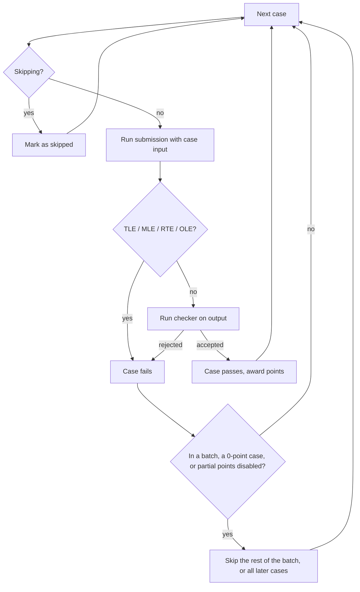

# Problem format

This page describes `init.yml`, the file that tells the judge how to grade a problem.

::: tip Do I need to write this by hand?
Usually not. When you save test data in the web editor, LCOJ generates `init.yml` for you (see [Managing problems](/en/setter/managing-problems)). You only write it by hand for features the web editor does not cover, such as [generators](/en/setter/generators) or Python checkers. In that case, mark the problem as **manually managed** in the admin so the site does not overwrite your file.
:::

## Problem directory

Each problem has its own directory inside the problem data root (`dmoj/problems/` in the Docker setup). The directory name is the problem code:

```
dmoj/problems/
└── aplusb/
    ├── init.yml        # required
    ├── aplusb.zip      # test data (optional, but recommended)
    └── checker.py      # helper files, if any
```

## The `init.yml` file

`init.yml` is a YAML object. The only key you always need is `test_cases` (unless test cases are detected automatically, see [below](#option-2-automatic-detection-with-regexes)). Most problems also set `archive`, the name of a zip file that holds the test data.

Minimal example:

```yaml
archive: aplusb.zip
test_cases:
- {in: aplusb.1.in, out: aplusb.1.out, points: 5}
- {in: aplusb.2.in, out: aplusb.2.out, points: 20}
- {in: aplusb.3.in, out: aplusb.3.out, points: 75}
```

### How file paths are resolved

Every file name in `init.yml` is resolved the same way:

1. The judge first looks for the file directly in the problem directory (`<problem_code>/<name>`).
2. If it is not there and `archive` is set, the judge looks for a member with **exactly that path inside the zip**. For example, `in: tests/1.in` refers to the zip entry `tests/1.in`, not to a folder next to the zip.

`archive` itself is always relative to the problem directory.

::: warning Helper programs are not read from the zip
Checkers, generators, interactors, and custom graders (`checker.py`, `gen.cpp`, `interactor.cpp`, ...) are loaded from the problem directory only. Put them next to `init.yml`, not inside the zip.
:::

## `test_cases`

There are two ways to specify test cases: an explicit list, or automatic detection with regexes.

### Option 1: A list of test cases

`test_cases` is a list. Each item is either a normal test case or a batch.

#### Normal test cases

A normal test case has these keys:

| Key | Meaning |
|---|---|
| `in` | Input file. |
| `out` | Expected output file. |
| `points` | Points for this case. |

```yaml
test_cases:
- {in: aplusb.1.in, out: aplusb.1.out, points: 50}
- {in: aplusb.2.in, out: aplusb.2.out, points: 50}
```

#### Batched test cases

A batch (subtask) groups several cases. It has:

| Key | Meaning |
|---|---|
| `points` | Points for the whole batch. |
| `batched` | List of cases in the batch. Each case has `in` and `out` (no `points`). |
| `dependencies` | Optional. List of earlier batch numbers (starting at 1) that must pass before this batch runs. |

A batch earns its points only if **all** of its cases pass. As soon as one case in a batch fails, the rest of that batch is skipped.

Batches are numbered 1, 2, 3, ... in the order they appear; normal (non-batched) cases are not counted. Batches cannot be nested, and a batch can only depend on batches that come before it.

```yaml
archive: tle16p4.zip
test_cases:
- {points: 0, in: tle16p4.p0.in, out: tle16p4.p0.out}
- {points: 10, in: tle16p4.p1.in, out: tle16p4.p1.out}
- points: 10          # batch 1
  batched:
  - {in: tle16p4.0.in, out: tle16p4.0.out}
  - {in: tle16p4.1.in, out: tle16p4.1.out}
- points: 10          # batch 2
  batched:
  - {in: tle16p4.2.in, out: tle16p4.2.out}
  - {in: tle16p4.3.in, out: tle16p4.3.out}
- points: 10          # batch 3
  batched:
  - {in: tle16p4.4.in, out: tle16p4.4.out}
  - {in: tle16p4.5.in, out: tle16p4.5.out}
  dependencies: [1, 2]
```

Batch 3 runs only if batches 1 and 2 both pass; otherwise its cases are marked as skipped.

#### Zero-point cases

If a case (or batch) worth `points: 0` fails, **every case after it is skipped**. This makes zero-point cases useful as sample tests or sanity checks, but order matters.

**Incorrect:**

```yaml
test_cases:
- {in: case1.1.in, out: case1.1.out, points: 100}
- {in: case1.0.in, out: case1.0.out, points: 0}
```

`case1.1` runs before `case1.0`. If only `case1.0` fails, the result is `100/100` but with a WA verdict.

**Correct:**

```yaml
test_cases:
- {in: case1.0.in, out: case1.0.out, points: 0}
- {in: case1.1.in, out: case1.1.out, points: 100}
```

#### How the judge walks through the cases



When **Allows partial points** is disabled for the problem, the site asks the judge to stop at the first failed case.

### Option 2: Automatic detection with regexes

If `archive` is set and your files follow a consistent naming scheme, you can let the judge find the test cases in the zip. This only works with `archive`.

The default patterns (matched case-insensitively against every file name in the zip) are:

- Input: `^(?=.*?\.in|in).*?(?:(?:^|\W)(?P<batch>\d+)[^\d\s]+)?(?P<case>\d+)[^\d\s]*$`
- Output: `^(?=.*?\.out|out).*?(?:(?:^|\W)(?P<batch>\d+)[^\d\s]+)?(?P<case>\d+)[^\d\s]*$`

In words: the name must contain `.in` (or `.out`), the **last** number is the case number, and an optional number before it (separated by non-digits) is the batch number.

| File name | Batch | Case |
|---|---|---|
| `test.1.in` | none | 1 |
| `test-1.in` | none | 1 |
| `test-case-1.in` | none | 1 |
| `test-1-2.in` | 1 | 2 |
| `test-batch-1-case-2.in` | 1 | 2 |
| `1.2.in` | 1 | 2 |

Files that share a batch number become one batch. A case without a batch uses its case number as its position, so these files:

```
1.in
2.1.in
2.2.in
3.in
```

are graded in this order: case 1, batch 2 (cases 2.1 and 2.2), case 3.

#### Customizing detection

You can set these keys inside `test_cases`:

| Key | Meaning |
|---|---|
| `input_format` | Python regex for input files. Must have a named group `case`, and optionally `batch`. |
| `output_format` | Python regex for output files, same rules. |
| `case_points` | A **list** of points, one per case or batch, in order. |

If `case_points` is not set, every case or batch is worth the top-level `points` value (default `1`).

```yaml
archive: data.zip
points: 10
test_cases:
  input_format: '^test-(?P<case>\d+)\.in$'
  output_format: '^test-(?P<case>\d+)\.out$'
```

With `case_points`:

```yaml
archive: data.zip
test_cases:
  input_format: '^test-(?P<case>\d+)\.in$'
  output_format: '^test-(?P<case>\d+)\.out$'
  case_points: [20, 30, 50]
```

To use the default patterns with default points, omit `test_cases` entirely and keep only `archive`.

## Pretests

`pretest_test_cases` has the same format as a `test_cases` list. Pretests always run first and count as zero-point cases, so a failed pretest stops the rest of the grading. In contests that judge pretests only, only these cases are run. The web editor writes this key when you tick **Pretest?** on a case.

## Inherited keys

Keys at the top level (or on a batch) apply to every case below them unless a case sets its own value. For example, this gives every case 5 points and the same expected output file:

```yaml
points: 5
out: correct.txt
test_cases:
- {in: 1.txt}
- {in: 2.txt}
```

This is how some of the [examples](/en/setter/examples) are written.

## Other keys

| Key | Default | Meaning |
|---|---|---|
| `checker` | `standard` | Checker used to compare output. Can also be set per case. See [Checkers](/en/setter/checkers). |
| `points` | `1` | Default points for cases that do not set their own. |
| `output_limit_length` | `25165824` | Maximum output size in bytes (24 MiB). Larger output gets OLE. |
| `output_prefix_length` | `128` (`0` with `signature_grader`) | How many bytes of the contestant's output are kept and shown in the submission results. |
| `binary_data` | `false` | If `true`, input and expected output are used as-is, without normalizing line endings. |
| `wall_time_factor` | `3` | Wall-clock limit as a multiple of the time limit. |
| `file_io` | none | `{input: <name>, output: <name>}`: the program reads and writes these files instead of stdin and stdout. |
| `unbuffered` | `false` | Run the program with unbuffered output. Needed for interactive problems. |
| `hints` | none | Executor hints set by the web editor, such as `unicode` and `nobigmath`. |
| `test_size_limit` | judge setting | Maximum size of a file read from the archive, in KB. |
| `symlinks` | none | Map of link names to create in the program's working directory. |
| `generator` | none | Generate test data with a program. See [Generators](/en/setter/generators). |
| `custom_judge`, `interactive`, `signature_grader`, `output_only`, `communication` | none | Select a non-standard grader. See [Graders](/en/setter/graders). |

::: info
All of these keys are read by the judge ([judge-server](https://github.com/luyencode/judge-server), a fork of the DMOJ/VNOJ judge). If a key is misspelled, the judge silently ignores it.
:::
