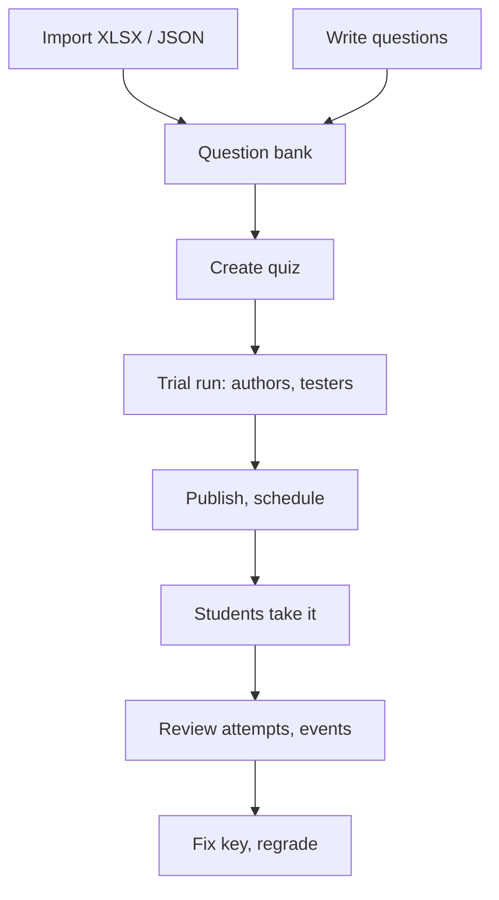

# Creating and managing quizzes

> How to build a question bank, bulk-import questions from Excel/JSON, create and schedule quizzes, then review attempts, integrity events and regrade.
>
> ⏱ ~30 min · 👤 Teachers, problem setters, administrators · 🔑 `quiz.edit_own_quiz` or `quiz.edit_all_quiz`

## Before you start

- [ ] Your account has `edit_own_quiz` or `edit_all_quiz` (see [Permissions](#permissions-and-how-to-grant-them)). With either one, the site's floating toolbar shows extra **Quiz** buttons.
- [ ] You have read [Taking a quiz](/en/learn/quiz) so you know what students see.
- [ ] For bulk import: Microsoft Excel, LibreOffice or Google Sheets (exporting `.xlsx`), or a text editor for JSON.
- [ ] If the quiz is for a class: the class's organization already exists on LCOJ.

## Workflow overview



Two key ideas:

- **Questions** live in the **question bank** and can be reused across quizzes.
- A **quiz** picks questions from the bank and gives each one **points** and an **order**. Points belong to the quiz, not the question.

## Permissions and how to grant them

| Permission (codename) | Display name | Allows |
|---|---|---|
| `quiz.edit_own_quiz` | Edit own quizzes and questions | Open the question bank, create questions and quizzes, import/export. Edit only questions and quizzes where you are an **author** or **curator** |
| `quiz.edit_all_quiz` | Edit all quizzes and questions | Everything above, plus view and edit **every** question and quiz |

Superusers automatically have both.

Per-object roles:

| Role | Can |
|---|---|
| Author | Whoever creates the object is added automatically. Can edit if they have `edit_own_quiz` |
| Curator | Edit like an author, if they also have `edit_own_quiz` |
| Tester | View and take the quiz while it is **hidden**. Cannot edit |
| `edit_all_quiz` holder | Edit everything |

### Grant access to a teacher (for administrators)

**Option 1: through a group (recommended for several teachers)**

1. Go to `/admin/auth/group/` and create a group, for example `Quiz Teachers`.
2. In the permission list's filter box, type `quiz`.
3. Pick **Quiz | quiz question | Edit own quizzes and questions** (`edit_own_quiz`) and click the arrow to add it.
4. Save the group.
5. Go to `/admin/auth/user/`, open the teacher's account, add the group under **Groups** and save.

**Option 2: directly on one user**

1. Go to `/admin/auth/user/` and open the account.
2. Under **User permissions**, filter by `quiz` and add `edit_own_quiz` (or `edit_all_quiz` for a head teacher or administrator).
3. Save.

::: warning Vietnamese permission name is mistranslated
In the Vietnamese UI, `edit_all_quiz` shows as "Chỉnh sửa toàn bộ tổ chức" ("edit all organizations"). That is wrong: the permission means **edit all quizzes and questions** and has nothing to do with organizations. Go by the codename.
:::

Teachers do **not** need `is_staff` or admin access: everything on this page works in the web UI. Admin access is only needed for [Django admin](#django-admin).

See also: [Permission system](/en/admin/permissions).

## Entry points

Users with the permission see three **Quiz** buttons on the floating site toolbar:

| Toolbar button | URL | Use it to |
|---|---|---|
| **Question Bank** | `/quizzes/questions/` | Browse, filter, create and export questions |
| **Import Quiz** | `/quizzes/import/` | Import questions from XLSX/JSON |
| **Manage Quizzes** | `/quizzes/` | The quiz list (includes your hidden quizzes) |

Other URLs:

| URL | Page |
|---|---|
| `/quizzes/questions/new` | New question |
| `/quizzes/questions/<id>/edit` | Edit a question |
| `/quizzes/import/template` | Download `quiz-template.xlsx` |
| `/quizzes/new` | **Create a quiz** |
| `/quizzes/<code>` | Quiz page (students see this too) |
| `/quizzes/<code>/edit` | Edit a quiz |
| `/quizzes/<code>/attempts` | Attempts, integrity events, regrade |
| `/quizzes/<code>/ranking` | Ranking |

::: tip There is no "New quiz" button
The UI currently has no link to the quiz creation page. Type `/quizzes/new` into the address bar, or create the quiz while importing (option **Also create a quiz from these questions**).
:::

## Question bank

### Browse and filter

1. Open **Question Bank** (`/quizzes/questions/`).
2. Filter with **Search...** (matches code, title and body), **All types**, **All categories**, **All levels**, then click **Filter**.

You see questions you authored or curate, plus every question marked **Public** = **Yes**. `edit_all_quiz` holders see everything.

### Create a question

1. In the question bank, click **New question**.
2. Enter a **Code** (lowercase letters and digits, for example `cpploop1`).
3. Pick a card under **Question Type**: **Multiple Choice**, **Multiple Answer**, **True / False** or **Short Answer**.
4. Enter a **Title** (a short name to find the question in the bank; students do not see it).
5. Write the **Question Text**. Switch to the **Preview** tab to check the rendering.
6. Set the answer:
   - Multiple Choice / Multiple Answer: fill in **Choice text**, click **Add choice** if needed (2 to 6 choices), tick the **Correct** column for the right choice(s).
   - True / False: pick **True** or **False**.
   - Short Answer: enter a pattern under **Correct Answer — Regex Patterns**; click **Add pattern** for more.
7. (Optional) Fill in **Overall Explanation**, **Category**, **Difficulty**, **Shuffle choices**, **Public in bank**.
8. Click **Save question**. You become the question's author automatically.

### Question fields

| Field | Required | Meaning |
|---|---|---|
| **Code** | Yes | Unique site-wide, only `a-z` and `0-9`, up to 32 characters. No underscores (the Vietnamese error message saying `^[a-z0-9_]+$` is wrong) |
| **Question Type** | Yes | Multiple Choice (MC), Multiple Answer (MA), True/False (TF), Short Answer (SA) |
| **Title** | Yes | Up to 200 characters, only used in the bank |
| **Question Text** | Yes | Markdown with math |
| **Choices** | MC/MA | 2–6 choices; each may have its own **Explanation** (shown behind a **Why?** toggle in full result mode) |
| **Correct Answer** | Yes | See [Question types and grading](#question-types-and-grading) |
| **Display answer** | No | SA only: a readable answer shown on the result page. If blank, students see the raw regex patterns |
| **Overall Explanation** | No | Markdown, shown on the result page in full feedback mode |
| **Category** | No | An existing category. Categories are created in admin (`/admin/quiz/quizcategory/`) or automatically on import |
| **Difficulty** | Yes | Easy / Medium / Hard (default Easy) |
| **MA Grading Strategy** | MA | See the strategy table below |
| **Shuffle choices** | No | Each student sees the choices in a different order (MC/MA) |
| **Public in bank** | No | Every quiz editor can see this question and use it in their quizzes (but not edit it) |

A **question's** authors and curators can only be changed in [Django admin](#django-admin).

### Writing content: Markdown and math

Question text, choices and explanations all support Markdown: `**bold**`, `*italic*`, `` `code` ``, highlighted code blocks, tables, lists. Math is rendered by MathJax:

````markdown
Compute ~S = \sum_{i=1}^{n} i~ for ~n = 100~.

$$
\frac{n(n+1)}{2}
$$

```cpp
for (int i = 1; i <= n; i++) s += i;
```
````

- Inline math: `~...~`
- Display math: `$$...$$`

::: warning
The header note in the XLSX template suggests `$math$`. The syntax the site uses is `~...~` (inline) and `$$...$$` (display), the same as in programming problem statements.
:::

## Question types and grading

Each question yields a **ratio** from 0 to 1. The question's score = ratio × the question's points in the quiz, rounded to 2 decimals. A blank answer scores 0.

| Type | Student does | Grading |
|---|---|---|
| **Multiple Choice** (MC) | Picks 1 choice | Right: 1, wrong: 0 |
| **True / False** (TF) | Picks True or False | Right: 1, wrong: 0 |
| **Multiple Answer** (MA) | Picks several choices | Depends on the strategy |
| **Short Answer** (SA) | Types text | Matches any pattern: 1, otherwise 0 |

### Multiple-answer strategies

Notation: **C** = number of correct choices, **W** = number of wrong choices in the question; the student picked **c** correct and **w** wrong choices.

| Strategy (UI label) | Value in import files | Formula |
|---|---|---|
| **All or nothing** (default) | `all_or_nothing` / `All or nothing` | 1 if the selection equals the correct set **exactly**, else 0 |
| **Partial credit with penalty** | `partial_credit` / `Partial credit` | max(0, c/C − w/W) |
| **Right minus wrong** | `right_minus_wrong` / `Right minus wrong` | max(0, (c − w)/C) |
| **Correct only, no penalty** | `correct_only` / `Correct only` | c/C |

**Example.** A question with 5 choices A–E, correct answers **A, C, D** (C = 3, W = 2), worth **3 points**:

| Student picks | c | w | All or nothing | Partial credit | Right minus wrong | Correct only |
|---|---|---|---|---|---|---|
| A, C, D | 3 | 0 | **3** | **3** | **3** | **3** |
| A, C, B | 2 | 1 | 0 | 0.5 | 1 | 2 |
| A, C, D, B | 3 | 1 | 0 | 1.5 | 2 | 3 |
| All 5 | 3 | 2 | 0 | 0 | 1 | 3 |
| A only | 1 | 0 | 0 | 1 | 1 | 1 |

::: danger "Correct only" can be gamed
With **Correct only, no penalty**, a student who ticks **every** choice gets full points and the question is even marked correct. Use it for practice quizzes only.
:::

An MA question is marked "correct" (green) only when its ratio is 1.

### Short answer: regex patterns

Each pattern is compared with the student's **whole** answer (leading and trailing spaces removed) using Python's `re.fullmatch`. Matching **any one** pattern is enough.

| Pattern | Accepts | Rejects |
|---|---|---|
| `42` | `42`, ` 42 ` | `42.0`, `x = 42` |
| `(?i)python` | `Python`, `PYTHON` | `python3` |
| `def` | `def` | `Def` (**case-sensitive** by default) |
| `\d+` | `7`, `2024` | `12a` |
| `3\.14` | `3.14` | `3x14` (without `\`, `.` matches any character) |
| `(?i)o\(n log n\)` | `O(n log n)`, `o(N LOG N)` | `O(nlogn)` |

::: warning Do not put `|` inside a pattern
Patterns are split on the `|` character, both in the form and in XLSX. So `(?i)(true|yes)` (even though the form's own help suggests it) is split into `(?i)(true` and `yes)` and rejected with "Invalid regex". Write **each alternative as its own pattern**: `(?i)true` and `(?i)yes`. `3|three` still works because it splits into the two valid patterns `3` and `three`.
:::

Also fill in **Display answer** (for example `Paris`) so students do not have to read regexes on the result page.

## Bulk import

### Import steps

1. Click **Import Quiz** on the toolbar, or open `/quizzes/import/`.
2. Under **XLSX or JSON file**, choose the file. Files ending in `.json` are read as JSON; anything else is read as XLSX.
3. (Optional) Tick **Also create a quiz from these questions**, then fill in **Quiz code** and **Quiz name**.
4. Click **Upload and preview**.
5. Review the **Preview**: each question is a box **Row N: [type] title**. Red boxes with a list of errors are invalid rows. **These categories will be created** lists categories that do not exist yet.
6. With no errors, click **Confirm import**. With errors, fix the file and upload again.
7. **Imported N questions.** means you are done. You land on the question bank, or on the quiz edit page if you chose to create a quiz.

::: info All-or-nothing import
One bad row means **nothing** is imported ("Fix the errors above and re-upload. Nothing was imported."). On confirm, everything is written in one transaction: if a code conflict appears, the whole import is rolled back.
:::

A quiz created during import gets default settings: **hidden**, no time limit, unlimited attempts, full feedback, integrity monitoring **on**. Questions are ordered as in the file, with points taken from the points column/field. Open the edit page and finish the settings before publishing.

### XLSX format

Download the template from `/quizzes/import/template` (the **Download XLSX template** link in the question bank). It has drop-down lists for **Type**, **Level**, **Shuffle Choices** and **MA Strategy**, and a note on every header cell.

General rules:

- Row 1 is the header and is **ignored**. Data starts on row 2; empty rows are skipped.
- Columns are read **by position** (A, B, C…), not by name. **Do not insert, delete or reorder columns.**
- Only the active sheet is read.
- Delete the 20 sample Python questions in the template before importing. If those codes already exist on the site, the import fails with duplicate codes.
- Format column Q (Correct Answer) as **Text** before typing. With a comma decimal separator (for example a Vietnamese regional setting), Excel may turn `1,3` into the number `1.3`, and the MA row will fail.

| Column | Header | Content |
|---|---|---|
| A | Code | Required. `a-z0-9`, up to 32 characters (lowercased automatically) |
| B | Type | `Multiple Choice`, `Multiple Answer`, `True/False`, `Short Answer` (or `MC`, `MA`, `TF`, `SA`) |
| C | Title | Required |
| D | Question | Required. Markdown body |
| E, G, I, K, M, O | Choice 1 … Choice 6 | Choices (MC/MA need at least 2). Leave unused cells empty |
| F, H, J, L, N, P | Explanation 1 … Explanation 6 | Per-choice explanation (optional) |
| Q | Correct Answer | MC: choice number, **1-based** (`2`). MA: comma-separated (`1,3`). TF: `True`/`False` (also `1`/`0`, `đúng`/`dung`/`sai`). SA: regex patterns separated by `\|` |
| R | Points | Points in the quiz created alongside. Empty = 1. Not negative |
| S | Category | Category (see note below) |
| T | Level | `Easy`, `Medium`, `Hard`. Empty = Easy |
| U | Explanation | Overall explanation |
| V | Shuffle Choices | `Yes` to shuffle choices (also `true`, `1`, `x`, `có`) |
| W | MA Strategy | `All or nothing`, `Partial credit`, `Right minus wrong`, `Correct only`. Empty = All or nothing |
| X | Answer Display | SA only: the answer shown to students |

::: warning Category column
The value is used **verbatim as the category slug**. If that slug does not exist, a category is created with a name derived from the slug (`-` replaced by spaces, words capitalised). Use slugs like `cpp-basics`, not `C++ basics`.
:::

**Minimal example** with 4 questions, one of each type. The table is transposed: each table column is one Excel row; unlisted cells stay empty.

| Excel column | Row 2 | Row 3 | Row 4 | Row 5 |
|---|---|---|---|---|
| A · Code | `cppmc1` | `cppma1` | `cpptf1` | `cppsa1` |
| B · Type | `Multiple Choice` | `Multiple Answer` | `True/False` | `Short Answer` |
| C · Title | `Type of 7/2` | `Integer types` | `Array index` | `Value of 7%3` |
| D · Question | `` In C++, what is `7/2`? `` | `Pick the integer types:` | `C++ arrays start at index 0.` | `` What is `7 % 3`? `` |
| E · Choice 1 | `3.5` | `int` | | |
| F · Explanation 1 | `That is floating-point division.` | | | |
| G · Choice 2 | `3` | `double` | | |
| I · Choice 3 | `4` | `long long` | | |
| Q · Correct Answer | `2` | `1,3` | `True` | `1` |
| R · Points | `1` | `2` | `1` | `1` |
| S · Category | `cpp-basics` | `cpp-basics` | `cpp-basics` | `cpp-basics` |
| T · Level | `Easy` | `Medium` | `Easy` | `Easy` |
| U · Explanation | `Dividing two integers gives an integer.` | | | |
| V · Shuffle Choices | `Yes` | `Yes` | | |
| W · MA Strategy | | `Partial credit` | | |
| X · Answer Display | | | | `1` |

::: tip The web importer ignores Answer Display
The `/quizzes/import/` page currently does **not** save column X (Answer Display). Fill in **Display answer** by editing the question after import, or import through admin (`/admin/quiz/quizquestion/import/`), which does save it.
:::

### JSON format

A JSON file is **an array** of question objects, UTF-8 encoded.

| Field | Required | Type and values |
|---|---|---|
| `code` | Yes | String, `a-z0-9`, up to 32 characters |
| `type` | Yes | `"MC"`, `"MA"`, `"TF"`, `"SA"` |
| `title` | Yes | String |
| `content` | Yes | Markdown string |
| `choices` | MC/MA | Array of strings, or of objects `{"text": "...", "explanation": "..."}`. At least 2 |
| `correct` | Yes | MC: integer, **0-based** index. MA: non-empty array of 0-based indices. TF: `true` / `false` (boolean). SA: see below |
| `points` | No | Number ≥ 0, default `1` |
| `category` | No | Category slug |
| `level` | No | `"easy"`, `"medium"`, `"hard"` (lowercase), default `"easy"` |
| `explanation` | No | Overall explanation |
| `shuffle` | No | Boolean, shuffle choices |
| `ma_strategy` | No | `"all_or_nothing"` (default), `"partial_credit"`, `"right_minus_wrong"`, `"correct_only"` |

For SA, `correct` is a string or an array whose items are:

- **Strings**, e.g. `"Paris"`: matched **literally**, **case-insensitive**, **not** as a regex.
- **Objects** `{"text": "...", "case_sensitive": false, "is_regex": false}`: set `is_regex: true` to use a (full-match) regex and `case_sensitive: true` to make it case-sensitive.

::: warning JSON differs from XLSX and the form
- MC/MA indices are **0-based** in JSON but **1-based** in XLSX and the form.
- SA strings in JSON are **plain text, case-insensitive**; in XLSX and the form each pattern is a **case-sensitive regex**.
- JSON has no `answer_display` field.
- If you later open a JSON-imported SA question in the form and save it, its answers are converted to case-sensitive regex patterns. Check the patterns before saving.
:::

**Complete example** (4 questions):

```json
[
  {
    "code": "cppmc1",
    "type": "MC",
    "title": "Type of 7/2",
    "content": "In C++, what is `7/2`?",
    "choices": [
      {"text": "3.5", "explanation": "That is floating-point division."},
      {"text": "3", "explanation": "Dividing two integers gives an integer."},
      "4"
    ],
    "correct": 1,
    "points": 1,
    "category": "cpp-basics",
    "level": "easy",
    "explanation": "Integer division drops the fractional part.",
    "shuffle": true
  },
  {
    "code": "cppma1",
    "type": "MA",
    "title": "Integer types",
    "content": "Pick the integer types:",
    "choices": ["int", "double", "long long"],
    "correct": [0, 2],
    "points": 2,
    "level": "medium",
    "ma_strategy": "partial_credit"
  },
  {
    "code": "cpptf1",
    "type": "TF",
    "title": "Array index",
    "content": "C++ arrays start at index 0.",
    "correct": true
  },
  {
    "code": "cppsa1",
    "type": "SA",
    "title": "Binary search complexity",
    "content": "What is the time complexity of binary search?",
    "correct": ["O(log n)", {"text": "o\\(\\s*log\\s*n\\s*\\)", "is_regex": true}]
  }
]
```

### Common import errors

Per-row error messages are in English:

| Message | Cause | Fix |
|---|---|---|
| `Question code is required and must match ^[a-z0-9]+$` | Missing code, or uppercase, underscores, spaces | Use lowercase letters and digits |
| `Duplicate code … in this file` | Two rows share a code | Rename one |
| `Code … already exists in the question bank` | The code already exists on the site | Change it (codes are unique site-wide) |
| `MC correct answer out of range 1-N` | The answer number exceeds the number of choices | Check Correct Answer (1-based) |
| `MC correct must be a 0-based choice index` | JSON: `correct` is not a valid integer | Use a 0-based index |
| `TF correct answer must be true or false` | Unrecognised TF value | Use `True` / `False` |
| `Invalid regex '…'` | Bad SA pattern, often a `\|` inside it | Split into several patterns, escape special characters |
| `Level must be one of …` | JSON: `level` capitalised or misspelled | Use `easy`/`medium`/`hard` |
| `MA strategy must be one of …` | Unknown strategy name | Use a value from the table |
| `Cannot read XLSX file` / `Invalid JSON file` | Corrupt or wrong file format | Re-save as `.xlsx`, or validate the JSON |
| `JSON root must be a list of question objects` | JSON does not start with `[` | Wrap the questions in an array |
| **No pending import - upload a file first.** | Confirm clicked twice, or the session expired | Upload the file again |

## Export questions

1. In the **Question Bank**, tick the checkbox of each question to export.
2. Click **Export selected to XLSX**. You get `quiz-questions.xlsx` in the same format as the import file.

::: info Export limitations
- The **Points** column is always `1`, because points belong to quizzes, not questions.
- The **Answer Display** column is empty.
- Re-importing the exported file reports duplicate codes. Change the codes first if you want copies.
:::

## Create a quiz

1. Open `/quizzes/new`.
2. Fill in the settings (see the table below). Only the **Quiz code** and **Quiz name** are required.
3. Under **Questions**, click **+ Add question**, type to search (by code, title or body; results look like `[MC] code: title`) and pick one.
4. Enter its **Points** (default 1, not negative).
5. Repeat steps 3–4 for each question. Drag the **⠿** handle to reorder; click **✕** to remove a question.
6. Click **Save quiz**. **Quiz saved.** appears and you stay on the edit page `/quizzes/<code>/edit`. You are the quiz's author automatically.

::: warning New quizzes are hidden
Until you tick **Publicly visible**, only authors, curators, testers and `edit_all_quiz` holders can see the quiz.
:::

### Quiz settings

| Field | Meaning |
|---|---|
| **Quiz code** | `a-z0-9`, up to 32 characters, unique. **Cannot be changed** after creation |
| **Quiz name** | Up to 100 characters |
| **Description** | Markdown, shown on the quiz page |
| **Time limit (minutes)** | Minutes per attempt. Empty = unlimited |
| **Maximum attempts** | Maximum submitted attempts per student. Empty = unlimited |
| **Shuffle questions** | Shuffle the question order for each attempt |
| **Result feedback** | What students see after submitting (see below) |
| **Integrity monitoring** | Warning dialog, watermark, copy blocking and event logging. **On** by default |
| **Start time** | Nobody can start before this. Empty = open now |
| **End time** | Nobody can start a new attempt after this. Empty = never closes. Must be after the start time |
| **Publicly visible** | Students can see and take the quiz |
| **Private to organizations** | Only members of the organizations below can see it |
| **Organizations** | The allowed organizations |
| **Curators** | Co-managers (need `edit_own_quiz`) |
| **Testers** | Can take the quiz while it is hidden |

Start and end times are interpreted in your account's time zone.

::: info Vietnamese labels
Several Vietnamese labels on this form are mistranslated: **Time limit** shows as "Giới hạn thời gian (giây):" (says *seconds*, but the unit is **minutes**), **Maximum attempts** as "Số thành viên tối đa", **Shuffle questions** as "Lời giải", **Result feedback** as "Phản hồi từ trình chấm". The Vietnamese page lists them all.
:::

**Result feedback** modes:

| Option | Students see after submitting |
|---|---|
| **Score only** | Total score and their own answers. No right/wrong marks, no key |
| **Show correctness (no answer key)** | Right/wrong colouring and per-question points, no key |
| **Show correct answers and explanations** | The key, per-choice explanations and the overall explanation. **Default** |

::: warning Results appear right after submission
There is no "reveal answers after the quiz closes" option. In full mode, an early finisher sees the key immediately and can share it. For exams, use **Score only** or **Show correctness** during the exam, then switch to full mode after the end time. The change applies to all past attempts at once.
:::

::: tip Combining an end time with a time limit
A timed attempt always gets its full time, **even past the end time**. To make everyone finish by a fixed moment, have students start at least one time limit before the end. For example, a 45-minute quiz closing at 10:00 should be started before 9:15.
:::

### Who can see the quiz?

| Publicly visible | Private to organizations | Who can see and take it |
|---|---|---|
| No | (any) | Authors, curators, testers, `edit_all_quiz` holders |
| Yes | No | Everyone (guests can view; sign-in required to take) |
| Yes | Yes | Members of the selected organizations, plus the people in the first row |

::: warning
To restrict a quiz to a class, tick **both** **Publicly visible** and **Private to organizations**, then choose the organizations. Ticking only **Private to organizations** without making it public leaves it **invisible** to students.
:::

## Preview a quiz

- **Single question:** in the question editor, use the **Preview** tab on the body and explanation fields.
- **Whole quiz:** while the quiz is hidden, authors and curators can take it themselves. Add colleagues as **Testers** so they can try it without edit rights.

::: info
Trial attempts are real attempts: they show up in the attempts list and **on the ranking**. Attempts can only be deleted in Django admin (`/admin/quiz/quizattempt/`).
:::

## Clone a quiz

1. On the quiz page or edit page, click **Clone quiz**.
2. You are taken to the copy's edit page.
3. Rename it (default `Copy of <old name>`), reset the schedule and save.

The copy has:

- **Code** = old code + the first free digit from 2 to 9 (for example `midterm` → `midterm2`). If all 8 are taken you get "Could not generate a unique code for the clone. Rename the original quiz first."
- The same description, time limit, attempts, shuffle, feedback mode, integrity setting, organization settings, curators, testers, question list, points and order.
- It is **always hidden**, has **no schedule**, **you** are its only author, and it has no attempts.

The copy **shares** questions with the original; questions are not duplicated. Editing a question affects both quizzes.

## Review attempts and integrity events

1. On the quiz page, click **All attempts** (or **Attempts & regrade** on the edit page). URL: `/quizzes/<code>/attempts`.
2. The table lists every attempt, newest first: **User**, **Started**, **Status** (**submitted** / **in progress**), **Score**, **Violations**.
3. Click the **⚠ N** badge in **Violations** to open the log: time and event type, plus the total ("N violation(s) total").
4. Click **view** to open that attempt's result page. Teachers always see **full** feedback, regardless of the quiz setting.

Event types:

| Type | UI label | Meaning |
|---|---|---|
| `tab_switch` | Tab switch | The quiz tab became hidden |
| `window_blur` | Window blur | The browser window lost focus |
| `devtools` | DevTools opened | Window more than 160 px larger than the viewport (heuristic) |
| `print_screen` | PrintScreen key | PrintScreen pressed |
| `copy_attempt` | Copy attempt | Tried to copy content |

::: warning Read events with care
- Events do **not** affect scores; they are signals to review.
- DevTools detection is a heuristic: a browser side panel or zoom level can trigger it.
- Each type is recorded at most once every 5 seconds. A student with JavaScript disabled or a second device leaves no trace.
:::

::: info Abandoned attempts
An attempt a student abandons stays **in progress** until that student opens the quiz page again; only then is it closed and graded. Until then it is not on the ranking and is not regraded.
:::

## Regrade

Regrading recomputes the score of **every submitted attempt** using the **current** answer key and points.

1. Fix the question's answer key, or change the points in the quiz, and save.
2. Open `/quizzes/<code>/attempts`.
3. Click **Regrade all attempts** and confirm **Regrade all submitted attempts?**.
4. **Regraded N attempts.** means you are done. The ranking updates immediately.

In-progress attempts do not need regrading: they are graded with the new key when submitted.

## Editing a quiz that already has attempts

Each attempt's question and choice order is **frozen when it starts**, and answers are stored as choice **indices**. So:

| Change | Safe? | Notes |
|---|---|---|
| Name, description, testers, curators | ✅ | |
| Public, organizations | ✅ | Takes effect immediately |
| Result feedback | ✅ | Applies immediately to **all** past attempts |
| Integrity monitoring | ✅ | Applies to pages loaded after saving |
| Extending the end time | ✅ | Students who used all attempts still cannot take more |
| Maximum attempts | ✅ | Takes effect immediately |
| Time limit | ⚠️ | Deadlines of **in-progress** attempts are recalculated immediately |
| Question points | ⚠️ | Old scores stay until you **regrade** |
| Answer key, SA patterns | ⚠️ | Needs a **regrade** |
| Wording of choices or explanations | ⚠️ | Safe if you **do not change meaning or order** |
| Adding a question | ⚠️ | Old attempts do not contain it, but the displayed maximum (`X / Y`) grows for everyone |
| Removing a question | ❌ | Old attempts still show it; on regrade it scores 0 |
| Reordering, adding or deleting choices | ❌ | Stored answers point to the wrong choices |
| Changing the question type | ❌ | Stored answers become invalid |
| Shuffle questions, shuffle choices | ✅ | Only affect new attempts |

::: danger Shared questions
A question can belong to several quizzes. Editing it changes **every** quiz that uses it. For substantial changes, create a new question with a new code and swap it into the quiz.
:::

## Django admin

Administrators (accounts with `is_staff` and the relevant model permissions) can manage everything in admin, under the **Quiz** group:

| Admin page | Use it for |
|---|---|
| `/admin/quiz/quiz/` | Quiz **authors**, the inline question list (with an **order** column), the **Clone selected quizzes** action |
| `/admin/quiz/quizquestion/` | Question **authors** and **curators**; the **Import questions** button (`/admin/quiz/quizquestion/import/`) imports XLSX/JSON **including Answer Display** |
| `/admin/quiz/quizcategory/` | Create and edit categories |
| `/admin/quiz/quizattempt/` | Inspect each attempt's answers, delete trial attempts |
| `/admin/quiz/quizviolation/` | Browse all integrity events by type |

On the web quiz edit page, staff also see the link **Edit quiz in admin panel for more options**.

::: warning
- Admin does **not** check authorship: anyone with change permission in admin can edit **every** quiz.
- In admin, `choices` and `correct_answers` are raw JSON. `choices` looks like `[{"text": "...", "explanation": "..."}]`. `correct_answers`: MC is a 0-based index, TF is `0` (True) or `1` (False), MA is an array of 0-based indices, SA is an array of regex patterns. Mistakes break grading, so prefer the web form.
:::

## Verify

- [ ] The quiz appears at `/quizzes/` when signed in as a student (or as an organization member, for organization-private quizzes).
- [ ] The quiz page shows the right number of questions, total points, time limit, attempts and schedule.
- [ ] A tester can finish and submit, and the result page uses the right feedback mode.
- [ ] `/quizzes/<code>/attempts` lists that attempt; with monitoring on, switching tabs during the trial produces a **Tab switch** event.

## Troubleshooting

| Symptom | Fix |
|---|---|
| No **Quiz** buttons on the toolbar; `/quizzes/questions/` returns 404 | The account lacks `edit_own_quiz` / `edit_all_quiz`. Ask an administrator |
| Cannot find a button to create a quiz | Open `/quizzes/new` directly |
| Students cannot see the quiz | **Publicly visible** is not ticked, or the quiz is organization-private and the student is not a member |
| Students see **Quiz not started yet.** | Check **Start time** and the time zone |
| Students submitted after the end time | Those are timed attempts started before the end time; they get their full time |
| Editing someone else's question returns 404 | You are not its author or curator. **Public** questions can be used but not edited |
| No categories to choose from | Create them in `/admin/quiz/quizcategory/`, or set them in the Category column when importing |
| Saving an SA question says `Invalid regex` | A pattern contains `\|` or an unclosed bracket. Split it into several patterns; escape `.`, `(`, `)`, `+`, `*` |
| A correct short answer was marked wrong | The pattern is case-sensitive (add `(?i)`) or has unescaped special characters. Fix it, then **regrade** |
| Scores did not change after fixing the key | You have not clicked **Regrade all attempts** |
| Import reports duplicate codes | Question codes are unique site-wide. Rename them, or remove the sample rows |
| Answer Display was not saved | The web importer ignores that column. Edit the question after import, or import through admin |
| Form says "End time must be after start time." | The end time must be later than the start time |
| Clone says it cannot generate a code | `<code>2` … `<code>9` all exist. Rename the original or create a new quiz |
| A student's attempt is stuck **in progress** | The student abandoned it. It closes when that student reopens the quiz page |

## Next steps

- [Taking a quiz](/en/learn/quiz): the student experience.
- [Permission system](/en/admin/permissions): granting permissions to teachers and groups.
