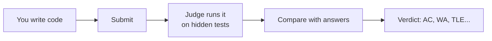
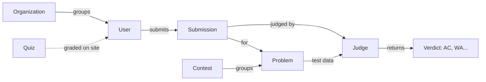

# What is LCOJ?

**LCOJ (Luyện Code Online Judge)** is the online programming judge that runs [luyencode.net](https://luyencode.net). You read a problem, write a program, submit it, and get a verdict a few seconds later. Beyond practice, LCOJ is used to run contests, give multiple-choice quizzes, and manage classes.

LCOJ is open-source software built on [DMOJ](https://github.com/DMOJ/online-judge) and [VNOJ](https://github.com/VNOI-Admin/OJ). Anyone can host their own copy for a school, class, or club.

## What is an online judge?

An **online judge** is a website that grades your programs automatically. Every problem has a set of **test cases** you can't see. When you submit, the system runs your program on each test, compares what it prints with the expected answer, and reports a **verdict**.

Take the problem "Sum of two numbers": you're given two integers `a` and `b` and must print `a + b`.

```cpp
#include <iostream>
int main() {
    long long a, b;
    std::cin >> a >> b;
    std::cout << a + b << '\n';
}
```

You submit this code. The judge runs it on the hidden tests: input `3 5` must print `8`, input `-1000000000 -1000000000` must print `-2000000000`, and so on. If every test passes, you get **Accepted (AC)**. If a test prints the wrong answer, you get **Wrong Answer (WA)**; if it runs too long, **Time Limit Exceeded (TLE)**.



Every verdict is explained in [Status codes](/en/reference/status-codes).

## What does LCOJ offer?

| Feature | Where on the site | What it's for | Read more |
|---|---|---|---|
| Problems | `/problems/` | Practice with a library of auto-graded programming problems | [Submitting and judging](/en/learn/submissions) |
| Contests | `/contests/` | Timed competitions with live rankings and several formats (IOI, ICPC, AtCoder, VNOJ...) | [Taking part in contests](/en/learn/contests) |
| Quizzes | `/quizzes/` | Single-choice, true/false, multiple-answer and short-answer questions, graded on submit | [Taking a quiz](/en/learn/quiz) |
| Exam library | `/library/` | Read official past exam papers (PDF) as a flipbook, and jump into the matching contest if there is one | [Exam library](/en/learn/exam-library) |
| Organizations | `/organizations/` | Group users into teams, classes or schools, with their own private problems and contests | [Organizations](/en/organize/organizations) |
| Blog, comments, tickets | `/blogs/`, `/tickets/` | Write posts, discuss problems, report problems with a statement | [Blog, comments and tickets](/en/learn/community) |

## Who uses LCOJ?

- **Students** practicing programming and preparing for olympiads, the Vietnamese Young Informatics contest, gifted-high-school entrance exams, and ICPC.
- **Teachers** who create classes (organizations), assign problems, set programming tests and quizzes, and track their students' results.
- **Problem setters** who write problems with test data, checkers and graders.
- **Contest organizers** running contests for a club, a school or the wider community.
- **Site admins and operators** who host LCOJ on their own server for their institution.

## Core concepts



- A **problem** is a statement plus a set of test data. The setter uploads the tests and picks how answers are checked.
- A **submission** is one attempt at sending your code for a problem.
- A **judge** is a machine that runs code in an isolated sandbox against the problem's test data and sends the **verdict** back to the website.
- A **contest** bundles problems into a time window with a scoreboard.
- An **organization** groups users, for example one class. It can have problems and contests that only its members see.
- A **quiz** is separate: its questions come from a question bank and the website grades them directly, with no judge involved.

Every term is defined in the [Glossary](/en/start/glossary).

## Choose your path

| You are | Read first | Then |
|---|---|---|
| **Student or learner** | [Account and sign-in](/en/learn/account), [Submitting and judging](/en/learn/submissions) | [Taking part in contests](/en/learn/contests), [Taking a quiz](/en/learn/quiz), [Status codes](/en/reference/status-codes) |
| **Problem setter** | [Your first problem](/en/tutorials/first-problem), [Managing problems](/en/setter/managing-problems) | [Problem format](/en/setter/problem-format), [Checkers](/en/setter/checkers), [Problem examples](/en/setter/examples) |
| **Teacher or contest organizer** | [Your first contest](/en/tutorials/first-contest), [Organizations (groups, classes)](/en/organize/organizations) | [Creating and managing contests](/en/organize/contest-setup), [Contest formats](/en/organize/contest-formats), [Your first quiz](/en/tutorials/first-quiz) |
| **Site admin** | [Permission system](/en/admin/permissions), [Managing users](/en/admin/users) | [Site configuration and content](/en/admin/site-config), [URL shortener](/en/admin/url-shortener) |
| **Operator or self-hoster** | [Architecture](/en/operate/architecture), [Installing with Docker](/en/operate/installation) | [Setting up judges](/en/operate/judge-setup), [Day-to-day operations](/en/operate/operations), [Updating](/en/operate/updating) |

::: tip Not sure where to start?
If you only want to solve problems on luyencode.net, [Submitting and judging](/en/learn/submissions) is all you need. Common questions are collected in the [FAQ](/en/start/faq).
:::

## Origins and license

Most of LCOJ's code comes from **DMOJ** (a Canadian online judge) and **VNOJ** (the VNOI community's fork of DMOJ). Many thanks to the DMOJ and VNOJ developers for sharing their work. On top of that base, LCOJ adds features such as quizzes and the exam library.

The code lives in two main repositories: [lcoj-docker](https://github.com/luyencode/lcoj-docker) (Docker Compose, scripts, configuration) and [lcoj-site](https://github.com/luyencode/lcoj-site) (the Django website). LCOJ is released under AGPL-3.0; see [License](/en/about/license).

## Getting help

- Report a bug or ask a question: [GitHub Issues](https://github.com/luyencode/lcoj-docker/issues).
- More resources at [behitek.com](https://behitek.com).
- Contact the LCOJ team: [luyencode.net/about/#lien-he](https://luyencode.net/about/#lien-he). LCOJ offers free installation help if you need it.
