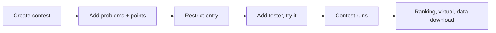

# Your first contest

> You will run a 60-minute class contest with 2–3 existing problems, open only to your class, then review the ranking and download the data afterwards.
>
> ⏱ ~25 min setup (+60 min contest) · 👤 Teachers, contest organizers · 🔑 `judge.add_contest`, or organization admin with `judge.create_private_contest`; adding testers needs a staff account

## What you'll do

- Create the contest in the web UI: key, name, start and end time, format.
- Add 2–3 problems and set their points.
- Restrict entry: private to an organization (class) or protected by an access code.
- Try the contest with a tester account before it starts.
- After it ends: view the ranking, open virtual participation, download submissions.

## Before you start

- [ ] You have 2–3 problems with tests that already pass an `AC` test submission (see [Your first problem](/en/tutorials/first-problem)). Keep them **private**: anyone can read a public problem without joining the contest.
- [ ] You have one of:
  - `judge.add_contest`: you see the **Add new contest** tab on `/contests/`; or
  - you are an **organization admin** (of the class) with `judge.create_private_contest`: you see the **Create new contest** tab on the organization page.
- [ ] You have `judge.edit_own_contest` so you can edit the contest after creating it.
- [ ] For a class-only contest: the class organization exists and students have joined it (see [Organizations](/en/organize/organizations)).
- [ ] A second account to act as tester, and someone with a **staff** account (possibly you) to add the tester in the admin.

See [Permissions](/en/admin/permissions) to ask an administrator for these.

## Step 1: Create the contest

Goal: a 60-minute contest with the right key, schedule, and format.

1. Open the contest creation page one of two ways:

   | Way | Where | Notes |
   |---|---|---|
   | **Inside an organization** (recommended for classes) | `/organization/<slug>` → **Create new contest** tab | The contest is automatically **private to the organization**. The key must start with the organization prefix (pre-filled, e.g. `class10a_`) |
   | **General contest** | `/contests/` → **Add new contest** tab (URL `/contests/new`) | A normal contest; restrict entry with an access code or in the admin |

2. Fill in the form:

   | Field | Example | Notes |
   |---|---|---|
   | **Contest id** | `class10a_quiz1` | Lowercase letters, digits, and `_` only (`^[a-z0-9_]+$`), at most 32 characters, unique. Used in the URL `/contest/<key>` |
   | **Contest name** | `Quiz 1 - Class 10A` | At most 100 characters |
   | **Start time** | `2026-10-05 14:00:00` | In your account's time zone |
   | **End time** | `2026-10-05 15:00:00` | At most 14 days after the start |
   | **Publicly visible** | ✅ checked | **Required** for students to see the contest, even an organization-private one |
   | **Scoreboard visibility** | **Visible** | Pick **Hidden for duration of contest** if students should not see standings during the contest |
   | **Contest format** | **IOI** (`ioi16`) or **ICPC** | See the table below |
   | **Description** | Rules, allowed languages… | Markdown |

   Leave the other fields (**No comments**, **Hide problem tags**, **Hide problem authors**, **Show short form settings display**) at their defaults. **Access code** and **Private to specific users** are covered in Step 3.

::: tip Picking a format: IOI or ICPC?

| | **IOI** (`ioi16`) | **ICPC** (`icpc`) |
|---|---|---|
| Points per problem | Sum of the best score of **each subtask** across all submissions | Best score of a single submission |
| Wrong submissions | No penalty | 20-minute penalty per wrong submission before reaching the best score |
| Ties | Tied rank (default) | Lower total time + penalty ranks higher |
| Scoreboard freeze | No | Yes (set in the admin) |
| Problem labels | 1, 2, 3 | A, B, C |
| Good for | Problems with **subtasks**, partial scoring, class tests | Team contests, speed practice; usually 1 point per problem |

`ioi16` scores by batch. If your problems **have no subtasks**, choose **IOI (pre-2016)** (`ioi`) or **Default** (`default`) instead. Details: [Contest formats](/en/organize/contest-formats).
:::

✅ **Result:** the information part of the form is filled in; do not click **Create** yet (you add problems in the next step, on the same form).

## Step 2: Add problems and points

Goal: the contest has 3 problems with the right points and order.

1. Scroll to the **Problems** section. The table has the columns **Problems**, **Points**, **Order in contest**, **Max submission**, and **Delete**.
2. In the first row, click the problem picker, type a code or name (e.g. `aplusb`), and select it. You can only pick problems you can see. For an organization contest, the picker has two tabs: **Organization problems** and **Public problems**.
3. Enter **Points** (an integer), e.g. `100`. For classic ICPC, use `1` per problem.
4. Enter **Order in contest** `1`, `2`, `3` (no duplicates). Or click **Switch to drag and drop mode** to reorder with the mouse; the order is numbered automatically.
5. (Optional) **Max submission**: maximum submissions per problem; leave blank for no limit.
6. Click **add another** below the table if you need more rows.
7. Click **Create**.

✅ **Result:** you land on the contest page `/contest/class10a_quiz1`. You are its author automatically and see the **Info**, **Statistics**, and **Edit** tabs. To change problems or times later, click **Edit** (`/contest/<key>/edit`), make changes, and click **Update**.

## Step 3: Restrict entry

Goal: only your class can get in. Pick **one** approach:

| Approach | How | What students see |
|---|---|---|
| **A. Private to an organization** | If you created it from the organization page (Step 1), you are done. If you used `/contests/new`: in the admin (Step 4), under **Access**, tick **Private to organizations** and choose the **Organization** (needs `judge.create_private_contest`) | Only organization members see the contest in the list |
| **B. Access code** | In **Edit**, fill in **Access code**, e.g. `10a-monday`, then **Update**. Read the code to the class when the contest starts | Everyone who can see the contest must enter the code: **Join contest** → **Please enter your access code:** → **Join Contest** |
| **C. List of contestants** | In **Edit**, tick **Private to specific users**, then add usernames under **Private contestants** (paste a whole list and press Enter) | Only listed users see the contest |

You can combine A and B: only class members see the contest, and they still need the code to get in.

✅ **Result:** the contest page (**Info** tab) reflects your setup; with an access code, the rules summary says an access code is required (when **Show short form settings display** is on).

## Step 4: Add a tester and advanced settings (admin)

Goal: a tester account can open the contest before it starts.

The site form has no tester field. This is done in the admin with a **staff** account that has `judge.edit_own_contest` (or ask an administrator):

1. Open the contest's **Edit** page and click **Edit contest in admin panel for more options** (only shown to staff). Or open `/admin/judge/contest/` and pick the contest.
2. In **Testers** (top of the page), add the tester account.
3. (Optional, same page) admin-only settings:

   | Field | When to use it |
   |---|---|
   | **Frozen last minutes** (**Format** section) | ICPC/VNOJ only, e.g. `15` to freeze the scoreboard for the last 15 minutes. After the contest, set it back to `0` to reveal the real standings |
   | **Contest format configuration** | JSON options for the format, e.g. `{"penalty": 10}` for ICPC |
   | **Time limit** (**Scheduling** section) | Each contestant gets a personal window (e.g. 60 minutes) starting when they join, inside the start–end range. Leave blank for a fixed-time contest like this one |
   | **Disallow virtual joining** (**Settings** section) | Tick it if nobody should do the contest virtually after it ends |
   | **Partial** column in the problems table | Untick so a problem only scores when fully solved (ICPC style) |

4. Click **Save**.

✅ **Result:** the tester account can open `/contest/<key>` even though the contest has not started.

## Step 5: Try the contest as the tester

Goal: make sure statements display correctly and submissions get judged.

1. Sign in as the tester (use a private window or another browser).
2. Open `/contest/<key>` and click **Spectate contest**. Testers and authors always enter as spectators, even before the start.
3. Open each problem in the contest's problem list, read it, and submit a correct solution.
4. Click **Leave contest** when done.

✅ **Result:** the submissions are judged `AC`. Spectators do **not** appear on the ranking, so testing does not affect the real results.

::: tip Check the student view
Sign in as an ordinary student account (not a tester) and open `/contests/`: the contest should appear in the list with a countdown. If it does not, recheck **Publicly visible** and the restriction from Step 3.
:::

## Step 6: Run the contest

Goal: students get in and you can follow along.

1. At the start time, students open `/contest/<key>` and click **Join contest** (entering the access code if there is one). Before the start, the button is not shown.
2. Watch the **Rankings** tab (`/contest/<key>/ranking/`) and the **Submissions** tab.
3. At the end time, the contest closes by itself.

✅ **Result:** the ranking updates after each judged submission (unless you hid the scoreboard or it is frozen).

## Step 7: After the contest

Goal: publish results, allow practice, and archive submissions.

1. **View the ranking:** the **Rankings** tab. If you used ICPC with a freeze, set **Frozen last minutes** back to `0` in the admin and click **Save** to reveal the real standings.
2. **Open virtual participation:** after the contest ends, anyone who missed it (or wants a retry) sees a **Virtual join** button on the contest page; each virtual run gets the full 60 minutes. On the ranking, tick **Show virtual participations** to include virtual runs. If you ticked **Disallow virtual joining** in Step 4, the button does not appear.
3. **Download data:** on the contest page, in the **Problems** section, click **Download data**. On the **Download contest data** page, keep **Download submissions?** checked, click **Prepare download**, wait for it to finish, then click **Download prepared data** to get `<key>-data.zip`. Details: [Contest data download](/en/organize/contest-data-download).
4. (Optional) To move the problems into the practice archive, click **Make All Problems Public** on the contest page.

✅ **Result:** the final ranking is visible, the **Virtual join** button is on the contest page, and you have a zip of the contestants' submissions.

## Verify

- [ ] Class members see the contest on `/contests/`; accounts outside the class (or without the code) cannot get in.
- [ ] The tester got in before the start and the tester's submissions were judged.
- [ ] Problem labels and scoring on the ranking match the chosen format (1, 2, 3 for IOI; A, B, C for ICPC).
- [ ] After the end, **Virtual join** appears and you can download `<key>-data.zip`.

## Troubleshooting

| Symptom | Cause | Fix |
|---|---|---|
| No **Add new contest** / **Create new contest** tab | Missing `judge.add_contest`, or not an organization admin / missing `judge.create_private_contest` | Ask an administrator for the permission |
| "Contest id must starts with `…`" | Organization contests need the organization prefix | Keep the pre-filled prefix and append to it |
| "Only accept alphanumeric characters (a-z, 0-9) and underscore (_)" | The key has uppercase letters, `-`, or spaces | Fix the key |
| "Contest duration cannot be longer than 14 days" | The end time is too far out | Shorten the window |
| "Problems must have distinct order." | Two problems share the same order | Number them 1, 2, 3 or use drag and drop mode |
| A problem cannot be found when adding | You cannot see that problem | Ask its author to add you as a curator, or pick another problem |
| Students cannot see the contest | **Publicly visible** is not ticked, or students are not in the organization / not on the list | Fix per Steps 1 and 3 |
| Students see the contest but no **Join contest** button | It has not started yet | Wait; double-check the time zone you scheduled in |
| You (the author) only see **Spectate contest** | Authors and testers can only spectate, not compete | Working as intended; use a student account to compete |
| Students could read the problems before the contest | The problems are public | Hide them beforehand (admin action **Mark problems as private**) |
| The scoreboard stays frozen after the contest | ICPC/VNOJ keep the freeze after the end | Set **Frozen last minutes** to `0` in the admin |
| No **Download data** button | You cannot edit the contest, or the feature is disabled on the server | See [Contest data download](/en/organize/contest-data-download) |
| "Please wait until the contest has ended to download data." | The contest has not ended | Wait for the end time and try again |

## Next steps

- [Contest setup](/en/organize/contest-setup): every setting, registration, terms, rating.
- [Contest formats](/en/organize/contest-formats): scoring, penalties, and freezing for each format.
- [Organizations](/en/organize/organizations): create a class and manage members.
- [Contest data download](/en/organize/contest-data-download): the layout of the submissions zip.
- [Taking part in contests](/en/learn/contests): the contestant's view.
