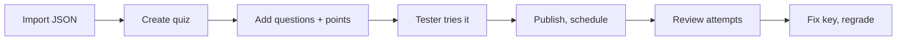

# Your first quiz

> You will build a 5-question, 15-minute quiz with integrity monitoring: import the questions from a JSON file, have a tester try it, publish it, then fix a wrong answer key and regrade.
>
> ⏱ ~20 min · 👤 Teachers, question authors · 🔑 `quiz.edit_own_quiz` (or `quiz.edit_all_quiz`)

## What you'll do

- Import 5 questions (multiple choice, multiple answer, true/false, short answer) into the question bank from a JSON file.
- Create a quiz with a time limit, an attempt limit, a feedback mode, and integrity monitoring.
- Attach the questions with points, then have a tester take it first.
- Publish and schedule it for your class.
- Review attempts, fix a wrong answer key, and regrade everything.



## Before you start

- [ ] Your account has `quiz.edit_own_quiz`. With it, the site's floating toolbar shows **Question Bank**, **Import Quiz**, and **Manage Quizzes**. If you do not see them, ask an administrator to grant it as described in [Quiz authoring](/en/setter/quiz-authoring#permissions-and-how-to-grant-them).
- [ ] A second account to act as the **tester**.
- [ ] (For a class-only quiz) the class organization exists on LCOJ and students have joined it.
- [ ] A text editor that saves UTF-8 (VS Code, Notepad++, Notepad on Windows 10 or later…).

## Step 1: Prepare the question file

Goal: a file `quiz-demo.json` with 5 valid questions.

1. Open your editor and paste the content below.
2. Question codes are **unique across all of LCOJ** and may only contain `a-z0-9` (no underscores). Replace every `mytest` with a string of your own, e.g. your username in lowercase: `mytestq1` → `hieuq1`.
3. Save it as `quiz-demo.json`, encoded as **UTF-8**.

```json
[
  {
    "code": "mytestq1",
    "type": "MC",
    "title": "Integer division 7/2",
    "content": "In C++, what is the value of the expression `7 / 2`?",
    "choices": [
      {"text": "3.5", "explanation": "That would be floating-point division."},
      {"text": "3", "explanation": "Dividing two integers drops the fractional part."},
      "4"
    ],
    "correct": 1,
    "category": "cpp-basics",
    "level": "easy",
    "explanation": "Both operands are `int`, so the result is an `int`.",
    "shuffle": true
  },
  {
    "code": "mytestq2",
    "type": "MC",
    "title": "Type that holds 10^18",
    "content": "Which C++ type can hold the number ~10^{18}~?",
    "choices": ["int", "long long", "short", "char"],
    "correct": 0,
    "category": "cpp-basics",
    "level": "easy",
    "explanation": "`long long` has at least 64 bits and holds values up to about ~9.2 \\cdot 10^{18}~."
  },
  {
    "code": "mytestq3",
    "type": "MA",
    "title": "Integer types",
    "content": "Select **all** integer types in C++:",
    "choices": ["int", "double", "long long", "float"],
    "correct": [0, 2],
    "category": "cpp-basics",
    "level": "medium",
    "ma_strategy": "partial_credit"
  },
  {
    "code": "mytestq4",
    "type": "TF",
    "title": "Array indexing",
    "content": "In C++, the first element of an array has index 0.",
    "correct": true,
    "category": "cpp-basics"
  },
  {
    "code": "mytestq5",
    "type": "SA",
    "title": "Leaving a loop",
    "content": "Which C++ keyword immediately exits the innermost loop?",
    "correct": ["break"],
    "category": "cpp-basics"
  }
]
```

::: warning Question 2 has a deliberately wrong key
In `mytestq2`, `"correct": 0` points to `int` (wrong); the right answer is `long long` (index `1`). The mistake is planted so you can practice **fixing a key and regrading** in Step 7. Do not fix it now.
:::

::: tip JSON format reminders
- `correct` for MC/MA questions is **0-based** (in the Excel file and in the form it is 1-based).
- Short-answer strings in JSON match **literally and case-insensitively**, so `Break` or ` break ` are both accepted.
- Math uses `~...~`, just like programming problem statements.

Prefer Excel? Download the template from `/quizzes/import/template` and follow the "XLSX format" section of [Quiz authoring](/en/setter/quiz-authoring).
:::

✅ **Result:** `quiz-demo.json` with 5 questions and your own code prefix.

## Step 2: Import the questions into the bank

Goal: the 5 questions are in the **Question Bank**.

1. Click **Import Quiz** on the toolbar, or open `/quizzes/import/`.
2. Under **XLSX or JSON file**, choose `quiz-demo.json`.
3. Do **not** tick **Also create a quiz from these questions** (you will create the quiz in the next step to learn the settings).
4. Click **Upload and preview**.
5. In the **Preview**, check that there are 5 boxes **Row 1** … **Row 5** and none has a red border. **These categories will be created** may list `cpp-basics`.
6. Click **Confirm import**.

✅ **Result:** the message **Imported 5 questions.** appears and you land on the **Question Bank** (`/quizzes/questions/`) with 5 new questions.

## Step 3: Create the quiz

Goal: a hidden quiz with the right settings.

1. Open `/quizzes/new` (the UI has no link to this page yet; type the URL).
2. Fill in the fields:

   | Field | Value |
   |---|---|
   | **Quiz code** | `mytestquiz` (`a-z0-9`, unique, cannot be changed later; replace the prefix as in Step 1) |
   | **Quiz name** | `C++ Basics Check` |
   | **Time limit (minutes)** | `15` |
   | **Maximum attempts** | `2` |
   | **Shuffle questions** | ticked |
   | **Result feedback** | **Show correctness (no answer key)** |
   | **Integrity monitoring** | ticked (on by default) |
   | **Publicly visible** | **leave unticked** (you turn it on in Step 6) |
   | **Testers** | add the tester account |

   Leave **Start time** and **End time** empty for now.

::: info Vietnamese UI labels
If your interface is in Vietnamese, several labels on this form are mistranslated: **Time limit** shows as "Giới hạn thời gian (giây):" (it says seconds, but the unit is **minutes**), **Maximum attempts** as "Số thành viên tối đa", **Shuffle questions** as "Lời giải", and **Result feedback** as "Phản hồi từ trình chấm".
:::

::: tip Why "correctness" instead of full feedback?
**Show correct answers and explanations** reveals the key **as soon as a student submits**, so early finishers can share it. Use correctness (or **Score only**) during the quiz and switch to full feedback after it closes.
:::

✅ **Result:** the settings are filled in; not saved yet (you add questions on this same form).

## Step 4: Add questions and points

Goal: the quiz has 5 questions worth 6 points in total.

1. Under **Questions**, click **+ Add question**, type `mytestq1` (with your prefix), and pick the result shown as `[MC] mytestq1: Integer division 7/2`.
2. Enter its **Points** from the table, then repeat for the other 4 questions:

   | Question | Type | Points |
   |---|---|---|
   | `mytestq1` | MC | 1 |
   | `mytestq2` | MC | 1 |
   | `mytestq3` | MA (partial credit with penalty) | 2 |
   | `mytestq4` | TF | 1 |
   | `mytestq5` | SA | 1 |

3. Drag the **⠿** handle to reorder if you like (optional, since question shuffling is on).
4. Click **Save quiz**.

✅ **Result:** **Quiz saved.** appears and you are on the edit page `/quizzes/mytestquiz/edit`. Open `/quizzes/mytestquiz`: it shows 5 questions, 6 points, a 15-minute limit, and at most 2 attempts.

## Step 5: Have the tester take it

Goal: confirm students will see what you intend, before publishing.

1. Sign in as the tester (private window or another browser) and open `/quizzes/mytestquiz`.
2. Click **Start quiz**. The **Academic Integrity Notice** dialog appears; click **I understand, start →**.
3. Answer all 5 questions. On question 2, pick `long long` (the truly correct answer). Switch to another tab once to trigger an integrity event.
4. Click **Review & Submit** on the last question (or **Submit quiz** in the sidebar) and confirm.

✅ **Result:** the result page shows **Score: 5 / 6** with right/wrong colouring per question and no answer key. Question 2 is marked **wrong** even though the tester chose correctly, because of the planted mistake.

::: info Trial attempts are real attempts
The tester's attempt shows up in the attempts list and on the **ranking**. An administrator can delete it in `/admin/quiz/quizattempt/`.
:::

## Step 6: Publish and schedule

Goal: the class can take the quiz in the planned window.

1. Open `/quizzes/mytestquiz/edit`.
2. Set **Start time** and **End time** (in your account's time zone), e.g. 14:00 and 15:00. An attempt that has started always gets its full 15 minutes, even past the end time, so tell students to start before 14:45.
3. Tick **Publicly visible**.
4. (Class-only) also tick **Private to organizations** and pick the class under **Organizations**. You must tick **both** boxes: with only **Private to organizations**, students still cannot see the quiz.
5. Click **Save quiz**.

✅ **Result:** signed in as a student (in the class, if restricted), open `/quizzes/`: the quiz is listed; before the start time, its page shows **Starting in …**.

## Step 7: Review attempts, fix the key, and regrade

Goal: spot the question with a wrong key, fix it, and regrade every submitted attempt.

1. On the quiz page, click **All attempts** (or **Attempts & regrade** on the edit page). URL: `/quizzes/mytestquiz/attempts`.
2. The table has **User**, **Started**, **Status**, **Score**, and **Violations**. Click the tester's **⚠ N** badge to open the log; you will see a **Tab switch** event.
3. Click **view** to open that attempt's result. Teachers always see full feedback, so it is easy to spot that question 2 uses `int` as the key.
4. Fix the question: open the **Question Bank** and click the title **Type that holds 10^18** (`mytestq2`) to open its edit page. In the choices list, mark the **Correct** column on `long long` and unmark it on `int`. Click **Save question**.
   Change only the correct answer; **do not** reorder, add, or remove choices, because old answers are stored by choice position.
5. Go back to `/quizzes/mytestquiz/attempts`, click **Regrade all attempts**, and confirm **Regrade all submitted attempts?**.

✅ **Result:** **Regraded N attempts.** appears; the tester's attempt goes from `5` to `6`, and the ranking (`/quizzes/mytestquiz/ranking`) updates immediately.

::: tip After the quiz closes
Once the quiz has ended, you can switch **Result feedback** to **Show correct answers and explanations** so students can review the key and explanations. The change applies to all past attempts at once.
:::

## Verify

- [ ] The question bank has 5 new questions with your prefix.
- [ ] `/quizzes/mytestquiz` shows 5 questions, 6 points, 15 minutes, at most 2 attempts.
- [ ] The tester's attempt has a **Tab switch** event.
- [ ] After regrading, the tester's attempt scores 6/6.
- [ ] Students (in the right class) see the quiz on `/quizzes/`; accounts outside the class do not, if it is organization-private.

## Troubleshooting

| Symptom | Cause | Fix |
|---|---|---|
| No **Import Quiz** button; `/quizzes/questions/` returns 404 | Missing `quiz.edit_own_quiz` | Ask an administrator for the permission |
| `Code … already exists in the question bank` | Someone already uses that code | Change the `mytest` prefix and upload again |
| `Question code is required and must match ^[a-z0-9]+$` | The code has uppercase letters, underscores, or spaces | Use lowercase letters and digits only |
| `Invalid JSON file` | A missing comma or bracket, or the file is not UTF-8 | Check the file with a JSON validator |
| The preview shows errors and **nothing** is imported | Import is all-or-nothing | Fix every bad row and upload again |
| **No pending import - upload a file first.** | Confirm clicked twice, or the session expired | Upload the file again |
| **+ Add question** does not find a question | Typo in the code, or the question was not imported | Check the **Question Bank** |
| Students cannot see the quiz | **Publicly visible** is not ticked, or the student is not in the organization | Fix per Step 6 |
| Students see **Quiz not started yet.** | The **Start time** has not been reached | Check the time and time zone |
| The timer is far too long | Seconds were entered in the time limit field | The field is in **minutes**: enter `15`, not `900` |
| Scores did not change after fixing the key | You did not click **Regrade all attempts** | Regrade as in Step 7 |

## Next steps

- [Quiz authoring](/en/setter/quiz-authoring): every question type, the XLSX format, multiple-answer strategies, cloning quizzes.
- [Taking quizzes](/en/learn/quiz): the student's view and how the ranking works.
- [Organizations](/en/organize/organizations): create a class to restrict who can take the quiz.
- [Permissions](/en/admin/permissions): grant authoring rights to teachers.
