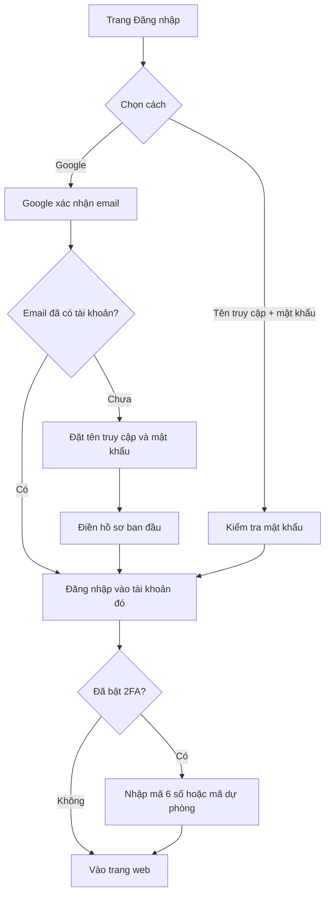

# Tài khoản và đăng nhập

> Cách tạo tài khoản và đăng nhập LCOJ bằng Google, thiết lập hồ sơ lần đầu, bảo vệ tài khoản bằng xác thực hai yếu tố và tải dữ liệu cá nhân về máy.
>
> ⏱ ~10 phút · 👤 Học sinh, mọi người dùng · 🔑 Chỉ cần tài khoản

## Trước khi bắt đầu

- [ ] Có một **tài khoản Google** (Gmail hoặc Google Workspace của trường) còn dùng được.
- [ ] Nghĩ trước một **tên truy cập** (username). Tên này hiện trên bảng xếp hạng, trong đường dẫn hồ sơ `/user/<tên truy cập>` và **không tự đổi được** sau khi tạo.
- [ ] Nếu định bật xác thực hai yếu tố: cài sẵn một ứng dụng xác thực trên điện thoại (Google Authenticator, Microsoft Authenticator, Authy hoặc ứng dụng tương tự hỗ trợ mã TOTP).

## Đăng nhập trên LCOJ hoạt động thế nào

LCOJ **chỉ cho đăng ký tài khoản mới qua Google**. Form đăng ký bằng tên truy cập và mật khẩu đã bị tắt (cài đặt `OAUTH_ONLY = True`), nên trang **Đăng ký** (`/accounts/register/`) chỉ có nút **Google** dưới dòng **Đăng ký bằng Gmail**. Facebook và GitHub không được cấu hình trên luyencode.net.

Tuy vậy, trang **Đăng nhập** (`/accounts/login/`) vẫn có hai cách:

| Cách đăng nhập | Dùng khi nào |
|---|---|
| Nút **Google** dưới dòng **Hoặc đăng nhập bằng...** | Cách chính. Bấm là xong, không cần nhớ mật khẩu |
| Ô **Tên truy cập** + **Mật khẩu** rồi bấm **Đăng nhập!** | Khi không tiện dùng Google (ví dụ máy phòng thi). Mật khẩu này là mật khẩu bạn tự đặt lúc tạo tài khoản qua Google |

::: info Mật khẩu vẫn tồn tại
Khi tạo tài khoản qua Google, LCOJ vẫn yêu cầu bạn đặt một mật khẩu riêng cho LCOJ. Nhờ vậy mọi tài khoản, kể cả tài khoản quản trị, đều đăng nhập được bằng tên truy cập và mật khẩu. Đổi mật khẩu tại **Chỉnh sửa hồ sơ** → **Đổi mật khẩu của bạn**.
:::

## Đăng ký và đăng nhập lần đầu

1. Mở `https://luyencode.net`, bấm **Đăng nhập** hoặc **Đăng ký** ở góc phải thanh điều hướng.
2. Bấm nút **Google** và chọn tài khoản Google của bạn.
3. Nếu email Google này **đã gắn với một tài khoản LCOJ**, bạn được đăng nhập thẳng vào tài khoản đó. Bỏ qua các bước còn lại.
4. Nếu là lần đầu, trang **Set up your account** hiện ra (trang này chưa được dịch, luôn hiện tiếng Anh). Điền:
   - **Username**: chỉ gồm chữ cái không dấu, chữ số và dấu gạch dưới `_`, tối đa 30 ký tự, chưa ai dùng. Ô này được điền sẵn một gợi ý dựa trên tài khoản Google.
   - **Password** và **Retype password**: mật khẩu cho LCOJ. Mật khẩu phải dài ít nhất 8 ký tự, không được toàn chữ số, không quá giống tên truy cập và không nằm trong danh sách mật khẩu từng bị lộ.
5. Bấm **Register!**.
6. Trang **Create your profile** hiện ra với các ô cài đặt hồ sơ (múi giờ, ngôn ngữ lập trình mặc định, giao diện, tổ chức...). Chọn xong thì bấm **Tiếp tục >**. Bạn có thể sửa mọi thứ ở đây sau này.

::: warning Để trống ô tự giới thiệu lúc tạo tài khoản
Phải giải được ít nhất **5 bài** mới được viết phần tự giới thiệu. Nếu bạn điền ô này ngay lúc tạo tài khoản, trang báo lỗi **Bạn phải giải ít nhất 5 bài trước khi có thể thay đổi thông tin người dùng** và không cho đi tiếp. Hãy để trống.
:::

Sau khi đăng nhập, thanh điều hướng hiện **Xin chào, &lt;tên&gt;.** kèm ảnh đại diện. Di chuột vào đó để thấy **Chỉnh sửa hồ sơ** và **Đăng xuất**.

## Chỉnh sửa hồ sơ

Mở **Chỉnh sửa hồ sơ** từ menu tài khoản, hoặc vào thẳng `/edit/profile/`. Sửa xong bấm **Cập nhật** ở cuối trang.

| Mục trên trang | Ý nghĩa |
|---|---|
| **Họ và tên** | Tên thật hiển thị, tối đa 30 ký tự. Thanh điều hướng chào bạn bằng tên này. Trên bảng xếp hạng kỳ thi, người xem bật **Hiển thị tên/tổ chức** mới thấy |
| **Huy hiệu hiển thị** | Chỉ hiện khi bạn đã được trao huy hiệu. Chọn một huy hiệu để hiển thị cạnh tên |
| **Tự giới thiệu:** | Nội dung Markdown hiện ở tab **Thông tin** trên hồ sơ. Cần giải ít nhất 5 bài mới sửa được |
| **Múi giờ:** | Múi giờ dùng để hiển thị mọi mốc thời gian. Mặc định `Asia/Ho_Chi_Minh`. Có thể chọn trên bản đồ |
| **Ngôn ngữ:** | Ngôn ngữ **lập trình** được chọn sẵn khi bạn nộp bài. Đây không phải ngôn ngữ giao diện |
| **Site theme:** | Giao diện trang web: **Follow system default** (theo hệ điều hành), **Light** (sáng) hoặc **Dark** (tối) |
| **Giao diện khung code:** | Bảng màu của khung soạn thảo code |
| **Tổ chức đại diện** | Các tổ chức bạn tham gia. Bỏ chọn một tổ chức nghĩa là rời tổ chức đó. Tối đa 3 tổ chức công khai |
| **Thông báo cho tôi về các kỳ thi sắp tới** | Chỉ hiện khi trang có bật bản tin |
| **Bật các tính năng đang thử nghiệm** | Dùng thử tính năng mới chưa phát hành chính thức |
| **Đổi ảnh đại diện của bạn** | Liên kết tới Gravatar. LCOJ lấy ảnh đại diện từ Gravatar theo email của bạn |
| **Đổi mật khẩu của bạn** | Đổi mật khẩu đăng nhập bằng tên truy cập |
| **Download your data** | Tải mã nguồn và bình luận của bạn về máy. Xem mục **Tải dữ liệu của bạn** bên dưới |

::: tip Đổi ngôn ngữ giao diện và chế độ tối nhanh
Bấm biểu tượng bánh răng **Cài đặt** trên thanh điều hướng:
- **Theme**: nút mặt trời (sáng) và mặt trăng (tối).
- **Ngôn ngữ**: nút **VI** và **EN** để đổi ngôn ngữ giao diện.

Nút này có cả khi **chưa đăng nhập**. Khi đó lựa chọn giao diện được lưu trong cookie của trình duyệt trong 1 năm, và nếu chưa chọn gì thì trang tự theo chế độ sáng/tối của hệ điều hành. Khi đã đăng nhập, lựa chọn được lưu vào hồ sơ và áp dụng trên mọi thiết bị.
:::

## Hồ sơ công khai của bạn

Trang hồ sơ nằm ở `https://luyencode.net/user/<tên truy cập>`. Mở `/user` (không có tên) sẽ đưa bạn tới hồ sơ của chính mình. Mọi người, kể cả khách chưa đăng nhập, đều xem được:

| Thông tin | Ở đâu |
|---|---|
| Ảnh đại diện (Gravatar), **Số bài đã giải:**, **Hạng điểm:**, **Tổng điểm:**, **Đóng góp:** | Cột bên trái |
| Số kỳ thi đã tham gia, **Hạng rating:**, **Rating:**, **Min. rating:**, **Max rating:** | Cột bên trái, chỉ hiện khi bạn đã có rating |
| Tổ chức (dòng **Từ**), phần tự giới thiệu, **Huy hiệu**, lịch hoạt động nộp bài theo ngày, **Lịch sử rating** | Tab **Thông tin** |
| Các bài đã giải và điểm từng bài | Tab **Thống kê** |
| Bài viết blog | Tab **Blog** |
| Danh sách bài nộp | Liên kết **Xem các bài nộp** (`/submissions/user/<tên truy cập>/`) |

**Email** của bạn chỉ hiện với chính bạn và quản trị viên cấp cao. Người khác xem được danh sách bài nộp của bạn, nhưng xem được mã nguồn hay không thì tùy cài đặt của từng bài (xem [Nộp bài và chấm bài](/learn/submissions)).

## Xác thực hai yếu tố (2FA)

Khi bật 2FA, mỗi lần đăng nhập (bằng Google hay bằng mật khẩu) LCOJ sẽ hỏi thêm một mã 6 chữ số do ứng dụng trên điện thoại sinh ra. Kẻ lấy được mật khẩu hoặc tài khoản Google của bạn vẫn không vào được nếu không có điện thoại.

### Bật 2FA

1. Vào **Chỉnh sửa hồ sơ**, tìm dòng **Xác thực 2 yếu tố đã tắt:** và bấm **Bật**.
2. Mở ứng dụng xác thực, quét mã QR ở mục **Quét mã này với ứng dụng xác thực của bạn:**. Không quét được thì nhập tay chuỗi ở dòng **Hoặc nhập mã này thủ công:**.
3. **Chép lại danh sách mã dự phòng** (scratch code) hiện ở cuối trang: 5 mã, mỗi mã 16 ký tự. Cất ở nơi an toàn. Sau khi bật xong, trang sẽ không hiện lại các mã này.
4. Nhập mã 6 số đang hiện trong ứng dụng vào ô **Nhập mã 6 chữ số sinh ra bởi ứng dụng của bạn:** rồi bấm **Enable Two Factor Authentication**.

Trang quay về **Chỉnh sửa hồ sơ**, giờ ghi **Two-factor authentication is enabled:** kèm các nút **Tắt** và **Refresh** (đổi sang khóa mới, ví dụ khi thay điện thoại).

### Đăng nhập khi đã bật 2FA

Sau khi đăng nhập bằng Google hoặc mật khẩu, trang **Perform Two-factor Authentication** hiện ra. Nhập **mã 6 số** trong ứng dụng, hoặc **một mã dự phòng 16 ký tự**, rồi bấm **Đăng nhập!**. Mỗi mã dự phòng chỉ dùng được một lần.

Cho tới khi qua bước này, mọi trang đều chuyển bạn về trang nhập mã. Bạn vẫn có thể **Đăng xuất**.

### Quản lý mã dự phòng

Trong **Chỉnh sửa hồ sơ**, dòng **Scratch codes:** có nút **Tạo** hoặc **Tạo lại**. Tạo lại sẽ **vô hiệu hóa toàn bộ mã cũ** và hiện bộ mã mới một lần duy nhất, kèm nút **Copy**. Hãy tạo lại khi bạn đã dùng gần hết mã hoặc nghi mã bị lộ.

### Tắt 2FA

Bấm **Tắt**, nhập mã 6 số hoặc một mã dự phòng, rồi bấm **Disable Two Factor Authentication**. Mã dự phòng cũng bị xóa theo.

::: warning Tài khoản quản trị không tự tắt được 2FA
LCOJ bật cài đặt `DMOJ_REQUIRE_STAFF_2FA`. Với tài khoản **staff**, sau khi đã bật 2FA thì nút **Tắt** chỉ hiện thông báo *"The administrators for this site require all the staff to have Two-factor Authentication enabled..."* và không cho tắt. Cài đặt này **không bắt buộc** staff phải bật 2FA từ đầu; nó chỉ ngăn tắt sau khi đã bật.
:::

::: info Khóa bảo mật (WebAuthn) chưa bật trên luyencode.net
Mã nguồn có hỗ trợ khóa bảo mật phần cứng (mục **Khoá bảo mật:**), nhưng tính năng này chỉ hiện khi máy chủ đặt `WEBAUTHN_RP_ID`. luyencode.net hiện chưa đặt, nên bạn chỉ dùng được ứng dụng xác thực và mã dự phòng.
:::

## API token

API token cho phép chương trình của bạn gọi API của LCOJ thay mặt tài khoản, bằng header `Authorization: Bearer <token>`. Token **bỏ qua bước 2FA**, nên hãy giữ bí mật như mật khẩu.

Trên LCOJ, trang **Chỉnh sửa hồ sơ** hiện **không có nút tạo API token** (giao diện này đã bị bỏ, dù địa chỉ `/accounts/api/token/generate/` vẫn tồn tại ở phía máy chủ). Nếu cần token, hãy liên hệ quản trị viên. Họ có thể tạo token bằng lệnh quản trị `generate_api_token` (xem [Lệnh quản trị](/reference/management-commands)). Cách gọi API xem tại [API](/reference/api).

## Tải dữ liệu của bạn

Bạn có thể tải về một file `.zip` chứa mã nguồn các bài đã nộp và các bình luận của mình.

1. Vào **Chỉnh sửa hồ sơ**, bấm liên kết **Download your data** (hoặc mở `/data/prepare/`).
2. Chọn ít nhất một mục: **Tải bình luận?** và/hoặc **Tải bài nộp?**.
3. Với bài nộp, có thể lọc thêm:
   - **Lọc theo mã bài:** mẫu mã bài, ví dụ `*` (mọi bài) hoặc `lc*`.
   - **Lọc theo kết quả:** chọn một hay nhiều kết quả như `AC`, `WA`. Để trống là lấy tất cả.
4. Bấm **Chuẩn bị dữ liệu**. Máy chủ chuẩn bị dữ liệu ở chế độ nền. Trang hiện tiến độ cho tới khi xong.
5. Khi thấy **Dữ liệu của bạn đã sẵn sàng!**, bấm **Tải dữ liệu** để nhận file `<tên truy cập>-data.zip`.

Trong file zip, thư mục `submissions/` chứa từng file mã nguồn (đặt tên theo số bài nộp) và file `info.json` ghi bài, thời điểm, ngôn ngữ, kết quả, thời gian chạy và bộ nhớ của mỗi bài nộp. Bình luận được xuất kèm thông tin trang mà bình luận thuộc về.

::: tip Giới hạn tần suất
Mỗi tài khoản chỉ chuẩn bị được **một bản dữ liệu mới mỗi ngày**. Bản đã chuẩn bị vẫn tải lại được nhiều lần. Người quản trị muốn tìm hiểu cách tính năng này được cấu hình trên máy chủ có thể xem [Tải dữ liệu người dùng](/operate/user-data-download).
:::

## Xóa hoặc vô hiệu hóa tài khoản

LCOJ **không có chức năng tự xóa tài khoản**. Nếu muốn xóa tài khoản, hãy liên hệ ban quản trị qua email `luyencodeonline@gmail.com` hoặc nút **Báo cáo vấn đề** (biểu tượng tam giác vàng trên thanh điều hướng).

## Kiểm tra kết quả

- [ ] Đăng xuất rồi đăng nhập lại bằng Google: vào được đúng tài khoản.
- [ ] Đăng nhập bằng tên truy cập và mật khẩu cũng vào được.
- [ ] Mở `/user/<tên truy cập>` trong cửa sổ ẩn danh: thấy hồ sơ công khai nhưng **không** thấy email.
- [ ] Nếu đã bật 2FA: lần đăng nhập mới có hỏi mã 6 số, và bạn biết mã dự phòng đang cất ở đâu.

## Sự cố thường gặp

| Triệu chứng | Cách xử lý |
|---|---|
| Không thấy form đăng ký bằng mật khẩu | Đúng như thiết kế: LCOJ chỉ cho đăng ký qua Google. Bấm nút **Google** |
| Trang **Xác thực không thành công** sau khi chọn tài khoản Google | Tài khoản Google phải cung cấp email. Thử lại, hoặc dùng tài khoản Google khác |
| Báo **Tên truy cập hoặc mật khẩu không hợp lệ.** | Tên truy cập là tên bạn đặt lúc tạo tài khoản, không phải email. Quên mật khẩu thì đăng nhập bằng Google rồi vào **Đổi mật khẩu của bạn** |
| Đăng nhập xong bị chuyển ngay sang trang đổi mật khẩu | Mật khẩu của bạn nằm trong danh sách mật khẩu từng bị lộ. Đặt mật khẩu mới để tiếp tục |
| Báo **Tài khoản này đã bị cấm vì lý do: ...** | Tài khoản bị khóa. Liên hệ ban quản trị |
| Không lưu được hồ sơ vì phần tự giới thiệu | Cần giải ít nhất 5 bài. Xóa nội dung ô **Tự giới thiệu:** rồi lưu lại |
| Mã 6 số bị báo sai | Kiểm tra giờ trên điện thoại đã tự động đồng bộ. Mỗi mã chỉ dùng được một lần, hãy chờ mã mới |
| Mất điện thoại có ứng dụng xác thực | Đăng nhập bằng một mã dự phòng 16 ký tự, rồi tắt 2FA hoặc bấm **Refresh** để gắn điện thoại mới. Hết cả mã dự phòng thì liên hệ ban quản trị |
| Ảnh đại diện không đổi | LCOJ lấy ảnh từ Gravatar theo **đúng email** của tài khoản. Đăng ký Gravatar bằng email đó |
| Muốn đổi tên truy cập | Người dùng không tự đổi được. Liên hệ ban quản trị |

## Tiếp theo

- [Nộp bài và chấm bài](/learn/submissions): nộp bài đầu tiên với tài khoản vừa tạo và đọc kết quả chấm.
- [Tham gia kỳ thi](/learn/contests): đăng ký và thi đấu trên LCOJ.
- [Câu hỏi thường gặp](/start/faq): giải đáp nhanh các thắc mắc khác.
