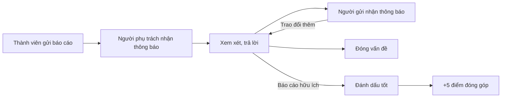

# Blog, bình luận và báo lỗi

> Cách đọc và viết blog, bình luận dưới bài tập, báo lỗi đề bài cho người ra đề, theo dõi thông báo và tích điểm đóng góp trên LCOJ.
>
> ⏱ ~12 phút · 👤 Mọi thành viên · 🔑 Tài khoản LCOJ đã đăng nhập (khách chỉ đọc được)

## Trước khi bắt đầu

- [ ] Đã **đăng nhập**. Khách đọc được blog và bình luận nhưng không bình luận, bỏ phiếu hay báo lỗi được.
- [ ] Đã giải được ít nhất **5 bài**. Đây là điều kiện để bình luận và bỏ phiếu (thành viên staff được miễn).
- [ ] Muốn viết blog thì cần giải được ít nhất **10 bài**.
- [ ] Biết viết Markdown cơ bản. Công thức toán viết bằng `~...~` (trong dòng) và `$$...$$` (riêng dòng).

::: info Các ngưỡng trên LCOJ
| Việc | Điều kiện | Thiết lập |
|---|---|---|
| Bình luận, bỏ phiếu bình luận/blog | Giải ≥ 5 bài | `VNOJ_INTERACT_MIN_PROBLEM_COUNT = 5` |
| Viết blog cá nhân | Giải ≥ 10 bài | `VNOJ_BLOG_MIN_PROBLEM_COUNT = 10` |
| Bình luận | Điểm đóng góp ≥ −20 | `VNOJ_COMMENT_MIN_CONTRIBUTION = -20` |
| Độ dài bình luận | 10 – 8196 ký tự | `VNOJ_COMMENT_MIN_LENGTH`, `VNOJ_COMMENT_MAX_LENGTH` |
| Thêm tag cho bài ở OJ khác | Rating ≥ 1900 hoặc có quyền riêng | `VNOJ_TAG_PROBLEM_MIN_RATING = 1900` |

"Số bài đã giải" là số bài **công khai** bạn đã `AC`. Staff không bị giới hạn về số bài, điểm đóng góp và độ dài bình luận.
:::

## Blog

### Đọc blog

1. Mở trang chủ `https://luyencode.net/`. Khung blog có hai tab:
   - **Tin tức** (*Newsfeed*): chỉ gồm các bài được staff đánh dấu **bài đăng chung** (*global post*), bài được **dán** (*sticky*) nằm trên cùng.
   - **Blog** (*Blogs*): mọi bài công khai, kể cả blog cá nhân của thành viên, xếp theo thời gian đăng mới nhất.
2. Trang chủ nhớ tab bạn chọn gần nhất. Danh sách được chia trang tại `/posts/<số trang>`.
3. Bấm tiêu đề để mở bài. Địa chỉ bài có dạng `/post/<id>-<slug>`.
4. Muốn xem tất cả blog của một người, mở hồ sơ của họ rồi chọn tab **Blog** (`/user/<tên>/blog/`).

Cột bên phải trang chủ còn có kỳ thi đang diễn ra/sắp diễn ra, **Dòng bình luận** (*Comment stream*: các bình luận mới nhất), bài tập mới, bảng **Top đóng góp** và mục **Báo cáo của tôi** (*My open tickets*) liệt kê các báo cáo bạn đang mở.

### Viết một bài blog

1. Mở hồ sơ của bạn, chọn tab **Tạo blog mới** (*Create new blog post*), hoặc vào thẳng `/posts/new`.
2. Điền **tiêu đề bài viết** (*post title*, tối đa 100 ký tự) và **nội dung** (*post content*) bằng Markdown. Dùng tab xem trước của trình soạn thảo để kiểm tra trước khi đăng.
3. Tích ô **hiển thị công khai** (*public visibility*). Ô này **mặc định không được tích**: nếu bỏ qua, bài chỉ bạn (và staff có quyền sửa mọi bài) xem được.
4. Bấm **Tạo** (*Create*). Bài được đăng ngay và xuất hiện ở tab **Blog** trên trang chủ.

::: warning Chưa đủ 10 bài
Nếu chưa giải đủ 10 bài, trang báo **Không thể tạo blog. Lưu ý: Bạn cần giải ít nhất 10 bài để có thể tạo blog.** (*You cannot create blog post…*).
:::

Sau khi đăng:

- **Sửa**: mở bài, bấm **[Chỉnh sửa]** cạnh tiêu đề (`/post/<id>-<slug>/edit`). Tác giả sửa được bài của mình. Bạn có thể bỏ tích **hiển thị công khai** để ẩn bài.
- **Xoá**: chỉ người có quyền xoá blog (staff) mới thấy nút **Xoá**. Thành viên thường muốn gỡ bài thì ẩn bài đi.
- **Đưa lên Tin tức / dán lên đầu**: chỉ staff có quyền `mark_global_post` / `pin_post` mới thấy ô **bài đăng chung** và **dán**.

### Markdown và công thức toán

Blog, bình luận và báo cáo đều dùng Markdown, hỗ trợ bảng, khối code, chữ gạch ngang và spoiler.

| Muốn viết | Cú pháp | Ví dụ |
|---|---|---|
| Công thức trong dòng | `~...~` | `~a^2 + b^2 = c^2~` |
| Công thức riêng dòng | `$$...$$` | `$$\sum_{i=1}^{n} i = \frac{n(n+1)}{2}$$` |
| Khối code | Ba dấu backtick kèm tên ngôn ngữ, ví dụ `cpp` | Code được tô màu cú pháp |

::: tip Không dùng `$...$`
`$a+b$` sẽ hiện nguyên văn. Công thức trong dòng luôn viết `~a+b~`.
:::

Trong bình luận và báo cáo, HTML thô bị vô hiệu (hiện nguyên văn). Blog cho phép một số thẻ HTML an toàn.

### Bỏ phiếu cho blog

Dưới mỗi bài có mũi tên lên/xuống và điểm hiện tại.

- Cần giải ≥ 5 bài mới bỏ phiếu được; khách bấm vào sẽ thấy **Hãy đăng nhập để bình chọn**.
- Không tự bỏ phiếu cho bài của mình (**Bạn không thể tự bỏ phiếu blog của mình.**).
- Mỗi người chỉ bỏ phiếu **một lần** cho một bài; bấm lần nữa sẽ báo lỗi *You cannot vote twice.* chứ không đổi hay huỷ phiếu.
- Điểm phiếu của blog công khai (không thuộc tổ chức) được cộng vào **điểm đóng góp** của các tác giả.

### Blog của tổ chức

Quản trị viên tổ chức có quyền `edit_organization_post` viết được bài riêng cho tổ chức tại `/organization/<slug>/post/new`, không cần đủ 10 bài. Bài tổ chức chỉ thành viên tổ chức xem được và **không** tính điểm đóng góp. Xem thêm ở [Tổ chức](/organize/organizations).

## Bình luận

### Bình luận xuất hiện ở đâu

| Trang | Địa chỉ |
|---|---|
| Bài tập | cuối trang `/problem/<mã bài>` |
| Lời giải (editorial) | cuối trang `/problem/<mã bài>/editorial` |
| Kỳ thi | trang `/contest/<mã kỳ thi>` |
| Bài blog | cuối trang `/post/<id>-<slug>` |
| Bài ở OJ khác (tag) | trang `/tag/<mã>` |

Bình luận được tải sau khi trang mở, mỗi trang 20 luồng bình luận gốc. Nếu thấy **Bình luận đã bị vô hiệu hóa trên trang này.** thì bình luận ở trang đó đang bị khoá: staff khoá thủ công, hoặc bài/kỳ thi thuộc một kỳ thi đang diễn ra có bật chế độ hỏi đáp (clarification).

### Viết và trả lời bình luận

1. Cuộn tới khung **Bình luận mới** (*New comment*) ở cuối phần bình luận.
2. Viết nội dung bằng Markdown (10 – 8196 ký tự), xem trước nếu cần.
3. Bấm **Đăng!** (*Post!*).
4. Để trả lời một bình luận, bấm biểu tượng **Phản hồi** (*Reply*) trên bình luận đó. Chỉ trả lời được bình luận đăng trong vòng **365 ngày** (`DMOJ_COMMENT_REPLY_TIMEFRAME`).

Biểu tượng **Liên kết** (*Link*) cho bạn đường dẫn thẳng tới bình luận (`#comment-<id>`).

::: tip Hỏi bài ở đâu?
Muốn hỏi gợi ý cách giải thì hỏi trong bình luận, **không** dùng báo cáo (ticket). Báo cáo chỉ dành cho lỗi của đề, test hoặc trang web.
:::

### Bỏ phiếu và bình luận bị ẩn

- Mỗi bình luận có mũi tên lên/xuống. Điều kiện giống blog: giải ≥ 5 bài, không tự bỏ phiếu cho mình (**Bạn không thể tự đánh giá bình luận của mình.**), mỗi người một phiếu.
- Mỗi phiếu thay đổi **1 điểm đóng góp** của tác giả (`VNOJ_CP_COMMENT = 1`).
- Bình luận có điểm **≤ −5** (`DMOJ_COMMENT_VOTE_HIDE_THRESHOLD`) bị thu gọn, hiện dòng **Bình luận này đã bị ẩn vì có quá nhiều phản ứng tiêu cực.** Bấm **Nhấn để xem.** (*Show it anyway.*) để đọc.

### Sửa, xoá và báo cáo bình luận

- **Sửa**: bấm biểu tượng **Chỉnh sửa** trên bình luận của bạn. Bình luận đã sửa có chữ **chỉnh sửa** (*edited*) kèm hai mũi tên ← → để xem lần lượt các phiên bản trước.
- **Xoá**: thành viên **không tự xoá** được bình luận. Nếu muốn gỡ, hãy sửa nội dung hoặc báo cho staff.
- **Staff** có thêm nút **Ẩn** (*Hide*): ẩn bình luận cùng toàn bộ trả lời bên dưới, điểm đóng góp của tác giả được tính lại (bình luận bị ẩn không còn được tính).
- **Báo cáo bình luận vi phạm**: không có nút báo cáo riêng cho từng bình luận. Dùng nút **Báo cáo vấn đề** trên thanh điều hướng (xem mục **Báo lỗi** bên dưới), dán liên kết của bình luận vào mô tả.

::: danger Bị tắt bình luận
Tài khoản bị staff bật **tắt bình luận** (*comment mute*) sẽ không bình luận, bỏ phiếu, sửa bình luận hay gửi báo cáo được, và nhận thông báo **Im lặng đi, bạn không có quyền nói ở đây.** kèm lý do (nếu có).
:::

## Điểm đóng góp

Điểm đóng góp (*contribution points*) ghi nhận việc bạn giúp cộng đồng. Điểm được tính như sau:

| Nguồn | Điểm |
|---|---|
| Mỗi phiếu lên / xuống cho bình luận của bạn (bình luận không bị ẩn) | +1 / −1 |
| Mỗi phiếu lên / xuống cho blog công khai của bạn (không thuộc tổ chức) | +1 / −1 |
| Mỗi báo cáo được đánh dấu **tốt** | **+5** (`VNOJ_CP_TICKET = 5`) |
| Mỗi lần mở xem lời giải của bài **chưa giải được** | −1 |

Xem điểm ở đâu:

- Trang hồ sơ của bạn, dòng **Đóng góp:** (*Contribution points:*).
- Bảng xếp hạng đóng góp tại `/contributors/` (tab **Đóng góp** cạnh tab **Bảng xếp hạng**). Ô **Tìm kiếm bằng username** nhảy tới đúng trang có người đó.
- Bảng **Top đóng góp** ở trang chủ (5 người đầu).

::: warning Điểm âm
Khi điểm đóng góp **dưới 0**, bạn không mở khoá được lời giải của bài chưa giải. Dưới **−20** thì không bình luận được nữa.
:::

## Báo lỗi (ticket)

Báo cáo (ticket) là kênh riêng tư giữa bạn và người phụ trách để báo lỗi đề, test sai, hoặc sự cố trên trang. Chỉ bạn, người được phân công và staff xem được báo cáo.

### Báo lỗi một bài tập

1. Mở trang đề bài và bấm **Báo cáo vấn đề** (*Report an issue*) dưới đề, hoặc nút **Báo cáo vấn đề** trên thanh điều hướng. Trong kỳ thi đang khoá bình luận, nút dưới đề đổi thành **Gửi thắc mắc** (*Request clarification*).
2. Trang `/problem/<mã bài>/tickets/new` mở ra. Điền **Tiêu đề của vấn đề** (tối đa 100 ký tự) và **Mô tả vấn đề** bằng Markdown: test nào, kết quả mong đợi, vì sao bạn nghĩ đề/test sai.
3. Bấm **Tạo!** (*Create!*). Bạn được chuyển tới trang báo cáo `/ticket/<số>`.

Báo cáo tự động được **phân công** cho tác giả và người quản lý (curator) của bài. Nếu bạn đang thi và bài thuộc kỳ thi đó, báo cáo được giao cho tác giả và người quản lý của **kỳ thi**.

::: danger Không dùng báo cáo để hỏi bài
Biểu mẫu nhắc rõ: báo cáo dành cho lỗi của bài, không phải để hỏi cách giải. Cần gợi ý thì hỏi trong phần bình luận. Dùng sai mục đích có thể bị khoá tài khoản.
:::

### Báo lỗi chung

Ở bất kỳ trang nào khác trang đề bài, nút **Báo cáo vấn đề** trên thanh điều hướng mở `/tickets/new?issue_url=<trang hiện tại>`. Ô **URL tới vấn đề** đã điền sẵn địa chỉ trang bạn đang xem (bắt buộc phải có). Điền tiêu đề, mô tả rồi bấm **Tạo!**.

Báo cáo chung không giao cho ai cụ thể; staff theo dõi chúng trong danh sách báo cáo.

### Theo dõi và trả lời báo cáo

- Xem các báo cáo của bạn tại `/tickets/`. Tích **Chỉ hiện báo cáo của tôi** hoặc **Ẩn ticket đã đóng** rồi bấm **Tìm** để lọc. Trên trang đề, liên kết **Các báo cáo của tôi** (`/problem/<mã bài>/tickets/`) liệt kê báo cáo của bạn cho bài đó.
- Trên trang báo cáo, viết trả lời ở khung dưới cùng rồi bấm **Đăng!**. Trang tự cập nhật khi có tin nhắn mới.
- Người gửi tự **Đóng vấn đề** (*Close ticket*) khi đã xong, hoặc **Mở lại vấn đề** (*Reopen ticket*) nếu lỗi quay lại.

### Staff và người phụ trách thấy gì

| Ai | Thấy và làm được |
|---|---|
| Người gửi | Báo cáo của mình: trả lời, đóng/mở lại |
| Người được phân công (tác giả, curator) | Báo cáo được giao; thêm **Ghi chú** nội bộ; nút **Upvote** (đánh dấu tốt) và **Undo vote** (bỏ đánh dấu) |
| Người sửa được bài | Mọi báo cáo của bài qua **Quản lý báo cáo** (*Manage tickets*) trên trang đề |
| Staff có quyền `change_ticket` | Tất cả báo cáo, kể cả báo cáo chung |

Người gửi **không tự đánh dấu tốt** báo cáo của mình được (**Bạn không thể tự đánh giá**). Staff còn thấy mục **Báo cáo mới** ở trang chủ.

## Thông báo

Biểu tượng chuông trên thanh điều hướng hiện số thông báo chưa đọc.

1. Bấm chuông để mở khung thông báo chưa đọc (tối đa 10 thông báo mới nhất).
2. Bấm vào một thông báo để mở liên kết; thông báo đó được đánh dấu đã đọc.
3. Bấm **Mark all read** để đánh dấu tất cả đã đọc.
4. Bấm **See all notifications** để mở trang đầy đủ `/notifications/`, có bộ lọc **Tất cả** / **Unread** / **Read** và nút **Mark all as read**.

Những gì tạo thông báo:

| Sự kiện | Ai nhận |
|---|---|
| Có báo cáo mới cho bài/kỳ thi | Người được phân công |
| Người khác trả lời báo cáo của bạn | Người gửi báo cáo |
| Người gửi trả lời báo cáo | Người được phân công |
| Kỳ thi đăng thông báo (announcement) | Mọi thí sinh chính thức của kỳ thi (không gồm thi ảo) |

Thông báo kỳ thi được ưu tiên xếp trên cùng, sau đó tới thông báo báo cáo. Việc đóng/mở lại báo cáo không tạo thông báo trong hộp thư, nhưng trang báo cáo đang mở sẽ tự cập nhật.

::: info Nhãn tiếng Anh
Một số nhãn của hộp thông báo (**Mark all read**, **See all notifications**, **Unread**…) hiện chưa được dịch nên vẫn hiện bằng tiếng Anh ở giao diện tiếng Việt.
:::

## Tag bài ở các OJ khác

Trang `/tags/` là kho bài tập ở **các online judge khác** (AtCoder, Codeforces, Codeforces Gym, Kattis, VNOJ) được cộng đồng gắn tag thuật toán. Đây không phải bài trên LCOJ, nên không nộp bài ở đây được. Trong danh sách, bấm mã hoặc tên bài để xem trang tag của bài; bấm tên OJ để mở đề gốc.

### Tìm bài

1. Mở `/tags/` (**Danh sách bài**).
2. Bấm một tag trong các nhóm tag để lọc; gõ mã hoặc tên bài vào ô **Tìm bài...**; chọn OJ trong ô lọc online judge.
3. Bấm **Tìm** để lọc, hoặc **Ngẫu nhiên** để mở một bài ngẫu nhiên thoả bộ lọc (mở ở tab mới). **Xóa tìm kiếm** bỏ mọi bộ lọc.
4. Trang của từng bài (`/tag/<mã>`) liệt kê các tag, người đã gắn và có phần bình luận; tiêu đề trang dẫn tới đề gốc. Tag có thể chưa chính xác; hãy bình luận hoặc dùng nút **Báo cáo vấn đề** nếu thấy sai.

### Ai được thêm bài và gắn tag

Bạn được gắn tag khi thoả **cả hai** điều kiện:

- Hồ sơ bật **Cho phép tag bài** (*Allow tagging*). Mặc định là bật; staff có thể tắt với từng người.
- Có quyền `add_tagproblem`, **hoặc** rating ≥ **1900**.

Nếu không đủ điều kiện, trang báo **Không thể tag – Bạn không có quyền tag bài tập.**

Cách làm:

1. Ở `/tags/`, chọn tab **Thêm tag cho bài** (*Create new tag problem*, `/tags/create`), dán đường dẫn đề ở OJ gốc, ví dụ `https://codeforces.com/problemset/problem/4/A`, rồi bấm **Tạo**. Việc lấy dữ liệu từ OJ gốc có thể mất vài phút.
2. Nếu bài đã có trong kho, bạn được chuyển thẳng tới trang của bài đó.
3. Trên trang bài, bấm **Thêm tag mới** (*Assign new tag*), chọn tag rồi bấm **Thêm**.

## Câu hỏi thường gặp

| Câu hỏi / Hiện tượng | Trả lời |
|---|---|
| Không thấy khung bình luận, chỉ thấy "Bạn cần giải được ít nhất 5 bài trước khi bình luận." | Giải thêm cho đủ 5 bài công khai (`AC`) rồi tải lại trang. |
| Bấm bỏ phiếu báo "Bạn phải giải ít nhất 5 bài trước khi có thể bỏ phiếu." | Như trên: cần đủ 5 bài. |
| Bài blog đăng rồi mà người khác không thấy | Bạn chưa tích **hiển thị công khai**. Mở **[Chỉnh sửa]**, tích ô đó rồi **Cập nhật**. |
| Blog của tôi không có ở tab **Tin tức** | Tab này chỉ gồm bài staff đánh dấu **bài đăng chung**. Blog cá nhân nằm ở tab **Blog**. |
| Không có nút **Phản hồi** trên một bình luận | Bình luận đó cũ hơn 365 ngày, hoặc trang đang khoá bình luận. |
| Bỏ phiếu nhầm, muốn đổi | Không đổi hay huỷ được phiếu trên giao diện. |
| Báo cáo bình luận có nội dung xấu thế nào? | Dùng **Báo cáo vấn đề** trên thanh điều hướng, dán liên kết bình luận (biểu tượng **Liên kết**) vào mô tả. |

## Tiếp theo

- [Tài khoản và hồ sơ](/learn/account): chỉnh hồ sơ, xem thống kê cá nhân.
- [Tổ chức](/organize/organizations): tham gia tổ chức và viết blog nội bộ.
- [Câu hỏi thường gặp](/start/faq): giải đáp nhanh các thắc mắc khác.
