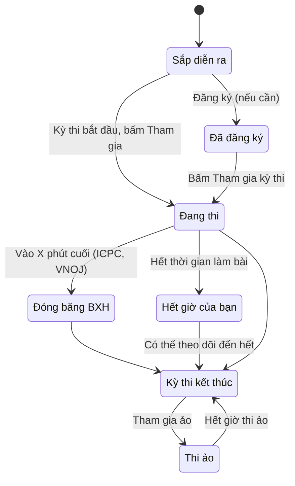

# Tham gia kỳ thi

> Cách tìm kỳ thi trên LCOJ, đăng ký và vào thi, nộp bài trong giờ thi, đọc bảng xếp hạng, thi ảo sau khi kỳ thi kết thúc và cách rating được cập nhật.
>
> ⏱ ~15 phút · 👤 Học sinh, thí sinh · 🔑 Cần tài khoản LCOJ đã đăng nhập (khách chỉ xem được danh sách và bảng xếp hạng công khai)

## Trước khi bắt đầu

- [ ] Đã **đăng nhập** (xem [Tài khoản và đăng nhập](/learn/account)). Khách thấy nút **Đăng nhập để tham gia** thay cho nút vào thi.
- [ ] Đã quen với việc [nộp bài và đọc kết quả chấm](/learn/submissions).
- [ ] Kiểm tra **múi giờ** trong **Chỉnh sửa hồ sơ**. Mọi giờ bắt đầu, kết thúc trên trang đều hiện theo múi giờ này.
- [ ] Với kỳ thi của một tổ chức (lớp, trường, câu lạc bộ): đã là thành viên của tổ chức đó.

## Vòng đời một lần tham gia

## Tìm kỳ thi

Mở mục kỳ thi trên thanh điều hướng, hoặc vào thẳng `https://luyencode.net/contests/`. Trang **Các kỳ thi** chia thành các phần:

| Phần | Nội dung |
|---|---|
| **Các kỳ thi đang tham gia** | Kỳ thi bạn đã vào và còn thời gian làm bài, kèm đồng hồ **Thời gian làm bài kết thúc trong ...** hoặc **Kết thúc trong ...** |
| **Các kỳ thi đang diễn ra** | Kỳ thi đã bắt đầu, chưa kết thúc. Có nút **Tham gia**, hoặc **Đăng ký** nếu kỳ thi yêu cầu đăng ký |
| **Các kỳ thi sắp tới** | Kỳ thi chưa bắt đầu, kèm **Bắt đầu trong ...** và nút **Đăng ký** nếu có |
| **Các kỳ thi đã qua** | Kỳ thi đã kết thúc, 20 kỳ thi mỗi trang, có ô **Tìm kỳ thi...** (tìm theo mã hoặc tên) và nút **Tham gia ảo** |

Mỗi kỳ thi hiện tên, thời gian, độ dài và các nhãn như **riêng tư** (chỉ một số người xem được), **rated** (có tính rating) hoặc tên tổ chức. Cột **Thành viên** là số người đã tham gia; số trong ngoặc là số lượt thi ảo.

Các công cụ khác trên trang:

- Ô **Ẩn các kỳ thi riêng tư**: ẩn các kỳ thi dành riêng cho tổ chức. Lựa chọn được nhớ trong phiên đăng nhập.
- Tab **Lịch**: xem kỳ thi theo tháng (`/contests/<năm>/<tháng>/`). Liên kết **Export** tải file lịch `contests.ics` để thêm vào Google Calendar hoặc ứng dụng lịch khác.
- Bấm vào một **thẻ** (tag) cạnh tên kỳ thi để xem mọi kỳ thi cùng thẻ (`/contests/tag/<tên thẻ>`).

## Trang kỳ thi

Mỗi kỳ thi có trang riêng `https://luyencode.net/contest/<mã kỳ thi>`, với các tab:

| Tab | Nội dung |
|---|---|
| **Thông tin** | Mô tả, thời gian, đồng hồ đếm ngược, danh sách bài, **Thông báo** và **Làm rõ** |
| **Bảng xếp hạng** | Bảng xếp hạng. Nếu bảng bị ẩn với bạn, tab đổi thành **Hidden Rankings** và không bấm được |
| **Bảng xếp hạng chính thức** | Chỉ có khi ban tổ chức nhập bảng xếp hạng chính thức từ bên ngoài |
| **Các bài nộp** | Bài nộp trong kỳ thi |

Nút tham gia nằm ở cuối hàng tab và đổi theo tình huống: **Tham gia kỳ thi**, **Đăng ký**, **Rời khỏi kỳ thi**, **Theo dõi kỳ thi**, **Ngừng theo dõi** hoặc **Tham gia ảo**.

Nếu ban tổ chức bật phần tóm tắt cài đặt, tab **Thông tin** còn cho biết kỳ thi có tính rating không, có chấm từng phần, có dùng pretest, có giới hạn số lần nộp, định dạng kỳ thi là gì, bảng xếp hạng có bị ẩn không và có cần mã truy cập không. Đọc kỹ phần này trước khi vào thi.

::: info Danh sách bài chỉ hiện khi bạn đang thi
Phần **Danh sách bài** trên tab **Thông tin** chỉ hiện khi bạn **đã vào kỳ thi**, hoặc khi kỳ thi **đã kết thúc**. Trước đó bạn chỉ thấy mô tả và thời gian.
:::

## Ai được vào kỳ thi

| Loại kỳ thi | Ai xem và vào được | Bạn sẽ thấy gì nếu không đủ điều kiện |
|---|---|---|
| **Mở** | Mọi người dùng đã đăng nhập | |
| **Cần đăng ký** | Người đăng ký trong khoảng thời gian đăng ký. Nếu hạn đăng ký còn mở khi kỳ thi đã bắt đầu, bạn vẫn vào thẳng được | Hết hạn đăng ký mà chưa đăng ký: trong danh sách hiện *Registration closed*, bấm vào thi thì báo **Not registered** |
| **Có mã truy cập** | Người nhập đúng mã do ban tổ chức cung cấp | Trang hỏi **Hãy nhập mã truy cập của bạn:**; nhập sai báo **Wrong access code.** |
| **Có điều khoản** | Người tích ô **I agree to the terms and conditions** | Không tích thì không vào được |
| **Riêng cho tổ chức** | Thành viên của tổ chức được chỉ định | Trang từ chối truy cập, ghi tên tổ chức được phép vào |
| **Riêng cho một số người** | Những người có tên trong danh sách thí sinh | **Kỳ thi dành riêng cho một số người dùng nhất định.** |
| **Đang ẩn** | Chỉ ban tổ chức và người thử đề | **Không có kỳ thi nào** |

Mã truy cập và điều khoản được hỏi **mỗi lần** bạn bấm vào thi hoặc đăng ký, kể cả khi thi ảo. Người bị ban tổ chức cấm tham gia (ví dụ do gian lận) nhận thông báo **Không thể tham gia**.

## Đăng ký và vào thi

### Đăng ký trước (nếu kỳ thi yêu cầu)

1. Chờ tới khi mở đăng ký. Trước đó danh sách hiện **Registration opens in ...**.
2. Bấm **Đăng ký** trong danh sách hoặc trên trang kỳ thi, xác nhận hộp thoại. Nhập mã truy cập hoặc đồng ý điều khoản nếu được hỏi.
3. Danh sách chuyển sang *Already registered*. Việc đăng ký **không** bắt đầu tính giờ làm bài.

### Vào thi

1. Khi kỳ thi đã bắt đầu, mở trang kỳ thi và bấm **Tham gia kỳ thi** (hoặc **Tham gia** trong danh sách). Với kỳ thi đã đóng đăng ký, danh sách chỉ ghi *Already registered* mà không có nút, nên hãy vào thẳng trang kỳ thi.
2. Hộp thoại nhắc: *Truy cập vào một kỳ thi lần đầu tiên sẽ bắt đầu việc đếm ngược thời gian kì thi và không thể dừng lại được.* Bấm **OK**.
3. Nhập mã truy cập hoặc đồng ý điều khoản nếu được hỏi, rồi bấm **Tham gia kỳ thi**.
4. Thanh thông tin kỳ thi xuất hiện ngay dưới thanh điều hướng, trên mọi trang: tên kỳ thi, thời gian còn lại và liên kết **Tới bảng xếp hạng**.

::: warning Mỗi lúc chỉ ở trong một kỳ thi
Vào một kỳ thi khác (kể cả thi ảo hay theo dõi) sẽ tự động **rời** kỳ thi hiện tại. Hộp thoại xác nhận sẽ báo điều này trước khi bạn đồng ý.
:::

## Khung giờ làm bài

LCOJ có hai kiểu kỳ thi theo thời gian:

| Kiểu | Trang kỳ thi ghi | Thời gian của bạn |
|---|---|---|
| **Giờ cố định** | *&lt;độ dài&gt; tính từ &lt;giờ bắt đầu&gt;* | Mọi người thi cùng lúc, từ giờ bắt đầu tới giờ kết thúc của kỳ thi. Vào muộn thì bị mất phần thời gian đã trôi qua |
| **Khung giờ riêng** (window) | *&lt;thời lượng&gt; giữa &lt;giờ mở&gt; và &lt;giờ đóng&gt;* | Đồng hồ **riêng của bạn** bắt đầu chạy khi bạn bấm vào thi lần đầu, và dừng khi hết thời lượng **hoặc** khi kỳ thi đóng, tùy điều nào tới trước |

::: danger Kỳ thi khung giờ riêng: đừng vào quá muộn
Nếu kỳ thi cho 3 giờ làm bài nhưng bạn vào khi chỉ còn 1 giờ nữa là kỳ thi đóng, bạn chỉ có 1 giờ. Đồng hồ cũng **không dừng** khi bạn rời kỳ thi hay tắt máy.
:::

Trên tab **Thông tin**, dòng trạng thái cho biết bạn đang ở đâu: **Bạn còn lại ... thời gian.**, **Thời gian làm bài của bạn đã hết! Kỳ thi sẽ kết thúc sau ...**, **Kỳ thi đã kết thúc.** hoặc **Đang tham gia ảo, còn lại ... thời gian.**

## Nộp bài trong kỳ thi

Cách nộp giống hệt khi luyện tập (xem [Nộp bài và chấm bài](/learn/submissions)). Những điểm khác:

- **Chỉ bài nộp khi bạn đang ở trong kỳ thi mới được tính.** Nếu đã bấm **Rời khỏi kỳ thi**, bài nộp sau đó không vào bảng xếp hạng. Hãy chắc chắn thanh thông tin kỳ thi đang hiện ở đầu trang.
- **Giới hạn số lần nộp**: một số bài chỉ cho nộp tối đa N lần. Số lần còn lại hiện dưới nút nộp bài. Vượt quá sẽ báo **Quá nhiều bài nộp**. Bài bị lỗi hệ thống (`IE`) không bị tính.
- **Pretest**: nếu kỳ thi dùng pretest, bài chỉ được chấm trên một phần nhỏ bộ test trong giờ thi. Sau kỳ thi, ban tổ chức chấm lại toàn bộ trên bộ test đầy đủ, nên điểm cuối cùng có thể thấp hơn.
- **Bài nộp của người khác**: trong giờ thi, tab **Các bài nộp** thường chỉ hiện bài của chính bạn. Sau khi kỳ thi kết thúc (và bảng xếp hạng không còn đóng băng), bạn xem được bài của mọi người.
- **Cách tính điểm và phạt** (điểm từng phần, thời gian phạt, số lần sai...) phụ thuộc định dạng kỳ thi. Xem [Các định dạng kỳ thi](/organize/contest-formats).

### Hỏi đáp và thông báo trong giờ thi

- **Gửi thắc mắc**: trên trang đề, trong giờ thi, nút **Báo cáo vấn đề** đổi thành **Gửi thắc mắc**. Câu hỏi được gửi thẳng tới ban tổ chức kỳ thi dưới dạng ticket.
- **Làm rõ**: câu trả lời chung cho mọi thí sinh hiện ở mục **Làm rõ** trên trang kỳ thi và trên trang đề bài liên quan.
- **Thông báo**: ban tổ chức đăng ở mục **Thông báo** trên tab **Thông tin**. Nếu kỳ thi bật thông báo đẩy, thí sinh và người theo dõi nhận thêm thông báo bật lên ngay trên trang.
- **Bình luận** trên trang kỳ thi và trang đề thường bị khóa trong giờ thi, để thí sinh không trao đổi lời giải.

## Rời và vào lại kỳ thi

- Bấm **Rời khỏi kỳ thi** để quay về chế độ luyện tập bình thường. Thanh thông tin kỳ thi biến mất.
- Muốn quay lại, mở trang kỳ thi và bấm **Tham gia kỳ thi**. Bạn được nối lại đúng lượt thi cũ, **thời gian vẫn tính tiếp** từ lần vào đầu tiên.
- Khi thời gian làm bài của bạn hết, hệ thống tự đưa bạn ra khỏi kỳ thi. Nếu kỳ thi vẫn đang diễn ra, nút đổi thành **Theo dõi kỳ thi**.

## Bảng xếp hạng

Mở tab **Bảng xếp hạng**, hoặc bấm **Tới bảng xếp hạng** trên thanh thông tin kỳ thi. Mỗi dòng gồm hạng, tên người dùng (tô màu theo rating), tổng điểm (và thời gian phạt, tùy định dạng) và kết quả từng bài.

Các tùy chọn phía trên bảng:

| Tùy chọn | Tác dụng |
|---|---|
| **Hiển thị tên/tổ chức** | Hiện họ tên và tổ chức cạnh tên người dùng |
| **Lọc** | Chỉ hiện thí sinh thuộc các tổ chức đã chọn |
| **Hiển thị xếp hạng của virtual** | Hiện cả các lượt thi ảo, xếp chung với thí sinh chính thức |
| **Show ghost participations** | Chỉ có ở một số kỳ thi. Xem mục **Phát lại diễn biến kỳ thi** bên dưới |
| **Tải bảng xếp hạng dưới dạng CSV** | Tải bảng về dạng CSV (không có với định dạng ICPC) |

Với định dạng ICPC, bảng có chú thích **Màu ô**: **Giải đầu tiên**, **Đã giải**, **Đã thử, sai**, **Đã thử, đang chấm**, **Chưa thử**. Thí sinh bị truất quyền luôn nằm cuối bảng.

### Khi bảng xếp hạng bị ẩn hoặc đóng băng

| Tình huống | Bạn thấy gì |
|---|---|
| Ẩn **trong suốt kỳ thi** | Trong giờ thi, bạn chỉ thấy dòng của mình với hạng `???`. Bảng đầy đủ hiện khi kỳ thi kết thúc |
| Ẩn **tới khi hết giờ làm bài của bạn** | Như trên, nhưng bảng đầy đủ hiện ngay khi thời gian của bạn hết |
| **Luôn ẩn** | Chỉ ban tổ chức xem được bảng đầy đủ |
| **Đóng băng** (chỉ ICPC và VNOJ) | Trên bảng xếp hạng, bài nộp trong X phút cuối hiện là **đang chấm**. Trang ghi rõ *Bảng điểm đã được đóng băng khi còn lại X phút...*. Bảng **vẫn đóng băng sau khi kỳ thi kết thúc**, cho tới khi ban tổ chức công bố kết quả |
| **Lưu tạm** (cache) | Trang báo bảng được lưu trong N giây, nên bài vừa nộp có thể chậm xuất hiện |

Ban tổ chức cũng có thể chia sẻ một đường dẫn xem bảng xếp hạng công khai dạng `/contest/<mã kỳ thi>/public_ranking/?code=<mã>`, dùng được cả khi bảng đang ẩn.

### Bảng xếp hạng chính thức

Với kỳ thi tổ chức ở nơi khác (ví dụ kỳ thi chấm bằng hệ thống riêng rồi đưa lên LCOJ), ban tổ chức có thể nhập kết quả chính thức. Khi đó có thêm tab **Bảng xếp hạng chính thức**, chỉ hiện tổng điểm và điểm từng bài theo dữ liệu được nhập.

### Phát lại diễn biến kỳ thi

Sau khi một kỳ thi **công khai** kết thúc, nếu bảng xếp hạng hiển thị và không bị đóng băng, và định dạng không phải IOI, phía trên bảng xếp hạng có thanh phát lại:

- Kéo thanh trượt để xem bảng xếp hạng **tại bất kỳ thời điểm nào** trong kỳ thi. Nhãn bên cạnh ghi thời điểm đang xem / tổng thời lượng.
- Bấm **End** để về bảng lúc kết thúc.
- Với ICPC và VNOJ có thêm ô **Freeze min** để thử xem bảng trông thế nào nếu đóng băng N phút cuối.
- Không phát lại được khi đang bật **Hiển thị xếp hạng của virtual**.

Một số kỳ thi có thêm **lượt thi "bóng ma"** (ghost): kết quả của thí sinh ở một kỳ thi khác cùng bộ đề, được ban quản trị ghép vào để so sánh. Bật **Show ghost participations** để hiện họ. Tên bóng ma có biểu tượng riêng và không có liên kết.

## Theo dõi kỳ thi

**Theo dõi** (spectate) cho phép xem kỳ thi đang diễn ra mà không thi đấu. Thanh thông tin kỳ thi ghi **spectating** và tab **Thông tin** ghi **Đang theo dõi, kỳ thi sẽ kết thúc trong ...**. Người theo dõi không xuất hiện trên bảng xếp hạng.

Bạn có nút **Theo dõi kỳ thi** trong hai trường hợp:

- Bạn là tác giả, người quản lý hoặc người thử đề của kỳ thi. Những người này chỉ được theo dõi, không được thi chính thức.
- Thời gian làm bài của bạn đã hết nhưng kỳ thi vẫn đang diễn ra.

Bấm **Ngừng theo dõi** để thoát.

## Thi ảo sau khi kỳ thi kết thúc

**Tham gia ảo** (virtual) cho phép bạn thi lại một kỳ thi đã kết thúc như thể đang thi thật: cùng bộ đề, có đồng hồ đếm ngược.

1. Mở kỳ thi trong phần **Các kỳ thi đã qua** và bấm **Tham gia ảo** (hoặc nút cùng tên trên trang kỳ thi).
2. Đồng hồ bắt đầu ngay. Thời lượng bằng khung giờ riêng của kỳ thi, hoặc bằng độ dài toàn bộ kỳ thi nếu kỳ thi có giờ cố định.
3. Nộp bài như bình thường. Tab **Thông tin** ghi **Đang tham gia ảo, còn lại ... thời gian.**
4. Hết giờ hoặc bấm **Rời khỏi kỳ thi** để kết thúc.

Những điều cần biết:

- Bạn có thể thi ảo **nhiều lần**. Mỗi lần là một lượt thi ảo mới, bắt đầu lại từ đầu.
- Lượt thi ảo **không tính rating** và mặc định không hiện trên bảng xếp hạng. Người xem phải bật **Hiển thị xếp hạng của virtual** mới thấy.
- Ở kỳ thi phát lại được, bảng xếp hạng trong lúc bạn thi ảo đặt **bạn cạnh các thí sinh thật tại cùng thời điểm** trong kỳ thi, tự cập nhật mỗi 30 giây. Nút **Live** đưa bảng về thời điểm hiện tại của bạn.
- Một số kỳ thi tắt tính năng này. Khi đó sẽ không có nút **Tham gia ảo**, hoặc trang báo **Kỳ thi này không cho phép tham gia ảo.**

## Rating

Kỳ thi có nhãn **rated** sẽ làm thay đổi **rating** của thí sinh. Tab **Thông tin** ghi rõ kỳ thi tính rating cho ai, ví dụ chỉ những người nộp ít nhất một bài, hoặc chỉ người có rating trong một khoảng nhất định.

- Chỉ lượt thi **chính thức** được tính. Thi ảo và theo dõi không ảnh hưởng rating.
- Rating **không cập nhật ngay** khi kỳ thi kết thúc. Người có quyền quản lý rating sẽ chạy việc tính rating, thường sau khi đã chấm lại và chốt kết quả.
- Sau khi tính, rating mới hiện trên hồ sơ (**Rating:**, **Lịch sử rating**), trên bảng xếp hạng người dùng, và tên bạn đổi màu theo mức rating.

## Câu hỏi thường gặp

| Tình huống | Giải thích và cách xử lý |
|---|---|
| Không thấy kỳ thi trong danh sách | Kỳ thi có thể đang ẩn, riêng cho tổ chức hoặc riêng cho một số người. Kiểm tra bạn đã vào đúng tổ chức, và bỏ tích **Ẩn các kỳ thi riêng tư** |
| Bấm vào thi thì báo **Not registered** | Kỳ thi yêu cầu đăng ký và hạn đăng ký đã qua. Liên hệ ban tổ chức |
| Báo **Kỳ thi đang không diễn ra** | Kỳ thi chưa bắt đầu. Chờ tới giờ, hoặc **Đăng ký** trước nếu có nút |
| Không thấy danh sách bài | Bạn chưa vào kỳ thi. Bấm **Tham gia kỳ thi** |
| Bài nộp không hiện trên bảng xếp hạng | Kiểm tra bạn **đang ở trong** kỳ thi lúc nộp. Nếu bảng đang lưu tạm hoặc đóng băng, hãy chờ |
| Hạng hiện `???` | Bảng xếp hạng đang ẩn với thí sinh. Kết quả hiện khi kỳ thi hoặc thời gian của bạn kết thúc |
| Tab **Hidden Rankings** không bấm được | Bảng xếp hạng bị ẩn và bạn chưa tham gia kỳ thi này |
| Đồng hồ vẫn chạy dù đã rời kỳ thi | Đúng như thiết kế: thời gian tính từ lần vào đầu tiên và không dừng |
| Điểm sau kỳ thi thấp hơn lúc thi | Kỳ thi dùng pretest, hoặc ban tổ chức đã chấm lại bài. Xem lại bài nộp trên bộ test đầy đủ |
| Kỳ thi đã kết thúc nhưng rating chưa đổi | Rating được tính thủ công sau kỳ thi. Chờ ban tổ chức công bố |
| Muốn luyện lại một kỳ thi cũ | Dùng **Tham gia ảo**, hoặc mở từng bài nếu bài đã được công khai |

## Tiếp theo

- [Các định dạng kỳ thi](/organize/contest-formats): cách tính điểm, phạt và xếp hạng của từng định dạng.
- [Nộp bài và chấm bài](/learn/submissions): đọc kết quả chấm, pretest và giới hạn nộp bài.
- [Tổ chức kỳ thi đầu tiên](/tutorials/first-contest): khi bạn muốn tự tạo một kỳ thi.
