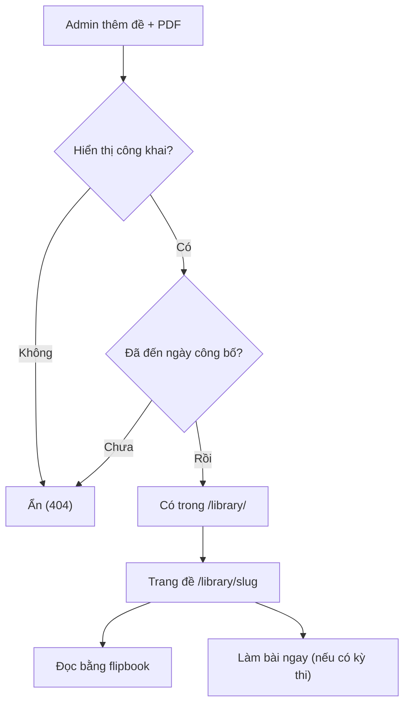
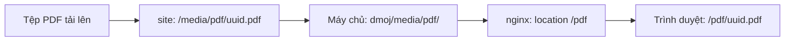

# Thư viện đề thi

> Tìm và đọc đề thi chính thức (PDF) ngay trên trình duyệt, vào làm bài nếu đề có kỳ thi; và cách quản trị viên đăng, hẹn giờ, lưu trữ đề.
>
> ⏱ ~5 phút (người đọc) · ~20 phút (quản trị viên) · 👤 Học sinh, giáo viên, quản trị viên · 🔑 Đọc: không cần đăng nhập; quản lý: tài khoản staff có quyền trên "Tài nguyên"

Thư viện đề thi (`/library/`) là nơi LCOJ lưu các đề thi chính thức dưới dạng PDF: đề học sinh giỏi, Tin học trẻ, đề vào 10 chuyên Tin… Người đọc lật từng trang đề ngay trên trình duyệt bằng trình xem dạng sách (flipbook). Nếu đề đã gắn với một kỳ thi, người đọc bấm một nút là vào làm bài và được chấm tự động.

Trang này gồm hai phần:

- **[Phần 1 – Dành cho người đọc](#readers)**: tìm đề, lọc đề, đọc đề bằng flipbook.
- **[Phần 2 – Dành cho quản trị viên](#admins)**: thêm đề, tải PDF lên, hẹn giờ đăng, quản lý danh mục, lưu trữ và xử lý sự cố.



---

## Phần 1 – Dành cho người đọc {#readers}

### 1.1. Tìm đề trong thư viện {#browse}

⏱ 2 phút · 👤 Học sinh, giáo viên, khách · 🔑 Không cần đăng nhập

#### Trước khi bắt đầu

- Thư viện mở công khai, không cần tài khoản.
- Mở trực tiếp địa chỉ `/library/` (ví dụ `https://luyencode.net/library/`). Menu điều hướng mặc định của LCOJ **không** có sẵn mục Thư viện; tuỳ quản trị viên có thêm vào hay không.

#### Các bước

1. Mở `/library/`. Đầu trang có tiêu đề **"Thư viện đề thi"** cùng bốn con số: "đề thi đã đăng", "nhóm kỳ thi", "tỉnh/thành phố" và "đề có chấm tự động".
2. Gõ từ khoá vào ô **"Tìm theo tên đề hoặc mô tả..."** rồi bấm **"Tìm kiếm"**. Hệ thống tìm trong cả tên đề lẫn phần mô tả, không phân biệt hoa thường.
3. Chọn một tab nhóm đề ngay dưới ô tìm kiếm, ví dụ "HSG Tỉnh/TP" hay "Đề vào 10 chuyên". Tab **"Tất cả"** hiện mọi đề. Mỗi tab có kèm số đề; nhóm nào chưa có đề được đăng thì không hiện tab.
4. Chọn tỉnh/thành trong ô **"Tất cả tỉnh/thành phố"**. Danh sách tự tải lại ngay khi bạn chọn.
5. Chọn năm trong ô **"Tất cả năm"**. Ô này chỉ liệt kê những năm đang có đề.
6. Xem kết quả ở bên phải thanh lọc (ví dụ "Tìm thấy 12 đề thi"). Muốn bỏ hết bộ lọc thì bấm **"Xóa bộ lọc"**.
7. Kéo xuống cuối trang để chuyển trang. Mỗi trang hiện 12 đề, mới nhất (theo ngày công bố) ở trên.

Các bộ lọc cộng dồn với nhau: tìm kiếm, nhóm, tỉnh và năm có thể dùng cùng lúc, và vẫn được giữ khi bạn chuyển trang.

::: tip Chia sẻ một danh sách đã lọc
Bộ lọc nằm ngay trên địa chỉ trang, nên bạn có thể gửi link cho người khác:

| Tham số | Ý nghĩa | Ví dụ |
|---|---|---|
| `q` | Từ khoá tìm trong tên đề và mô tả | `?q=tin học trẻ` |
| `category` | Slug của nhóm đề | `?category=hsg-tinh-tp` |
| `province` | Mã tỉnh/thành | `?province=ha_noi` |
| `year` | Năm thi (phải là số; giá trị khác bị bỏ qua) | `?year=2024` |

Ví dụ: `/library/2?category=de-vao-10-chuyen&province=tp_ho_chi_minh` là trang 2 của đề vào 10 chuyên tại TP. Hồ Chí Minh.
:::

#### Đọc thẻ đề

Mỗi đề trong danh sách là một thẻ gồm:

- Nhãn nhóm đề (có màu) và năm thi.
- Tên đề. Bấm vào tên (hoặc chỗ bất kỳ trên thẻ) để mở trang đề.
- Nhãn tỉnh/thành, và nhãn **"Đề đầy đủ bản PDF"** nếu đề có tệp PDF.
- Đoạn trích mô tả, tối đa 140 ký tự.
- Nút **"Làm bài ngay"** nếu đề có kỳ thi luyện tập, ngược lại là nhãn **"Mới có đề, chưa chấm"**.

#### Kiểm tra kết quả

- Số trong dòng "Tìm thấy N đề thi" khớp với số thẻ trên các trang.
- Khi chọn một tab, tab đó được tô đậm và địa chỉ trang có thêm `category=…`.

#### Xử lý sự cố

| Triệu chứng | Cách khắc phục |
|---|---|
| "Không tìm thấy đề thi." | Bấm "Xóa bộ lọc", hoặc tìm bằng từ khoá ngắn hơn. |
| Không thấy tab của nhóm mình cần | Nhóm đó chưa có đề nào được đăng công khai. |
| Ô năm không có năm cần tìm | Chưa có đề công khai nào của năm đó. |
| Đề mình biết là có nhưng không hiện | Có thể đề đang bị ẩn hoặc chưa đến ngày công bố. Hãy liên hệ quản trị viên. |

#### Tiếp theo

Mở một đề để đọc: xem [1.2. Đọc đề bằng flipbook](#flipbook).

### 1.2. Đọc đề bằng flipbook {#flipbook}

⏱ 5 phút · 👤 Học sinh, giáo viên, khách · 🔑 Không cần đăng nhập

#### Trước khi bắt đầu

- Dùng trình duyệt hiện đại có bật JavaScript (Chrome, Edge, Firefox, Safari bản mới).
- Trang đề có địa chỉ dạng `/library/<slug>`, ví dụ `/library/hsg-ha-noi-2024`.

#### Các bước

1. Bấm vào một thẻ đề trong thư viện để mở trang đề.
2. Xem phần đầu trang: nhóm đề, tỉnh/thành, năm và dòng "Đăng ngày …".
3. Cuộn xuống khung flipbook. Trình xem chỉ bắt đầu tải khi khung sắp lọt vào màn hình; trong lúc chờ sẽ có dòng **"Đang tải tài liệu…"**. Trang 1 hiện trước, các trang sau được xử lý dần ở nền.
4. Lật trang bằng cách bấm vào mép trái/phải của trang, hoặc kéo góc trang như lật sách thật. Trên điện thoại thì vuốt.
5. Dùng thanh công cụ ở góc trên bên phải khung đề:

   | Nút (biểu tượng) | Tác dụng |
   |---|---|
   | Kính lúp dấu trừ | Thu nhỏ, mỗi lần 0,25×, nhỏ nhất 1× |
   | Kính lúp dấu cộng | Phóng to, mỗi lần 0,25×, lớn nhất 2,5×. Khi đã phóng to, khung có thanh cuộn để xem phần bị khuất |
   | Loa | Bật/tắt tiếng lật trang. Lựa chọn được trình duyệt ghi nhớ cho các lần sau |
   | Mũi tên mở rộng | Xem toàn màn hình (nền tối). Bấm lại hoặc nhấn `Esc` để thoát |

6. Đọc phần mô tả bên dưới flipbook (nếu có).
7. Nếu đề có kỳ thi, bấm **"Làm bài ngay"** (ở đầu trang hoặc ở khung **"Bạn đã sẵn sàng tự làm thử chưa?"** cuối trang) để vào kỳ thi, nộp bài và nhận kết quả.
8. Bấm **"Quay lại thư viện"** để trở về danh sách.

::: details Flipbook hiển thị thế nào trên máy tính và điện thoại?
- **Máy tính, màn hình rộng**: hiện hai trang cạnh nhau như một cuốn sách mở. Trang đầu và trang cuối (bìa) hiện riêng một trang, căn giữa.
- **Màn hình hẹp** (khung đề hẹp hơn khoảng 600px, thường là điện thoại): ưu tiên hiện một trang mỗi lần.
- Kích thước sách được tính cho vừa chiều cao cửa sổ. Khi vào hoặc thoát toàn màn hình, sách được dựng lại cho vừa màn hình mới.
- Flipbook **không có phím tắt**; hãy dùng chuột, cảm ứng và các nút trên thanh công cụ.
- Chú thích khi rê chuột lên các nút thanh công cụ hiện đang là tiếng Anh ("Zoom out", "Zoom in", "Toggle sound", "Fullscreen").
:::

::: warning Không có nút tải PDF
Trang đề không có nút tải về. Liên kết **"Tải PDF"** chỉ xuất hiện khi trình duyệt tắt JavaScript hoặc không tải được thư viện hiển thị. Nếu không đọc được bản PDF, flipbook hiện liên kết **"Không thể tải xem trước — tải PDF"** để bạn mở thẳng tệp.
:::

#### Kiểm tra kết quả

- Thấy trang 1 của đề và thanh công cụ ở góc trên bên phải.
- Lật trang có hiệu ứng và tiếng lật (nếu chưa tắt tiếng).

#### Xử lý sự cố

| Triệu chứng | Cách khắc phục |
|---|---|
| Kẹt ở "Đang tải tài liệu…" | Tệp lớn hoặc mạng chậm. Đợi thêm, hoặc tải lại trang. |
| Thấy link "Tải PDF" thay vì sách | Trình duyệt không tải được thư viện hiển thị (JavaScript bị tắt, bị chặn, trình duyệt quá cũ). Bấm link để mở PDF, hoặc đổi trình duyệt. |
| Thấy "Không thể tải xem trước — tải PDF" | Không đọc được tệp PDF. Bấm link để mở trực tiếp, rồi báo quản trị viên. |
| Trang đề báo 404 | Đề đã bị ẩn, chưa đến ngày công bố, hoặc sai địa chỉ. |
| Nút toàn màn hình không có tác dụng | Một số trình duyệt di động (ví dụ Safari trên iPhone) không cho một phần trang web chiếm toàn màn hình. Hãy xoay ngang máy hoặc phóng to. |
| Không có tiếng lật trang | Kiểm tra nút loa trên thanh công cụ và âm lượng máy. |
| Có trang đề nhưng không có flipbook | Đề chưa có tệp PDF, chỉ có mô tả. |
| Bấm "Làm bài ngay" bị báo lỗi hoặc 404 | Kỳ thi gắn với đề có thể là kỳ thi riêng tư bạn không có quyền xem. Hãy liên hệ quản trị viên. |

#### Tiếp theo

- Luyện tập trong kỳ thi gắn với đề qua nút "Làm bài ngay".
- Quay lại `/library/` để tìm đề cùng nhóm, cùng tỉnh hoặc cùng năm.

---

## Phần 2 – Dành cho quản trị viên {#admins}

Toàn bộ việc quản lý thư viện làm trong trang quản trị Django (`/admin/`), mục **Online Judge**:

| Mục trong admin (vi) | Mục trong admin (en) | Địa chỉ | Model |
|---|---|---|---|
| Tài nguyên | Resources | `/admin/judge/examstatement/` | `ExamStatement` (một đề) |
| Danh mục đề thi | Exam categories | `/admin/judge/examcategory/` | `ExamCategory` (nhóm đề) |

::: warning Tên mục dễ nhầm
Trong admin, đề thi mang tên **"Tài nguyên"** (tiếng Anh: "Resources"), không phải "Đề thi".
:::

### 2.1. Cấp quyền quản lý thư viện {#permissions}

⏱ 5 phút · 👤 Quản trị viên hệ thống · 🔑 Superuser

#### Trước khi bắt đầu

- Người được cấp quyền phải có tài khoản bật **staff status** mới vào được `/admin/`.
- Thư viện không có quyền riêng, chỉ dùng bốn quyền mặc định của Django cho mỗi model (xem [Hệ thống phân quyền](/admin/permissions)).

#### Các bước

1. Vào `/admin/auth/group/` và tạo nhóm, ví dụ "Library editors".
2. Thêm các quyền cần thiết cho nhóm:

   | Quyền (codename) | Cho phép |
   |---|---|
   | `judge.view_examstatement` / `judge.add_examstatement` / `judge.change_examstatement` / `judge.delete_examstatement` | Xem / thêm / sửa / xoá đề |
   | `judge.view_examcategory` / `judge.add_examcategory` / `judge.change_examcategory` / `judge.delete_examcategory` | Xem / thêm / sửa / xoá nhóm đề |

3. Thêm người dùng vào nhóm vừa tạo.
4. Đảm bảo tài khoản của họ có bật staff status.

::: tip
Người soạn đề thường chỉ cần quyền với đề, cùng `judge.view_examcategory` để chọn nhóm. Chỉ nên cho quyền sửa/xoá nhóm với người quản lý chung.
:::

#### Kiểm tra kết quả

- Người được cấp quyền đăng nhập `/admin/` và thấy mục "Tài nguyên" trong phần Online Judge.

#### Xử lý sự cố

| Triệu chứng | Cách khắc phục |
|---|---|
| Không vào được `/admin/` | Bật staff status cho tài khoản. |
| Không thấy mục "Tài nguyên" | Thiếu quyền `view`/`change` trên `examstatement`. |
| Ô "Contest" không tìm thấy kỳ thi cần gắn | Ô này chỉ liệt kê những kỳ thi mà chính người đang soạn xem được. Cần cấp quyền xem kỳ thi đó (ví dụ `see_private_contest`). |

#### Tiếp theo

[2.2. Thêm một đề thi](#add-exam).

### 2.2. Thêm một đề thi {#add-exam}

⏱ 5–10 phút · 👤 Quản trị viên, người soạn đề · 🔑 `judge.add_examstatement`

#### Trước khi bắt đầu

- Chuẩn bị tệp PDF của đề: đuôi phải là `.pdf`, dung lượng **tối đa 5 MB** (`PDF_STATEMENT_MAX_FILE_SIZE = 5242880`).
- Nếu muốn có nút "Làm bài ngay", hãy tạo kỳ thi luyện tập trước.
- Kiểm tra nhóm đề phù hợp đã có chưa (xem [2.4](#categories)).

#### Các bước

1. Vào `/admin/judge/examstatement/` và bấm nút thêm mới.
2. Nhập **Tiêu đề** (tối đa 100 ký tự). Ô **Slug** (chuỗi định danh ngắn, không dấu, dùng làm địa chỉ trang) tự điền theo tiêu đề (đã bỏ dấu).
3. Sửa lại **Slug** nếu cần. Slug phải là duy nhất, tối đa 50 ký tự, và sẽ thành địa chỉ trang đề `/library/<slug>`.
4. Chọn **Nhóm** (nhóm đề, bắt buộc).
5. Chọn **Tỉnh/thành phố** nếu là đề của một địa phương, không thì để trống.
6. Nhập **Năm** thi (không bắt buộc, từ 1990 đến năm sau năm hiện tại).
7. Viết **Mô tả** bằng Markdown (không bắt buộc).
8. Tìm và chọn kỳ thi luyện tập trong ô **Contest** (gõ mã hoặc tên kỳ thi).
9. Tick/bỏ tick **Hiển thị công khai**.
10. Đặt **Publish on** (ngày công bố) bằng bộ chọn ngày giờ. Để trống thì lấy thời điểm lưu.
11. Chọn tệp ở ô **Tệp PDF**.
12. Lưu.

Ý nghĩa từng trường:

| Trường (vi) | Trường (en) | Bắt buộc | Ý nghĩa |
|---|---|---|---|
| Tiêu đề | Title | Có | Tên đề, hiện trên thẻ, trang đề và tiêu đề tab trình duyệt. Tối đa 100 ký tự. |
| Slug | Slug | Có | Địa chỉ trang đề `/library/<slug>`. Duy nhất, tối đa 50 ký tự, chỉ gồm chữ không dấu, số, `-`, `_`. Tự điền từ tiêu đề. |
| Nhóm | Category | Có | Nhóm đề: quyết định tab và nhãn màu. |
| Tỉnh/thành phố | Province | Không | Chọn trong danh sách tỉnh/thành có sẵn. Dùng cho bộ lọc tỉnh. |
| Năm | Year | Không | Từ 1990 đến năm sau năm hiện tại. Dùng cho bộ lọc năm. |
| Mô tả | Description | Không | Markdown. Hiện dưới flipbook, được cắt thành đoạn trích 140 ký tự trên thẻ, được tìm kiếm, và đoạn văn đầu tiên dùng làm mô tả SEO. |
| Contest | Contest | Không | Kỳ thi luyện tập. Có kỳ thi thì hiện nút "Làm bài ngay". Nếu kỳ thi bị xoá, liên kết tự bỏ trống. |
| Hiển thị công khai | Publicly visible | — | Mặc định bật. Tắt thì đề biến khỏi danh sách và trang đề trả về 404. |
| Publish on | Publish on | Không | Ngày giờ công bố. Trước thời điểm này đề bị ẩn như đang tắt hiển thị. Cũng dùng để sắp xếp (mới nhất lên trên) và hiện ở dòng "Đăng ngày …". |
| Tệp PDF | PDF file | Không | Tệp tải lên (`.pdf`, ≤ 5 MB). Mỗi lần lưu có tệp mới là thay PDF của đề. |
| Đường dẫn PDF | PDF URL | — | Chỉ đọc. Hệ thống tự điền sau khi tải lên, dạng `/pdf/<uuid>.pdf`. |

::: warning Không nhập được link PDF ngoài, không xoá được PDF
Ô **Đường dẫn PDF** chỉ đọc, nên không thể trỏ đề tới PDF lưu ở nơi khác, cũng không thể gỡ PDF khỏi đề trong admin. Muốn thay PDF thì tải tệp mới lên; tệp cũ vẫn nằm trên đĩa.
:::

::: tip Hẹn giờ đăng đề
Để công bố đề đúng giờ (ví dụ ngay sau khi kỳ thi thật kết thúc), cứ bật **Hiển thị công khai** và đặt **Publish on** vào thời điểm đó. Đề tự xuất hiện khi đến giờ, không cần thao tác gì thêm.
:::

::: details Trang đề có sẵn SEO
- Trang danh sách có tiêu đề thay đổi theo bộ lọc (ví dụ "Đề vào 10 chuyên - Hà Nội - năm 2024 | Thư viện đề thi") và mô tả kèm số đề tìm được.
- Trang kết quả tìm kiếm (`?q=`) có `noindex, follow`; các trang lọc theo nhóm/tỉnh/năm vẫn được index.
- Cả hai loại trang có dữ liệu schema.org (JSON-LD): `CollectionPage`/`ItemList` cho danh sách, `LearningResource` cho trang đề, cùng `BreadcrumbList`.
- Mô tả SEO của trang đề lấy từ đoạn văn đầu tiên của **Mô tả** (không có thì dùng tiêu đề), ảnh chia sẻ lấy từ ảnh đầu tiên trong mô tả. Kết quả được **lưu cache 24 giờ**, nên sửa mô tả xong có thể phải đợi tới một ngày thẻ meta mới cập nhật.
- Hiện chưa có trang thư viện nào trong `sitemap.xml`.
:::

#### Kiểm tra kết quả

1. Mở `/library/`. Đề mới nằm đầu danh sách (nếu đã đến ngày công bố).
2. Thẻ đề có nhãn "Đề đầy đủ bản PDF", và nút "Làm bài ngay" nếu đã gắn kỳ thi.
3. Mở trang đề: flipbook tải được trang 1.
4. Mở thử `/pdf/<uuid>.pdf` (lấy từ ô Đường dẫn PDF). Trình duyệt phải hiện được tệp.

#### Xử lý sự cố

| Triệu chứng | Cách khắc phục |
|---|---|
| Lỗi "File quá lớn! Độ lớn tối đa của file là …" | Nén PDF (giảm độ phân giải ảnh) xuống dưới 5 MB. Giới hạn này đặt trong `PDF_STATEMENT_MAX_FILE_SIZE`. |
| Lỗi đuôi tệp không hợp lệ | Chỉ nhận tệp `.pdf`. |
| Lỗi "Năm thi phải nằm trong khoảng từ 1990 đến …" | Sửa năm cho đúng khoảng cho phép. |
| Lỗi slug đã tồn tại | Đổi slug, ví dụ thêm năm hoặc tỉnh vào cuối. |
| Lưu xong nhưng không thấy đề ở `/library/` | Kiểm tra **Hiển thị công khai** đã bật và **Publish on** không nằm trong tương lai. |
| Có đề nhưng không có flipbook | Chưa tải PDF (ô Đường dẫn PDF trống). |

#### Tiếp theo

- [2.3. Sửa, ẩn hoặc gỡ đề](#edit-exam)
- [2.5. Lưu trữ PDF và sao lưu](#storage)

### 2.3. Sửa, ẩn hoặc gỡ đề {#edit-exam}

⏱ 2 phút · 👤 Quản trị viên, người soạn đề · 🔑 `judge.change_examstatement` (xoá: `judge.delete_examstatement`)

#### Trước khi bắt đầu

- Danh sách đề trong admin có cột tiêu đề, nhóm, tỉnh, năm, kỳ thi, hiển thị, ngày công bố; có bộ lọc theo nhóm, tỉnh, năm, hiển thị; có thanh duyệt theo ngày công bố; và tìm được theo tiêu đề và mô tả.

#### Các bước

1. Vào `/admin/judge/examstatement/` và tìm đề cần sửa.
2. Bấm vào tiêu đề đề để mở form.
3. Muốn ẩn tạm thời: bỏ tick **Hiển thị công khai**, rồi lưu.
4. Muốn thay PDF: chọn tệp mới ở ô **Tệp PDF**, rồi lưu.
5. Muốn gỡ hẳn: dùng nút xoá trong form, rồi xác nhận.

::: warning Đổi slug làm hỏng link cũ
Slug chính là địa chỉ trang đề. Đổi slug thì mọi link đã chia sẻ trước đó sẽ trả về 404.
:::

#### Kiểm tra kết quả

- Đề đã ẩn hoặc xoá thì không còn trong `/library/`, và `/library/<slug>` trả về 404.
- Đề đã thay PDF thì ô Đường dẫn PDF có tên tệp mới.

#### Xử lý sự cố

| Triệu chứng | Cách khắc phục |
|---|---|
| Flipbook vẫn hiện PDF cũ | Tải lại trang bỏ qua cache (Ctrl+F5). Tệp mới có địa chỉ khác, nên chỉ cần trang HTML được tải lại. |
| Mô tả SEO vẫn là nội dung cũ | Cache 24 giờ; đợi hết hạn hoặc xoá cache Redis. |

#### Tiếp theo

[2.4. Quản lý nhóm đề](#categories).

### 2.4. Quản lý nhóm đề {#categories}

⏱ 3 phút · 👤 Quản trị viên · 🔑 `judge.add_examcategory` / `judge.change_examcategory`

#### Trước khi bắt đầu

Sau khi chạy migration, LCOJ có sẵn 8 nhóm:

| Thứ tự | Tên | Slug |
|---|---|---|
| 0 | HSG Tỉnh/TP | `hsg-tinh-tp` |
| 1 | HSG Quốc Gia | `hsg-quoc-gia` |
| 2 | Chọn đội tuyển quốc gia | `chon-doi-tuyen-quoc-gia` |
| 3 | Olympic quốc tế | `olympic-quoc-te` |
| 4 | Đề thi thử | `de-thi-thu` |
| 5 | Đề vào 10 chuyên | `de-vao-10-chuyen` |
| 6 | ICPC/OLP | `icpc-olp` |
| 7 | Khác | `khac` |

#### Các bước

1. Vào `/admin/judge/examcategory/`.
2. Bấm thêm mới, hoặc bấm vào một nhóm có sẵn để sửa.
3. Nhập tên nhóm (duy nhất, tối đa 40 ký tự). Trong admin tiếng Việt, ô này đang bị dịch nhầm thành **"Tên người dùng"**; tiếng Anh là "Name".
4. Kiểm tra **Slug** (tự điền từ tên, duy nhất, tối đa 50 ký tự). Slug này là giá trị `?category=` trên địa chỉ trang.
5. Đặt **Thứ tự**: số nhỏ hơn đứng trước. Nhóm cùng thứ tự được xếp theo tên.
6. Lưu.

::: tip Màu nhãn
Màu của nhãn nhóm được gán tự động theo vị trí của nhóm trong thứ tự sắp xếp (bảng 7 màu, lặp lại). Đổi thứ tự thì màu cũng đổi theo.
:::

#### Kiểm tra kết quả

- Tab của nhóm hiện ở `/library/` theo đúng thứ tự, **khi nhóm đã có ít nhất một đề công khai**.

#### Xử lý sự cố

| Triệu chứng | Cách khắc phục |
|---|---|
| Không xoá được nhóm | Nhóm vẫn còn đề (liên kết được bảo vệ). Chuyển các đề sang nhóm khác hoặc xoá chúng trước. |
| Nhóm mới không hiện tab | Nhóm chưa có đề công khai nào. |
| Link `?category=` cũ không còn lọc đúng | Slug nhóm đã bị đổi. Cập nhật lại link. |

#### Tiếp theo

[2.5. Lưu trữ PDF và sao lưu](#storage).

### 2.5. Lưu trữ PDF và sao lưu {#storage}

⏱ 5 phút · 👤 Người vận hành máy chủ · 🔑 Quyền truy cập máy chủ Docker

#### Trước khi bắt đầu

Đường đi của một tệp PDF:



- Tệp được đổi tên thành `<uuid>.pdf` và lưu vào `MEDIA_ROOT/pdf/` = `/media/pdf/` trong container `site` (`PDF_STATEMENT_UPLOAD_MEDIA_DIR = 'pdf'`).
- `/media/` là thư mục `dmoj/media/` trên máy chủ (bind mount trong `docker-compose.yml`), dùng chung cho `site` và `nginx`.
- nginx phục vụ trực tiếp tệp tại `/pdf/…` (`location /pdf { root /media/; }`). Địa chỉ lưu trong đề là địa chỉ tương đối `/pdf/<uuid>.pdf` (`PDF_STATEMENT_UPLOAD_URL_PREFIX = '/pdf'`), cùng tên miền với trang, nên không vướng CORS.
- Đây là cùng thư mục với PDF đề bài của các bài tập.

#### Các bước

1. Sao lưu thư mục `dmoj/media/pdf/` cùng với cơ sở dữ liệu. Chỉ có database thì đề còn nhưng mất PDF; chỉ có thư mục thì còn PDF nhưng không biết tệp nào của đề nào.
2. Khi chuyển máy chủ, chép `dmoj/media/` sang máy mới trước khi chạy `docker compose up -d`.

::: warning Tệp PDF cũ không tự bị xoá
Thay PDF hoặc xoá đề **không** xoá tệp trên đĩa. Thư mục `dmoj/media/pdf/` sẽ lớn dần. Nếu cần dọn, phải đối chiếu với cột `pdf_url` của các đề (và PDF của bài tập) trước khi xoá.
:::

#### Kiểm tra kết quả

```sh
cd lcoj-docker/dmoj
ls -lh media/pdf/ | tail
curl -I http://localhost:${NGINX_PORT:-8071}/pdf/<uuid>.pdf   # mong đợi 200, Content-Type: application/pdf
```

#### Tiếp theo

- Xem thêm [Vận hành LCOJ](/operate/operations) về sao lưu.

### 2.6. Thư viện hiển thị flipbook (PDF.js, StPageFlip) {#static-assets}

⏱ 10 phút · 👤 Người vận hành máy chủ · 🔑 Quyền truy cập máy chủ Docker và repo

#### Trước khi bắt đầu

Flipbook dùng các tệp tĩnh sau:

| Tệp | Nguồn |
|---|---|
| `lcoj/pdfjs/pdfjs-init.js`, `pdf.min.js`, `pdf.worker.min.js` (PDF.js) | Submodule `resources/lcoj` → repo [luyencode/lcoj-static](https://github.com/luyencode/lcoj-static) |
| `lcoj/pageflip/page-flip.browser.js` (StPageFlip) | Cùng submodule `resources/lcoj` |
| `flipbook.js`, `flipbook.scss`, `page-flip.mp3` | Nằm ngay trong `resources/` của lcoj-site |

Các thư viện này **không** nằm trong repo lcoj-site và không lấy từ CDN. Chúng nằm trong một submodule riêng, và được phục vụ từ `/static/`.

#### Các bước

1. Sau khi clone hoặc cập nhật mã, tải đủ submodule (kể cả submodule lồng trong `dmoj/repo`):

   ```sh
   cd lcoj-docker
   git submodule update --init --recursive
   ```

2. Kiểm tra các tệp đã có:

   ```sh
   ls dmoj/repo/resources/lcoj/pdfjs dmoj/repo/resources/lcoj/pageflip
   ```

3. Chép tệp tĩnh ra volume `assets` để nginx phục vụ:

   ```sh
   cd dmoj
   ./scripts/copy_static
   ```

4. Nếu có sửa cấu hình nginx, khởi động lại nginx: `docker compose restart nginx`.

#### Kiểm tra kết quả

- Mở `/static/lcoj/pdfjs/pdf.min.js` và `/static/lcoj/pageflip/page-flip.browser.js` trên trình duyệt: phải trả về mã JavaScript, không phải 404.
- Mở một trang đề có PDF: flipbook hiện được trang 1.

#### Xử lý sự cố

| Triệu chứng | Cách khắc phục |
|---|---|
| Sau khoảng 8 giây flipbook chỉ còn link "Tải PDF" | Không tải được PDF.js hoặc StPageFlip. Kiểm tra `/static/lcoj/...` có 404 không, chạy lại bước 1 và 3. |
| "Không thể tải xem trước — tải PDF" | PDF.js đã tải nhưng không đọc được tệp. Mở Console của trình duyệt, tìm dòng `[flipbook] failed to load`. Kiểm tra `/pdf/<uuid>.pdf` có trả về 200 không, và tệp có bị hỏng không. |
| `/pdf/<uuid>.pdf` trả về 404 | Tệp không có trong `dmoj/media/pdf/`, hoặc nginx thiếu `location /pdf`. Kiểm tra mount `./media/:/media/` của cả `site` và `nginx`. |
| Console báo lỗi tải `pdf.worker.min.js` | Worker được tải từ cùng thư mục với `pdfjs-init.js`. Đảm bảo `pdf.worker.min.js` đã được chép ra `/static/lcoj/pdfjs/`. |
| Flipbook trắng hoặc rất chậm với tệp nhiều trang | Mọi trang được vẽ thành ảnh ngay trên trình duyệt, từng trang một. Tệp nhiều trang hoặc nhiều ảnh nặng sẽ tốn bộ nhớ, nhất là trên điện thoại. Hãy tối ưu PDF (giảm độ phân giải ảnh, bỏ trang thừa). |
| Lỗi CORS trong Console | Chỉ xảy ra khi PDF nằm ở tên miền khác. Với cấu hình mặc định (PDF ở `/pdf/` cùng tên miền) thì không gặp. Kiểm tra `MEDIA_URL`/`SITE_FULL_URL` và reverse proxy phía trước có chuyển hướng sang tên miền khác không. |
| Tải lên báo lỗi 413 | Vượt `client_max_body_size 64M` của nginx. Không xảy ra với tệp ≤ 5 MB. |

#### Tiếp theo

- [Cài đặt LCOJ](/operate/installation)
- [Vận hành LCOJ](/operate/operations)

## Tiếp theo

- [Nộp bài và chấm bài](/learn/submissions): cách nộp lời giải khi vào làm bài từ nút "Làm bài ngay".
- [Tham gia kỳ thi](/learn/contests): cách kỳ thi luyện tập hoạt động.
- [Thiết lập kỳ thi](/organize/contest-setup): dành cho quản trị viên muốn tạo kỳ thi để gắn với đề.
