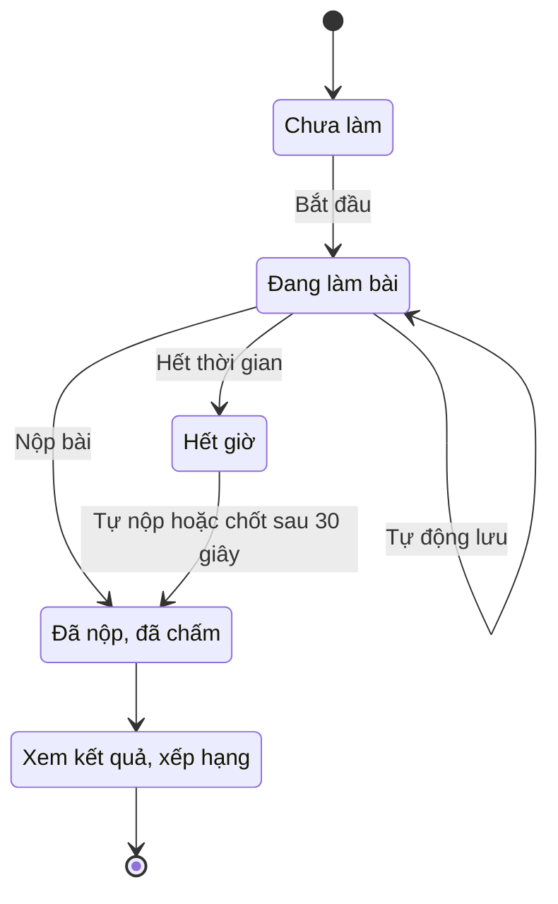

# Làm bài trắc nghiệm

> Hướng dẫn tìm bài kiểm tra trắc nghiệm trên LCOJ, làm bài, nộp bài, xem kết quả và bảng xếp hạng.
>
> ⏱ ~10 phút · 👤 Học sinh, người luyện tập · 🔑 Chỉ cần tài khoản LCOJ đã đăng nhập

## Trước khi bắt đầu

- [ ] Đã **đăng nhập**. Khách vẫn xem được danh sách và trang thông tin bài, nhưng phải đăng nhập mới bấm làm bài được.
- [ ] Dùng trình duyệt máy tính bản mới (Chrome, Edge, Firefox…) và mạng ổn định. Đáp án được lưu lên máy chủ ngay khi bạn chọn.
- [ ] Nếu bài dành riêng cho một **tổ chức** (lớp, trường, CLB), bạn phải là thành viên của tổ chức đó.
- [ ] Dành đủ thời gian. Với bài có giới hạn thời gian, đồng hồ chạy ngay khi bạn bấm bắt đầu và **không tạm dừng** kể cả khi bạn đóng tab.

## Vòng đời một lượt làm bài

Mỗi lần bấm bắt đầu tạo ra một **lượt làm bài**. Lượt đó được chấm tự động ngay khi nộp; điểm cao nhất của bạn được dùng để xếp hạng.

## Tìm bài kiểm tra

1. Bấm mục **Trắc nghiệm** trên thanh menu, hoặc mở thẳng `https://luyencode.net/quizzes/`. Trang có tiêu đề **Bài kiểm tra**.
2. Chọn tab trạng thái: **Tất cả**, **Sắp tới**, **Đang diễn ra** hoặc **Đã kết thúc**. Tab chỉ hiện khi có bài thuộc nhóm đó.
3. Muốn tìm theo tên hoặc mã bài, gõ vào ô **Tìm bài kiểm tra...** rồi bấm **Tìm** (hoặc Enter).
4. Đánh dấu **Ẩn đã làm** để ẩn những bài bạn đã nộp ít nhất một lần.
5. Bấm vào mã hoặc tên bài để mở trang thông tin.

Bảng danh sách có các cột:

| Cột | Ý nghĩa |
|---|---|
| **Mã** | Mã bài, cũng là một phần URL: `/quizzes/<mã>` |
| **Bài kiểm tra** | Tên bài, giờ mở/đóng (hoặc **Luôn mở**) và đồng hồ đếm ngược |
| **Câu hỏi** | Số câu trong bài |
| **Người tham gia** | Số người đã nộp ít nhất một lượt |
| **Điểm của bạn** | Điểm cao nhất của bạn, hoặc `—` nếu chưa nộp lượt nào |

::: tip
Danh sách hiện 50 bài mỗi trang. Bạn chỉ thấy những bài mình được phép truy cập. Bài dành riêng cho tổ chức mà bạn không tham gia sẽ không xuất hiện.
:::

## Đọc trang thông tin bài

Trang `/quizzes/<mã>` cho biết:

| Thông tin | Ý nghĩa |
|---|---|
| **Câu hỏi** | Số câu |
| **Điểm** | Tổng điểm tối đa |
| **Giới hạn thời gian:** | Số **phút** cho mỗi lượt. `∞` nghĩa là không giới hạn |
| **Số lần làm tối đa** | Số lượt được nộp. `∞` nghĩa là không giới hạn |
| **Bắt đầu:** / **Kết thúc:** | Khung giờ mở bài. **Không đặt — mở ngay** và **Không đặt — không có hạn** nghĩa là không giới hạn phía đó |
| Dải thông báo | **Bắt đầu trong …** (chưa mở), **Kết thúc trong …** (đang mở), hoặc thông báo bài đã đóng |
| **Lần làm bài của bạn** | Các lượt bạn đã làm, kèm điểm hoặc trạng thái **đang làm bài** |

Nút ở thanh hành động thay đổi theo tình huống:

| Bạn thấy | Nghĩa là |
|---|---|
| **Bắt đầu kiểm tra** (kèm "N lần làm còn lại") | Bạn có thể bắt đầu lượt mới |
| **Tiếp tục làm bài** | Bạn đang có một lượt dở dang. Bấm để quay lại đúng lượt đó |
| **Quiz not started yet.** | Bài chưa đến giờ mở |
| **Quiz is closed.** | Đã qua giờ kết thúc |
| **Không còn lượt làm bài.** | Bạn đã dùng hết số lượt |

::: info
Trang thông tin **không** cho biết trước chế độ hiển thị kết quả (chỉ điểm, đúng/sai, hay đầy đủ đáp án). Bạn chỉ biết sau khi nộp bài lượt đầu tiên. Xem phần [Xem kết quả](#xem-ket-qua).
:::

## Bắt đầu làm bài

1. Mở trang thông tin bài và bấm **Bắt đầu kiểm tra**.
2. Nếu bài bật giám sát, hộp thoại **Thông báo liêm chính học thuật** hiện ra. Đọc các quy tắc rồi bấm **Tôi hiểu, bắt đầu →**. Bấm **Huỷ** nếu chưa muốn làm; lúc này chưa có lượt nào được tạo.
3. Trang làm bài mở ra. Nếu bài có giới hạn thời gian, đồng hồ đếm ngược đã bắt đầu chạy.

::: warning Đồng hồ không dừng
Thời gian được tính từ lúc bấm bắt đầu. Đóng tab, tắt máy hay mất mạng đều **không** dừng đồng hồ.
:::

Thứ tự câu hỏi và thứ tự các lựa chọn có thể bị xáo trộn, tùy giáo viên cài đặt. Thứ tự đó được cố định cho lượt của bạn, nên tải lại trang vẫn giữ nguyên.

## Giám sát liêm chính

Khi giáo viên bật **giám sát liêm chính**, trang làm bài sẽ:

- Phủ một **hình mờ** lặp lại tên đăng nhập của bạn và giờ bắt đầu lượt làm.
- **Chặn sao chép** và **tắt chuột phải**.
- Hiện một thông báo nhỏ khoảng 4 giây (bằng tiếng Anh, ví dụ `⚠ Tab switch detected. This has been recorded.`) mỗi khi ghi nhận một sự kiện.

Các sự kiện được ghi lại:

| Sự kiện (giáo viên thấy) | Khi nào bị ghi nhận |
|---|---|
| **Chuyển tab** | Tab làm bài bị ẩn: chuyển tab khác, thu nhỏ trình duyệt |
| **Mất tiêu điểm cửa sổ** | Cửa sổ trình duyệt mất focus: bấm sang ứng dụng khác, Alt+Tab |
| **Mở DevTools** | Kích thước vùng hiển thị chênh lệch với cửa sổ hơn 160 px (dấu hiệu mở DevTools) |
| **Phím PrintScreen** | Bấm phím PrintScreen |
| **Sao chép bài làm** | Thử sao chép (Ctrl+C…) |

Giáo viên thấy **loại sự kiện** và **thời điểm** xảy ra. Hệ thống không chụp màn hình và không ghi lại nội dung bạn làm ngoài tab.

::: tip Vi phạm không trừ điểm
Đúng như thông báo trong hộp thoại, các sự kiện này **không ảnh hưởng đến điểm** của bạn. Chúng chỉ là thông tin để giáo viên xem xét.
:::

::: details Vì sao tôi bị ghi "Mở DevTools" dù không mở?
Việc phát hiện dựa vào chênh lệch giữa kích thước cửa sổ và vùng hiển thị trang. Thanh bên của trình duyệt đang mở, một số tiện ích mở rộng hoặc mức thu phóng lạ đều có thể tạo chênh lệch đó. Hãy đóng thanh bên trước khi làm bài. Mỗi loại sự kiện chỉ được ghi tối đa một lần trong 5 giây.
:::

## Trả lời từng loại câu hỏi

Dùng **Trước** / **Sau** để chuyển câu, hoặc bấm số câu trong ô **Câu hỏi** ở thanh bên. Câu đã trả lời được tô màu trên bản đồ câu hỏi, còn thanh tiến độ ở trên cùng cho biết bạn đã làm được bao nhiêu phần.

| Loại (tên trên giao diện) | Cách trả lời | Chấm điểm |
|---|---|---|
| **Trắc nghiệm** (một đáp án) | Chọn một ô tròn | Đúng lựa chọn đúng thì được trọn điểm, sai thì 0 |
| **Nhiều đáp án** | Đánh dấu một hoặc nhiều ô vuông | Tùy cách chấm giáo viên chọn: có thể "tất cả hoặc không", hoặc cho điểm một phần |
| **Đúng/Sai** | Chọn **Đúng** hoặc **Sai** | Trọn điểm hoặc 0 |
| **Trả lời ngắn** | Gõ vào ô **Nhập câu trả lời của bạn...** | Khớp với mẫu đáp án thì được trọn điểm, nếu không thì 0 |

Phím tắt (khi không gõ trong ô trả lời ngắn):

| Phím | Tác dụng |
|---|---|
| <kbd>←</kbd> / <kbd>→</kbd> | Câu trước / câu sau |
| <kbd>1</kbd>–<kbd>9</kbd> | Chọn (hoặc bỏ chọn, với câu nhiều đáp án) lựa chọn thứ N |

### Câu trả lời ngắn được so khớp thế nào?

- Khoảng trắng **ở đầu và cuối** câu trả lời được bỏ qua. Khoảng trắng **ở giữa** thì vẫn tính.
- Câu trả lời phải khớp **toàn bộ** với một mẫu của giáo viên, không phải chỉ chứa mẫu đó. Ví dụ đáp án `42` sẽ không chấp nhận `x = 42`.
- Có phân biệt **hoa/thường** hay không là do giáo viên quyết định từng câu. Hãy gõ đúng như đề yêu cầu.
- Để trống thì tính là chưa trả lời, được 0 điểm.

::: tip
Nếu đề không nói gì về định dạng, hãy trả lời ngắn gọn nhất có thể: chỉ ghi số hoặc từ khóa, không thêm đơn vị hay dấu câu.
:::

## Tự động lưu

- Câu **trắc nghiệm, nhiều đáp án, đúng/sai** được lưu ngay khi bạn chọn.
- Câu **trả lời ngắn** được lưu khi bạn ngừng gõ khoảng 0,8 giây.
- Nếu lưu thất bại (mất mạng), thanh bên hiện `Save failed — retrying…` và trình duyệt tự thử lại mỗi 3 giây. Đừng đóng tab khi thấy dòng này.
- Bỏ hết lựa chọn của một câu cũng được lưu, và câu đó trở thành "chưa trả lời".

Vì đáp án nằm trên máy chủ, bạn có thể tải lại trang hoặc mở lại từ máy khác mà không mất bài: bấm **Tiếp tục làm bài** trên trang thông tin.

## Thời gian, hết giờ và đóng tab

| Tình huống | Điều gì xảy ra |
|---|---|
| Bài có giới hạn thời gian | Đồng hồ ở ô **Thời gian** chuyển vàng khi còn dưới 5 phút và đỏ khi còn dưới 1 phút. Về 0 thì trình duyệt **tự nộp bài** |
| Mạng chậm đúng lúc hết giờ | Máy chủ vẫn nhận đáp án gửi tới trong **30 giây** sau hạn chót |
| Bạn đóng tab khi còn giờ | Lượt làm vẫn chạy. Mở lại trang bài và bấm **Tiếp tục làm bài** để làm tiếp |
| Bạn đóng tab và hết giờ luôn | Sau hạn chót + 30 giây, lượt làm được **chốt**: các đáp án đã lưu vẫn được chấm. Việc chốt diễn ra khi bạn mở lại trang bài |
| Bài có giờ kết thúc và có giới hạn thời gian | Bạn được làm đủ thời gian của lượt mình, **kể cả khi** giờ kết thúc đã qua |
| Bài có giờ kết thúc nhưng không giới hạn thời gian | Lượt làm đóng đúng giờ kết thúc, không có 30 giây gia hạn và không có đồng hồ tự nộp |
| Không giới hạn thời gian, không giờ kết thúc | Lượt làm mở mãi cho đến khi bạn tự nộp |

::: warning
Một lượt bị bỏ dở chỉ được chốt khi bạn quay lại trang bài. Trước lúc đó, lượt ấy chưa có điểm và chưa lên bảng xếp hạng. Nếu lỡ đóng tab, hãy mở lại trang bài càng sớm càng tốt.
:::

## Nộp bài

1. Ở câu cuối, bấm **Xem lại & Nộp bài**, hoặc bấm **Nộp bài kiểm tra** ở thanh bên bất cứ lúc nào.
2. Trình duyệt hiện hộp xác nhận **Nộp bài kiểm tra ngay bây giờ?**. Nếu còn câu bỏ trống, phía trên có thêm dòng "Bạn có N câu hỏi chưa trả lời." Đồng ý để nộp, hoặc hủy để quay lại làm tiếp.
3. Bài được chấm ngay và bạn được chuyển sang trang kết quả.

::: danger
Đã nộp thì không thể sửa. Muốn cải thiện điểm, bạn phải bắt đầu lượt mới (nếu còn lượt).
:::

## Xem kết quả

Trang kết quả (`/quizzes/<mã>/attempt/<số lượt>/result`) luôn hiện **Điểm: X / Y**. Phần còn lại phụ thuộc vào chế độ giáo viên chọn:

| Chế độ | Bạn thấy |
|---|---|
| **Chỉ điểm** | Tổng điểm, nội dung từng câu và **Câu trả lời của bạn**. Không có đúng/sai, không có đáp án |
| **Đúng/sai** (không có đáp án) | Thêm màu xanh/đỏ và điểm từng câu (ví dụ `(0.5 / 1)`), nhưng không có đáp án đúng |
| **Đầy đủ** (đáp án và giải thích) | Tất cả lựa chọn: ✓ đánh dấu đáp án đúng, ✗ đánh dấu lựa chọn sai bạn đã chọn, nhãn **Câu trả lời của bạn**, nhãn **Missed** cho đáp án đúng bạn bỏ sót, nút **Tại sao?** mở phần giải thích từng lựa chọn, **Đáp án đúng** (hoặc **Mẫu được chấp nhận**) cho câu đúng/sai và trả lời ngắn, cùng lời giải thích chung của câu |

Câu bạn bỏ trống hiện **(không có câu trả lời)**.

Bạn luôn xem lại được các lượt cũ: trên trang thông tin, trong bảng **Lần làm bài của bạn**, bấm **xem**.

## Bảng xếp hạng

Bấm **Bảng xếp hạng** trên trang thông tin hoặc trang kết quả (`/quizzes/<mã>/ranking`). Quy tắc:

1. Mỗi người chỉ có **một dòng**: lượt tốt nhất của họ.
2. Điểm **cao hơn** xếp trên.
3. Nếu bằng điểm, ai làm **nhanh hơn** (thời gian từ lúc bắt đầu đến lúc nộp) xếp trên.
4. Nếu vẫn bằng, ai **nộp sớm hơn** xếp trên.

Chỉ lượt **đã nộp** mới được tính. Dòng của bạn được tô vàng. Cột **Thời gian** là thời gian làm của lượt được dùng để xếp hạng.

## Số lượt làm bài

- **Số lần làm tối đa** chỉ đếm những lượt **đã nộp**. Lượt đang dở không làm mất lượt mới.
- Mỗi lúc bạn chỉ có **một** lượt dở dang. Bấm bắt đầu khi đang có lượt dở sẽ đưa bạn về lượt đó.
- Hết lượt thì nút bắt đầu biến mất và bạn thấy **Không còn lượt làm bài.**

## Bài dành riêng cho tổ chức

Một số bài chỉ dành cho thành viên của một hoặc nhiều tổ chức. Nếu bạn không thuộc tổ chức đó, bài không hiện trong danh sách và mở link trực tiếp sẽ báo **404**. Hãy tham gia tổ chức (xem trang **Tổ chức** trên LCOJ) hoặc hỏi giáo viên.

## Kiểm tra kết quả

Sau khi nộp, kiểm tra nhanh:

- [ ] Trang thông tin bài có dòng mới trong **Lần làm bài của bạn**, kèm điểm (không còn **đang làm bài**).
- [ ] Cột **Điểm của bạn** trong danh sách `/quizzes/` hiện điểm cao nhất của bạn.
- [ ] Tên bạn xuất hiện trên **Bảng xếp hạng**.

## Câu hỏi thường gặp

| Tình huống | Cách xử lý |
|---|---|
| Thấy `Save failed — retrying…` | Mạng chập chờn. Giữ nguyên tab, trình duyệt tự thử lại mỗi 3 giây. Các đáp án đã lưu trước đó vẫn an toàn |
| Lỡ đóng tab hoặc máy tắt | Mở lại trang bài. Nếu còn giờ, bấm **Tiếp tục làm bài**. Nếu hết giờ, lượt làm được chốt với các đáp án đã lưu |
| Hết giờ khi đang làm | Bài tự nộp. Các đáp án đã lưu (cả những đáp án tới trong 30 giây gia hạn) đều được chấm |
| Không thấy đáp án đúng sau khi nộp | Giáo viên chọn chế độ **Chỉ điểm** hoặc **Đúng/sai**. Đây là cài đặt, không phải lỗi |
| Không thấy nút bắt đầu | Kiểm tra: đã đăng nhập chưa, bài đã mở chưa (**Quiz not started yet.**), đã đóng chưa (**Quiz is closed.**), còn lượt không |
| Mở link bài thì báo 404 | Bài đang ẩn hoặc chỉ dành cho tổ chức bạn không tham gia |
| Điểm trên bảng xếp hạng không phải lượt mới nhất | Bảng xếp hạng dùng lượt **tốt nhất**, không phải lượt gần nhất |
| Câu trả lời ngắn đúng mà bị chấm sai | Kiểm tra chữ hoa/thường, khoảng trắng ở giữa, đơn vị thừa. Nếu vẫn chắc mình đúng, báo giáo viên: họ có thể sửa đáp án và chấm lại |
| Bị ghi vi phạm oan | Vi phạm không trừ điểm. Nếu cần, giải thích với giáo viên |
| Giờ kết thúc đã qua, còn làm tiếp được không? | Chỉ khi bạn đang có lượt dở **và** bài có giới hạn thời gian mà lượt đó chưa hết giờ. Không thể bắt đầu lượt mới sau giờ kết thúc |

## Tiếp theo

- [Tạo và quản lý bài trắc nghiệm](/setter/quiz-authoring): dành cho giáo viên muốn tự ra đề.
- [Hệ thống phân quyền](/admin/permissions): tìm hiểu các quyền trên LCOJ.
