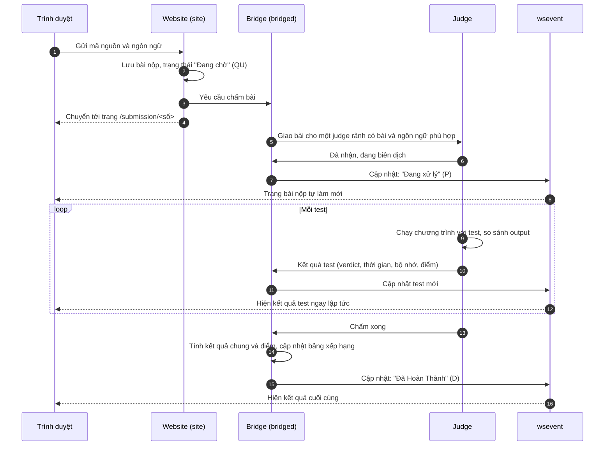

# Nộp bài và chấm bài

> Cách nộp lời giải cho một bài lập trình trên LCOJ, điều gì xảy ra sau khi bấm nộp, cách đọc trang kết quả và những lỗi hay gặp.
>
> ⏱ ~10 phút · 👤 Học sinh, người luyện tập · 🔑 Cần tài khoản LCOJ đã đăng nhập

## Trước khi bắt đầu

- [ ] Đã **đăng nhập**. Khách vẫn đọc được đề, nhưng phải đăng nhập mới nộp được bài. Trên luyencode.net, bạn đăng nhập bằng tài khoản Google.
- [ ] Đã chạy thử lời giải trên máy với **test ví dụ** trong đề.
- [ ] Biết bài đọc dữ liệu từ đâu. Mặc định chương trình **đọc từ bàn phím (stdin) và in ra màn hình (stdout)**, trừ khi đề ghi rõ phải đọc/ghi file.

## Nộp bài

1. Mở trang đề, ví dụ `https://luyencode.net/problem/aplusb`.
2. Chọn một trong hai cách:
   - Bấm nút **Gửi bài giải** ở cột thông tin bên phải để mở trang nộp bài riêng (`/problem/<mã bài>/submit`).
   - Hoặc cuộn xuống cuối trang đề, mở tab **Submit Solution** để nộp ngay tại chỗ.
3. Chọn **ngôn ngữ** trong ô chọn. Ô này chỉ hiện những ngôn ngữ mà bài cho phép và đang có judge hỗ trợ. Khi mở danh sách, bạn thấy cả phiên bản trình biên dịch.
4. Đưa mã nguồn vào khung soạn thảo. Có ba cách: dán trực tiếp, bấm chọn file ở dòng **Dán bài làm của bạn ở đây hoặc nhập từ file:**, hoặc kéo thả file vào khung soạn thảo. Nội dung file được nạp vào khung để bạn xem lại trước khi nộp.
5. Bấm **Nộp bài!**. Trình duyệt chuyển sang trang bài nộp `/submission/<số>`, nơi bạn theo dõi kết quả.

::: info Ngôn ngữ chỉ nộp bằng file
Một số ngôn ngữ đặc biệt như **Scratch** (file `.sb3`) hay **Output Only** (file `.zip`) không có khung soạn thảo. Trang nộp hiện thông báo **Ngôn ngữ này chỉ chấp nhận nộp bằng file.** kèm một ô để chọn hoặc kéo thả file. File phải đúng đuôi và không vượt dung lượng quy định của ngôn ngữ.
:::

### Giới hạn khi nộp

| Giới hạn | Chi tiết |
|---|---|
| Độ dài mã nguồn | Tối đa 65536 ký tự |
| Số bài đang chờ chấm | Mặc định mỗi người chỉ có tối đa **2** bài đang chờ hoặc đang chấm cùng lúc. Nộp thêm sẽ nhận thông báo **Bạn đã nộp bài quá nhiều lần.** Chờ các bài trước chấm xong rồi nộp tiếp |
| Số lần nộp trong kỳ thi | Một số kỳ thi giới hạn số lần nộp mỗi bài. Số lần còn lại hiện ngay dưới nút nộp bài |
| Ngôn ngữ | Chỉ nộp được các ngôn ngữ mà bài cho phép. Nếu không có judge nào chấm được bài, trang hiện **Bài tập này hiện tại không chấm.** |

## Điều gì xảy ra sau khi bấm nộp



Tóm lại (các thuật ngữ *judge*, *bridge*, *verdict* được giải thích trong [Thuật ngữ](/start/glossary)):

1. **Website** lưu bài nộp với trạng thái **Đang chờ** rồi gửi yêu cầu chấm tới **bridge**.
2. **Bridge** chọn một **judge** đang rảnh, có dữ liệu bài và hỗ trợ ngôn ngữ bạn chọn. Nếu mọi judge đều bận, bài nằm trong hàng đợi.
3. **Judge** biên dịch mã nguồn. Nếu lỗi biên dịch, bài dừng ở **Lỗi dịch (CE)**.
4. Judge chạy lần lượt từng test trong sandbox, đo thời gian và bộ nhớ, rồi gửi kết quả **từng test** về bridge.
5. Bridge ghi kết quả vào cơ sở dữ liệu và báo cho **wsevent**. Trang bài nộp đang mở trong trình duyệt nhận thông báo qua WebSocket và tự cập nhật, **bạn không cần tải lại trang**.

## Đọc trang bài nộp

Trang `/submission/<số>` thay đổi theo từng bước:

| Bạn thấy | Nghĩa là |
|---|---|
| **Chúng tôi đang đợi một máy chấm phù hợp để chấm bài của bạn...** | Bài đang trong hàng đợi (`QU`) |
| **Bài nộp của bạn đang được xử lý...** | Judge đang biên dịch (`P`) |
| **Biên dịch gặp lỗi** kèm thông báo | Lỗi biên dịch (`CE`). Đọc thông báo để sửa |
| **Các cảnh báo biên dịch** | Biên dịch thành công nhưng có cảnh báo. Bài vẫn được chấm |
| **Kết quả** và danh sách test | Bài đang chấm hoặc đã chấm xong |

### Kết quả từng test

Mỗi test hiện trên một dòng, ví dụ:

```
Test case #1:  Kết quả đúng (AC)    [0.012s, 3.21 MB]   (10/10)
Test case #2:  Kết quả sai (WA)     [0.015s, 3.21 MB]   (0/10)
Test case #3:  Quá thời gian (TLE)  [>1.000s, 3.30 MB]  (0/10)
```

| Thành phần | Ý nghĩa |
|---|---|
| `Test case #N` | Số thứ tự test. Với bài chấm theo nhóm (batch), các test được gom vào **Batch #N**, và mỗi nhóm chỉ được điểm khi đúng **mọi** test trong nhóm |
| Kết quả | Tên kết quả kèm mã viết tắt như `AC`, `WA`, `TLE`, có thể kèm một phản hồi ngắn trong ngoặc. Xem ý nghĩa đầy đủ tại [Mã trạng thái](/reference/status-codes) |
| `[0.012s, 3.21 MB]` | Thời gian chạy và bộ nhớ đã dùng. Với `TLE`, thời gian hiện dạng `>` giới hạn |
| `(10/10)` | Điểm đạt được / điểm tối đa của test |

Phía trên danh sách có một dãy biểu tượng tóm tắt: dấu ✓ cho test đúng, dấu ✗ cho test sai (bấm vào để nhảy tới test đó), dấu `–` cho test bị bỏ qua.

Dòng test có mũi tên ở đầu là dòng có thêm thông tin; bấm vào để mở ra. Khi không ở trong kỳ thi, vài test đầu tiên có thể kèm **Phản hồi từ trình chấm** (ví dụ checker cho biết sai ở đâu). Nếu bài cho phép xem dữ liệu test, bạn còn thấy input, đáp án và **Output của bạn (đã được lược bỏ)**.

::: info Người ra đề có thể ẩn bớt kết quả
Tùy cài đặt của bài, trang bài nộp có thể hiện kết quả **từng test**, chỉ hiện kết quả **từng nhóm test**, hoặc chỉ hiện **kết quả chung** của cả bài. Trong kỳ thi đang diễn ra, phần phản hồi chi tiết thường bị ẩn.
:::

### Tổng kết

Khi chấm xong, cuối trang hiện:

- **Tài nguyên:** thời gian chạy lớn nhất và bộ nhớ lớn nhất trong các test.
- **Điểm cuối cùng:** tổng điểm test, kèm số điểm của bài, ví dụ `20/30 (6.667/10 điểm)`.

::: tip Chấm điểm từng phần
- Bài **cho chấm từng phần** (partial): điểm bài tỉ lệ với số điểm test đạt được. Sai vài test vẫn có điểm.
- Bài **không chấm từng phần**: chỉ được điểm khi đúng **tất cả** test. Sai một test là 0 điểm cho bài.
:::

### Pretest trong kỳ thi

Một số kỳ thi chỉ chấm trên **pretest** (một phần nhỏ bộ test) trong lúc thi. Trang bài nộp khi đó ghi **Kết quả pretest**, các test ghi là `Pretest #N` và điểm là **Điểm pretest:**. Qua hết pretest **không đảm bảo** bạn được điểm tối đa khi chấm trên bộ test đầy đủ sau kỳ thi.

## Các thao tác trên trang bài nộp

| Nút / liên kết | Chức năng |
|---|---|
| **Xem code** | Xem lại mã nguồn đã nộp |
| **Nộp lại** | Mở trang nộp bài với sẵn mã nguồn và ngôn ngữ của bài này, để sửa rồi nộp tiếp. Chỉ có với bài của chính bạn |
| **Huỷ bỏ** | Nút nằm dưới danh sách test, chỉ hiện khi bài chưa chấm xong (phím tắt Ctrl+Enter). Bài chuyển sang **Bị hủy bỏ** (`AB`) với 0 điểm |

Trên trang đề, cột bên phải có các liên kết **Bài nộp của tôi**, **Danh sách bài nộp** (của mọi người) và **Bài nộp tốt nhất**.

### Xem lời giải của người khác

Bạn luôn xem được mã nguồn của chính mình. Với bài của người khác, cài đặt mặc định của LCOJ là: **chỉ xem được sau khi bạn đã giải được bài đó** (đạt `AC` với điểm tối đa). Người ra đề có thể đổi cài đặt này cho từng bài, cho phép mọi người xem hoặc không cho ai xem.

Nộp nhiều lần không bị trừ điểm khi luyện tập: hệ thống chỉ ghi nhận điểm cao nhất của bạn cho mỗi bài. Riêng trong kỳ thi, cách tính điểm và phạt phụ thuộc vào [định dạng kỳ thi](/organize/contest-formats).

## Sự cố thường gặp

| Triệu chứng | Nguyên nhân thường gặp | Cách sửa |
|---|---|---|
| `WA` dù chạy đúng trên máy | In thêm chữ như `Nhap n:`, `Ket qua la:` | Chỉ in **đúng** những gì đề yêu cầu. Checker mặc định bỏ qua dấu cách thừa nhưng không bỏ qua chữ thừa |
| `WA` ở test lớn, test nhỏ đúng | Tràn số nguyên (`int` chỉ chứa tới khoảng 2·10⁹) | Dùng `long long` trong C/C++, `long` trong Java khi kết quả hoặc phép nhân trung gian có thể lớn |
| `WA`, `IR` hoặc `RTE` ngay test đầu | Đọc/ghi file trong khi bài dùng stdin/stdout (hoặc ngược lại) | Làm đúng theo đề. Xóa `freopen(...)` nếu đề không yêu cầu file |
| `TLE` | Thuật toán quá chậm so với giới hạn dữ liệu | Ước lượng độ phức tạp: khoảng 10⁸ phép tính đơn giản mỗi giây |
| `TLE` với dữ liệu vào/ra lớn | Nhập/xuất chậm: `cin`/`cout` chưa tắt đồng bộ, dùng `endl` liên tục, `input()` trong Python | C++: `ios::sync_with_stdio(false); cin.tie(nullptr);` và dùng `'\n'` thay `endl`. Python: `sys.stdin.readline`, hoặc thử `PyPy 3` |
| `TLE` dù thuật toán đúng | Vòng lặp vô hạn, hoặc chương trình chờ nhập thêm dữ liệu không có | Kiểm tra điều kiện dừng, đọc đúng số lượng dữ liệu đề cho |
| `RTE` (`segmentation fault`) | Vượt chỉ số mảng, đệ quy quá sâu | Kiểm tra kích thước mảng theo giới hạn trong đề |
| `CE` với Java | Lớp chính không khai báo `public class`, hoặc có dòng `package` | Khai báo lớp chính là `public class`, xóa dòng `package` |
| `CE` dù code đúng | Chọn sai ngôn ngữ hoặc phiên bản (ví dụ code C++ chọn C) | Bấm **Nộp lại**, chọn đúng ngôn ngữ rồi nộp |

Giải thích chi tiết từng mã kết quả có tại [Mã trạng thái](/reference/status-codes). Danh sách ngôn ngữ xem tại [Ngôn ngữ được hỗ trợ](/reference/languages).

## Tiếp theo

- [Tham gia kỳ thi](/learn/contests): cách nộp bài, pretest và bảng xếp hạng trong kỳ thi.
- [Câu hỏi thường gặp](/start/faq): giải đáp nhanh các thắc mắc khác.
