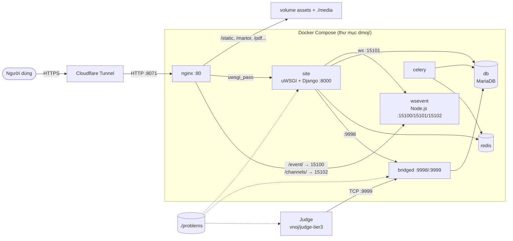

# Kiến trúc hệ thống

> LCOJ gồm 7 dịch vụ Docker Compose (nginx, site, celery, bridged, wsevent, db, redis) cộng với các máy chấm chạy riêng. Trang này giải thích mỗi dịch vụ làm gì, nói chuyện với nhau qua mạng/cổng nào và dữ liệu nằm ở đâu.
>
> ⏱ ~15 phút đọc · 👤 Người vận hành · 🔑 Không cần quyền gì để đọc; chỉnh uWSGI cần SSH + docker trên máy chủ

## Khi nào cần trang này

- **Trước khi cài đặt**: để biết mình sắp chạy những gì và cần mở cổng nào.
- **Khi gỡ lỗi**: để đoán lỗi nằm ở dịch vụ nào (ví dụ 502 là nginx không gọi được `site`).
- **Khi mở rộng**: để chỉnh số worker uWSGI, thêm judge, hoặc lên kế hoạch sao lưu.

Nếu gặp thuật ngữ lạ (container, volume, reverse proxy, judge...), xem [Thuật ngữ](/start/glossary).

Mọi thông tin dưới đây lấy từ repo [lcoj-docker](https://github.com/luyencode/lcoj-docker): `dmoj/docker-compose.yml`, các `Dockerfile` trong `dmoj/*/`, `dmoj/nginx/conf.d/nginx.conf` và `dmoj/config/`.

LCOJ dựa trên [DMOJ](https://github.com/DMOJ/online-judge) và [VNOJ](https://github.com/VNOI-Admin/OJ). Toàn bộ website chạy bằng Docker Compose; riêng các máy chấm (judge) chạy tách biệt và kết nối vào hệ thống qua cổng 9999.

## Tổng quan luồng xử lý



Tóm tắt một request:

1. Người dùng truy cập `https://luyencode.net`. HTTPS kết thúc tại **Cloudflare Tunnel**; tunnel chuyển tiếp HTTP thuần tới cổng nginx trên máy chủ (mặc định `8071`).
2. **nginx** trả trực tiếp file tĩnh (`/static`, icon, `robots.txt`...) và file media (`/martor`, `/pdf`, `/submission_file`...). Các request còn lại được chuyển tới **site** qua giao thức uwsgi (`site:8000`).
3. `/event/` (WebSocket) và `/channels/` (long polling) được chuyển tới **wsevent** để cập nhật trực tiếp kết quả chấm, bảng xếp hạng.
4. Khi có bài nộp, **site** gửi yêu cầu chấm tới **bridged** (cổng 9998). bridged chọn một judge rảnh (judge đã kết nối vào cổng 9999), nhận kết quả và ghi vào **db**.
5. Tác vụ nặng hoặc chạy nền (rejudge hàng loạt, xuất dữ liệu...) được đẩy vào hàng đợi Redis cho **celery** xử lý.

::: warning HTTPS nằm ở Cloudflare, không phải nginx
Trên production, nginx chỉ phục vụ HTTP (`listen 80`) bên trong. Chứng chỉ và HTTPS do Cloudflare Tunnel đảm nhận. Cloudflare Tunnel (`cloudflared`) không nằm trong `docker-compose.yml`, nó chạy riêng trên máy chủ và trỏ vào cổng nginx đã publish.
:::

## Các dịch vụ

| Dịch vụ | Container | Image / build | Chạy lệnh | Vai trò |
|---|---|---|---|---|
| `nginx` | `lcoj_nginx` | `nginx:alpine` | mặc định của image | Reverse proxy, phục vụ static và media |
| `site` | `lcoj_site` | `lcoj/lcoj-site` (`site/Dockerfile`) | `uwsgi --ini uwsgi.ini` | Website Django, lắng nghe uwsgi tại `:8000` |
| `celery` | `lcoj_celery` | `lcoj/lcoj-celery` (`celery/Dockerfile`) | `celery -A dmoj_celery worker -l info --concurrency=2` | Chạy tác vụ nền |
| `bridged` | `lcoj_bridged` | `lcoj/lcoj-bridged` (`bridged/Dockerfile`) | `python3 manage.py runbridged` | Cầu nối giữa site và judge |
| `wsevent` | `lcoj_wsevent` | `lcoj/lcoj-wsevent` (`wsevent/Dockerfile`, từ `node:alpine`) | `node /app/site/websocket/daemon.js` | Máy chủ sự kiện WebSocket |
| `db` | `lcoj_mysql` | `mariadb` | mặc định của image | Cơ sở dữ liệu |
| `redis` | `lcoj_redis` | `redis:alpine` | mặc định của image | Cache (DB 0), hàng đợi Celery (DB 1) |
| `base` | — | `lcoj/lcoj-base` (`base/Dockerfile`) | không chạy (`network_mode: none`) | Image nền để build `site`, `celery`, `bridged` |

Chi tiết từng dịch vụ:

- **base**: image nền dựa trên `python:3.11-slim-bullseye`, cài Node.js 18, thư viện build và client MariaDB, rồi cài `requirements.txt`, `additional_requirements.txt` và `package.json` của lcoj-site. `site`, `celery` và `bridged` đều `FROM lcoj/lcoj-base:latest`, nên khi đổi dependency phải build lại `base` trước.
- **site**: thêm `pandoc` vào image nền, chạy uWSGI với file `uwsgi.ini` trong `/site` (xem [phần uWSGI](#uwsgi)).
- **celery**: dùng chung mã nguồn với site, chạy 2 worker song song (`--concurrency=2`).
- **bridged**: mở cổng 9998 cho Django và 9999 cho judge. Địa chỉ lấy từ biến `BRIDGED_HOST` (xem [Biến môi trường](/operate/environment)).
- **wsevent**: đọc cấu hình từ `websocket/config.js` (bản gốc ở `dmoj/config/config.js`): cổng `15100` cho trình duyệt nhận sự kiện, `15101` để site gửi sự kiện, `15102` cho long polling qua HTTP.
- **judge**: không nằm trong `docker-compose.yml`. Judge thường chạy bằng image `vnoj/judge-tier3` (image gốc của VNOJ) và kết nối tới cổng 9999 của bridged. Xem [Cài đặt judge](/operate/judge-setup).

## Mạng (networks)

Compose tạo ba mạng nội bộ; một dịch vụ chỉ nói chuyện được với dịch vụ chung mạng.

| Mạng | Thành viên |
|---|---|
| `nginx` | nginx, site, bridged, wsevent |
| `site` | site, celery, bridged, wsevent, redis |
| `db` | db, site, celery, bridged |

Trong cùng mạng, các dịch vụ gọi nhau bằng tên dịch vụ: `db`, `redis`, `bridged`, `wsevent`, `site`. Đó là lý do các giá trị mặc định trong `site.env` là `redis://redis:6379/0`, `ws://wsevent:15101/`, `BRIDGED_HOST=bridged`...

## Cổng (ports)

| Cổng | Dịch vụ | Publish ra máy chủ? | Dùng cho |
|---|---|---|---|
| `${NGINX_PORT:-8071}` → 80 | nginx | Có | Cổng web duy nhất; Cloudflare Tunnel trỏ vào đây |
| 9999 | bridged | Có (`9999:9999`) | Judge kết nối vào |
| 9998 | bridged | Có (`9998:9998`) | Site gửi yêu cầu chấm |
| 8000 | site | Không | nginx → uWSGI |
| 15100 / 15101 / 15102 | wsevent | Không (đang comment) | WebSocket / nhận sự kiện / long polling |
| 3306 | db | Không (đang comment) | MariaDB |
| 6379 | redis | Không (đang comment) | Redis |

::: warning Không để lộ cổng 9998/9999 ra Internet
Hai cổng của bridged được publish trên mọi địa chỉ của máy chủ. Hãy dùng tường lửa để chỉ các máy judge của bạn truy cập được 9999, và chặn 9998 từ bên ngoài.
:::

`NGINX_PORT` được Docker Compose thay thế khi đọc `docker-compose.yml`, nên phải đặt trong shell hoặc file `dmoj/.env`, không phải trong `environment/site.env`. Xem [Biến môi trường](/operate/environment#nginx-port).

## Dữ liệu: volume và bind mount

Bind mount là thư mục trên máy chủ (đường dẫn tính từ `dmoj/`); volume có tên do Docker quản lý.

| Nguồn | Loại | Gắn vào | Dịch vụ | Nội dung |
|---|---|---|---|---|
| `./repo/` | bind | `/site/` (wsevent: `/app/site/`) | site, celery, bridged, wsevent | Mã nguồn lcoj-site (git submodule) |
| `./problems/` | bind | `/problems/` | site, bridged | Dữ liệu test của bài tập (`DMOJ_PROBLEM_DATA_ROOT`) |
| `./media/` | bind | `/media/` | site, nginx | File người dùng tải lên (`MEDIA_ROOT`) |
| `./database/` | bind | `/var/lib/mysql/` | db | Dữ liệu MariaDB |
| `./nginx/conf.d/` | bind | `/etc/nginx/conf.d/` | nginx | Cấu hình nginx |
| `assets` | volume | `/assets/` | site, nginx | Static đã build (`/assets/static`, `/assets/resources`) |
| `userdatacache` | volume | `/userdatacache/` | site, celery, nginx | File xuất dữ liệu người dùng |
| `contestdatacache` | volume | `/contestdatacache/` | site, celery, nginx | File xuất dữ liệu kỳ thi |
| `cache` | volume | `/cache/` | site, nginx | Cache (django-compressor) |

Một số điểm cần lưu ý:

- Vì `./repo/` được bind mount, sửa code Python chỉ cần restart container, không cần build lại image.
- Judge cần đọc cùng dữ liệu test với site. Nếu judge chạy trên cùng máy, hãy mount `dmoj/problems` vào judge; nếu chạy máy khác, cần đồng bộ thư mục này.
- `/userdatacache` và `/contestdatacache` là `internal` trong nginx: Django trả header `X-Accel-Redirect`, nginx mới gửi file cho người dùng.
- Volume `assets` được điền bởi `./scripts/copy_static` (xem [Các script hỗ trợ](/operate/scripts)).

::: tip Sao lưu
Dữ liệu cần sao lưu nằm ở `dmoj/database/`, `dmoj/problems/`, `dmoj/media/` và `dmoj/environment/`. Các volume có tên đều có thể tạo lại (`copy_static`, hoặc sinh lại khi người dùng yêu cầu xuất dữ liệu). Xem thêm [Vận hành hằng ngày](/operate/operations).
:::

## uWSGI

Container `site` chạy lệnh `uwsgi --ini uwsgi.ini` trong thư mục `/site`, tức là đọc file `dmoj/repo/uwsgi.ini` trên máy chủ. File này được `./scripts/initialize` sao chép từ bản mẫu `dmoj/config/uwsgi.ini` (và bị lcoj-site `.gitignore`). Bản mẫu hiện tại:

```ini
[uwsgi]
# Socket and pid file location/permission.
socket = :8000
pidfile = /tmp/dmoj-site.pid
chmod-pidfile = 666

# Paths.
chdir = .

# Details regarding DMOJ application.
protocol = uwsgi
master = true
plugins = python
env = DJANGO_SETTINGS_MODULE=dmoj.settings
module = dmoj.wsgi:application
optimize = 2

# Logging
disable-logging = true
log-4xx = true
log-5xx = true

# Scaling settings. Tune as you like.
memory-report = true
reload-on-rss = 512M
workers = 8
```

| Tùy chọn | Ý nghĩa |
|---|---|
| `socket = :8000` | Lắng nghe TCP cổng 8000 trên mọi interface của container; nginx gọi `uwsgi_pass site:8000` |
| `protocol = uwsgi` | Dùng giao thức uwsgi nhị phân (không phải HTTP), nên không thể mở `:8000` bằng trình duyệt |
| `master = true` | Có tiến trình master quản lý và tự khởi động lại worker |
| `module = dmoj.wsgi:application` | Ứng dụng WSGI của Django |
| `disable-logging`, `log-4xx`, `log-5xx` | Không ghi log mọi request, chỉ ghi request lỗi 4xx/5xx |
| `workers = 8` | Số tiến trình xử lý request song song |
| `reload-on-rss = 512M` | Worker dùng quá 512 MB RAM sẽ được khởi động lại, tránh rò rỉ bộ nhớ |
| `memory-report = true` | Ghi thông tin bộ nhớ vào log |

nginx đặt `uwsgi_read_timeout 600`, nên request chạy lâu tối đa 10 phút trước khi nginx trả lỗi 504.

### Điều chỉnh uWSGI

1. Sửa `dmoj/repo/uwsgi.ini` (bản đang chạy). Nên sửa luôn `dmoj/config/uwsgi.ini` để giữ đồng bộ với bản mẫu.
2. Áp dụng bằng cách khởi động lại site:

   ```sh
   cd dmoj
   docker compose restart site
   ```

3. Theo dõi log để kiểm tra site khởi động ổn:

   ```sh
   docker compose logs -f site
   ```

Gợi ý khi điều chỉnh:

- **`workers`**: mỗi worker là một tiến trình Django riêng, thường tốn vài trăm MB RAM. Tăng khi CPU còn rảnh mà request phải chờ; giảm khi máy thiếu RAM. Ước lượng RAM tối đa khoảng `workers × reload-on-rss`.
- **`reload-on-rss`**: hạ xuống nếu máy ít RAM, tăng lên nếu thấy worker bị khởi động lại liên tục trong log.
- Máy phát triển có thể thêm `py-autoreload = 1` để uWSGI tự nạp lại khi file Python thay đổi. Không nên bật trên production.

::: warning `initialize` ghi đè cấu hình
Chạy lại `./scripts/initialize` sẽ sao chép đè `dmoj/config/uwsgi.ini` lên `dmoj/repo/uwsgi.ini`. Nếu bạn chỉ sửa bản trong `repo/`, thay đổi sẽ mất.
:::

::: details Lỗi 502 Bad Gateway
nginx trả trang `502.html` khi không kết nối được tới `site:8000` (ví dụ site đang khởi động, hoặc bị lỗi khi nạp Django). Kiểm tra:

```sh
docker compose ps site
docker compose logs --tail=100 site
```

Lỗi hay gặp là sai cú pháp trong `local_settings.py` hoặc thiếu biến môi trường. Xem [Biến môi trường](/operate/environment).
:::

## Tiếp theo

- [Cài đặt](/operate/installation): dựng toàn bộ các dịch vụ trên theo từng bước.
- [Biến môi trường](/operate/environment): cấu hình địa chỉ `redis`, `wsevent`, `bridged` và `NGINX_PORT`.
- [Cài đặt judge](/operate/judge-setup): kết nối máy chấm vào cổng 9999.
- [Vận hành hằng ngày](/operate/operations): sao lưu và theo dõi các dịch vụ.

::: tip Cần hỗ trợ?
- Tạo issue tại [GitHub Issues](https://github.com/luyencode/lcoj-docker/issues)
- Tham khảo thêm tại [behitek.com](https://behitek.com)
- LCOJ hỗ trợ cài đặt miễn phí: [luyencode.net/about/#lien-he](https://luyencode.net/about/#lien-he)
:::
